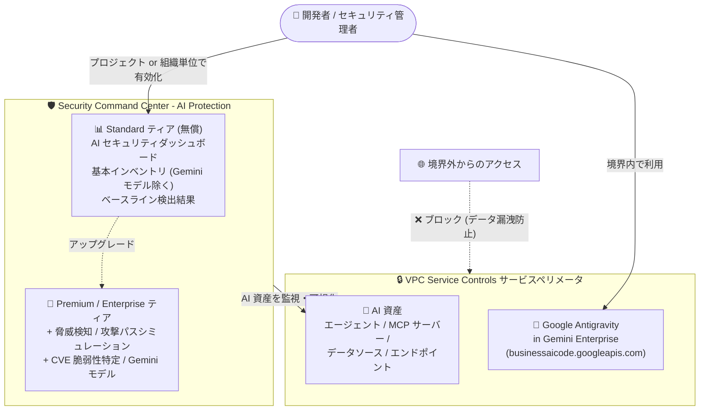

# Security Command Center / VPC Service Controls: AI ワークロード向けセキュリティ・ガバナンス機能の拡充

**リリース日**: 2026-08-03

**サービス**: Security Command Center / VPC Service Controls

**機能**: Standard ティアでの AI Protection サポート、Google Antigravity in Gemini Enterprise の VPC Service Controls 統合 (Preview)

**ステータス**: AI Protection (Standard ティア): 提供開始 / VPC Service Controls 統合: Preview

📊 [このアップデートのインフォグラフィックを見る](https://takech9203.github.io/google-cloud-news-summary/20260803-scc-ai-protection-standard-tier.html)

## 概要

2026 年 8 月 3 日、Google Cloud は AI ワークロードのセキュリティとガバナンスに関連する 2 つのアップデートを発表しました。いずれも、企業が生成 AI やエージェント型ワークロードを安全に導入・運用するための基盤を強化するものです。

1 つ目は **Security Command Center (SCC) の Standard ティアで AI Protection がサポート** されたことです。プロジェクトレベル・組織レベルの両方のアクティベーションに対応し、Standard ティアのプロジェクトレベルアクティベーションでは、AI セキュリティダッシュボード、基本インベントリビュー (Gemini モデルを除く)、ベースラインのセキュリティ検出結果 (Security Essentials) にアクセスできます。Standard ティアは追加料金なしで利用できるため、これまで Premium / Enterprise ティアの契約が前提だった AI セキュリティの可視化を、小規模な環境や個別プロジェクトでも気軽に始められるようになりました。

2 つ目は **VPC Service Controls が「Google Antigravity in Gemini Enterprise」との統合を Preview でサポート** したことです。エージェント型開発ツールである Google Antigravity の API (`businessaicode.googleapis.com`) をサービス境界 (サービスペリメータ) で保護できるようになり、データ漏洩 (exfiltration) リスクを抑えながら、境界内で Antigravity を通常どおり利用できます。

**アップデート前の課題**

- AI Protection の主要な機能は Premium / Enterprise ティアが前提であり、無償の Standard ティアのみを利用する組織・プロジェクトでは AI 資産のセキュリティ状況を SCC 上で可視化する手段が限られていた
- 組織全体での SCC 有効化権限を持たないチームは、担当プロジェクト単位で AI セキュリティダッシュボードを利用することができなかった
- Google Antigravity in Gemini Enterprise は VPC Service Controls の保護対象外であり、サービスペリメータで API アクセスを制御する統制の効いた環境では、エージェント型開発ツールの導入がコンプライアンス上の課題となっていた

**アップデート後の改善**

- Standard ティア (追加料金なし) でも AI Protection が利用可能になり、AI セキュリティダッシュボードと基本インベントリビューで AI 資産の全体像を把握できるようになった
- プロジェクトレベルのアクティベーションに対応したため、組織管理者を介さずにプロジェクト単位で AI セキュリティの可視化を開始できるようになった
- Google Antigravity in Gemini Enterprise の API をサービスペリメータで保護できるようになり (Preview)、既知の制限事項なしで境界内での利用が可能になった

## アーキテクチャ図



SCC の AI Protection が Standard ティアでも AI 資産の可視化を提供し、VPC Service Controls のサービスペリメータが Google Antigravity への境界外アクセスをブロックしてデータ漏洩を防止する構成です。

## サービスアップデートの詳細

### 主要機能

1. **Standard ティアでの AI Protection サポート (SCC)**
   - プロジェクトレベル・組織レベルの両方のアクティベーションで AI Protection を利用可能
   - プロジェクトレベルの Standard ティアで利用できる機能:
     - **AI セキュリティダッシュボード**: 「リスクの概要 > AI セキュリティ」から AI 関連のリスクを一元的に確認
     - **基本インベントリビュー**: データソース、エンドポイント、エージェント、Agent Registry にカタログ登録された MCP サーバーなどの AI 資産を把握 (Gemini モデルのインベントリは Premium / Enterprise ティアのみ)
     - **ベースラインのセキュリティ検出結果 (Security Essentials)**: AI 資産に対する基本的なセキュリティ検出結果の表示
   - 新規の SCC アクティベーションでは AI Protection がデフォルトで有効。AI Protection 提供前に SCC を有効化していた場合は手動での有効化が必要
   - 脅威検知 (Event Threat Detection / Agent Platform Threat Detection)、攻撃パスシミュレーション、エージェントワークロードの CVE 脆弱性特定、高度なコンプライアンスフレームワークなどは Premium / Enterprise ティアまたは組織レベルのアクティベーションが必要

2. **Google Antigravity in Gemini Enterprise の VPC Service Controls 統合 (Preview)**
   - サービス名 `businessaicode.googleapis.com` をサービスペリメータの保護対象サービスとして構成可能
   - ペリメータ内で Google Antigravity を通常どおり利用でき、境界外からの API アクセスや境界外へのデータ持ち出しを制御
   - 本統合には既知の制限事項なし (ドキュメント記載)
   - Preview 段階のため、本番環境での利用は完全にはサポートされない

## 技術仕様

### AI Protection のティア別機能比較

| 機能 | Standard | Premium / Enterprise |
|------|----------|---------------------|
| AI セキュリティダッシュボード | ✅ | ✅ |
| AI 資産インベントリ (データソース、エンドポイント、エージェント、MCP サーバー) | ✅ (基本) | ✅ |
| Gemini モデルのインベントリ | ❌ | ✅ |
| ベースラインのセキュリティ検出結果 (Security Essentials) | ✅ | ✅ |
| 高度なフレームワークコンプライアンス | ❌ | ✅ |
| エージェントワークロードの脆弱性 (CVE) 特定 | ❌ | ✅ |
| 攻撃パスシミュレーションによるリスク特定 | ❌ | ✅ |
| 脅威の検知と管理 | ❌ | ✅ |
| 過剰な権限を持つエージェントの検出 | ✅ | ✅ |
| アクティベーション単位 | プロジェクト / 組織 | プロジェクト / 組織 (Enterprise は組織のみ) |

補足: MCP サーバーの検出には、MCP サーバーをホストする各プロジェクトで App Hub API (`apphub.googleapis.com`) の有効化が必要です。また、Enterprise ティアは非推奨となっており、2027 年 5 月 21 日にシャットダウンが予定されています。

### VPC Service Controls 統合の仕様

| 項目 | 詳細 |
|------|------|
| 対象プロダクト | Google Antigravity in Gemini Enterprise |
| サービス名 | `businessaicode.googleapis.com` |
| ステータス | Preview (本番環境での利用は完全サポート対象外) |
| ペリメータでの保護 | 可能 (保護対象サービスとして構成可) |
| 既知の制限事項 | なし |

## 設定方法

### 前提条件

1. (AI Protection) Google Cloud プロジェクトが組織に関連付けられていること
2. (AI Protection) プロジェクトレベルの有効化には Security Admin (`roles/iam.securityAdmin`) および Security Center Admin (`roles/securitycenter.admin`) ロールが必要
3. (VPC Service Controls) Access Context Manager のアクセスポリシーが構成済みであること

### 手順

#### ステップ 1: SCC Standard ティアの有効化と AI Protection の確認

```bash
# プロジェクトまたは組織で Security Command Center Standard を有効化
# (Google Cloud コンソール: [Security Command Center] > [有効化])
```

新規アクティベーションでは AI Protection はデフォルトで有効です。Google Cloud コンソールで「リスクの概要 > AI セキュリティ」に移動し、AI セキュリティダッシュボードを確認します。AI Protection 提供前から SCC を利用している場合は、設定画面から手動で有効化します。

#### ステップ 2: サービスペリメータへの Google Antigravity の追加

```bash
# 既存のサービスペリメータに Google Antigravity API を保護対象として追加
gcloud access-context-manager perimeters update PERIMETER_NAME \
  --add-restricted-services=businessaicode.googleapis.com \
  --policy=POLICY_ID
```

ペリメータの構成後、境界内のプロジェクトからは Google Antigravity を通常どおり利用でき、境界外からのアクセスはブロックされます。

## メリット

### ビジネス面

- **AI セキュリティ導入の敷居を低減**: 追加料金なしの Standard ティアで AI 資産の可視化を開始でき、AI ガバナンス整備の第一歩をコストゼロで踏み出せる
- **規制業界でのエージェント型開発ツール採用**: 金融・医療などデータ境界統制が必須の業界でも、VPC Service Controls の保護下で Google Antigravity を導入する道筋ができた
- **法的・財務リスクの軽減**: セキュリティ侵害や規制非準拠に伴うリスクを、AI 資産の早期可視化により低減

### 技術面

- **プロジェクト単位のスモールスタート**: 組織全体の SCC 導入を待たずに、個別プロジェクトで AI セキュリティダッシュボードを利用可能
- **AI 資産の一元的な把握**: データソース、エンドポイント、エージェント、MCP サーバーを含むインベントリを 1 つのダッシュボードで確認
- **制限事項なしのペリメータ統合**: Google Antigravity の VPC Service Controls 統合には既知の制限がなく、既存のペリメータ運用にそのまま組み込める

## デメリット・制約事項

### 制限事項

- Standard ティアの基本インベントリビューには Gemini モデルが含まれない (Premium / Enterprise ティアが必要)
- 脅威検知、攻撃パスシミュレーション、CVE 脆弱性特定、高度なコンプライアンスフレームワークなどの AI Protection 機能は Premium / Enterprise ティアまたは組織レベルのアクティベーションが必要
- VPC Service Controls の Google Antigravity 統合は Preview 段階であり、本番環境での利用は完全にはサポートされない
- プロジェクトレベルのアクティベーションでは、ダッシュボードに表示されるデータは当該プロジェクトに限定される

### 考慮すべき点

- AI Protection 提供前に SCC を有効化していた組織・プロジェクトでは、AI Protection の手動有効化が必要
- MCP サーバーのインベントリ検出には、ホストする各プロジェクトで App Hub API の有効化が必要
- Model Armor のテンプレートを構成していない場合、AI セキュリティダッシュボードの Model Armor ウィジェットにデータが表示されない
- Enterprise ティアは 2027 年 5 月 21 日にシャットダウン予定のため、新規の高度な機能利用は Premium ティアを軸に検討するのが望ましい

## ユースケース

### ユースケース 1: 個別プロジェクトでの AI セキュリティ可視化のスモールスタート

**シナリオ**: 生成 AI アプリケーションを開発する部門チームが、組織全体の SCC Premium 導入を待たずに、自チームのプロジェクトで AI 資産のセキュリティ状況を把握したい。

**実装例**:
```
1. 対象プロジェクトで SCC Standard ティアをプロジェクトレベルで有効化 (無償)
2. [リスクの概要] > [AI セキュリティ] で AI セキュリティダッシュボードを確認
3. AI リソースタブでデータソース / エンドポイント / エージェント / MCP サーバーのインベントリを確認
4. ベースラインのセキュリティ検出結果 (Security Essentials) を定期レビュー
```

**効果**: コストをかけずに AI 資産の可視化と基本的なリスク管理を開始でき、必要に応じて Premium ティアへの段階的なアップグレードを判断できる。

### ユースケース 2: データ境界統制下でのエージェント型開発環境の提供

**シナリオ**: 金融機関が、機密データを扱うプロジェクト群を VPC Service Controls のサービスペリメータで保護しており、その統制を維持したまま開発者に Google Antigravity によるエージェント型開発体験を提供したい。

**効果**: `businessaicode.googleapis.com` をペリメータの保護対象に追加することで、境界外へのデータ持ち出しを防ぎながら Antigravity を利用でき、セキュリティ統制と開発生産性を両立できる。

## 料金

- **SCC Standard ティア**: 追加料金なしで利用可能。AI Protection の Standard ティア機能 (AI セキュリティダッシュボード、基本インベントリ、ベースライン検出結果) も同様
- **SCC Premium / Enterprise ティア**: 従量課金 (Pay-as-you-go) またはサブスクリプション。詳細は [Security Command Center の料金ページ](https://cloud.google.com/security-command-center/pricing) を参照
- **VPC Service Controls**: サービス自体に追加料金はなし
- Model Armor は全ユーザーに月間の無償トークン枠が提供され、超過分は別途課金の可能性あり

## 関連サービス・機能

- **Model Armor**: LLM のプロンプトとレスポンスをスクリーニングするサービス。AI Protection の必須構成要素であり、テンプレートを構成するとダッシュボードにデータが表示される
- **Agent Registry**: エージェントと MCP サーバーの一元カタログ。AI Protection のインベントリのソースとなり、VPC Service Controls にも GA で対応
- **App Hub**: MCP サーバーのインベントリ検出に必要な API を提供
- **Compliance Manager**: AI Protection フレームワークを通じたコンプライアンス管理を提供 (Standard ティアは限定的な機能)
- **Gemini Enterprise**: Google Antigravity を含む AI プラットフォーム。Gemini Enterprise 本体 (`discoveryengine.googleapis.com`) の VPC Service Controls 統合は GA 済み
- **Access Context Manager**: サービスペリメータやアクセスレベルを定義する VPC Service Controls の基盤

## 参考リンク

- 📊 [インフォグラフィック](https://takech9203.github.io/google-cloud-news-summary/20260803-scc-ai-protection-standard-tier.html)
- [公式リリースノート](https://docs.cloud.google.com/release-notes#August_03_2026)
- [AI Protection の概要](https://docs.cloud.google.com/security-command-center/docs/ai-protection-overview)
- [AI Protection の構成](https://docs.cloud.google.com/security-command-center/docs/configure-ai-protection)
- [Security Command Center のサービスティア](https://docs.cloud.google.com/security-command-center/docs/service-tiers)
- [プロジェクトでの Security Command Center の有効化](https://docs.cloud.google.com/security-command-center/docs/activate-scc-for-a-project)
- [VPC Service Controls でサポートされるプロダクト](https://docs.cloud.google.com/vpc-service-controls/docs/supported-products)
- [料金ページ (Security Command Center)](https://cloud.google.com/security-command-center/pricing)

## まとめ

今回のアップデートにより、無償の SCC Standard ティアでも AI 資産の可視化とベースラインのセキュリティ検出が可能になり、AI セキュリティ対策の裾野が大きく広がりました。あわせて Google Antigravity の VPC Service Controls 統合 (Preview) により、データ境界統制が必須の環境でもエージェント型開発ツールを導入しやすくなっています。まずは Standard ティアで AI セキュリティダッシュボードを確認し、脅威検知や攻撃パスシミュレーションが必要になった段階で Premium ティアへのアップグレードを検討することを推奨します。

---

**タグ**: #SecurityCommandCenter #AIProtection #VPCServiceControls #GoogleAntigravity #GeminiEnterprise #AISecurity #Governance #Preview
