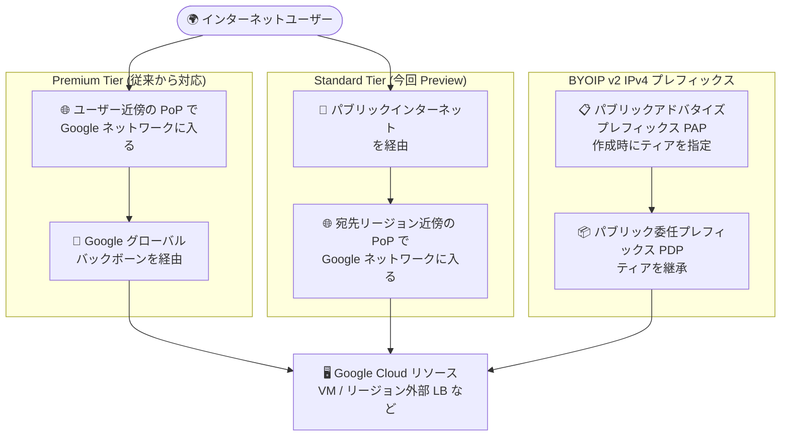

# Virtual Private Cloud (VPC): BYOIP の v2 IPv4 パブリックアドバタイズプレフィックスが Standard Tier に対応 (Preview)

**リリース日**: 2026-08-03

**サービス**: Virtual Private Cloud (VPC)

**機能**: Standard Tier IP アドレスを使用する BYOIP 向け v2 IPv4 パブリックアドバタイズプレフィックス

**ステータス**: Preview

📊 [このアップデートのインフォグラフィックを見る](https://takech9203.github.io/google-cloud-news-summary/20260803-vpc-byoip-v2-standard-tier.html)

## 概要

Virtual Private Cloud (VPC) の Bring Your Own IP (BYOIP) 機能において、Standard Tier の IP アドレスを使用する v2 IPv4 パブリックアドバタイズプレフィックス (Public Advertised Prefix、PAP) を作成できるようになりました (Preview)。BYOIP は、組織が保有するパブリック IP アドレスレンジを Google Cloud に持ち込み、Google Cloud リソースに割り当てて利用できる機能です。

これまで BYOIP のプレフィックスは Premium Tier (Google のグローバルバックボーンを経由する性能最適化型ネットワーク) のみに対応していました。今回のアップデートにより、v2 IPv4 パブリックアドバタイズプレフィックスの作成時にネットワークティアとして Standard Tier (トラフィックがパブリックインターネットを経由し、宛先近くの PoP で Google ネットワークに入るコスト最適化型) を選択できるようになります。

自社保有の IP アドレスを維持しながらアウトバウンド データ転送コストを抑えたい組織、たとえばレイテンシ要件が厳しくない単一リージョン構成のワークロードを移行する企業にとって、コスト効率の高い選択肢が加わるアップデートです。

**アップデート前の課題**

- BYOIP のパブリックアドバタイズプレフィックスは Premium Tier のみに対応しており、持ち込んだ IP アドレスに対して Standard Tier のコスト最適化されたデータ転送料金を適用できなかった
- コストを優先したいワークロードでも、BYOIP を利用する限り Premium Tier のネットワーク料金体系が前提となっていた
- 性能要件が緩いワークロードで Standard Tier を使いたい場合、Google 提供の IP アドレスを使う必要があり、自社保有 IP の継続利用 (レピュテーション維持、許可リスト登録済み IP の維持など) と両立できなかった

**アップデート後の改善**

- v2 IPv4 パブリックアドバタイズプレフィックスの作成時に Standard Tier を指定できるようになった (Preview)
- 自社保有の IP アドレスを維持したまま、コスト最適化された Standard Tier の料金体系でトラフィックを処理できるようになった
- パブリック委任プレフィックス (PDP) とサブプレフィックスは親のパブリックアドバタイズプレフィックスのネットワークティアを継承するため、プレフィックス単位で一貫したティア管理ができる

## アーキテクチャ図

BYOIP の v2 IPv4 パブリックアドバタイズプレフィックス作成時に Premium Tier / Standard Tier を選択でき、配下の委任プレフィックスはそのティアを継承します。Standard Tier ではトラフィックがパブリックインターネットを経由し、宛先リージョン近くで Google ネットワークに入ります。

## サービスアップデートの詳細

### 主要機能

1. **v2 IPv4 パブリックアドバタイズプレフィックスでの Standard Tier 指定 (Preview)**
   - v2 パブリックアドバタイズプレフィックスの作成時にネットワークティア (Premium Tier / Standard Tier) を指定できる
   - Standard Tier はコスト最適化型で、トラフィックはパブリックインターネットを経由し、宛先近くの PoP で Google ネットワークに入る
   - Premium Tier は引き続きデフォルトのティアで、ソース近傍の PoP から Google のグローバルバックボーンを経由する性能最適化型

2. **ネットワークティアの継承**
   - パブリック委任プレフィックス (PDP) とサブプレフィックスは、親のパブリックアドバタイズプレフィックスのネットワークティアを継承する
   - ティアの選択は BGP アナウンスの方法とプレフィックスの到達性に影響する

3. **v2 構成の利点をそのまま利用可能**
   - v2 リージョナル構成は PAP のプロビジョニングが約 2 週間、PDP は数分と、v1 (約 4 週間) より短い
   - v2 では BGP アナウンスのタイミングをユーザー自身が制御できる (プロビジョニング後に自動アナウンスされない)

## 技術仕様

### BYOIP v2 IPv4 構成におけるティア別仕様

| 項目 | Premium Tier | Standard Tier (Preview) |
|------|--------------|-------------------------|
| ルーティング | ソース近傍の PoP から Google グローバルバックボーンを経由 | パブリックインターネットを経由し、宛先近傍の PoP で Google ネットワークに入る |
| IP スタック | IPv4、IPv6 (外部パススルー NLB と VM 専用サブネットのみ) | IPv4 のみ |
| PAP の CIDR サイズ | /16 〜 /24 | /16 〜 /23 |
| PDP (トップレベル) のサイズ | /16 〜 /28 (PAP と同サイズ可) | /17 〜 /24 (PAP より小さい必要がある) |
| サブプレフィックス | 親 PDP と同サイズ以下、最小 /28 | 親 PDP と同サイズ以下、最小 /28 |
| BGP アナウンス | ユーザーがアナウンス / 撤回を制御 (v2) | ユーザーがアナウンス / 撤回を制御 (v2) |
| SLA (参考: Network Service Tiers) | 99.99% | 99.9% |

### Standard Tier で利用可能な主なリソース

Standard Tier はリージョナル外部 IPv4 アドレスを対象とし、以下のようなリソースで利用できます (Network Service Tiers の仕様に準拠)。

| リソース | Standard Tier 対応 |
|----------|-------------------|
| VM インスタンス (GKE ノード VM 含む) | 対応 (リージョナル外部 IP) |
| リージョン外部アプリケーション ロードバランサ | 対応 |
| リージョン外部パススルー ネットワーク ロードバランサ | 対応 |
| Cloud NAT ゲートウェイ | 対応 |
| グローバル外部アプリケーション ロードバランサ | 非対応 (Premium Tier が必要) |
| Cloud CDN / Cloud VPN | 非対応 (Premium Tier が必要) |

## 設定方法

### 前提条件

1. 持ち込む IPv4 プレフィックスの所有権を ROA (Route Origin Authorization) と逆引き DNS で検証できること
2. 持ち込むプレフィックスが Google の外部で重複してアドバタイズされていないこと (重複アナウンスは非サポート)
3. Standard Tier の場合、パブリックアドバタイズプレフィックスのサイズが /16 〜 /23 であること

### 手順

#### ステップ 1: v2 パブリックアドバタイズプレフィックスの作成

v2 の IPv4 パブリックアドバタイズプレフィックスを作成する際に、ネットワークティアとして Standard Tier を指定します。詳細な手順は [パブリックアドバタイズプレフィックスの作成](https://docs.cloud.google.com/vpc/docs/create-pap) を参照してください。v2 リージョナル構成のプロビジョニングには約 2 週間かかります。

#### ステップ 2: パブリック委任プレフィックスの作成

プロビジョニングした PAP からパブリック委任プレフィックス (PDP) を作成し、プロジェクトとリージョンに IP アドレスを割り当てます。Standard Tier の場合、トップレベルの PDP は /17 〜 /24 で、PAP より小さいサイズにする必要があります。PDP は親 PAP のネットワークティアを継承します。

#### ステップ 3: BGP アナウンスの管理

v2 構成ではプロビジョニング完了後に自動でアナウンスされないため、任意のタイミングで [BGP アナウンスの管理](https://docs.cloud.google.com/vpc/docs/manage-bgp-announcement) からプレフィックスのアナウンスを開始します。ネットワークティアは BGP アナウンスと到達性の挙動に影響します。

## メリット

### ビジネス面

- **データ転送コストの削減**: 自社保有 IP を使いつつ、Premium Tier より安価な Standard Tier のアウトバウンド データ転送料金を適用できる
- **IP 資産の継続活用**: 顧客の許可リストに登録済みの IP やレピュテーション構築済みの IP を維持したままコスト最適化が可能
- **BYOIP 自体は無料**: BYOIP で持ち込んだ IP アドレスにはアイドル・使用中を問わず IP アドレス利用料が発生しない

### 技術面

- **ティアの一元管理**: PDP とサブプレフィックスが親 PAP のティアを継承するため、プレフィックス単位で一貫したネットワークポリシーを維持できる
- **v2 の迅速なプロビジョニング**: PDP とサブプレフィックスは数分で作成でき、BGP アナウンスのタイミングも制御可能
- **ワークロードに応じたティア選択**: 性能重視のプレフィックスは Premium Tier、コスト重視のプレフィックスは Standard Tier と、用途別に使い分けられる

## デメリット・制約事項

### 制限事項

- Preview 段階の機能であり、GA 前の利用には Pre-GA 提供条件が適用される
- Standard Tier は IPv4 のみ対応 (IPv6 は Premium Tier のみ)
- Standard Tier の PAP は /16 〜 /23 で、Premium Tier (/16 〜 /24) より最小サイズの要件が厳しい
- Standard Tier のトップレベル PDP は PAP より小さいサイズ (/17 〜 /24) にする必要がある
- グローバル外部アプリケーション ロードバランサ、Cloud CDN、Cloud VPN など、Premium Tier を必要とするサービスでは利用できない

### 考慮すべき点

- Standard Tier はトラフィックがパブリックインターネットを経由するため、Premium Tier と比較してレイテンシや品質が経路上の ISP に依存する
- SLA は Premium Tier の 99.99% に対し Standard Tier は 99.9% となる (Compute Engine SLA)
- v2 PAP のプロビジョニングには約 2 週間かかるため、移行計画には十分なリードタイムが必要
- リージョナル構成のため、マルチリージョンで公開する場合はリージョンごとの構成 (DNS によるルーティングなど) が必要

## ユースケース

### ユースケース 1: 単一リージョンの Web サービスのコスト最適化移行

**シナリオ**: オンプレミスから Google Cloud へ移行する企業が、顧客のファイアウォールで許可リスト登録済みの自社 IP レンジを維持したい。サービスは単一リージョンで完結し、レイテンシ要件は厳しくない。

**効果**: 自社 IP を BYOIP で持ち込み Standard Tier を指定することで、許可リストの変更依頼を顧客に求めることなく移行でき、アウトバウンド データ転送費用を Premium Tier より抑えられる。

### ユースケース 2: 大容量アウトバウンドを伴うバッチ配信基盤

**シナリオ**: 特定の送信元 IP からの配信が要件となっているデータ配信基盤で、月間のアウトバウンド転送量が大きく、ネットワークコストが課題になっている。

**効果**: 保有プレフィックスを Standard Tier の BYOIP として構成し、リージョン外部パススルー ネットワーク ロードバランサや VM に割り当てることで、送信元 IP 要件を満たしながらデータ転送単価を引き下げられる。

## 料金

BYOIP で持ち込んだ IP アドレス自体には、アイドル・使用中を問わず料金が発生しません。ネットワークティアごとにアウトバウンド データ転送料金が異なり、Standard Tier は Premium Tier より低価格に設定されています。また、Standard Tier には利用リージョンごとに月間 200 GB の無料枠 (Free Tier) があります。

詳細は以下の料金ページを参照してください。

- [Network Service Tiers の料金](https://cloud.google.com/network-tiers/pricing)
- [VPC ネットワークの料金](https://cloud.google.com/vpc/network-pricing)

## 利用可能リージョン

リージョンごとの提供状況はリリースノートおよびドキュメントに明記されていません。v2 パブリックアドバタイズプレフィックスはリージョナル構成であり、Standard Tier はリージョナル外部 IPv4 アドレスを対象とします。詳細は [BYOIP ドキュメント](https://docs.cloud.google.com/vpc/docs/bring-your-own-ip) を参照してください。

## 関連サービス・機能

- **Network Service Tiers**: 今回のアップデートの基盤となる機能。Premium Tier と Standard Tier の 2 つのティアを提供し、性能とコストのトレードオフを選択できる
- **Cloud Load Balancing**: Standard Tier の BYOIP アドレスはリージョン外部アプリケーション ロードバランサ、リージョン外部パススルー ネットワーク ロードバランサなどで利用できる
- **Compute Engine**: VM インスタンスのリージョナル外部 IPv4 アドレスとして BYOIP アドレスを割り当て可能
- **Cloud NAT**: Standard Tier をサポートするため、BYOIP アドレスを NAT ゲートウェイの外部アドレスとして利用する構成が可能

## 参考リンク

- 📊 [インフォグラフィック](https://takech9203.github.io/google-cloud-news-summary/20260803-vpc-byoip-v2-standard-tier.html)
- [公式リリースノート](https://docs.cloud.google.com/release-notes#August_03_2026)
- [Bring your own IP addresses (BYOIP)](https://docs.cloud.google.com/vpc/docs/bring-your-own-ip)
- [パブリックアドバタイズプレフィックスの作成](https://docs.cloud.google.com/vpc/docs/create-pap)
- [Network Service Tiers の概要](https://docs.cloud.google.com/network-tiers/docs/overview)
- [Network Service Tiers の料金](https://cloud.google.com/network-tiers/pricing)

## まとめ

BYOIP の v2 IPv4 パブリックアドバタイズプレフィックスが Standard Tier に対応したことで、自社保有 IP の継続利用とネットワークコスト最適化を両立できるようになりました。レイテンシ要件が厳しくない単一リージョン構成のワークロードで BYOIP を利用している、または移行を検討している場合は、Preview 段階での検証と、プレフィックスサイズ要件 (/16 〜 /23) や Premium Tier 専用サービスとの互換性の確認を推奨します。

---

**タグ**: VPC, BYOIP, Network Service Tiers, Standard Tier, パブリックアドバタイズプレフィックス, Preview, ネットワーク
