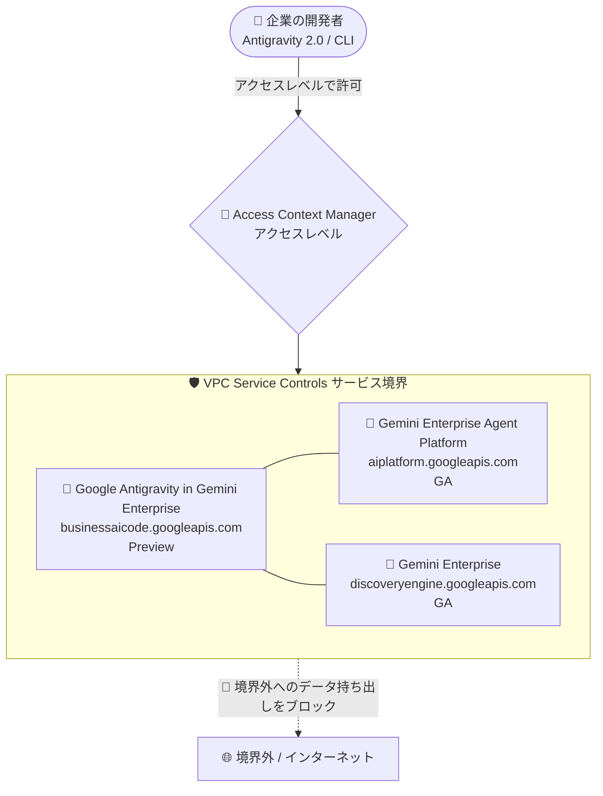

# VPC Service Controls: Google Antigravity in Gemini Enterprise の統合サポート (Preview)

**リリース日**: 2026-08-03

**サービス**: VPC Service Controls

**機能**: Google Antigravity in Gemini Enterprise の VPC Service Controls 統合

**ステータス**: Preview

📊 [このアップデートのインフォグラフィックを見る](https://takech9203.github.io/google-cloud-news-summary/20260803-vpc-service-controls-antigravity-gemini-enterprise.html)

## 概要

VPC Service Controls (VPC-SC) が、**Google Antigravity in Gemini Enterprise** との統合を Preview としてサポートしました。Google Antigravity in Gemini Enterprise の API (`businessaicode.googleapis.com`) をサービス境界 (サービスペリメータ) で保護できるようになり、境界内でプロダクトを通常どおり利用できます。

Google Antigravity は、エージェントを操縦・カスタマイズ・オーケストレーションするための AI エージェント型開発ツールです。Gemini Enterprise Agent Platform との統合により、企業の開発者は自社の Google Cloud プロジェクトでホストされるモデルを使って Antigravity を利用でき、プライベートネットワーキングやデータレジデンシー要件を満たしながら、従量課金ベースで運用できます (エンタープライズ統合の対象は Antigravity 2.0 と Antigravity CLI で、Antigravity IDE は対象外)。

今回のアップデートにより、VPC Service Controls でデータ境界を運用している金融・公共・医療などの規制業界の組織でも、Antigravity in Gemini Enterprise をデータ漏洩 (exfiltration) リスクを抑制した形で導入する道が開かれました。なお、この統合は Preview 段階であり、より広範なテストと利用の準備はできていますが、本番環境での完全なサポートは提供されていません。

**アップデート前の課題**

- Google Antigravity in Gemini Enterprise の API (`businessaicode.googleapis.com`) は VPC Service Controls のサポート対象外であり、サービス境界による保護を構成できなかった
- VPC-SC でデータ境界を必須としている組織では、境界内のプロジェクトから Antigravity in Gemini Enterprise を保護対象サービスとして利用する手段がなかった

**アップデート後の改善**

- `businessaicode.googleapis.com` をサービス境界の保護対象サービス (restricted services) に追加できるようになった
- サービス境界内で Google Antigravity in Gemini Enterprise を通常どおり利用できるようになった
- 公式ドキュメント上、この統合に既知の制限事項 (known limitations) はないとされている

## アーキテクチャ図



VPC Service Controls のサービス境界に `businessaicode.googleapis.com` を追加することで、Google Antigravity in Gemini Enterprise を Gemini Enterprise (GA) や Gemini Enterprise Agent Platform (GA) と同じ境界内で保護し、境界外へのデータ持ち出しをブロックできます。

## サービスアップデートの詳細

### 主要機能

1. **サービス境界による保護 (Preview)**
   - Google Antigravity in Gemini Enterprise の API を VPC Service Controls のサービス境界で保護可能
   - 保護対象サービス名: `businessaicode.googleapis.com`
   - 境界内でプロダクトを通常どおり利用可能

2. **既知の制限事項なし**
   - 公式の VPC Service Controls サポート対象プロダクト一覧において、この統合には既知の制限事項がないと明記されている

3. **Gemini Enterprise / Agent Platform 関連統合との組み合わせ**
   - Gemini Enterprise 本体 (`discoveryengine.googleapis.com`) の VPC-SC 統合は GA
   - Gemini Enterprise Agent Platform (`aiplatform.googleapis.com`) および Agent Runtime の VPC-SC 統合は GA
   - Antigravity と Gemini Enterprise Agent Platform の統合を利用する組織は、境界に Agent Platform API も追加する必要がある (Antigravity エンタープライズ設定ガイドに記載)

## 技術仕様

### VPC Service Controls 統合の概要

| 項目 | 詳細 |
|------|------|
| 統合ステータス | Preview (広範なテスト・利用は可能だが、本番環境での完全サポートはなし) |
| 境界での保護 | 可能 (Protect with perimeters: Yes) |
| サービス名 | `businessaicode.googleapis.com` |
| 既知の制限事項 | なし |

### Antigravity と Gemini Enterprise Agent Platform 統合の前提 (参考)

| 項目 | 詳細 |
|------|------|
| 対応プロダクト | Antigravity 2.0、Antigravity CLI (Antigravity IDE はエンタープライズ統合の対象外) |
| 必要な API | Agent Platform API (`aiplatform.googleapis.com`) の有効化 |
| 利用者のロール | Agent Platform User (`roles/aiplatform.user`) |
| エンドポイント | global、multi-region eu、multi-region us |
| VPC-SC 構成 | サービス境界がある場合、Agent Platform API を境界に追加する必要あり |

## 設定方法

### 前提条件

1. 組織レベルで Access Context Manager のアクセスポリシーが作成されていること
2. VPC Service Controls を管理する権限 (例: `roles/accesscontextmanager.policyAdmin`) を持っていること
3. Antigravity と Gemini Enterprise Agent Platform の統合設定が完了していること (Google Cloud プロジェクト、課金、Agent Platform API の有効化)

### 手順

#### ステップ 1: サービス境界に保護対象サービスを追加

```bash
# 既存のサービス境界に businessaicode.googleapis.com を追加
gcloud access-context-manager perimeters update PERIMETER_NAME \
  --policy=POLICY_ID \
  --add-restricted-services=businessaicode.googleapis.com
```

Antigravity と Gemini Enterprise Agent Platform の統合を利用する場合は、`aiplatform.googleapis.com` も境界に含めます。

#### ステップ 2: ドライランモードでの検証 (推奨)

Preview 段階の統合であるため、まずドライラン構成で境界違反のログを確認し、正規のアクセスがブロックされないことを検証してから適用することを推奨します。

## メリット

### ビジネス面

- **規制業界での AI エージェント開発ツール導入**: データ境界の運用が必須の組織でも、Antigravity in Gemini Enterprise をデータ漏洩リスクを抑制した形で評価・導入できる
- **ガバナンスの一元化**: Gemini Enterprise や Agent Platform と同じサービス境界で Antigravity API を保護でき、セキュリティポリシーを一貫して適用できる

### 技術面

- **データ漏洩リスクの軽減**: サービス境界により、境界外への意図しないデータの持ち出しをブロックできる
- **境界内での通常利用**: 保護を有効にしても、境界内ではプロダクトを通常どおり利用できる (既知の制限事項なし)

## デメリット・制約事項

### 制限事項

- この VPC-SC 統合は Preview であり、本番環境での完全なサポートは提供されていない
- Antigravity のエンタープライズ統合 (Gemini Enterprise Agent Platform 経由) は Antigravity 2.0 と Antigravity CLI のみ対応で、Antigravity IDE は対象外

### 考慮すべき点

- 境界外のクライアント (開発者の端末など) からアクセスする場合は、アクセスレベルや Ingress ルールの設計が必要
- Gemini Enterprise アプリを含むプロジェクトで VPC-SC を有効にすると、Gemini Enterprise の「アクション」の作成・利用がデフォルトでブロックされる (利用には Google の担当者への許可リスト追加依頼が必要) という Gemini Enterprise 側の制限がある点に注意

## ユースケース

### ユースケース 1: 規制業界でのエージェント型開発環境の保護

**シナリオ**: 金融機関が、ソースコードや社内データを扱う AI エージェント型開発ツールとして Antigravity in Gemini Enterprise を導入したい。ただし社内ポリシーにより、すべての Google Cloud API はサービス境界内で保護する必要がある。

**実装例**:
```bash
gcloud access-context-manager perimeters update finance-perimeter \
  --policy=123456789 \
  --add-restricted-services=businessaicode.googleapis.com,aiplatform.googleapis.com,discoveryengine.googleapis.com
```

**効果**: Antigravity 関連 API を境界内で保護しつつ、開発者はアクセスレベルで許可された環境から通常どおり利用できる。境界外へのデータ持ち出しはブロックされる。

### ユースケース 2: 既存の Gemini Enterprise 境界への追加

**シナリオ**: すでに Gemini Enterprise (`discoveryengine.googleapis.com`) と Gemini Enterprise Agent Platform (`aiplatform.googleapis.com`) をサービス境界で保護している組織が、新たに Antigravity の利用を開始する。

**効果**: 既存の境界に `businessaicode.googleapis.com` を追加するだけで、Antigravity in Gemini Enterprise を同一のセキュリティポリシー下で利用開始できる。

## 料金

VPC Service Controls 自体の料金と、Antigravity in Gemini Enterprise の利用料金 (Gemini Enterprise Agent Platform 経由の従量課金) については、以下の公式ページを参照してください。

- [VPC Service Controls ドキュメント](https://docs.cloud.google.com/vpc-service-controls/docs/overview)
- [Antigravity プラン](https://antigravity.google/docs/plans)
- [Gemini Enterprise Agent Platform の消費オプション](https://docs.cloud.google.com/gemini-enterprise-agent-platform/models/deploy/consumption-options)

## 関連サービス・機能

- **Gemini Enterprise** (`discoveryengine.googleapis.com`): Antigravity のエンタープライズ提供の基盤。VPC-SC 統合は GA。ただし VPC-SC 有効時は Gemini Enterprise アクションがデフォルトでブロックされる制限がある
- **Gemini Enterprise Agent Platform** (`aiplatform.googleapis.com`): Antigravity のモデルホスティングを担うプラットフォーム。VPC-SC 統合は GA。Antigravity 利用時は境界に追加が必要
- **Access Context Manager**: サービス境界とアクセスレベルを定義する基盤サービス。境界外の開発者端末からのアクセス許可の設計に使用
- **NotebookLM Enterprise**: 同じく Gemini Enterprise ファミリーのプロダクトで、VPC-SC 統合は GA

## 参考リンク

- 📊 [インフォグラフィック](https://takech9203.github.io/google-cloud-news-summary/20260803-vpc-service-controls-antigravity-gemini-enterprise.html)
- [公式リリースノート](https://docs.cloud.google.com/release-notes#August_03_2026)
- [VPC Service Controls サポート対象プロダクト: Google Antigravity in Gemini Enterprise](https://docs.cloud.google.com/vpc-service-controls/docs/supported-products#table_gemini_enterprise_antigravity)
- [Antigravity と Gemini Enterprise Agent Platform のスタートガイド](https://antigravity.google/docs/enterprise)
- [Gemini Enterprise Agent Platform での VPC Service Controls](https://docs.cloud.google.com/gemini-enterprise-agent-platform/machine-learning/general/vpc-service-controls)
- [VPC Service Controls 概要](https://docs.cloud.google.com/vpc-service-controls/docs/overview)

## まとめ

VPC Service Controls が Google Antigravity in Gemini Enterprise (`businessaicode.googleapis.com`) を Preview でサポートし、データ境界を運用する組織でも AI エージェント型開発ツールを保護された環境で利用できるようになりました。既知の制限事項はないとされていますが、Preview 段階のため、まずはドライランモードで検証したうえで非本番環境から適用することを推奨します。Antigravity と Agent Platform の統合を利用する場合は、`aiplatform.googleapis.com` も境界に含めることを忘れないようにしてください。

---

**タグ**: #VPCServiceControls #GoogleAntigravity #GeminiEnterprise #セキュリティ #Preview #データ漏洩対策
