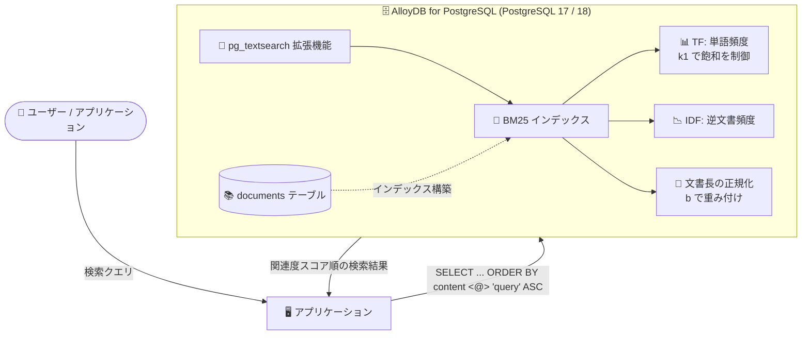

# AlloyDB for PostgreSQL: BM25 インデックスによる全文検索 (Preview)

**リリース日**: 2026-08-04

**サービス**: AlloyDB for PostgreSQL

**機能**: Best Matching 25 (BM25) インデックスによる全文検索

**ステータス**: Preview

📊 [このアップデートのインフォグラフィックを見る](https://takech9203.github.io/google-cloud-news-summary/20260804-alloydb-bm25-full-text-search.html)

## 概要

AlloyDB for PostgreSQL が、全文検索向けの Best Matching 25 (BM25) インデックスを Preview として提供開始しました。新しい `pg_textsearch` 拡張機能を有効化することで BM25 インデックスを作成でき、全文検索の確率的ランキング (probabilistic ranking) を最適化できます。本機能は PostgreSQL 17 または 18 を実行する AlloyDB インスタンスでサポートされます。

BM25 は、ドキュメントがクエリに対してどの程度関連しているかを推定するために広く使われている確率的ランキングアルゴリズムです。Term Frequency (TF: 単語の出現頻度)、Inverse Document Frequency (IDF: 逆文書頻度)、Document Length Normalization (文書長の正規化) の 3 要素を評価することで、PostgreSQL 標準のテキスト検索よりも高精度な検索ランキングを実現します。Elasticsearch などの専用検索エンジンで標準的に使われているランキングアルゴリズムを、マネージド PostgreSQL データベース内で直接利用できるようになった点が大きなポイントです。

検索機能を持つアプリケーション (EC サイトの商品検索、ドキュメント検索、ナレッジベース、RAG アプリケーションなど) を AlloyDB 上で構築している開発者が主な対象ユーザーです。外部の検索エンジンを別途運用することなく、SQL だけで高品質な関連度ランキングを実装できます。

**アップデート前の課題**

- PostgreSQL 標準の全文検索のランキングは `ts_rank` / `ts_rank_cd` 関数に依存しており、BM25 のような TF-IDF ベースの確率的ランキング (単語頻度の飽和制御や文書長の正規化) が利用できなかった
- AlloyDB では高性能な全文検索向けに RUM 拡張機能が提供されていたが、RUM 拡張は PostgreSQL 17 以前のみのサポートで、ランキング品質を高めるには追加の工夫が必要だった
- Elasticsearch などの BM25 ランキングを備えた検索エンジンと同等の検索品質を求める場合、データベース外部に検索基盤を構築・同期する必要があり、運用コストとデータ整合性の課題があった

**アップデート後の改善**

- `pg_textsearch` 拡張機能により、`CREATE INDEX ... USING bm25` という SQL だけで BM25 インデックスを作成し、確率的ランキングによる全文検索が可能になった
- `k1` (単語頻度の飽和パラメータ) と `b` (文書長の正規化パラメータ) をインデックス作成時に調整でき、ドキュメントコレクションの特性に合わせたランキングチューニングが可能になった
- `<@>` 演算子で BM25 スコアによる関連度順の検索を `ORDER BY ... LIMIT` の形で簡潔に記述できるようになった
- PostgreSQL 17 に加えて 18 でもサポートされ、最新バージョンでの全文検索の選択肢が拡充された

## アーキテクチャ図



アプリケーションは `<@>` 演算子を使った SQL クエリを発行するだけで、`pg_textsearch` 拡張の BM25 インデックスが TF・IDF・文書長正規化を評価した確率的ランキング結果を返します。

## サービスアップデートの詳細

### 主要機能

1. **pg_textsearch 拡張機能による BM25 インデックス**
   - `CREATE EXTENSION pg_textsearch` で拡張機能を有効化し、`USING bm25` 構文でテキストカラムにインデックスを作成
   - PostgreSQL 標準の全文検索 (GIN / GiST) では実現できなかった、TF-IDF ベースの確率的ランキングをデータベース内で直接実行

2. **`<@>` 演算子による関連度ランキング検索**
   - `content <@> '検索語'` の形式で BM25 スコアを計算
   - スコアは負の値で返される (PostgreSQL のインデックススキャンが昇順 (ASC) のみをサポートするための仕様)。より小さい (より負の) スコアほど関連度が高い
   - `ORDER BY ... ASC LIMIT N` で上位 N 件の関連ドキュメントを効率的に取得

3. **ランキングパラメータのチューニング**
   - `k1` (デフォルト: 1.2): 単語頻度の飽和パラメータ。大きくすると、クエリ語が繰り返し出現するドキュメントのスコアが上がりやすくなる
   - `b` (デフォルト: 0.75): 文書長の正規化パラメータ。大きくすると、長いドキュメントへのペナルティが強くなる
   - `text_config` (必須): 使用する PostgreSQL テキスト検索設定 (例: `english`)

## 技術仕様

### 要件と仕様

| 項目 | 詳細 |
|------|------|
| 拡張機能 | `pg_textsearch` (データベースごとに有効化が必要) |
| 対応 PostgreSQL バージョン | 17 または 18 (AlloyDB インスタンス) |
| 必要なデータベースロール | `alloydbsuperuser` |
| インデックスタイプ | `bm25` |
| 検索演算子 | `<@>` (負の BM25 スコアを返す) |
| インデックスパラメータ | `text_config` (必須)、`k1` (デフォルト 1.2)、`b` (デフォルト 0.75) |
| リリースステージ | Preview (Pre-GA Offerings Terms が適用) |

## 設定方法

### 前提条件

1. PostgreSQL 17 または 18 を実行する AlloyDB インスタンス
2. `alloydbsuperuser` データベースロールを持つユーザー

### 手順

#### ステップ 1: pg_textsearch 拡張機能の有効化

```sql
CREATE EXTENSION IF NOT EXISTS pg_textsearch;
```

psql などのクライアントで AlloyDB データベースに接続し、データベースごとに拡張機能を作成します。

#### ステップ 2: BM25 インデックスの作成

```sql
-- サンプルテーブルの作成
CREATE TABLE documents (
  id SERIAL PRIMARY KEY,
  title TEXT NOT NULL,
  content TEXT NOT NULL
);

-- content カラムに BM25 インデックスを作成
CREATE INDEX idx_docs_bm25
ON documents
USING bm25 (content)
WITH (text_config = 'english');
```

`WITH` 句では `text_config` (必須) に加えて、`k1` と `b` をオプションで指定できます。

#### ステップ 3: BM25 スコアによる検索

```sql
SELECT title, content, content <@> 'database system' AS score
FROM documents
ORDER BY content <@> 'database system' ASC
LIMIT 5;
```

`<@>` 演算子は負の BM25 スコアを返すため、昇順 (ASC) でソートすると関連度の高いドキュメントが先頭に来ます。

#### ステップ 4 (任意): ランキングパラメータのチューニング

```sql
-- 短いドキュメント向けに単語頻度を重視する設定例
CREATE INDEX idx_docs_bm25_tuned
ON documents
USING bm25 (content)
WITH (text_config = 'english', k1 = 1.5, b = 0.8);
```

## メリット

### ビジネス面

- **検索基盤の統合によるコスト削減**: 高品質な関連度ランキングのために外部検索エンジン (Elasticsearch など) を別途構築・運用する必要がなくなり、インフラコストとデータ同期の運用負荷を削減できる
- **検索体験の向上**: BM25 による確率的ランキングで検索結果の関連性が向上し、EC サイトやナレッジベースなどのユーザー体験改善に直結する

### 技術面

- **SQL ネイティブな実装**: インデックス作成も検索も標準的な SQL 構文で完結し、既存の PostgreSQL アプリケーションに最小限の変更で導入できる
- **データ整合性の維持**: 検索インデックスがデータベース内にあるため、外部検索エンジンとの同期遅延や不整合が発生しない
- **チューニング可能なランキング**: `k1` と `b` パラメータにより、ドキュメントコレクションの特性 (文書長のばらつき、単語の繰り返し傾向) に合わせた最適化が可能
- **ハイブリッド検索との親和性**: AlloyDB の ScaNN ベクトル検索と組み合わせることで、キーワード検索とセマンティック検索を融合したハイブリッド検索を単一データベースで構築できる

## デメリット・制約事項

### 制限事項

- Preview 段階の機能であり、Pre-GA Offerings Terms が適用される (SLA 対象外、サポートが限定される可能性がある)
- PostgreSQL 17 または 18 を実行する AlloyDB インスタンスのみでサポートされる
- 拡張機能の有効化に `alloydbsuperuser` データベースロールが必要

### 考慮すべき点

- `<@>` 演算子が返すスコアは負の値である (PostgreSQL が昇順インデックススキャンのみをサポートするため)。アプリケーション側でスコアを表示する場合は符号の扱いに注意が必要
- 従来の RUM 拡張機能は PostgreSQL 17 以前のみのサポートであるため、PostgreSQL 18 で高機能な全文検索を行う場合は BM25 インデックスが主な選択肢となる
- `k1` と `b` のチューニングはインデックス作成時に指定するため、パラメータ変更にはインデックスの再作成が必要

## ユースケース

### ユースケース 1: EC サイトの商品検索の関連度改善

**シナリオ**: AlloyDB 上で商品カタログを管理する EC サイトで、商品説明文に対するキーワード検索の関連度を改善したい。従来の `ts_rank` ベースの検索では、説明文の長い商品が不当に低くランクされたり、キーワードの重要度が反映されにくいという課題があった。

**実装例**:
```sql
CREATE EXTENSION IF NOT EXISTS pg_textsearch;

CREATE INDEX idx_products_bm25
ON products
USING bm25 (description)
WITH (text_config = 'english', k1 = 1.5, b = 0.8);

SELECT name, description <@> 'wireless noise cancelling headphones' AS score
FROM products
ORDER BY description <@> 'wireless noise cancelling headphones' ASC
LIMIT 20;
```

**効果**: TF-IDF と文書長正規化に基づく関連度ランキングにより、検索エンジン専用製品に近い検索品質を外部システムなしで実現できる。

### ユースケース 2: RAG アプリケーションのハイブリッド検索

**シナリオ**: AlloyDB AI のベクトル検索 (ScaNN インデックス) を使った RAG アプリケーションで、セマンティック検索だけでは固有名詞や型番などの正確なキーワードマッチングが弱い。BM25 による全文検索を組み合わせて検索精度を高めたい。

**効果**: ベクトル検索 (意味的類似性) と BM25 全文検索 (キーワード関連度) を単一の AlloyDB 内で組み合わせるハイブリッド検索により、LLM に渡すコンテキストの検索精度が向上する。AlloyDB の `ai.hybrid_search()` 関数は複数の検索タイプの結果を RRF (Reciprocal Rank Fusion) アルゴリズムで統合できる。

## 料金

BM25 インデックス機能自体に追加料金はありません。AlloyDB の通常の料金体系 (コンピュート、ストレージ、ネットワーク) が適用されます。インデックスの構築・保持によりストレージ使用量とコンピュートリソースの消費が増える点は考慮が必要です。

### AlloyDB の基本料金 (参考)

| 項目 | 料金 (USD) |
|------|-----------|
| vCPU | $0.06608 / vCPU 時間 〜 |
| メモリ | $0.0112 / GB 時間 〜 |
| リージョナルクラスタストレージ | $0.0004109 / GB 時間 〜 |
| バックアップストレージ | $0.000137 / GB 時間 〜 |

1 年 / 3 年の確約利用割引 (CUD) により、vCPU とメモリはそれぞれ 25% / 52% の割引が適用可能です。詳細は [AlloyDB 料金ページ](https://cloud.google.com/alloydb/pricing) を参照してください。

## 利用可能リージョン

リージョン固有の制限は Release Notes に記載されていません。PostgreSQL 17 または 18 を実行する AlloyDB インスタンスで利用できます。最新のリージョン情報は [AlloyDB のドキュメント](https://docs.cloud.google.com/alloydb/docs) を参照してください。

## 関連サービス・機能

- **AlloyDB AI (ScaNN インデックス)**: ベクトル検索と BM25 全文検索を組み合わせたハイブリッド検索を構築可能。`ai.hybrid_search()` 関数が RRF アルゴリズムで結果を統合する
- **RUM 拡張機能**: AlloyDB が従来提供してきた高性能全文検索向けインデックス。PostgreSQL 17 以前のみサポートで、位置情報をインデックスに保持しフレーズ検索やランキングを高速化する
- **PostgreSQL 標準全文検索 (GIN / GiST)**: `tsvector` / `tsquery` / `@@` 演算子による組み込みの全文検索。BM25 インデックスはこれらのランキング品質を補完する
- **Vertex AI**: AlloyDB AI 経由で埋め込み生成 (`embedding()` 関数) に利用でき、BM25 と組み合わせた RAG アーキテクチャを構成できる

## 参考リンク

- 📊 [インフォグラフィック](https://takech9203.github.io/google-cloud-news-summary/20260804-alloydb-bm25-full-text-search.html)
- [公式リリースノート](https://docs.cloud.google.com/release-notes#August_04_2026)
- [ドキュメント: Create and manage a BM25 index](https://docs.cloud.google.com/alloydb/docs/ai/create-bm25-index)
- [ドキュメント: 全文検索の概要](https://docs.cloud.google.com/alloydb/docs/ai/full-text-search-overview)
- [ドキュメント: ハイブリッドベクトル類似検索の実行](https://docs.cloud.google.com/alloydb/docs/ai/run-hybrid-vector-similarity-search)
- [料金ページ](https://cloud.google.com/alloydb/pricing)

## まとめ

AlloyDB の BM25 インデックスは、専用検索エンジンで標準的な確率的ランキングアルゴリズムをマネージド PostgreSQL 内で直接利用可能にする重要なアップデートです。外部検索基盤なしで高品質な全文検索を実現でき、ScaNN ベクトル検索と組み合わせたハイブリッド検索により RAG アプリケーションの検索精度向上にも寄与します。PostgreSQL 17 / 18 の AlloyDB インスタンスを利用中で検索機能を持つアプリケーションを運用している場合は、Preview 段階での評価を推奨します。

---

**タグ**: AlloyDB, PostgreSQL, BM25, 全文検索, pg_textsearch, 検索ランキング, ハイブリッド検索, Preview
