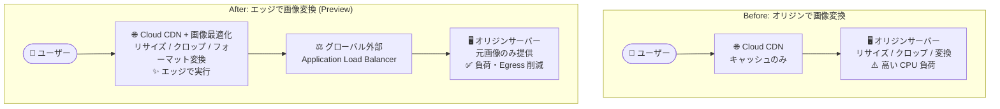

# Cloud CDN: ネイティブ画像最適化 (Image Optimization)

**リリース日**: 2026-08-04

**サービス**: Cloud CDN

**機能**: Google ネットワークエッジでのネイティブ画像最適化

**ステータス**: Preview

📊 [このアップデートのインフォグラフィックを見る](https://takech9203.github.io/google-cloud-news-summary/20260804-cloud-cdn-image-optimization.html)

## 概要

Cloud CDN が、グローバル外部アプリケーションロードバランサ (Global External Application Load Balancer) 向けに、Google ネットワークエッジでのネイティブ画像最適化 (Image Optimization) を Preview として提供開始しました。リサイズ、クロップ、フォーマット変換といった計算負荷の高い画像変換処理を、オリジンサーバーではなく Google のエッジで実行できるようになります。

これまで画像の動的な変換・最適化には、オリジン側での実装 (Thumbor などのセルフマネージド画像処理サーバー) やサードパーティの画像 CDN サービスが必要でした。今回のアップデートにより、Cloud CDN と外部アプリケーションロードバランサの既存構成に画像最適化を組み込めるようになり、オリジンサーバーの負荷と Egress コストの削減が期待できます。

Web サイトやモバイルアプリで多数の画像バリエーション (サムネイル、デバイス別サイズ、次世代フォーマット) を配信しているワークロードを持つユーザーが主な対象です。なお、Preview 期間中は画像最適化を無料で利用でき、GA (一般提供) 後に課金が開始される予定です。

**アップデート前の課題**

- 画像のリサイズ・クロップ・フォーマット変換はオリジンサーバー側で実行する必要があり、CPU リソースを消費していた
- デバイスごとに異なるサイズ・フォーマットの画像を用意するには、事前生成 (ビルド時処理) や画像処理サーバーの構築・運用が必要だった
- 変換前の大きな元画像をオリジンから転送するため、オリジンからの Egress (キャッシュフィル) コストが増加していた
- サードパーティの画像 CDN を利用する場合、別オリジンへの接続追加による接続セットアップ時間の増加や、追加の契約・運用管理が必要だった

**アップデート後の改善**

- 画像変換 (リサイズ、クロップ、フォーマット変換) が Google ネットワークエッジで実行され、オリジンサーバーの計算負荷がオフロードされた
- 変換処理を CDN 側に任せることで、オリジンサーバーの負荷とオリジンからの Egress コストを削減できるようになった
- グローバル外部アプリケーションロードバランサ + Cloud CDN という既存の構成に、追加のインフラ構築なしで画像最適化を組み込めるようになった

## アーキテクチャ図

従来はオリジンサーバーが画像変換を担っていましたが、今回のアップデートにより計算負荷の高い変換処理が Google ネットワークエッジ (Cloud CDN) にオフロードされ、オリジンは元画像の提供に専念できます。

## サービスアップデートの詳細

### 主要機能

1. **エッジでのネイティブ画像変換**
   - リサイズ、クロップ、フォーマット変換といった計算負荷の高い画像変換を Google ネットワークエッジで実行
   - オリジンサーバー側での画像処理実装やサードパーティ画像 CDN が不要になる

2. **オリジン負荷と Egress コストの削減**
   - 変換処理をエッジにオフロードすることで、オリジンサーバーの CPU 負荷を軽減
   - オリジンからのデータ転送 (Egress) コストを削減

3. **グローバル外部アプリケーションロードバランサとの統合**
   - Cloud CDN が有効なグローバル外部アプリケーションロードバランサの構成で利用可能
   - Google Front End (GFE) を経由する既存の配信パスに画像最適化が組み込まれる

## 技術仕様

| 項目 | 詳細 |
|------|------|
| 対応ロードバランサ | グローバル外部アプリケーションロードバランサ |
| 実行場所 | Google ネットワークエッジ |
| サポートされる変換 | リサイズ、クロップ、フォーマット変換など |
| リリースステージ | Preview |
| Preview 期間中の料金 | 無料 (GA 後に課金開始) |

## メリット

### ビジネス面

- **コスト削減**: 画像変換のオフロードにより、オリジンサーバーのコンピュートコストと Egress コストを削減できる
- **運用負荷の軽減**: 画像処理サーバー (Thumbor 等) の構築・運用やサードパーティ画像 CDN の契約管理が不要になる
- **Preview 期間中は無料**: GA までは追加料金なしで機能を評価できる

### 技術面

- **オリジンのスケーラビリティ向上**: 計算負荷の高い変換処理がエッジで実行されるため、オリジンは動的コンテンツの生成に専念できる
- **配信パフォーマンスの向上**: ユーザーに近い Google エッジで変換・配信が完結し、レイテンシ削減が期待できる
- **既存構成への追加が容易**: グローバル外部アプリケーションロードバランサ + Cloud CDN の既存構成を活用できる

## デメリット・制約事項

### 制限事項

- Preview 段階のため、SLA の対象外であり、本番ワークロードへの適用は慎重に判断する必要がある
- グローバル外部アプリケーションロードバランサのみ対応 (リージョン外部/内部アプリケーションロードバランサ、クラシックアプリケーションロードバランサへの対応は明記されていない)

### 考慮すべき点

- Preview 期間中は無料だが、**GA 後は課金が開始される**ため、GA 時の料金体系を確認した上でコスト計画を立てる必要がある
- 変換後の画像のキャッシュ動作 (キャッシュキーとの関係) や具体的な変換パラメータの仕様は、公式ドキュメント「Optimize images with Cloud CDN」で確認が必要

## ユースケース

### ユースケース 1: EC サイトの商品画像配信

**シナリオ**: EC サイトで同一の商品画像を、一覧ページのサムネイル、詳細ページの拡大画像、モバイルアプリ用など複数サイズで配信している。従来はオリジン側で全バリエーションを事前生成・保存していた。

**効果**: 元画像 1 枚をオリジンに置くだけで、エッジ側でリサイズ・クロップして配信できる。ストレージの重複保存とオリジンの変換負荷が削減され、画像バリエーション追加時の再生成バッチも不要になる。

### ユースケース 2: メディアサイトの次世代フォーマット配信

**シナリオ**: ニュースサイトで大量の JPEG 画像を配信しているが、ページ表示速度改善 (LCP 改善) のために WebP や AVIF などの次世代フォーマットへの移行を検討している。オリジン側での一括変換はコストと時間がかかる。

**効果**: エッジでのフォーマット変換により、オリジンの画像を変更することなく最適化されたフォーマットで配信でき、転送量削減とページ表示速度の改善が期待できる。

## 料金

**Preview 期間中、画像最適化機能は無料で利用できます。GA (一般提供) 後に課金が開始されます。**

画像最適化機能自体の GA 後の料金は未発表です。なお、Cloud CDN の基本料金は以下のとおりです (画像最適化とは別に発生します)。

### Cloud CDN 基本料金 (参考)

| 項目 | 料金 (USD) |
|------|-----------|
| キャッシュデータ転送 (Cache data transfer out) | $0.02〜$0.20 / GiB (宛先と月間使用量による) |
| キャッシュフィル (Cache fill) | $0.01〜$0.04 / GiB |
| HTTP/HTTPS キャッシュルックアップリクエスト | $0.0075 / 10,000 リクエスト |

詳細は [Cloud CDN 料金ページ](https://cloud.google.com/cdn/pricing) を参照してください。

## 利用可能リージョン

Cloud CDN はグローバルサービスであり、Google のグローバルエッジネットワークで提供されます。画像最適化機能の提供ロケーションの詳細は公式ドキュメントを参照してください。

## 関連サービス・機能

- **グローバル外部アプリケーションロードバランサ**: 画像最適化の前提となるロードバランサ。Cloud CDN と組み合わせて Google Front End (GFE) 経由でコンテンツを配信する
- **Cloud Storage**: バックエンドバケットとして画像のオリジンに利用されることが多い。Cloud CDN との組み合わせで大容量ファイルのキャッシュやキャッシュ無効化が可能
- **Cloud Monitoring / Cloud Logging**: Cloud CDN の事前定義ダッシュボードでキャッシュヒット率、キャッシュ Egress、エラー率などを監視できる
- **Service Extensions**: ロードバランサのデータパスを拡張する仕組み。エッジ拡張により Cloud CDN のキャッシュ動作に影響を与えるカスタムロジックを実装できる

## 参考リンク

- 📊 [インフォグラフィック](https://takech9203.github.io/google-cloud-news-summary/20260804-cloud-cdn-image-optimization.html)
- [公式リリースノート](https://docs.cloud.google.com/release-notes#August_04_2026)
- [Cloud CDN ドキュメント (概要)](https://docs.cloud.google.com/cdn/docs/overview)
- [料金ページ](https://cloud.google.com/cdn/pricing)

## まとめ

Cloud CDN のネイティブ画像最適化により、これまでオリジンサーバーやサードパーティ画像 CDN に依存していた画像変換処理を Google ネットワークエッジで完結できるようになりました。Preview 期間中は無料で利用できるため、画像配信のオリジン負荷や Egress コストに課題を抱えているワークロードでは、この期間に効果を検証することを推奨します。GA 後は課金が開始されるため、料金体系の発表にも注視してください。

---

**タグ**: Cloud CDN, 画像最適化, Application Load Balancer, ネットワーキング, パフォーマンス, コスト削減, Preview
