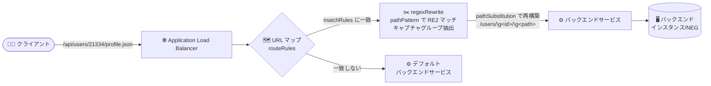

# Cloud Load Balancing: 正規表現による URL リライト (regexRewrite) が Preview に

**リリース日**: 2026-08-04

**サービス**: Cloud Load Balancing

**機能**: URL マップのルートルールにおける正規表現 URL リライト (regexRewrite)

**ステータス**: Preview

📊 [このアップデートのインフォグラフィックを見る](https://takech9203.github.io/google-cloud-news-summary/20260804-cloud-load-balancing-regex-url-rewrite.html)

## 概要

Application Load Balancer の URL マップにおいて、ルートルールに対する正規表現 URL リライト (`regexRewrite`) が Preview として利用可能になりました。正規表現パターンによるリライトアクションを使用して、リクエストをバックエンドに転送する前に、URL パスのコンポーネントを置換・削除・並べ替えることができます。

`pathPattern` フィールドに RE2 構文の正規表現を指定して受信リクエストパスの一部をキャプチャし、`pathSubstitution` フィールドでキャプチャグループを参照しながらバックエンドへ送信するパスを再構築します。名前付きキャプチャグループ (`(?<name>re)`) を `\g<name>` で参照する方法と、`\1` や `\2` のような番号による参照の両方に対応しています。

従来のプレフィックス置換 (`pathPrefixRewrite`) やパステンプレート (`pathTemplateRewrite`) では表現が難しかった、パス途中のセグメント抽出やコンポーネントの結合・並べ替えといった複雑な URL 変換を、ロードバランサーのレイヤーで宣言的に実現できます。API ゲートウェイ的なパス変換をアプリケーションコードやプロキシを追加せずに行いたいユーザーに有用です。

**アップデート前の課題**

- URL リライトはプレフィックス置換 (`pathPrefixRewrite`) やパステンプレートのワイルドカード (`pathTemplateRewrite`) に限られ、正規表現によるきめ細かなパス変換はロードバランサーでは行えなかった
- パス途中の複数セグメントを抽出して結合・並べ替えるような複雑な変換は、バックエンド側のアプリケーションや別途プロキシで実装する必要があった

**アップデート後の改善**

- RE2 構文の正規表現でパスをマッチ・キャプチャし、キャプチャグループを使って新しいパスを再構築できるようになった
- 名前付きキャプチャグループ (`\g<name>`) と番号参照 (`\1` など) の両方でパスコンポーネントの置換・削除・並べ替えが可能になった
- リージョナル/クロスリージョン内部 ALB、リージョナル/グローバル外部 ALB で URL マップの設定のみで複雑なリライトを実現できるようになった

## アーキテクチャ図



クライアントのリクエストパスをロードバランサーの URL マップで RE2 正規表現によりマッチ・キャプチャし、置換後のパスでバックエンドサービスに転送するフローを示しています。

## サービスアップデートの詳細

### 主要機能

1. **正規表現によるパスのマッチとキャプチャ (`pathPattern`)**
   - `pathMatchers[].routeRules[].routeAction.urlRewrite.regexRewrite.pathPattern` に RE2 構文の正規表現を指定
   - 受信リクエストパスの一部をキャプチャグループ `(...)` で抽出できる
   - 名前付きキャプチャグループは `(?<name>re)` または `(?P<name>re)` 形式で定義

2. **キャプチャグループを使ったパスの再構築 (`pathSubstitution`)**
   - `pathMatchers[].routeRules[].routeAction.urlRewrite.regexRewrite.pathSubstitution` でバックエンドへ送るパスを再構築
   - 名前付き構文 `\g<name>` または番号構文 `\1`、`\2` でキャプチャグループを参照
   - 名前付きグループ `(?<name>re)` は番号と名前の両方が付与されるため、どちらでも参照可能

3. **動作例**
   - 受信リクエストの URL パス: `/api/users/21334/profile.json`
   - `pathPattern`: `/api/users/(?<id>\d+)/(?<path>[a-z]+\.json)`
   - `pathSubstitution`: `/users/\g<id>/\g<path>`
   - バックエンドに送信されるパス: `/users/21334/profile.json`

## 技術仕様

### 対応プロダクトと制限

| 項目 | 詳細 |
|------|------|
| 対応ロードバランサー | リージョナル内部 ALB、クロスリージョン内部 ALB、リージョナル外部 ALB、グローバル外部 ALB |
| 非対応 | クラシック Application Load Balancer (正規表現をサポートしない) |
| 正規表現構文 | RE2 構文 (URL マップで許可されるオペレーターには制限あり) |
| リライトアクションの排他性 | 1 つのルートルールに指定できる URL リライトアクションは 1 つのみ。`regexRewrite` は `pathPrefixRewrite`、`pathTemplateRewrite` と併用不可 |
| キャプチャグループ数 | `pathSubstitution` で参照できるキャプチャグループは最大 8 個 (`pathPattern` で定義が必要) |
| 文字数制限 | `pathPattern`、`pathSubstitution` はそれぞれ最大 250 文字 |
| ステータス | Preview (Pre-GA Offerings Terms が適用され、サポートが限定される場合あり) |

### URL マップ設定例

以下は公式ドキュメントに掲載されている設定例です。`/region/us-central1/bucket/my-bucket/stage/dev/object.pdf` のようなリクエストが `/us-central1/my-bucket-dev/object.pdf` にリライトされてバックエンドサービスにプロキシされます。

```yaml
defaultService: projects/example-project/regions/us-central1/backendServices/default-bs
name: regex-rewrite-url-map
pathMatchers:
- name: region-matcher
  defaultService: projects/example-project/regions/us-central1/backendServices/default-bs
  routeRules:
  - matchRules:
    - prefixMatch: /region/
    priority: 1
    service: projects/example-project/regions/us-central1/backendServices/rewrite-bs
    routeAction:
      urlRewrite:
        regexRewrite:
          pathPattern: "/region/(?<reg>[a-z0-9-]+)/bucket/(?<bkt>[a-z0-9-]+)/stage/(?<stg>[a-z0-9-]+)/object\\.pdf"
          pathSubstitution: "/\\g<reg>/\\g<bkt>-\\g<stg>/object.pdf"
```

## メリット

### ビジネス面

- **アプリケーション改修の削減**: URL 構造の変更やレガシーパスの吸収をロードバランサー側の設定だけで実現でき、バックエンドのコード変更やリリース作業を減らせる
- **追加コンポーネント不要**: パス変換のためだけに別途プロキシや API ゲートウェイを構築・運用する必要がなくなる

### 技術面

- **複雑なパス変換に対応**: パス途中のセグメント抽出、コンポーネントの結合 (例: `\g<bkt>-\g<stg>`)、削除、並べ替えが正規表現で宣言的に記述できる
- **既存のルートルールと統合**: URL マップの `routeRules` の一部として設定するため、マッチ条件 (`matchRules`) やバックエンド選択と組み合わせて柔軟なルーティングが構成できる

## デメリット・制約事項

### 制限事項

- Preview 機能であり、Pre-GA Offerings Terms が適用される (サポートが限定される場合がある)
- クラシック Application Load Balancer では利用できない
- `regexRewrite` は `pathPrefixRewrite` や `pathTemplateRewrite` と同一ルートルール内で併用できない
- キャプチャグループは最大 8 個、`pathPattern` / `pathSubstitution` は各 250 文字まで
- RE2 構文のうち URL マップで許可されるオペレーターには制限がある ([RE2 specifications for URL maps](https://docs.cloud.google.com/load-balancing/docs/re2-support) を参照)

### 考慮すべき点

- URL マップでの正規表現マッチングは、メモリ消費とリクエスト処理レイテンシの面でコストが高い。公式ドキュメントでは、URL マップに正規表現が 1 つある場合で約 100 マイクロ秒/リクエスト、5 つの場合で約 200 マイクロ秒/リクエストのレイテンシ増加が目安として示されている (正規表現マッチャーに関する記載)
- リライト後のパスがバックエンドアプリケーションのルーティングと整合しているか、デプロイ前に十分なテストが必要

## ユースケース

### ユースケース 1: 外部公開 API パスと内部パスの分離

**シナリオ**: 外部向けには `/api/users/{id}/profile.json` という API パスを公開しつつ、バックエンドサービスは `/users/{id}/profile.json` という内部パス構造で実装されている。

**実装例**:
```yaml
routeAction:
  urlRewrite:
    regexRewrite:
      pathPattern: "/api/users/(?<id>\\d+)/(?<path>[a-z]+\\.json)"
      pathSubstitution: "/users/\\g<id>/\\g<path>"
```

**効果**: 外部公開する URL 構造とバックエンドの実装を疎結合に保ち、バックエンドの変更なしに公開 API パスを維持できる。

### ユースケース 2: パスコンポーネントの結合・並べ替え

**シナリオ**: `/region/{region}/bucket/{bucket}/stage/{stage}/object.pdf` のような冗長なパスを受け付け、バックエンドには `{bucket}-{stage}` のように複数セグメントを結合した短いパス `/{region}/{bucket}-{stage}/object.pdf` で転送したい。

**効果**: 従来のプレフィックス置換では不可能だった複数セグメントの抽出・結合・並べ替えを、ロードバランサーの設定のみで実現できる。

## 料金

このアップデートに固有の追加料金に関する記載はリリースノートにありません。Cloud Load Balancing の料金体系については公式の料金ページを参照してください。

- [Cloud Load Balancing の料金](https://cloud.google.com/vpc/network-pricing)

## 関連サービス・機能

- **パステンプレートによるワイルドカードマッチング (`pathTemplateRewrite`)**: ワイルドカード構文と名前付き変数によるパス変換。単純なセグメント単位の変換であればこちらでも対応可能で、`regexRewrite` とは同一ルールで併用不可
- **正規表現マッチャー (`regexMatch`)**: ルートルールの `matchRules` でパス・ヘッダー・クエリパラメータを正規表現でマッチする機能 (同じく Preview)。マッチ条件とリライトを組み合わせた高度なルーティングが可能
- **Cloud Service Mesh**: URL マップベースの高度なトラフィック管理を共有する関連プロダクト

## 参考リンク

- 📊 [インフォグラフィック](https://takech9203.github.io/google-cloud-news-summary/20260804-cloud-load-balancing-regex-url-rewrite.html)
- [公式リリースノート](https://docs.cloud.google.com/release-notes#August_04_2026)
- [ドキュメント: Regular expression URL rewrites for route rules](https://docs.cloud.google.com/load-balancing/docs/url-map-concepts#regex-url-rewrite)
- [RE2 specifications for URL maps](https://docs.cloud.google.com/load-balancing/docs/re2-support)
- [料金ページ](https://cloud.google.com/vpc/network-pricing)

## まとめ

Application Load Balancer の URL マップで正規表現によるパスリライトが可能になり、これまでバックエンドや追加プロキシで実装していた複雑な URL 変換をロードバランサー層で完結できるようになりました。まだ Preview のため本番適用は慎重に判断しつつ、正規表現マッチングによるレイテンシ増加とキャプチャグループ数・文字数の制限を考慮した上で、パス変換要件のあるワークロードでの検証を始めることをおすすめします。

---

**タグ**: Cloud Load Balancing, Application Load Balancer, URL マップ, regexRewrite, URL リライト, RE2, Preview, ネットワーキング
