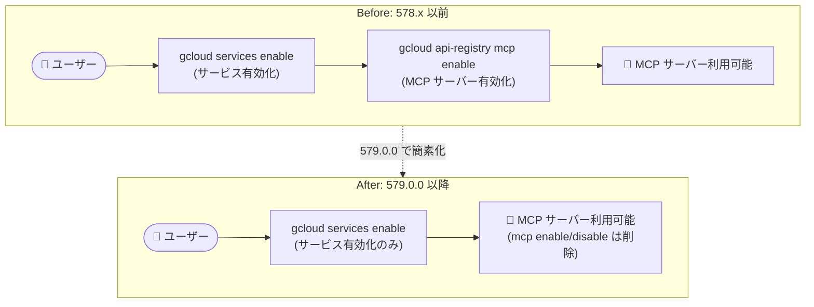

# Cloud SDK: gcloud CLI 579.0.0 リリース (Breaking Changes と複数の GA 昇格)

**リリース日**: 2026-08-04

**サービス**: Cloud SDK (gcloud CLI)

**機能**: gcloud CLI 579.0.0 - Breaking Changes、GA 昇格、新コマンド群の追加

**ステータス**: リリース済み (Breaking Changes を含む)

📊 [このアップデートのインフォグラフィックを見る](https://takech9203.github.io/google-cloud-news-summary/20260804-cloud-sdk-579-breaking-changes.html)

## 概要

2026 年 8 月 4 日、Google Cloud CLI (gcloud) のバージョン 579.0.0 がリリースされました。本リリースには 2 件の Breaking Changes が含まれるほか、Dataproc のフレキシブル VM フラグ、Cloud Functions の `gcloud functions upgrade` コマンド、Cloud Quotas の `gcloud quotas` サーフェス、Compute Engine の `gcloud compute hosts` / `reservations hosts` など、多数のコマンド・フラグが GA (General Availability) に昇格しています。

Breaking Changes は 2 件です。1 つ目は API Registry 関連で、`gcloud api-registry mcp enable` および `gcloud api-registry mcp disable` コマンドが削除されました。MCP サーバーの有効化操作が不要となり、基盤となるサービス (underlying service) を有効化するだけで十分になったためです。同様に `gcloud beta services mcp enable` も no-op に変更されています。2 つ目は Compute Engine 関連で、beta トラックの `gcloud compute instance-groups managed list-instances` の出力から `PRESERVED_STATE` 列が削除されました。この列を解析している自動化スクリプトは修正が必要です。

そのほか、Cloud SQL の `reencrypt` コマンドのゼロダウンタイム対応、IAM の新コマンド群 `gcloud iam access-policies` の追加、Compute Engine の各種 `test-iam-permissions` コマンドの追加、VMware Engine の CMEK 対応フラグなど、Solutions Architect や運用担当者が把握しておくべき変更が幅広く含まれています。CI/CD パイプラインで gcloud CLI を利用している場合は、Breaking Changes の影響確認を推奨します。

**アップデート前の課題**

- MCP サーバーを利用するには、サービス本体の有効化に加えて `gcloud api-registry mcp enable` などによる MCP サーバーの明示的な有効化が別途必要だった
- Dataproc のフレキシブル VM (instance-selection / instance-flexibility-policy) フラグは GA 前のトラックでの提供であり、本番利用の際に保証が限定的だった
- `gcloud functions upgrade` (第 1 世代から第 2 世代への関数アップグレード) は beta 提供で、GA 水準のサポートがなかった
- `gcloud sql instances reencrypt` は再暗号化時にダウンタイム警告が表示され、多くのインスタンスで停止を伴う操作だった
- Compute Engine の個別リソース (インスタンス、ディスク、ルーターなど) に対する IAM 権限を CLI から直接テストするコマンドが揃っていなかった
- Cloud Quotas の CLI 操作 (`gcloud quotas`) は GA 前の提供だった

**アップデート後の改善**

- MCP サーバーの有効化操作が不要になり、基盤サービスの有効化のみで利用可能になった (操作手順の簡素化)
- Dataproc のフレキシブル VM フラグが `clusters create` と `workflow-templates set-managed-cluster` で GA になり、本番環境で安心して利用できるようになった
- `gcloud functions upgrade` が GA に昇格し、第 1 世代関数の第 2 世代 (Cloud Run functions) への移行が GA サポートの下で実施できるようになった
- `gcloud sql instances reencrypt` がほとんどのインスタンスでゼロダウンタイム再暗号化に対応した (C4 / C4A / N4 マシンタイプは引き続き再起動が発生)
- instances / disks / routers / network-firewall-policies / snapshot-groups / http-health-checks に `test-iam-permissions` コマンドが追加され、IAM 権限の検証が CLI で完結するようになった
- `gcloud quotas` サーフェス (info、preferences、adjuster settings) が GA になり、クォータ管理を CLI で本番運用できるようになった

## アーキテクチャ図



Breaking Change の中心である MCP サーバー有効化フローの変更を示しています。579.0.0 以降は基盤サービスの有効化のみで MCP サーバーが利用可能となり、`gcloud api-registry mcp enable/disable` コマンドは削除されました。

## サービスアップデートの詳細

### Breaking Changes

1. **(API Registry) `gcloud api-registry mcp enable` / `gcloud api-registry mcp disable` の削除**
   - MCP サーバーの有効化操作が不要になったため、コマンド自体が削除された
   - 基盤となるサービスを有効化すれば MCP サーバーを利用できる
   - 関連して `gcloud beta services mcp enable` も no-op (何もしないコマンド) に変更された
   - スクリプトや CI/CD でこれらのコマンドを実行している場合、コマンドが存在せずエラーになるため削除が必要

2. **(Compute Engine) `gcloud compute instance-groups managed list-instances` の `PRESERVED_STATE` 列削除 (beta)**
   - beta トラックの出力から `PRESERVED_STATE` 列が削除された
   - 列位置や列名に依存して出力をパースしている自動化処理は修正が必要
   - `--format` フラグで明示的にフィールドを指定している場合の挙動も確認を推奨

### GA 昇格

1. **Cloud Dataproc: フレキシブル VM フラグ**
   - `--master-instance-selection`、`--master-instance-flexibility-policy-file`、`--worker-instance-selection`、`--worker-instance-flexibility-policy-file`、`--secondary-worker-instance-selection`、`--secondary-worker-instance-flexibility-policy-file` が GA に昇格
   - 対象コマンド: `gcloud dataproc clusters create`、`gcloud dataproc workflow-templates set-managed-cluster`
   - ランク付きのマシンタイプリストを指定し、優先マシンタイプが確保できない場合に代替マシンタイプへフォールバックできる (最大 5 ランク、1 リストあたり最大 10 マシンタイプ)

2. **Cloud Functions: `gcloud functions upgrade`**
   - 第 1 世代関数を第 2 世代 (Cloud Run functions) へアップグレードするコマンドが GA に昇格
   - `--redirect-traffic` / `--rollback-traffic` / `--commit` によるトラフィック切り替え・ロールバック・確定の段階的移行をサポート
   - あわせて `gcloud functions deploy` の `--direct-vpc-egress` フラグに `all-traffic` 値が追加され、全トラフィックの Direct VPC egress 経由送信を指定可能になった

3. **Cloud Quotas: `gcloud quotas` サーフェス**
   - info、preferences、adjuster settings の各サブコマンドが GA に昇格
   - クォータ情報の参照、クォータ引き上げ希望 (preference) の管理、クォータ調整機能の設定が CLI で GA サポートの下で利用可能

4. **Compute Engine: `gcloud compute hosts` / `gcloud compute reservations hosts`**
   - 物理ホスト関連のコマンド群が GA に昇格
   - `reservations hosts list` / `describe` は `--reservation-block` 指定時に `--reservation` が必須になった
   - `--igmp-query` フラグ (instance-templates create、instances network-interfaces add、instances bulk create) も GA に昇格

5. **その他の GA 昇格**
   - Cloud NetApp: `gcloud netapp volumes start-split` / `get-split-status` (ボリュームのクローン分割操作)
   - Distributed Cloud Edge: `gcloud edge-cloud zones list`
   - Compute Firewall Policies: `--policy-type` フラグの `ULL_POLICY` 値

### 新機能・新コマンド

1. **IAM: `gcloud iam access-policies` コマンド群**
   - `create` / `delete` / `describe` / `list` / `update` / `search-policy-bindings` によるアクセスポリシーリソースの管理が可能になった
   - `gcloud iam policy-bindings create` に `--target-resource` フラグが追加された

2. **Compute Engine: `test-iam-permissions` コマンドの拡充**
   - `gcloud compute instances test-iam-permissions` (GA / beta / preview)
   - `gcloud compute disks test-iam-permissions`
   - `gcloud compute routers test-iam-permissions` (beta)
   - `gcloud compute network-firewall-policies test-iam-permissions`
   - `gcloud compute snapshot-groups test-iam-permissions` (beta)
   - `gcloud compute http-health-checks test-iam-permissions`

3. **Compute Engine: インスタンス作成関連の機能追加**
   - ローカル SSD のパーティションサイズに 3500GB と 7000GB を追加 (`instances create` / `instance-templates create`)
   - `confidential-compute-type` オプションに Arm CCA (Confidential Compute Architecture) サポートを追加
   - `--ipv6-network-tier` フラグが subnets create/update で beta に昇格し、instances / instance-templates 関連コマンドで `STANDARD` オプションが beta 追加

4. **Cloud SQL: ゼロダウンタイム再暗号化**
   - `gcloud sql instances reencrypt` がほとんどのインスタンスでゼロダウンタイムの再暗号化をサポートし、従来のダウンタイム警告が削除された
   - CMEK のキーローテーション後、新しいプライマリキーバージョンでインスタンスを停止せずに再暗号化できる
   - C4 / C4A / N4 マシンタイプは未対応で、引き続き操作中に再起動が発生しダウンタイム警告が表示される

5. **VMware Engine: CMEK 対応**
   - `gcloud vmware private-clouds create` に `--kms-key` フラグが追加され、有効な KMS キーリソース名を指定すると CMEK が有効化される
   - `gcloud vmware private-clouds update` に `--encryption-type` と `--kms-key` フラグが追加 (`--encryption-type` が CMEK の場合 `--kms-key` は必須)

6. **その他の変更**
   - Cloud Firestore Emulator: `gcloud emulators firestore start` に `--require-indexes` と `--index-file` フラグを追加
   - Kubernetes Engine: デフォルト kubectl を 1.35.6 に更新 (1.30.14〜1.36.3 も同梱)
   - Network Services: `gcloud network-services endpoint-policies` の `clientTlsPolicy` フィールドを非推奨化、リソース名パターンがリージョナルロケーションをサポート
   - AI: `gcloud ai` の `us` マルチリージョンリクエストを Vertex AI マルチリージョナル (REP) エンドポイントへルーティング

## 技術仕様

### Breaking Changes の影響範囲

| 項目 | 詳細 |
|------|------|
| 削除コマンド | `gcloud api-registry mcp enable` / `gcloud api-registry mcp disable` |
| no-op 化 | `gcloud beta services mcp enable` |
| 出力変更 | `gcloud compute instance-groups managed list-instances` (beta) から `PRESERVED_STATE` 列を削除 |
| 影響対象 | 上記コマンドを利用するスクリプト、CI/CD パイプライン、出力パーサー |
| 対応方法 | MCP 関連コマンドの呼び出しを削除、列パースの修正、`--format` での明示的フィールド指定 |

### 主要な GA 昇格一覧

| サービス | GA 昇格した機能 |
|----------|----------------|
| Cloud Dataproc | instance-selection / instance-flexibility-policy 系 6 フラグ |
| Cloud Functions | `gcloud functions upgrade` |
| Cloud Quotas | `gcloud quotas` (info / preferences / adjuster settings) |
| Compute Engine | `gcloud compute hosts`、`gcloud compute reservations hosts`、`--igmp-query` フラグ |
| Cloud NetApp | `volumes start-split` / `get-split-status` |
| Distributed Cloud Edge | `gcloud edge-cloud zones list` |
| Compute Firewall Policies | `--policy-type` の `ULL_POLICY` 値 |

## 設定方法

### 前提条件

1. gcloud CLI がインストール済みであること
2. パッケージマネージャー (apt / yum) 経由でインストールした場合は、対応するパッケージ更新手順を使用すること

### 手順

#### ステップ 1: バージョンの確認と更新

```bash
# 現在のバージョンを確認
gcloud version

# 579.0.0 へ更新 (インタラクティブインストーラーの場合)
gcloud components update
```

更新前に Breaking Changes の影響を確認してください。

#### ステップ 2: Breaking Changes への対応

```bash
# NG (579.0.0 ではコマンドが存在しない)
# gcloud api-registry mcp enable ...

# OK: 基盤サービスの有効化のみで MCP サーバーが利用可能
gcloud services enable SERVICE_NAME
```

スクリプト内の `gcloud api-registry mcp enable/disable` 呼び出しを削除します。

#### ステップ 3: 問題発生時のダウングレード

```bash
# 以前のバージョンへ戻す (直接インストールの場合)
gcloud components update --version=578.0.0
```

パッケージマネージャー経由の場合は apt / yum のバージョン指定インストールを使用します。

## メリット

### ビジネス面

- **本番運用の安心感**: Dataproc フレキシブル VM、Cloud Quotas、`functions upgrade` などが GA となり、SLA・サポート対象の下で本番利用できる
- **ダウンタイム削減**: Cloud SQL の再暗号化がゼロダウンタイムになり、キーローテーション後のコンプライアンス対応をサービス停止なしで実施できる
- **コスト最適化の選択肢拡大**: Dataproc フレキシブル VM により、キャパシティ不足時のフォールバックとリザベーション活用でクラスタ起動の成功率とコスト効率を高められる

### 技術面

- **操作の簡素化**: MCP サーバーの有効化ステップが不要になり、サービス有効化のワンステップで完結する
- **IAM 検証の効率化**: 各種 `test-iam-permissions` コマンドにより、最小権限設計の検証やトラブルシューティングが CLI で完結する
- **移行パスの確立**: `gcloud functions upgrade` の GA 化により、第 1 世代関数から Cloud Run functions への段階的移行 (トラフィック切替・ロールバック・コミット) が正式サポートされた

## デメリット・制約事項

### 制限事項

- Cloud SQL のゼロダウンタイム再暗号化は C4 / C4A / N4 マシンタイプでは未対応 (再起動が発生する)
- `PRESERVED_STATE` 列の削除は beta トラックの変更であり、beta コマンドに依存した自動化は今後も変更リスクがある
- `--ipv6-network-tier` の `STANDARD` オプションは beta 提供
- Network Services の `clientTlsPolicy` フィールドは非推奨となったため、利用中の場合は移行計画が必要

### 考慮すべき点

- CI/CD パイプラインで gcloud CLI のバージョンを固定していない場合、579.0.0 への自動更新により MCP 関連コマンドの呼び出しが失敗する可能性がある
- `gcloud compute reservations hosts list/describe` は `--reservation-block` 指定時に `--reservation` が必須となったため、既存スクリプトの引数を確認する必要がある
- GKE のデフォルト kubectl が 1.35.6 に更新されたため、クラスタバージョンとのスキュー (バージョン差) ポリシーを確認すること

## ユースケース

### ユースケース 1: CI/CD パイプラインの Breaking Changes 対応

**シナリオ**: gcloud CLI を利用する CI/CD パイプラインで、MCP サーバー有効化を含むプロビジョニングスクリプトを運用している。579.0.0 への更新後にスクリプトが失敗するようになった。

**実装例**:
```bash
# 変更前 (失敗する)
gcloud services enable myservice.googleapis.com
gcloud api-registry mcp enable --service=myservice.googleapis.com

# 変更後 (サービス有効化のみで十分)
gcloud services enable myservice.googleapis.com
```

**効果**: プロビジョニング手順が 1 ステップ削減され、スクリプトの保守負担が軽減される。

### ユースケース 2: Cloud SQL の CMEK キーローテーション後の無停止再暗号化

**シナリオ**: コンプライアンス要件により CMEK の定期ローテーションを実施しており、ローテーション後にインスタンスを新しいキーバージョンで再暗号化する必要がある。従来はダウンタイムを伴うためメンテナンスウィンドウの調整が必要だった。

**実装例**:
```bash
# キーローテーション後、ゼロダウンタイムで再暗号化
gcloud sql instances reencrypt INSTANCE_NAME
```

**効果**: ほとんどのインスタンスでサービス停止なしにキーバージョンを更新でき、メンテナンスウィンドウの調整が不要になる (C4 / C4A / N4 は除く)。

### ユースケース 3: Dataproc クラスタのキャパシティ確保率向上

**シナリオ**: 特定マシンタイプの在庫不足によりクラスタ作成が失敗することがある。GA になったフレキシブル VM フラグで代替マシンタイプへのフォールバックを構成する。

**実装例**:
```bash
gcloud dataproc clusters create my-cluster \
  --region=us-central1 \
  --zone="" \
  --worker-instance-selection='{"machineTypes":["e2-standard-8"],"rank":0}' \
  --worker-instance-selection='{"machineTypes":["n2-standard-8"],"rank":1}' \
  --num-workers=10
```

**効果**: 優先マシンタイプが確保できない場合に自動的に代替マシンタイプで起動し、クラスタ作成の成功率が向上する。

## 料金

gcloud CLI 自体は無料で利用できます。CLI から操作する各サービス (Dataproc、Cloud SQL、Compute Engine など) には各サービスの料金が適用されます。

- [Google Cloud の料金](https://cloud.google.com/pricing)

## 利用可能リージョン

gcloud CLI はリージョンに依存せず利用できます。各コマンドが操作するサービス・機能のリージョン可用性は各サービスのドキュメントを参照してください。

## 関連サービス・機能

- **Cloud KMS**: Cloud SQL の再暗号化および VMware Engine の CMEK で使用するキーの管理を担う
- **Cloud Run functions**: `gcloud functions upgrade` による第 1 世代関数の移行先
- **IAM (Principal Access Boundary / Policy Bindings)**: 新設の `gcloud iam access-policies` や `--target-resource` フラグが関係するポリシー管理基盤
- **Managed Instance Group (MIG)**: `PRESERVED_STATE` 列削除の影響を受けるステートフル MIG の運用
- **GKE**: 同梱 kubectl のバージョン更新 (デフォルト 1.35.6) の影響を受ける

## 参考リンク

- 📊 [インフォグラフィック](https://takech9203.github.io/google-cloud-news-summary/20260804-cloud-sdk-579-breaking-changes.html)
- [公式リリースノート](https://docs.cloud.google.com/release-notes#August_04_2026)
- [gcloud CLI リリースノート](https://docs.cloud.google.com/sdk/docs/release-notes)
- [gcloud components update リファレンス](https://docs.cloud.google.com/sdk/gcloud/reference/components/update)
- [Cloud SQL CMEK 再暗号化ドキュメント](https://docs.cloud.google.com/sql/docs/mysql/configure-cmek)
- [第 1 世代関数のアップグレードガイド](https://docs.cloud.google.com/functions/1stgendocs/migrating/upgrade-gen1-functions)
- [Principal Access Boundary ポリシーの表示](https://docs.cloud.google.com/iam/docs/principal-access-boundary-policies-view)
- [リリースノート購読 (google-cloud-sdk-announce)](https://groups.google.com/forum/#!forum/google-cloud-sdk-announce)

## まとめ

gcloud CLI 579.0.0 は、MCP 有効化コマンドの削除と MIG 出力列の削除という 2 件の Breaking Changes を含むため、CLI を自動化に組み込んでいる環境では更新前の影響確認が必須です。一方で、Dataproc フレキシブル VM、`gcloud functions upgrade`、`gcloud quotas` などの GA 昇格と、Cloud SQL のゼロダウンタイム再暗号化により、本番運用の選択肢と運用性が大きく向上しています。まずは CI/CD パイプラインのスクリプトを点検し、その後 GA 化された機能の本番採用を検討することを推奨します。

---

**タグ**: #CloudSDK #gcloud #BreakingChanges #Dataproc #CloudFunctions #CloudQuotas #CloudSQL #ComputeEngine #IAM #CMEK #GA
