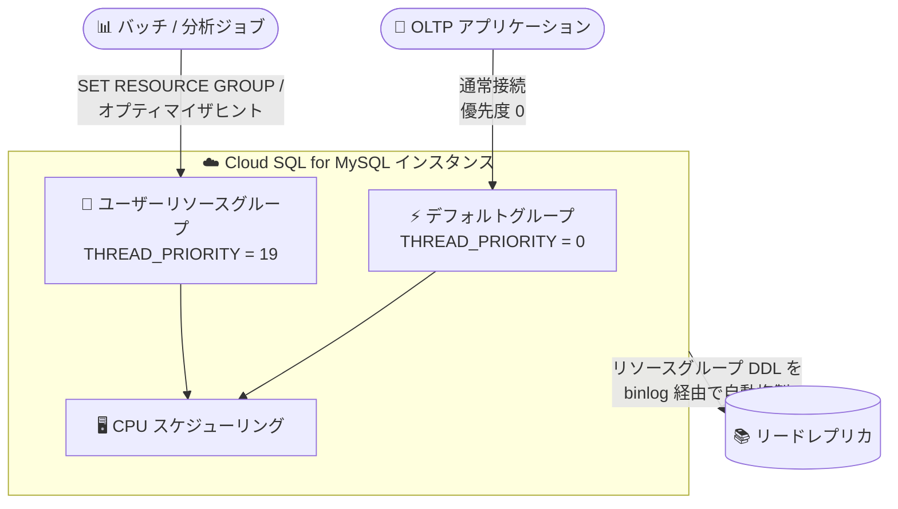

# Cloud SQL for MySQL: リソースグループのサポート

**リリース日**: 2026-08-04

**サービス**: Cloud SQL for MySQL

**機能**: MySQL リソースグループによるワークロード別リソース割り当て管理

**ステータス**: Feature

📊 [このアップデートのインフォグラフィックを見る](https://takech9203.github.io/google-cloud-news-summary/20260804-cloud-sql-mysql-resource-groups.html)

## 概要

Cloud SQL for MySQL が MySQL リソースグループをサポートしました。MySQL 8.0 で導入されたリソースグループは、単一のデータベースインスタンス上で動作する異なるスレッド間の CPU リソース割り当てを管理・優先順位付けする機能です。ユーザーレベルのリソースグループを作成し、スレッド優先度 (0 = 最高 〜 19 = 最低) を指定することで、セッションや個別クエリ単位でワークロードごとの CPU スケジューリング優先度を制御できます。

この機能は、日次の分析処理やバッチレポートといった低優先度タスクが CPU 使用率を急上昇させ、OLTP (オンライントランザクション処理) のようなクリティカルな高優先度接続のパフォーマンスを劣化させる「ノイジーネイバー問題」の緩和に有効です。重要度の低いワークロードが過剰なリソースを消費するのを防ぐことができます。

リソースグループは、Cloud SQL Enterprise エディションと Cloud SQL Enterprise Plus エディションの両方を含む、すべての Cloud SQL for MySQL 8.0 以降のインスタンスでサポートされます。利用するには、メンテナンスバージョン `MYSQL_VERSION.R20260320.00_20` 以降がインスタンスにインストールされている必要があります。

**アップデート前の課題**

- 同一インスタンス上で OLTP とバッチ/分析処理が混在すると、低優先度タスクの CPU スパイクがクリティカルな接続のパフォーマンスを劣化させる「ノイジーネイバー問題」が発生していた
- Cloud SQL for MySQL では、ワークロード (セッションやクエリ) 単位で CPU スケジューリング優先度を制御する手段がなかった
- CPU 競合を回避するには、リードレプリカへのワークロード分離やインスタンス分割といったコストのかかる対策が必要だった

**アップデート後の改善**

- `CREATE RESOURCE GROUP` でユーザーレベルのリソースグループを作成し、スレッド優先度 (0〜19) をワークロードごとに設定できるようになった
- `SET RESOURCE GROUP` によるセッション/スレッド単位の割り当てや、`/*+ RESOURCE_GROUP(...) */` オプティマイザヒントによるクエリ単位の割り当てが可能になった
- コミュニティ版 MySQL と異なり、リソースグループの DDL がバイナリログに書き込まれるよう Cloud SQL が動作を変更しており、リードレプリカへの自動複製とポイントインタイムリカバリ (PITR) での定義の保全が実現された

## アーキテクチャ図



OLTP 接続はデフォルトの最高優先度 (0) で処理される一方、バッチや分析ジョブは低優先度のリソースグループに割り当てることで CPU 競合を緩和します。リソースグループ定義はバイナリログを通じてリードレプリカにも自動複製されます。

## サービスアップデートの詳細

### 主要機能

1. **リソースグループの作成・変更・削除**
   - `CREATE RESOURCE GROUP <名前> TYPE = USER THREAD_PRIORITY = <優先度>;` でユーザーレベルのリソースグループを作成
   - スレッド優先度は 0 (最高) 〜 19 (最低) の範囲で指定可能。標準接続のデフォルト優先度は 0
   - `ALTER RESOURCE GROUP` で既存グループの優先度を変更、`DROP RESOURCE GROUP` で不要なグループを削除

2. **接続・クエリのリソースグループへの割り当て**
   - セッション単位: `SET RESOURCE GROUP <グループ名>;` で現在の接続を割り当て
   - スレッド単位: `SET RESOURCE GROUP <グループ名> FOR <スレッド ID>;` で特定スレッドを割り当て
   - クエリ単位: `SELECT /*+ RESOURCE_GROUP(<グループ名>) */ ...` のオプティマイザヒントで個別クエリを割り当て

3. **リソースグループのモニタリング**
   - `INFORMATION_SCHEMA.RESOURCE_GROUPS` で構成済みリソースグループを確認
   - `performance_schema.threads` でアクティブな接続スレッドと割り当て先リソースグループを確認

4. **リードレプリカへの自動複製 (Cloud SQL 独自の拡張)**
   - コミュニティ版 MySQL ではリソースグループ操作 (`CREATE`/`ALTER`/`DROP RESOURCE GROUP`) はバイナリログに書き込まれないが、Cloud SQL ではこのデフォルト動作をオーバーライドし、すべてのリソースグループ定義コマンドをバイナリログに記録する
   - これによりリソースグループがリードレプリカに自動複製され、レプリカ上でも `RESOURCE_GROUP` ヒントを使用でき、グループ未定義によるクエリ失敗を回避できる
   - グループ定義は PITR 用のバイナリログストリームにも保全される (`SET RESOURCE GROUP` などのセッション割り当てはバイナリログに書き込まれない)

## 技術仕様

### 前提条件と対応範囲

| 項目 | 詳細 |
|------|------|
| 対応バージョン | MySQL 8.0 以降のすべての Cloud SQL for MySQL インスタンス |
| 対応エディション | Cloud SQL Enterprise エディション / Enterprise Plus エディション |
| 必須メンテナンスバージョン | `MYSQL_VERSION.R20260320.00_20` 以降 |
| リソースグループの種類 | ユーザーレベル (`TYPE = USER`) のみ |
| スレッド優先度の範囲 | 0 (最高) 〜 19 (最低)、標準接続のデフォルトは 0 |

### 必要な権限

| 権限 | 用途 |
|------|------|
| `RESOURCE_GROUP_ADMIN` | リソースグループの作成・変更・削除 |
| `RESOURCE_GROUP_USER` | スレッドの割り当てやクエリでのヒント使用 |

Cloud SQL では両方の権限が `cloudsqlsuperuser` ロールにデフォルトで付与されています (デフォルトの root ユーザーを含む)。MySQL 管理者は他のユーザーに `RESOURCE_GROUP_USER` や `RESOURCE_GROUP_ADMIN` 権限を付与することもできます。

### コミュニティ版 MySQL との差異

Cloud SQL はフルマネージドサービスであるため、インスタンスの信頼性確保と内部プロセス保護の観点から、コミュニティ版 MySQL とは以下の差異・制限があります。

| 差異 | 内容 |
|------|------|
| CPU コアアフィニティ非対応 | `VCPU = 2-3` のようなコアレベルの CPU ピン留めは不可。`VCPU` 句を使用すると `ERROR 1227 (42000): Access denied` で失敗 |
| システムリソースグループ禁止 | `TYPE = SYSTEM` の作成は不可 (バックアップ・モニタリング・レプリケーションなどの Cloud SQL バックグラウンドジョブの保護のため) |
| DDL の自動バイナリログ記録 | コミュニティ版と異なり、リソースグループ DDL がバイナリログに記録されレプリカへ複製される |
| 管理権限の事前付与 | `RESOURCE_GROUP_ADMIN` / `RESOURCE_GROUP_USER` が `cloudsqlsuperuser` に事前付与済み |

## 設定方法

### 前提条件

1. `RESOURCE_GROUP_ADMIN` 権限を持つユーザーアカウントでデータベースにログインしている (デフォルトの root ユーザーおよび `cloudsqlsuperuser` ロールを持つアカウントはデフォルトで保持)
2. Cloud SQL インスタンスで MySQL 8.0 以降が稼働している
3. メンテナンスバージョン `MYSQL_VERSION.R20260320.00_20` 以降がインストールされている

### 手順

#### ステップ 1: リソースグループを作成する

```sql
CREATE RESOURCE GROUP batch_group
  TYPE = USER
  THREAD_PRIORITY = 19;
```

低優先度のバッチワークロード用に、最低優先度 (19) のユーザーリソースグループを作成します。

#### ステップ 2: ワークロードユーザーに権限を付与する

```sql
GRANT RESOURCE_GROUP_USER ON *.* TO 'batch_user'@'%';
```

接続をリソースグループに割り当てるユーザーに `RESOURCE_GROUP_USER` 権限を付与します。

#### ステップ 3: 接続またはクエリをリソースグループに割り当てる

```sql
-- セッション全体を割り当てる場合
SET RESOURCE GROUP batch_group;

-- 個別クエリのみ割り当てる場合 (オプティマイザヒント)
SELECT /*+ RESOURCE_GROUP(batch_group) */ region, SUM(sales)
FROM orders
GROUP BY region;
```

#### ステップ 4: リソースグループをモニタリングする

```sql
-- 構成済みリソースグループの確認
SELECT * FROM INFORMATION_SCHEMA.RESOURCE_GROUPS;

-- アクティブスレッドと割り当てグループの確認
SELECT THREAD_ID, NAME, TYPE, RESOURCE_GROUP
FROM performance_schema.threads;
```

## メリット

### ビジネス面

- **クリティカルワークロードの保護**: 分析やバッチ処理による CPU スパイクから OLTP のパフォーマンスを保護し、エンドユーザー体験の劣化を防止できる
- **インスタンス集約によるコスト効率**: CPU 競合を優先度制御で緩和できるため、ワークロード分離のためだけにインスタンスを分割する必要性を減らせる

### 技術面

- **きめ細かな優先度制御**: セッション単位・スレッド単位・クエリ単位という 3 つの粒度で CPU スケジューリング優先度を割り当てられる
- **レプリカとの整合性**: リソースグループ DDL が自動的にレプリカへ複製されるため、レプリカ上の `RESOURCE_GROUP` ヒント使用時にグループ未定義でクエリが失敗するリスクがない
- **標準 SQL による運用**: MySQL 標準の `CREATE/ALTER/DROP RESOURCE GROUP` 構文で管理でき、アプリケーション側の大きな変更が不要

## デメリット・制約事項

### 制限事項

- CPU コアアフィニティ (`VCPU` 句によるコアレベルのピン留め) はサポートされない (`THREAD_PRIORITY` のみ使用可能)
- システムリソースグループ (`TYPE = SYSTEM`) の作成は禁止されており、ユーザーレベルグループのみ作成可能
- メンテナンスバージョン `MYSQL_VERSION.R20260320.00_20` 以降が必須のため、古いメンテナンスバージョンのインスタンスでは事前にメンテナンス適用が必要
- MySQL 8.0 以降のインスタンスが対象 (MySQL 5.7 以前では利用不可)

### 考慮すべき点

- スレッド優先度によるスケジューリング制御であり、CPU やメモリの使用量をハードリミットで制限する仕組みではない
- `SET RESOURCE GROUP` などのセッション割り当てはバイナリログに記録されないため、レプリカ側では割り当てを個別に行う必要がある
- リリースノートではメモリリソースへの言及があるが、公式ドキュメントの管理対象は CPU スケジューリング優先度 (`THREAD_PRIORITY`) が中心である

## ユースケース

### ユースケース 1: OLTP と日次バッチレポートの共存

**シナリオ**: EC サイトの注文処理 (OLTP) を担う Cloud SQL for MySQL インスタンス上で、深夜に日次売上レポートのバッチ集計を実行している。バッチ実行中に CPU 使用率が急上昇し、注文処理のレイテンシが悪化する。

**実装例**:
```sql
CREATE RESOURCE GROUP nightly_batch TYPE = USER THREAD_PRIORITY = 19;
GRANT RESOURCE_GROUP_USER ON *.* TO 'report_user'@'%';
-- バッチジョブの接続時に実行
SET RESOURCE GROUP nightly_batch;
```

**効果**: バッチ集計スレッドが最低優先度で実行されるため、OLTP 接続 (優先度 0) が CPU スケジューリングで優先され、注文処理のパフォーマンス劣化を緩和できる。

### ユースケース 2: リードレプリカ上のアドホック分析クエリの優先度制御

**シナリオ**: リードレプリカでアドホックな分析クエリを実行しているが、レプリケーション適用や他の参照クエリへの影響を抑えたい。

**効果**: プライマリで定義したリソースグループがバイナリログ経由でレプリカに自動複製されるため、レプリカ上でも `/*+ RESOURCE_GROUP(...) */` ヒントを使って分析クエリを低優先度で実行でき、グループ未定義によるクエリ失敗も発生しない。

## 料金

リソースグループは Cloud SQL for MySQL インスタンス上の機能であり、この機能固有の追加料金に関する記載は確認できませんでした。Cloud SQL の料金体系については公式料金ページを参照してください。

- [Cloud SQL の料金](https://cloud.google.com/sql/pricing)

## 利用可能リージョン

リージョン単位の制限に関する記載はなく、MySQL 8.0 以降のすべての Cloud SQL for MySQL インスタンス (Enterprise エディションおよび Enterprise Plus エディション) でサポートされます。ただし、メンテナンスバージョン `MYSQL_VERSION.R20260320.00_20` 以降が必要です。

## 関連サービス・機能

- **Cloud SQL システムインサイト / クエリインサイト**: CPU 使用率の高いワークロードや遅いクエリを特定し、リソースグループへの割り当て対象を判断するのに活用できる
- **Cloud SQL リードレプリカ**: リソースグループ DDL が自動複製されるため、レプリカ上でも一貫した優先度制御が可能
- **Cloud SQL ポイントインタイムリカバリ (PITR)**: リソースグループ定義がバイナリログストリームに保全されるため、リカバリ後もグループ定義が維持される
- **Cloud Monitoring**: Cloud SQL インスタンスの CPU 使用率をモニタリングし、リソースグループ導入の効果測定に利用できる

## 参考リンク

- 📊 [インフォグラフィック](https://takech9203.github.io/google-cloud-news-summary/20260804-cloud-sql-mysql-resource-groups.html)
- [公式リリースノート](https://docs.cloud.google.com/release-notes#August_04_2026)
- [Manage CPU allocation with MySQL resource groups (公式ドキュメント)](https://docs.cloud.google.com/sql/docs/mysql/resource-groups)
- [MySQL 8.0 Resource Groups (MySQL 公式リファレンス)](https://dev.mysql.com/doc/refman/8.0/en/resource-groups.html)
- [Cloud SQL for MySQL メンテナンスチェンジログ](https://docs.cloud.google.com/sql/docs/mysql/maintenance-changelog)
- [Cloud SQL の料金](https://cloud.google.com/sql/pricing)

## まとめ

Cloud SQL for MySQL でリソースグループが利用可能になったことで、OLTP とバッチ/分析ワークロードが混在するインスタンスにおける「ノイジーネイバー問題」を、標準 SQL によるスレッド優先度制御で緩和できるようになりました。Cloud SQL 独自の拡張として DDL のレプリカ自動複製と PITR 対応が組み込まれている点も運用上の大きな利点です。CPU 競合に悩むインスタンスを運用している場合は、まずメンテナンスバージョンが `MYSQL_VERSION.R20260320.00_20` 以降であることを確認し、低優先度ワークロードのリソースグループ割り当てを検討することを推奨します。

---

**タグ**: Cloud SQL, MySQL, リソースグループ, CPU 管理, ワークロード管理, パフォーマンス, データベース
