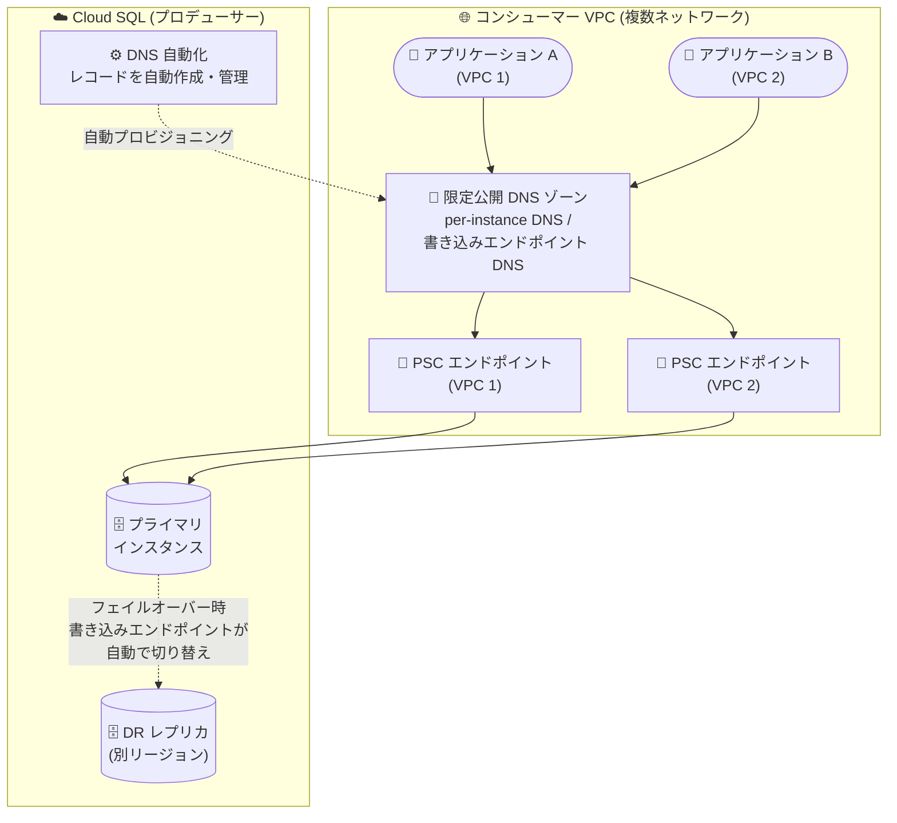

# Cloud SQL (PostgreSQL / SQL Server): Private Service Connect 有効インスタンスの DNS 自動化が GA

**リリース日**: 2026-08-04

**サービス**: Cloud SQL for PostgreSQL / Cloud SQL for SQL Server

**機能**: Private Service Connect (PSC) 有効インスタンスにおける DNS 自動化 (DNS automation)

**ステータス**: GA (一般提供)

📊 [このアップデートのインフォグラフィックを見る](https://takech9203.github.io/google-cloud-news-summary/20260804-cloud-sql-psc-dns-automation-ga.html)

## 概要

Cloud SQL for PostgreSQL および Cloud SQL for SQL Server において、Private Service Connect (PSC) が有効なインスタンスの **DNS 自動化 (DNS automation)** が一般提供 (GA) になりました。DNS 自動化を有効にすると、Cloud SQL がインスタンスごとの DNS レコード (per-instance DNS record) を、PSC 自動接続 (auto connections) で構成された認可済みコンシューマー VPC ネットワークに対して自動的にプロビジョニング・管理します。

さらに、Cloud SQL Enterprise Plus エディションのインスタンスで DNS 自動化を有効にしている場合は、**グローバル書き込みエンドポイント DNS (global write endpoint DNS)** も有効化できます。これは常に現在のプライマリインスタンスの IP アドレスに自動解決されるグローバル DNS 名で、リージョン障害時のレプリカフェイルオーバーや切り替え (スイッチオーバー) の際に、アプリケーション側の接続文字列を変更することなく新しいプライマリへ自動的に接続をリダイレクトします。

PSC 経由で Cloud SQL に接続するマルチ VPC / マルチプロジェクト環境を運用するチームや、Enterprise Plus の高度なディザスタリカバリ (Advanced DR) を利用する組織にとって、DNS 運用の手作業を排除し DR 構成をシンプルにする重要なアップデートです。

**アップデート前の課題**

- PSC 有効インスタンスでは、ネットワークごとに PSC エンドポイントの IP アドレスが異なるため DNS 名での接続が推奨されるが、per-instance DNS 名の DNS レコードは、インスタンスの lookup API から推奨 DNS 名を取得し、各コンシューマー VPC の限定公開 DNS ゾーンに手動で作成する必要があった
- 接続先の VPC ネットワークが増えるたびに、ネットワークごとに DNS レコードの作成・管理作業が発生し、運用負荷と設定ミスのリスクがあった
- DNS 自動化機能自体は Preview として提供されており、本番ワークロードでの利用には Pre-GA 提供条件が適用されていた

**アップデート後の改善**

- DNS 自動化が GA となり、本番環境で SLA の下で利用可能になった。Cloud SQL が認可済みコンシューマー VPC ネットワーク全体に per-instance DNS レコードを自動的にプロビジョニング・管理する
- PSC 自動接続の有効化・無効化に合わせて、関連する DNS レコードの作成・クリーンアップも自動で行われる
- Enterprise Plus エディションでは、グローバル書き込みエンドポイント DNS を有効化でき、フェイルオーバー / スイッチオーバー時にクライアント側の接続文字列変更が不要になる

## アーキテクチャ図



DNS 自動化を有効にすると、Cloud SQL が各コンシューマー VPC の DNS レコードを自動管理します。Enterprise Plus では、グローバル書き込みエンドポイント DNS が常に現在のプライマリを指すため、DR フェイルオーバー時もアプリケーションの変更が不要です。

## サービスアップデートの詳細

### 主要機能

1. **per-instance DNS レコードの自動プロビジョニング (GA)**
   - PSC 自動接続 (`pscAutoConnections`) で構成された認可済みコンシューマー VPC ネットワークに対して、Cloud SQL がインスタンス単位の DNS レコードを自動作成・管理
   - プライマリインスタンスと各レプリカインスタンスは、それぞれ個別の per-instance DNS 名を持つ
   - DNS 名は `{ID}.{プロジェクト固有 ID}.{リージョン}.sql-psc.goog` 形式 (例: `d73a167a8c3a.2naantchj3tsc.us-central1.sql-psc.goog`)

2. **グローバル書き込みエンドポイント DNS (Enterprise Plus)**
   - 常に現在のプライマリインスタンスの IP アドレスに解決されるグローバル DNS 名を自動プロビジョニング
   - レプリカフェイルオーバーやスイッチオーバーの際、書き込みエンドポイントが新しいプライマリへ自動的に更新される
   - Enterprise Plus の高度なディザスタリカバリ (Advanced DR) と組み合わせて、リージョン障害復旧や DR 訓練をアプリケーション無変更で実施可能

3. **DNS レコードの自動クリーンアップ**
   - 既存インスタンスに対して DNS 自動化の有効化・無効化が可能で、Cloud SQL が対応するネットワークの DNS レコードを自動的にプロビジョニングまたはクリーンアップする

## 技術仕様

### DNS 名の種類と対応エディション

| 項目 | per-instance DNS 名 | グローバル書き込みエンドポイント DNS 名 |
|------|---------------------|------------------------------------------|
| 対応エディション | すべてのエディション | Enterprise Plus のみ |
| 解決先 | 各インスタンス (プライマリ / レプリカ個別) | 常に現在のプライマリインスタンス |
| 前提条件 | PSC 有効 + PSC 自動接続 | DNS 自動化が有効であること |
| 主な用途 | マルチ VPC からの接続の一元化 | Advanced DR でのシームレスなフェイルオーバー |

### API 設定パラメータ

```json
{
  "settings": {
    "ipConfiguration": {
      "ipv4Enabled": false,
      "pscConfig": {
        "allowedConsumerProjects": ["ALLOWED_PROJECTS"],
        "pscAutoConnections": [
          {
            "consumerProject": "CONSUMER_PROJECT",
            "consumerNetwork": "projects/PARENT_PROJECT/global/networks/CONSUMER_NETWORK"
          }
        ],
        "pscEnabled": true,
        "psc_auto_dns_enabled": true,
        "psc_write_endpoint_dns_enabled": true
      }
    }
  }
}
```

## 設定方法

### 前提条件

1. Cloud SQL インスタンスで Private Service Connect が有効であること (`--enable-private-service-connect`)
2. 許可するコンシューマープロジェクト (`--allowed-psc-projects`) と PSC 自動接続 (`--psc-auto-connections`) が構成されていること
3. グローバル書き込みエンドポイント DNS を使用する場合は、Enterprise Plus エディションのインスタンスであり、かつ DNS 自動化が有効であること

### 手順

#### ステップ 1: DNS 自動化を有効にしてインスタンスを作成

```bash
gcloud sql instances create INSTANCE_NAME \
  --project=PROJECT_ID \
  --region=REGION \
  --enable-private-service-connect \
  --allowed-psc-projects=ALLOWED_PROJECTS \
  --psc-auto-connections=network=projects/PARENT_PROJECT/global/networks/CONSUMER_NETWORK \
  --enable-psc-auto-dns \
  --enable-psc-write-endpoint-dns
```

`--enable-psc-auto-dns` で per-instance DNS 自動化を、`--enable-psc-write-endpoint-dns` で書き込みエンドポイント DNS 自動化 (Enterprise Plus のみ) を有効にします。いずれも新規インスタンスではデフォルト無効です。

#### ステップ 2: 既存インスタンスで有効化 / 無効化

```bash
gcloud sql instances patch INSTANCE_NAME \
  --enable-psc-auto-dns \
  --enable-psc-write-endpoint-dns
```

無効化する場合は `--no-enable-psc-auto-dns` / `--no-enable-psc-write-endpoint-dns` を指定します。Cloud SQL が対応する DNS レコードを自動的に作成またはクリーンアップします。

#### ステップ 3: 自動作成された DNS 名の確認

```bash
gcloud sql instances describe INSTANCE_NAME \
  --project=PROJECT_ID \
  --flatten="dnsNames[]" \
  --format="csv[no-heading](dnsNames.dnsScope, dnsNames.recordManager, dnsNames.name)" \
  | grep "INSTANCE,CLOUD_SQL_AUTOMATION"
```

自動化により作成された DNS 名は gcloud CLI または API のインスタンス describe 出力で確認できます。

## メリット

### ビジネス面

- **運用コストの削減**: VPC ネットワークごとの DNS レコード作成・管理という手作業がなくなり、ネットワーク追加時の運用負荷と設定ミスのリスクを削減
- **DR 対応力の向上**: 書き込みエンドポイント DNS により、リージョン障害時の復旧や DR 訓練をアプリケーション変更なしで実施でき、RTO 短縮に寄与
- **GA による本番適用**: Pre-GA 提供条件が外れ、本番ワークロードで安心して利用可能

### 技術面

- **マルチ VPC 接続の一元化**: ネットワークごとに PSC エンドポイントの IP が異なっても、単一の DNS 名で接続先を統一できる
- **ライフサイクルの自動管理**: PSC 自動接続の有効化・無効化に連動して DNS レコードが自動的に作成・クリーンアップされる
- **フェイルオーバーの透過化**: 書き込みエンドポイントが常に現在のプライマリを指すため、クライアント側の接続文字列更新が不要

## デメリット・制約事項

### 制限事項

- DNS 自動化で作成された per-instance DNS 名や書き込みエンドポイントに対して、Cloud SQL Auth Proxy や言語コネクタからの接続はサポートされない (ドキュメント記載の制限)
- Google Cloud コンソールや Terraform による DNS 自動化の構成はサポートされない (gcloud CLI / REST API を使用)
- グローバル書き込みエンドポイント DNS は Enterprise Plus エディション限定で、DNS 自動化の有効化が前提

### 考慮すべき点

- DNS 自動化はデフォルトで無効のため、新規・既存インスタンスとも明示的な有効化が必要
- DNS レコードは PSC 自動接続 (`pscAutoConnections`) で構成されたネットワークに対して作成されるため、手動でエンドポイントを作成しているネットワークでは従来通り手動での DNS 構成が必要
- 自動作成された DNS 名は gcloud CLI / API の describe 出力でのみ確認可能

## ユースケース

### ユースケース 1: マルチプロジェクト・マルチ VPC 環境での接続管理の自動化

**シナリオ**: 共有 VPC を持たない複数のサービスプロジェクトから、PSC 経由で同一の Cloud SQL for PostgreSQL インスタンスに接続している。これまで各 VPC の限定公開 DNS ゾーンに手動でレコードを登録していた。

**実装例**:
```bash
gcloud sql instances patch my-postgres-instance \
  --enable-psc-auto-dns
```

**効果**: 認可済みの全コンシューマー VPC に per-instance DNS レコードが自動作成され、新しい VPC を追加する際も DNS 作業が不要になる。

### ユースケース 2: Enterprise Plus + Advanced DR でのシームレスなリージョンフェイルオーバー

**シナリオ**: Cloud SQL for SQL Server の Enterprise Plus インスタンスでクロスリージョンの DR レプリカを構成しており、DR 訓練や実際のフェイルオーバー時にアプリケーションの接続文字列を書き換える運用が負担になっている。

**効果**: 書き込みエンドポイント DNS を有効化することで、スイッチオーバー / レプリカフェイルオーバー時に DNS が新しいプライマリへ自動的に切り替わり、アプリケーション側の変更なしで書き込み接続が復旧する。

## 料金

DNS 自動化機能自体の追加料金に関する記載は Release Notes およびドキュメントにはありません。Cloud SQL のインスタンス料金はエディション・マシン構成・ストレージに基づく従量課金です。

| 項目 | 料金 (概算・参考) |
|------|-------------------|
| Cloud SQL Enterprise (vCPU) | $0.0413 / vCPU 時〜 |
| Cloud SQL Enterprise Plus (vCPU) | $0.05369 / vCPU 時〜 |
| Cloud SQL Enterprise Plus (メモリ) | $0.0091 / GB 時〜 |

詳細は [Cloud SQL 料金ページ](https://cloud.google.com/sql/pricing) を参照してください。

## 利用可能リージョン

リージョン別の提供状況は公式ドキュメントの [リージョン提供状況の概要](https://docs.cloud.google.com/sql/docs/postgres/region-availability-overview) を参照してください。

## 関連サービス・機能

- **Private Service Connect (PSC)**: 本機能の前提となるプライベート接続方式。コンシューマー VPC からプロデューサー (Cloud SQL) へのプライベートなサービス接続を実現
- **Cloud DNS**: DNS 自動化が作成・管理する DNS レコードの基盤。手動構成の場合は限定公開 DNS ゾーンを自身で管理する
- **Cloud SQL Advanced Disaster Recovery (Advanced DR)**: Enterprise Plus の機能。書き込みエンドポイントと組み合わせることで、スイッチオーバー / レプリカフェイルオーバーをアプリケーション無変更で実行可能
- **Cloud SQL Auth Proxy / 言語コネクタ**: PSC 有効インスタンスへの接続に DNS 名を必要とするが、DNS 自動化で作成された DNS 名への接続は現時点でサポート対象外

## 参考リンク

- 📊 [インフォグラフィック](https://takech9203.github.io/google-cloud-news-summary/20260804-cloud-sql-psc-dns-automation-ga.html)
- [公式リリースノート](https://docs.cloud.google.com/release-notes#August_04_2026)
- [Cloud SQL for PostgreSQL: Private Service Connect の概要](https://docs.cloud.google.com/sql/docs/postgres/about-private-service-connect)
- [Cloud SQL for SQL Server: Private Service Connect の概要](https://docs.cloud.google.com/sql/docs/sqlserver/about-private-service-connect)
- [Private Service Connect の構成 (DNS 自動化を有効にしたインスタンスの作成)](https://docs.cloud.google.com/sql/docs/postgres/configure-private-service-connect)
- [Cloud SQL の高度なディザスタリカバリ](https://docs.cloud.google.com/sql/docs/postgres/intro-to-cloud-sql-disaster-recovery)
- [料金ページ](https://cloud.google.com/sql/pricing)

## まとめ

PSC 有効な Cloud SQL インスタンスの DNS 自動化が GA となり、マルチ VPC 環境での DNS レコード管理の手作業が不要になりました。特に Enterprise Plus 利用者は、グローバル書き込みエンドポイント DNS と Advanced DR を組み合わせることで、アプリケーション無変更のリージョンフェイルオーバーを実現できます。PSC 経由で Cloud SQL を利用している場合は、`--enable-psc-auto-dns` による有効化を検討することを推奨します。

---

**タグ**: Cloud SQL, PostgreSQL, SQL Server, Private Service Connect, DNS, GA, ネットワーキング, ディザスタリカバリ, Enterprise Plus
