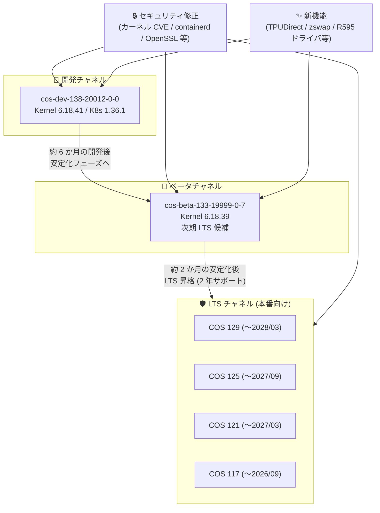

# Container-Optimized OS: 全チャネル一斉イメージ更新 (セキュリティ修正・新機能追加)

**リリース日**: 2026-08-04

**サービス**: Container-Optimized OS (COS)

**機能**: 新イメージリリース (dev / beta / LTS 4 系統)

**ステータス**: リリース済み (Change / Security / Feature)

📊 [このアップデートのインフォグラフィックを見る](https://takech9203.github.io/google-cloud-news-summary/20260804-container-optimized-os-image-updates.html)

## 概要

2026 年 8 月 4 日、Container-Optimized OS (COS) の全リリースチャネルにわたる 6 つの新イメージが一斉リリースされました。対象は開発版の cos-dev-138、ベータ版の cos-beta-133、および本番運用向けの LTS 4 系統 (COS 129 / 125 / 121 / 117) です。COS は Compute Engine や GKE のノード OS として広く利用される、コンテナ実行に最適化された Google 管理のイメージです。

今回のリリースの中心はセキュリティ修正です。Linux カーネルの多数の CVE (CVE-2026-64xxx シリーズ) への対応に加え、containerd v2.3.2 への更新による CVE 修正、OpenSSH 10.3_p1、OpenSSL、glibc、systemd、curl 8.21.0、Go 1.25.10 など、OS を構成する主要パッケージが幅広く更新されています。あわせて dev / beta チャネルでは、TPUDirect サポートや第 8 世代 TPU デバイス対応、zswap サポートなど、AI/ML ワークロード向けの新機能が多数追加されました。

COS をノード OS として使う GKE クラスタ運用者、Compute Engine 上でコンテナを直接実行しているユーザー、および次期 LTS (COS 133) の検証を進めているプラットフォームチームが対象です。

**アップデート前の課題**

- 既存イメージには Linux カーネルや containerd、OpenSSL などの既知の脆弱性 (CVE) が未修正のまま残っていた
- TPUDirect や第 8 世代 TPU デバイスといった最新の AI アクセラレータ機能に COS が対応していなかった
- ARM64 では CONFIG_MEMORY_FAILURE が有効でなく、CUDA ワークロードでのメモリエラーハンドリングに制約があった

**アップデート後の改善**

- 全チャネルのイメージでカーネル・ユーザーランドの多数の CVE が修正され、最新イメージへの更新だけでセキュリティリスクを低減できるようになった
- dev / beta チャネルで TPUDirect・第 8 世代 TPU・nvidia-fs・NVIDIA R595 系ドライバなど、AI/ML インフラ向け機能が利用可能になった
- カーネルの zswap サポートや GVNIC の大きなリングサイズ (DQO-QPL) など、メモリ効率・ネットワーク性能面の改善が導入された

## アーキテクチャ図



COS のリリースチャネル構成と今回の更新の流れを示しています。セキュリティ修正は全チャネルに適用され、新機能は dev / beta チャネルにのみ導入されます (LTS は安定性維持のため新機能を追加しない方針)。

## サービスアップデートの詳細

### リリースされたイメージ一覧

| イメージ | チャネル | カーネル | Docker | Containerd |
|----------|----------|----------|--------|------------|
| cos-dev-138-20012-0-0 | dev | COS-6.18.41 | v29.4.3 | v2.3.2 |
| cos-beta-133-19999-0-7 | beta | COS-6.18.39 | v29.4.3 | v2.3.2 |
| cos-129-19506-299-82 | LTS (129) | COS-6.12.94 | v27.5.1 | v2.2.6 |
| cos-125-19216-532-62 | LTS (125) | COS-6.12.94 | v27.5.1 | v2.1.9 |
| cos-121-18867-528-43 | LTS (121) | COS-6.6.143 | v27.5.1 | v2.0.10 |
| cos-117-18613-675-37 | LTS (117) | COS-6.6.143 | v24.0.9 | v1.7.34 |

### セキュリティ修正の概要

今回のリリースには非常に多数のセキュリティ修正が含まれます。個別の CVE 列挙は公式リリースノートに譲り、ここではカテゴリ別に整理します。

| カテゴリ | 修正内容 |
|----------|----------|
| Linux カーネル | CVE-2026-64xxx シリーズを中心とする多数の脆弱性修正 (全チャネル) |
| containerd | v2.3.2 への更新に含まれる CVE 修正 (dev / beta) |
| OpenSSH | 10.3_p1 への更新 |
| OpenSSL | 脆弱性修正を含む更新 (dev チャネルでは 3.5.6 → 4.0.0 へメジャーアップグレード) |
| glibc / systemd | セキュリティ修正を含む更新 |
| curl | 8.21.0 への更新 |
| Go ランタイム | 1.25.10 への更新 |

### 新機能 (dev / beta チャネル)

1. **AI アクセラレータ対応の強化**
   - TPUDirect のサポートを追加
   - 第 8 世代 TPU デバイスのサポートを追加
   - COS GPU インストーラで nvidia-fs (GPUDirect Storage 用) をサポート
   - NVIDIA ドライバを更新: R595 ブランチ追加、RTX PRO 6000 向け 590.44.01 / 590.48.01、580.x 系の更新

2. **カーネル・信頼性の改善**
   - zswap (圧縮スワップキャッシュ) のカーネルサポートを追加
   - ARM64 で CONFIG_MEMORY_FAILURE を有効化し、CUDA ワークロードのメモリエラーハンドリングを改善
   - ublk カーネルモジュールを追加

3. **ネットワーク・運用性の改善**
   - GVNIC でより大きなリングサイズ (DQO-QPL) をサポート
   - カーネル引数を管理する cos_kernel_args ツールを追加
   - systemd-resolved のスタブリゾルバをデフォルトで有効化
   - Kubernetes を 1.36.1 に更新 (dev チャネル)

### 破壊的変更 (dev / beta チャネル)

- **/dev/hugepages が noexec オプション付きでマウントされるようになりました。** hugepages 領域から実行可能コードをロードするワークロードは影響を受ける可能性があるため、beta (COS 133) の検証時に確認が必要です。

## メリット

### ビジネス面

- **セキュリティコンプライアンスの維持**: 最新イメージへのロールアウトだけで多数の CVE 対応が完了し、脆弱性管理の運用負荷を削減できる
- **AI インフラへの投資保護**: 最新世代の TPU / NVIDIA GPU への対応が OS レベルで進み、次期 LTS (COS 133) で AI ワークロード基盤として利用できる見通しが立つ

### 技術面

- **全チャネル同時更新**: dev / beta / LTS 4 系統が同時に更新されており、検証環境と本番環境を同じタイミングで最新化できる
- **メモリ・ネットワーク性能の向上**: zswap によるメモリ効率化、GVNIC の大きなリングサイズによるネットワークスループット改善が期待できる
- **ARM64 の信頼性向上**: CONFIG_MEMORY_FAILURE の有効化により、ARM64 上の CUDA ワークロードでメモリエラーからの回復性が向上する

## デメリット・制約事項

### 制限事項

- 新機能 (TPUDirect、zswap、R595 ドライバなど) は dev / beta チャネルのみで、LTS チャネルには含まれない
- dev / beta チャネルのイメージは本番利用向けではなく、検証・実験用途に限定される

### 考慮すべき点

- **破壊的変更**: dev / beta では /dev/hugepages が noexec でマウントされるため、該当領域を実行用途で使うワークロードは事前検証が必要
- 本番環境では Image Family API による自動最新化ではなく、検証済みの特定イメージ名を指定してロールアウトすることが推奨されている
- COS 117 LTS のサポート終了は 2026 年 9 月に迫っており、COS 121 以降への移行計画を進めるべき時期にある
- dev チャネルの OpenSSL 4.0.0 はメジャーバージョンアップのため、OpenSSL に依存するカスタムコンポーネントは互換性確認が必要

## ユースケース

### ユースケース 1: 本番 GKE / GCE ノードの定期セキュリティ更新

**シナリオ**: COS 121 LTS を本番ノードで利用中の組織が、カーネル CVE への対応として cos-121-18867-528-43 へ更新する。

**実装例**:
```bash
# 最新の LTS イメージを確認
gcloud compute images list --project=cos-cloud \
  --filter="family:cos-121-lts" --no-standard-images

# 検証済みイメージを指定してインスタンステンプレートを更新
gcloud compute instance-templates create my-template-new \
  --image=cos-121-18867-528-43 --image-project=cos-cloud
```

**効果**: OS の再構築なしにカーネル・ユーザーランドの CVE 修正を一括適用でき、脆弱性スキャンの指摘事項を効率的に解消できる。

### ユースケース 2: 次期 LTS (COS 133) に向けた AI ワークロードの先行検証

**シナリオ**: TPU / GPU を利用する ML プラットフォームチームが、cos-beta-133 で TPUDirect や NVIDIA R595 系ドライバ、noexec 化された /dev/hugepages の影響を先行検証する。

**効果**: COS 133 が LTS に昇格する前に互換性問題を洗い出し、本番移行時のリスクを最小化できる。

## 料金

Container-Optimized OS 自体は無償で提供され、追加のライセンス費用は発生しません。イメージを実行する Compute Engine / GKE のリソース料金のみが課金されます。

- [Compute Engine 料金ページ](https://cloud.google.com/compute/pricing)

## 関連サービス・機能

- **Google Kubernetes Engine (GKE)**: COS はデフォルトのノードイメージ (cos_containerd)。GKE のノード自動アップグレードで新イメージが順次適用される
- **Compute Engine**: cos-cloud プロジェクトのイメージファミリー経由で COS イメージを利用可能
- **Cloud TPU / GPU (アクセラレータ)**: TPUDirect、第 8 世代 TPU、NVIDIA R595 ドライバ対応により、AI ワークロードのホスト OS としての機能が強化

## 参考リンク

- 📊 [インフォグラフィック](https://takech9203.github.io/google-cloud-news-summary/20260804-container-optimized-os-image-updates.html)
- [公式リリースノート](https://docs.cloud.google.com/release-notes#August_04_2026)
- [COS リリースノート (マイルストーン別)](https://docs.cloud.google.com/container-optimized-os/docs/release-notes)
- [COS バージョニングとイメージファミリー](https://docs.cloud.google.com/container-optimized-os/docs/concepts/versioning)
- [COS サポートポリシー](https://docs.cloud.google.com/container-optimized-os/docs/resources/support-policy)

## まとめ

COS の全チャネルにわたる一斉更新で、カーネルをはじめとする多数の CVE 修正が提供されました。本番環境で LTS イメージを利用中のチームは、検証のうえ早期のロールアウトを推奨します。また dev / beta チャネルには TPUDirect や zswap などの新機能と /dev/hugepages の noexec 化という破壊的変更が含まれるため、次期 LTS (COS 133) への移行を見据えた先行検証を始める好機です。

---

**タグ**: #ContainerOptimizedOS #COS #セキュリティ #GKE #ComputeEngine #カーネル #containerd #TPU #GPU
