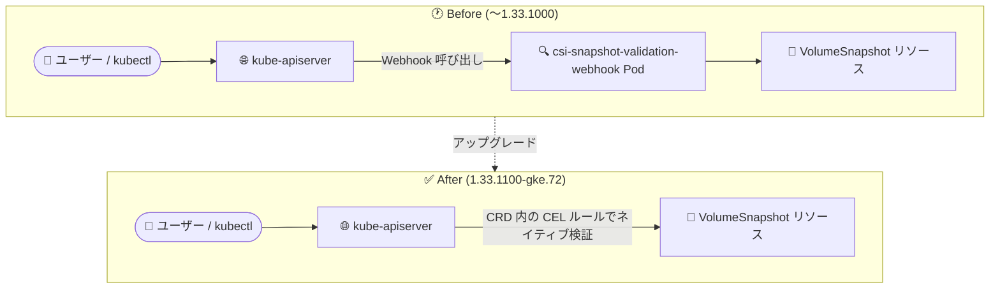

# Google Distributed Cloud (software only) for bare metal: 1.33.1100-gke.72 リリース

**リリース日**: 2026-08-04

**サービス**: Google Distributed Cloud (software only) for bare metal

**機能**: バージョン 1.33.1100-gke.72 リリース (csi-snapshot-validation-webhook の削除、脆弱性修正)

**ステータス**: GA (ダウンロード可能)

📊 [このアップデートのインフォグラフィックを見る](https://takech9203.github.io/google-cloud-news-summary/20260804-gdc-bare-metal-1-33-1100.html)

## 概要

Google Distributed Cloud (software only) for bare metal のパッチバージョン 1.33.1100-gke.72 がダウンロード可能になりました。本バージョンは Kubernetes v1.33.11-gke.100 上で動作します。オンプレミスのベアメタル環境で GKE Enterprise クラスタを運用しているユーザー向けのメンテナンスリリースであり、コンポーネントの近代化とセキュリティ修正が中心です。

本リリースの主な変更点は 2 つです。1 つ目は、非推奨となっていた csi-snapshot-validation-webhook コンポーネントの削除です。ボリュームスナップショットリソースのバリデーションは、デプロイされる Custom Resource Definitions (CRDs) 内の Common Expression Language (CEL) ルールによって Kubernetes ネイティブに処理されるようになりました。2 つ目は、Critical 3 件を含む多数の脆弱性 (CVE) の修正です。

なお、リリース後、GKE On-Prem API クライアント (Google Cloud コンソール、gcloud CLI、Terraform) でのインストールやアップグレードにこのバージョンが利用可能になるまで、約 7〜14 日かかります。

**アップデート前の課題**

- ボリュームスナップショットリソース (VolumeSnapshot など) のバリデーションに、専用の Webhook コンポーネント (csi-snapshot-validation-webhook) をクラスタ内で稼働させる必要があった
- Webhook ベースのバリデーションは、追加の Pod・証明書管理などの運用対象コンポーネントを増やす要因となっていた (同コンポーネントは過去に証明書ローテーション対応などの保守が行われてきた)
- 1.33.1000-gke.59 以前のバージョンには、Critical 3 件 (CVE-2025-22871、CVE-2026-33815、CVE-2026-33816) を含む未修正の脆弱性が存在した

**アップデート後の改善**

- 非推奨の csi-snapshot-validation-webhook が削除され、CRD に組み込まれた CEL ルールによるネイティブバリデーションに移行したことで、クラスタ内の運用コンポーネントが削減された
- バリデーションが API サーバー側 (CRD の CEL ルール) で完結するため、Webhook 呼び出しに依存しない構成になった
- Critical / High / Medium / Low 各重要度の脆弱性が修正され、セキュリティ体制が強化された

## アーキテクチャ図

従来はクラスタ内の専用 Webhook Pod がスナップショットリソースを検証していましたが、1.33.1100-gke.72 では CRD に埋め込まれた CEL ルールにより API サーバーがネイティブに検証します。

## サービスアップデートの詳細

### 主要機能

1. **バージョン 1.33.1100-gke.72 の提供開始 (Announcement)**
   - Kubernetes v1.33.11-gke.100 上で動作
   - アップグレード手順は公式ドキュメント「Upgrade clusters」を参照
   - GKE On-Prem API クライアント (Google Cloud コンソール、gcloud CLI、Terraform) でのインストール・アップグレードには、リリース後約 7〜14 日で利用可能になる
   - サードパーティストレージベンダーを利用している場合は、認定済みストレージパートナーの一覧を確認すること

2. **csi-snapshot-validation-webhook の削除 (Feature)**
   - 非推奨となっていた csi-snapshot-validation-webhook コンポーネントを削除
   - アップストリーム Kubernetes のバリデーションは、デプロイされる CRD 内の Common Expression Language (CEL) ルールによってネイティブに処理される
   - ボリュームスナップショット機能 (VolumeSnapshot / VolumeSnapshotClass / VolumeSnapshotContent) 自体は引き続き利用可能

3. **脆弱性の修正 (Fixed)**
   - Vulnerability fixes ページに記載された脆弱性を修正
   - 詳細は「技術仕様」セクションの脆弱性一覧を参照

## 技術仕様

### リリース情報

| 項目 | 詳細 |
|------|------|
| バージョン | 1.33.1100-gke.72 |
| Kubernetes バージョン | v1.33.11-gke.100 |
| リリース日 | 2026-08-04 |
| GKE On-Prem API クライアントでの利用可能時期 | リリース後 約 7〜14 日 |
| 対象 | Google Distributed Cloud (software only) for bare metal (旧称: GDC Virtual / Anthos clusters on bare metal) |

### 修正された脆弱性 (1.33.1100-gke.72)

公式の Vulnerability fixes ページに記載されている本バージョンでの修正内容は以下のとおりです。

| 重要度 | CVE |
|--------|-----|
| Critical (3 件) | CVE-2025-22871, CVE-2026-33815, CVE-2026-33816 |
| High (19 件) | CVE-2021-39156, CVE-2021-39155, CVE-2019-14993, CVE-2022-23635, CVE-2026-49839, CVE-2026-40164, CVE-2026-32316, CVE-2025-58063, CVE-2024-34156, CVE-2024-34158, CVE-2026-4424, CVE-2026-5121, CVE-2026-4111, CVE-2025-6020, CVE-2025-65637, CVE-2024-47866, CVE-2025-32990, CVE-2025-32988, CVE-2024-24791 |
| Medium (22 件) | CVE-2024-45339, CVE-2026-39350, CVE-2022-31045, CVE-2026-41413, CVE-2026-33947, CVE-2026-43895, CVE-2026-33948, CVE-2026-39979, CVE-2026-43894, CVE-2026-39956, CVE-2026-54679, CVE-2026-47770, CVE-2026-40898, CVE-2025-22866, CVE-2024-45341, CVE-2024-45336, CVE-2024-34155, CVE-2026-4426, CVE-2024-22365, CVE-2025-52555, CVE-2025-6395, CVE-2025-4598 |
| Low (5 件) | CVE-2026-41257, CVE-2026-41256, CVE-2026-44777, CVE-2026-43896, CVE-2026-41889 |

### ボリュームスナップショットのリソース構成

CEL ルールによるバリデーション対象となるボリュームスナップショット関連リソースは以下のとおりです (snapshot.storage.k8s.io API グループ)。

| リソース | 役割 |
|----------|------|
| VolumeSnapshotClass | スナップショットの CSI ドライバと deletionPolicy を定義 |
| VolumeSnapshot | 既存 PersistentVolumeClaim のスナップショット取得リクエスト |
| VolumeSnapshotContent | ストレージシステム上の実スナップショットとのバインディングを保持 |

## 設定方法

### 前提条件

1. Google Distributed Cloud (software only) for bare metal のクラスタを運用していること
2. アップグレード前にリリースノート (脆弱性修正、既知の問題を含む) を確認すること
3. サードパーティストレージベンダーを利用している場合、本リリースで認定済みであることをストレージパートナー一覧で確認すること

### 手順

#### ステップ 1: アップグレードの実施

公式ドキュメント「[Upgrade clusters](https://docs.cloud.google.com/kubernetes-engine/distributed-cloud/bare-metal/docs/how-to/upgrade)」に従い、クラスタを 1.33.1100-gke.72 にアップグレードします。

#### ステップ 2: GKE On-Prem API クライアント経由の場合

Google Cloud コンソール、gcloud CLI、Terraform からのインストール・アップグレードは、リリース後約 7〜14 日で利用可能になるため、利用可能になったことを確認してから実施します。

## メリット

### ビジネス面

- **セキュリティリスクの低減**: Critical 3 件を含む約 50 件の CVE が修正され、オンプレミス環境のコンプライアンス・セキュリティ体制を維持できる
- **運用コストの削減**: 非推奨コンポーネントの削除により、クラスタ内で管理・監視すべきコンポーネントが減少する

### 技術面

- **Kubernetes ネイティブなバリデーション**: Webhook 呼び出しに依存せず、CRD 内の CEL ルールで API サーバーが直接検証するため、構成がシンプルになる
- **アップストリーム準拠**: アップストリーム Kubernetes の方向性 (Webhook から CEL ベースのバリデーションへの移行) に沿った構成となり、将来のバージョンアップとの整合性が高い

## デメリット・制約事項

### 考慮すべき点

- GKE On-Prem API クライアント (コンソール、gcloud CLI、Terraform) での利用は、リリース後約 7〜14 日待つ必要がある
- サードパーティストレージベンダーを利用している場合、本リリースでの認定状況をストレージパートナー一覧で事前に確認する必要がある
- csi-snapshot-validation-webhook コンポーネントに依存した独自の運用 (監視設定など) がある場合は、削除に伴い見直しが必要

## ユースケース

### ユースケース 1: セキュリティパッチ適用としての定期アップグレード

**シナリオ**: オンプレミスのベアメタル環境で GDC クラスタを運用しており、社内のセキュリティポリシーで Critical / High 脆弱性への迅速な対応が求められている。

**効果**: 1.33.1100-gke.72 へのアップグレードにより、Critical 3 件・High 19 件を含む脆弱性が修正され、セキュリティポリシーへの準拠を維持できる。

### ユースケース 2: ボリュームスナップショット運用の継続

**シナリオ**: CSI ドライバ経由で VolumeSnapshot を利用した永続ボリュームのバックアップ運用を行っている。

**効果**: バリデーションが CRD 内の CEL ルールに移行した後も、VolumeSnapshot / VolumeSnapshotClass / VolumeSnapshotContent を用いた既存のスナップショット運用フローは引き続き利用できる。クラスタ内の Webhook コンポーネントが減ることで運用対象がシンプルになる。

## 関連サービス・機能

- **GKE On-Prem API**: Google Cloud コンソール、gcloud CLI、Terraform からの GDC クラスタのライフサイクル管理に使用 (本バージョンの対応はリリース後約 7〜14 日)
- **Google Distributed Cloud (software only) for VMware**: 同日に同バージョン 1.33.1100-gke.72 がリリースされた VMware 環境向けの姉妹製品
- **CSI (Container Storage Interface) ドライバ**: ボリュームスナップショット機能の利用にはスナップショット対応の CSI ドライバが必要。認定済みストレージパートナーの製品を利用可能

## 参考リンク

- 📊 [インフォグラフィック](https://takech9203.github.io/google-cloud-news-summary/20260804-gdc-bare-metal-1-33-1100.html)
- [公式リリースノート](https://docs.cloud.google.com/release-notes#August_04_2026)
- [GDC for bare metal リリースノート](https://docs.cloud.google.com/kubernetes-engine/distributed-cloud/bare-metal/docs/release-notes)
- [Volume snapshots (ボリュームスナップショット)](https://docs.cloud.google.com/kubernetes-engine/docs/how-to/persistent-volumes/volume-snapshots)
- [Vulnerability fixes (脆弱性修正一覧)](https://docs.cloud.google.com/kubernetes-engine/distributed-cloud/bare-metal/docs/vulnerabilities)
- [認定済みストレージパートナー](https://docs.cloud.google.com/kubernetes-engine/enterprise/docs/resources/partner-storage)
- [クラスタのアップグレード](https://docs.cloud.google.com/kubernetes-engine/distributed-cloud/bare-metal/docs/how-to/upgrade)

## まとめ

Google Distributed Cloud (software only) for bare metal 1.33.1100-gke.72 は、Critical 3 件を含む多数の脆弱性修正と、非推奨の csi-snapshot-validation-webhook 削除 (CEL ルールによるネイティブバリデーションへの移行) を含むメンテナンスリリースです。1.33 系を運用中のクラスタは、セキュリティ観点から早期のアップグレードを推奨します。GKE On-Prem API クライアント経由での適用は、リリース後約 7〜14 日で利用可能になる点に留意してください。

---

**タグ**: Google Distributed Cloud, GDC, bare metal, GKE Enterprise, Kubernetes, CSI, Volume Snapshot, CEL, セキュリティ, 脆弱性修正
