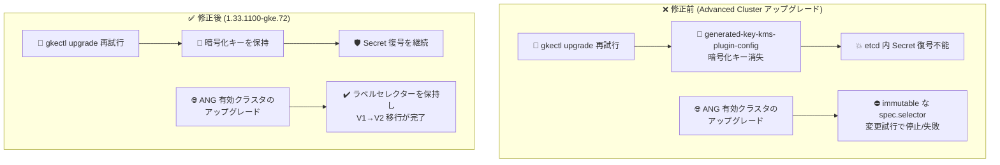

# Google Distributed Cloud (software only) for VMware: 1.33.1100-gke.72 リリース (脆弱性修正とアップグレード安定性の改善)

**リリース日**: 2026-08-04

**サービス**: Google Distributed Cloud (software only) for VMware

**機能**: バージョン 1.33.1100-gke.72 リリース (Announcement + Fixed)

**ステータス**: GA (ダウンロード提供開始)

📊 [このアップデートのインフォグラフィックを見る](https://takech9203.github.io/google-cloud-news-summary/20260804-gdc-vmware-1-33-1100.html)

## 概要

Google Distributed Cloud (software only) for VMware のパッチバージョン **1.33.1100-gke.72** がダウンロード可能になりました。本バージョンは **Kubernetes v1.33.11-gke.100** 上で動作します。オンプレミスの VMware vSphere 環境で GKE クラスタを運用するユーザー向けのリリースで、セキュリティ脆弱性の修正に加え、Advanced Cluster へのアップグレードに関する複数の重要な不具合修正が含まれています。

今回のリリースは新機能の追加ではなく、脆弱性修正 (Vulnerability fixes) と、`gkectl prepare` のプライベートレジストリ CA 証明書読み取りエラー、Advanced Cluster アップグレード失敗時の再試行による暗号化キー消失、Anthos Network Gateway (ANG) 有効クラスタのアップグレード停止という 4 系統の修正が中心です。特に暗号化キー消失の問題は、コントロールプレーンが etcd 内の既存 Kubernetes Secret を復号できなくなるという深刻な影響を持つため、Advanced Cluster への移行を予定している環境では本バージョンへの更新が強く推奨されます。

リリース後、GKE On-Prem API クライアント (Google Cloud コンソール、gcloud CLI、Terraform) で本バージョンが利用可能になるまでには約 7〜14 日かかります。サードパーティのストレージベンダーを使用している場合は、認定済みストレージパートナーの一覧を確認してください。

**アップデート前の課題**

- `gkectl prepare` がプライベートレジストリの CA 証明書を読み取る際、ファイル権限の問題により permission denied エラーで失敗することがあった
- Advanced Cluster へのアップグレードが失敗した後に再試行 (既存のブートストラップクラスタでの再実行など) すると、`generated-key-kms-plugin-config` シークレット内の暗号化キーが消失・破損し、コントロールプレーンが etcd 内の既存 Kubernetes Secret を復号できなくなる可能性があった
- Anthos Network Gateway (ANG) が有効なユーザークラスタを Advanced Cluster にアップグレードすると、アップグレード処理が既存 ANG リソースの変更不可 (immutable) な `spec.selector` フィールドを変更しようとするため、停止または失敗していた
- 既知の脆弱性が未修正のまま残っていた

**アップデート後の改善**

- プライベートレジストリ CA 証明書のファイル権限が 644 に設定され、非 root プロセスからも読み取り可能になり、`gkectl prepare` が正常に動作するようになった
- Advanced Cluster へのアップグレード再試行時にも `generated-key-kms-plugin-config` シークレットの暗号化キーが保持されるようになり、Secret 復号不能のリスクが解消された
- アップグレードオペレーターが既存 ANG リソースのラベルセレクターを reconciliation 時に保持するようになり、V1 から V2 へのクラスタ移行が正常に完了するようになった
- Vulnerability fixes に記載された脆弱性が修正された

## アーキテクチャ図



Advanced Cluster へのアップグレードにおける 2 つの重大な不具合 (暗号化キー消失と ANG リソース起因の停止) が修正され、アップグレードの再試行や ANG 有効クラスタの移行が安全に行えるようになりました。

## サービスアップデートの詳細

### 主要な修正内容

1. **脆弱性の修正**
   - Vulnerability fixes ページに記載された脆弱性が修正された
   - GKE セキュリティチームは Kubernetes vulnerability scoring システムに基づき脆弱性を Critical / High / Medium / Low に分類しており、最新の推奨パッチバージョンへのアップグレードが推奨される

2. **gkectl prepare のプライベートレジストリ CA 証明書読み取りエラーの修正**
   - `gkectl prepare` がプライベートレジストリの CA 証明書を読み取る際に permission denied で失敗する問題を修正
   - 証明書ファイルの権限が 644 に設定され、非 root プロセスからも読み取り可能になった

3. **Advanced Cluster アップグレード再試行時の暗号化キー消失の修正**
   - Advanced Cluster への失敗したアップグレードを再試行 (既存のブートストラップクラスタでの再実行など) すると、`generated-key-kms-plugin-config` シークレットの暗号化キーが消失・破損する問題を修正
   - この問題が発生すると、コントロールプレーンが etcd に保存された既存の Kubernetes Secret を復号できなくなっていた
   - GDC for VMware の always-on secrets encryption は、外部 KMS に依存せず自動生成キーで Secret を etcd 格納前に暗号化する仕組みで、バージョン 1.32 以降は Advanced Cluster でもサポートされている

4. **Anthos Network Gateway (ANG) 有効クラスタのアップグレード停止の修正**
   - ANG が有効なユーザークラスタを Advanced Cluster にアップグレードすると、停止または失敗する問題を修正
   - 従来のアップグレード処理は、既存 ANG リソース (NetworkGatewayGroup など) の変更不可な `spec.selector` フィールドを変更しようとしていた
   - アップグレードオペレーターが reconciliation 時に既存のラベルセレクターを保持するようになり、V1 から V2 へのクラスタ移行が正常に完了するようになった

## 技術仕様

### バージョン情報

| 項目 | 詳細 |
|------|------|
| GDC for VMware バージョン | 1.33.1100-gke.72 |
| Kubernetes バージョン | v1.33.11-gke.100 |
| リリースタイプ | パッチリリース (脆弱性修正 + バグ修正) |
| GKE On-Prem API クライアント対応 | リリース後約 7〜14 日で利用可能 (コンソール、gcloud CLI、Terraform) |
| アップグレード方法 | [Upgrade clusters](https://docs.cloud.google.com/kubernetes-engine/distributed-cloud/vmware/docs/how-to/upgrading) を参照 |

### Advanced Cluster アップグレードに関する留意点 (公式ドキュメントより)

| 項目 | 詳細 |
|------|------|
| 1.32 → 1.33 アップグレード | 既定で Advanced Cluster に自動変換 (非 Advanced のまま維持するオプションあり) |
| 1.33 → 1.34 アップグレード | 常に Advanced Cluster に変換される |
| gkectl バージョン要件 | Advanced Cluster へのアップグレード時は、gkectl のバージョンをターゲットバージョンと一致させる必要がある |
| バージョンスキュー | 非 Advanced から Advanced へのアップグレードでは、コントロールプレーンと全ノードプールを同時に同一バージョンへアップグレードする必要がある |

## 設定方法

### 前提条件

1. アップグレード前に `gkectl diagnose cluster` を実行し、クラスタが正常であることを確認する
2. gkectl のバージョンとバンドルがターゲットバージョンに対応していることを確認する
3. サードパーティのストレージベンダーを使用している場合は、[認定済みストレージパートナー](https://docs.cloud.google.com/kubernetes-engine/enterprise/docs/resources/partner-storage)の一覧を確認する

### 手順

#### ステップ 1: OS イメージを vSphere にインポート

```bash
gkectl prepare \
    --bundle-path /var/lib/gke/bundles/gke-onprem-vsphere-1.33.1100-gke.72.tgz \
    --kubeconfig ADMIN_CLUSTER_KUBECONFIG
```

管理ワークステーション上で実行し、ターゲットバージョンの OS イメージを vSphere にインポートします。1.31 以降では、ユーザークラスタより先に管理クラスタをアップグレードする必要があります (管理クラスタのバージョンはユーザークラスタ以上である必要があります)。

#### ステップ 2: クラスタのアップグレード

公式ドキュメント [Upgrade clusters](https://docs.cloud.google.com/kubernetes-engine/distributed-cloud/vmware/docs/how-to/upgrading) の手順に従い、管理クラスタ、ユーザークラスタの順にアップグレードを実施します。

## メリット

### ビジネス面

- **セキュリティリスクの低減**: 既知の脆弱性が修正され、コンプライアンス要件への対応が容易になる
- **アップグレードの信頼性向上**: Advanced Cluster への移行 (V1 → V2) が失敗・停止するリスクが減り、計画的なバージョンアップが実施しやすくなる

### 技術面

- **データ保全性の確保**: アップグレード再試行時の暗号化キー消失が解消され、etcd 内の既存 Secret へのアクセスが失われるリスクがなくなった
- **ANG 環境での移行が可能に**: Egress NAT ゲートウェイなど Anthos Network Gateway を利用するクラスタでも Advanced Cluster への移行が正常に完了する
- **プライベートレジストリ環境の安定化**: 非 root プロセスでも CA 証明書を読み取れるようになり、`gkectl prepare` の失敗が解消された

## デメリット・制約事項

### 考慮すべき点

- GKE On-Prem API クライアント (Google Cloud コンソール、gcloud CLI、Terraform) で本バージョンが利用可能になるまで、リリース後約 7〜14 日かかる
- 非 Advanced Cluster を 1.33 で維持できるのは 1.32 → 1.33 のアップグレードのみで、1.34 へのアップグレード時には必ず Advanced Cluster に変換される
- Advanced Cluster では cert-manager が自動的にインストールされ、既存のカスタム cert-manager 構成は上書きされるため、移行前に確認が必要
- サードパーティストレージベンダー利用時は、認定済みストレージパートナーの確認が必要

## ユースケース

### ユースケース 1: ANG (Egress NAT ゲートウェイ) 利用クラスタの Advanced Cluster 移行

**シナリオ**: 送信元 IP アドレスを固定するために Egress NAT ゲートウェイ (NetworkGatewayGroup / EgressNATPolicy) を利用しているユーザークラスタを、1.33 系の Advanced Cluster にアップグレードしたい。従来はアップグレードが `spec.selector` の変更試行により停止・失敗していた。

**効果**: 1.33.1100-gke.72 ではアップグレードオペレーターが既存 ANG リソースのラベルセレクターを保持するため、ANG 有効クラスタでも V1 → V2 移行が正常に完了する。

### ユースケース 2: always-on secrets encryption 有効環境での安全なアップグレード再試行

**シナリオ**: always-on secrets encryption を有効にしたクラスタで Advanced Cluster へのアップグレードが途中で失敗し、既存のブートストラップクラスタを使って再実行する必要がある。従来は再試行により `generated-key-kms-plugin-config` の暗号化キーが消失し、既存 Secret が復号不能になるリスクがあった。

**効果**: 本バージョンでは再試行時にも暗号化キーが保持されるため、Secret へのアクセスを失うことなくアップグレードを完遂できる。

## 関連サービス・機能

- **GKE On-Prem API (コンソール / gcloud CLI / Terraform)**: クラスタのライフサイクル管理に使用。本バージョンは約 7〜14 日後に利用可能になる
- **Anthos Network Gateway (Network Gateway for GDC)**: Egress NAT、BGP ロードバランサー、フローティング IP などの高度なネットワーク機能を提供するコンポーネント。今回のアップグレード修正の対象
- **Always-on secrets encryption**: 外部 KMS 不要で etcd 内の Secret を暗号化する機能。1.32 以降 Advanced Cluster でもサポート。今回の暗号化キー消失修正に関連
- **Google Distributed Cloud (software only) for bare metal**: 同日に同バージョン 1.33.1100-gke.72 がリリースされたベアメタル版

## 参考リンク

- 📊 [インフォグラフィック](https://takech9203.github.io/google-cloud-news-summary/20260804-gdc-vmware-1-33-1100.html)
- [公式リリースノート](https://docs.cloud.google.com/release-notes#August_04_2026)
- [クラスタのアップグレード](https://docs.cloud.google.com/kubernetes-engine/distributed-cloud/vmware/docs/how-to/upgrading)
- [Vulnerability fixes (脆弱性修正一覧)](https://docs.cloud.google.com/kubernetes-engine/distributed-cloud/vmware/docs/vulnerabilities)
- [認定済みストレージパートナー](https://docs.cloud.google.com/kubernetes-engine/enterprise/docs/resources/partner-storage)
- [Advanced Cluster へのアップデート/アップグレード](https://docs.cloud.google.com/kubernetes-engine/distributed-cloud/vmware/docs/how-to/update-or-upgrade-to-adv-cluster)
- [Always-on secrets encryption](https://docs.cloud.google.com/kubernetes-engine/distributed-cloud/vmware/docs/how-to/always-on-secrets-encryption)
- [Egress NAT ゲートウェイの設定](https://docs.cloud.google.com/kubernetes-engine/distributed-cloud/vmware/docs/how-to/egress-nat-gateway)

## まとめ

GDC (software only) for VMware 1.33.1100-gke.72 は、脆弱性修正に加えて Advanced Cluster アップグレードの安定性を大きく改善するパッチリリースです。特に暗号化キー消失や ANG 有効クラスタのアップグレード停止といった重大な問題が解消されているため、1.33 系を運用中、または Advanced Cluster への移行を計画している環境では、本バージョンへの早期アップグレードを推奨します。

---

**タグ**: #GoogleDistributedCloud #VMware #GDC #Kubernetes #オンプレミス #セキュリティ #AdvancedCluster #アップグレード
