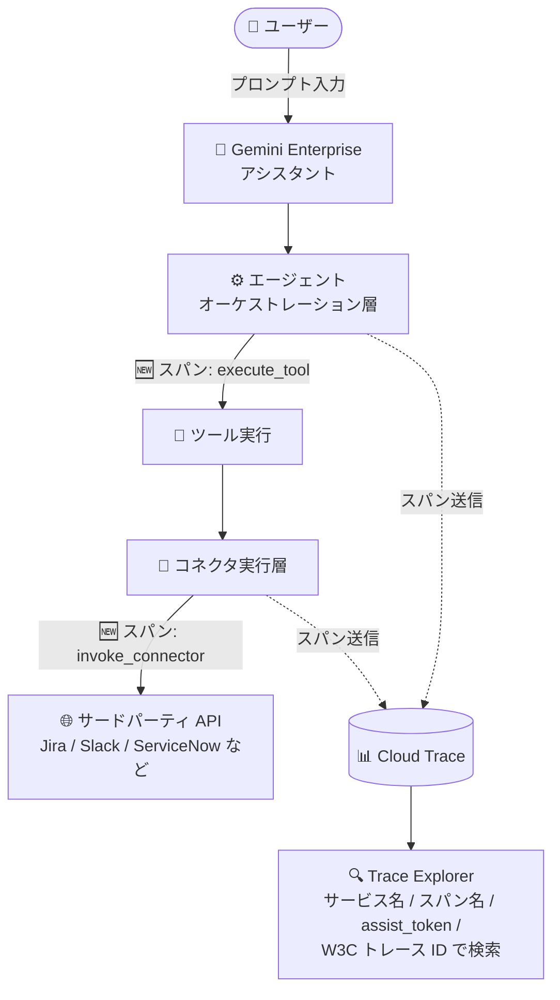

# Gemini Enterprise: データコネクタのエンドツーエンドトレーシングサポート

**リリース日**: 2026-08-04

**サービス**: Gemini Enterprise

**機能**: データコネクタワークフローのエンドツーエンドトレーシング

**ステータス**: Feature

📊 [このアップデートのインフォグラフィックを見る](https://takech9203.github.io/google-cloud-news-summary/20260804-gemini-enterprise-connector-tracing.html)

## 概要

Gemini Enterprise のデータコネクタワークフロー全体にわたるエンドツーエンドのトレーシングサポートが拡張されました。今回のアップデートでは、可観測性 (オブザーバビリティ) を向上させる 2 つの新しいトレーススパンが導入されています。`execute_tool` はエージェントオーケストレーション層におけるツール実行を表し、`invoke_connector` はコネクタ実行層におけるリクエストロジックと実行を表します。

これらのスパンにより、アシスタントへのプロンプト入力からサードパーティ API の呼び出しまで、ワークフロー全体の親子関係をエンドツーエンドで可視化できるようになりました。Trace Explorer でサービス名やスパン名によるスパンの検索・フィルタリング、`gemini_enterprise.assist_token` 属性を使用したターンレベルのレガシー assist トークンによるクエリ、W3C トレース ID を使用したトレースの検索が可能です。

このアップデートは、Gemini Enterprise でサードパーティのデータコネクタ (Jira、Slack、ServiceNow、SharePoint など) を利用する企業の管理者や運用担当者にとって、コネクタ経由の処理の遅延分析や障害切り分けを大幅に効率化するものです。

**アップデート前の課題**

- アシスタントのプロンプトからサードパーティ API 呼び出しまでの一連のワークフローを、単一のトレースとして追跡できず、エージェント層とコネクタ層の処理の対応関係を把握しにくかった
- コネクタ経由の処理で遅延や障害が発生した場合、エージェントオーケストレーション層とコネクタ実行層のどちらに原因があるかの切り分けが困難だった
- コネクタ連携の問題調査は、Gemini Enterprise コネクタエラーログなどの断片的な情報に頼る必要があった

**アップデート後の改善**

- `execute_tool` と `invoke_connector` の 2 つの新しいスパンにより、エージェントオーケストレーション層とコネクタ実行層それぞれの実行状況を個別に観測できるようになった
- アシスタントプロンプトからサードパーティ API までの親子関係を持つワークフロー全体をエンドツーエンドで可視化できるようになった
- Trace Explorer でのサービス名・スパン名による検索、`gemini_enterprise.assist_token` 属性によるターン単位のクエリ、W3C トレース ID によるトレース検索が可能になり、問題調査の起点が増えた

## アーキテクチャ図



ユーザーのプロンプトからサードパーティ API 呼び出しまでのワークフローにおいて、新しい `execute_tool` スパン (エージェントオーケストレーション層) と `invoke_connector` スパン (コネクタ実行層) が親子関係で記録され、Cloud Trace の Trace Explorer でエンドツーエンドに可視化できます。

## サービスアップデートの詳細

### 主要機能

1. **`execute_tool` スパン**
   - エージェントオーケストレーション層におけるツールの実行を表すスパン
   - アシスタントがコネクタのアクションをツールとして呼び出す際の処理時間やステータスを観測できる

2. **`invoke_connector` スパン**
   - コネクタ実行層におけるリクエストロジックと実行を表すスパン
   - サードパーティ API へのリクエスト処理を個別に観測でき、外部システム側の遅延切り分けに役立つ

3. **エンドツーエンドの親子関係の可視化**
   - アシスタントプロンプトからサードパーティ API までのワークフロー全体を、親子関係を持つスパンのツリーとして可視化
   - Trace Explorer や各エージェントの Traces タブで、グラフ表示 / タイムライン表示を切り替えて確認可能

4. **多様な検索・フィルタリング手段**
   - Trace Explorer でサービス名またはスパン名によるスパンの検索・フィルタリング
   - `gemini_enterprise.assist_token` 属性を使用した、ターンレベルのレガシー assist トークンによるクエリ
   - W3C トレース ID を使用したトレースの直接検索

## 技術仕様

### 新しいトレーススパン

| スパン名 | レイヤー | 表す処理 |
|------|------|------|
| `execute_tool` | エージェントオーケストレーション層 | ツールの実行 |
| `invoke_connector` | コネクタ実行層 | リクエストロジックとサードパーティ API 呼び出しの実行 |

### トレースの検索方法

| 検索方法 | 説明 |
|------|------|
| サービス名 / スパン名 | Trace Explorer でスパンを検索・フィルタリング |
| `gemini_enterprise.assist_token` 属性 | ターンレベルのレガシー assist トークンによるクエリ |
| W3C トレース ID | トレース ID を指定した直接検索 |

### データ保持

- Gemini Enterprise アプリが生成したトレースとスパンは、Google Cloud プロジェクトの Cloud Trace に保存される
- 保持期間は Cloud Trace に準拠し、デフォルトで 30 日間 (期間を過ぎたデータは自動削除)

## 設定方法

### 前提条件

1. Gemini Enterprise Admin ロールまたは Google Cloud コンソールの Gemini Enterprise User ロール
2. 既存の Gemini Enterprise Web アプリ
3. トレースへのアクセスには Cloud Trace User ロール (`roles/cloudtrace.user`)
4. オブザーバビリティ設定「Enable instrumentation of OpenTelemetry traces and logs」の有効化 (Core Assistant エージェントはアプリレベル設定、Agent Designer 製エージェントや Deep Research エージェントはエージェントの Configuration タブで有効化)

### 手順

#### ステップ 1: オブザーバビリティ設定を有効化

Google Cloud コンソールで Gemini Enterprise アプリの設定 (またはエージェントの Configuration タブ) を開き、「Enable instrumentation of OpenTelemetry traces and logs」を有効にします。

#### ステップ 2: Trace Explorer でトレースを確認

1. Google Cloud コンソールで **Trace Explorer** ページに移動
2. Gemini Enterprise アプリを作成した Google Cloud プロジェクトを選択
3. スパン名 (`execute_tool` / `invoke_connector`) やサービス名でフィルタリングし、Span ID をクリックして詳細を表示

#### ステップ 3: エージェント単位でトレースを確認 (任意)

1. Google Cloud コンソールでアプリに移動し、**Agents** をクリック
2. 対象エージェントを選択し、**Traces** タブを開く
3. トレーススパン ID をクリックして、グラフ / タイムライン表示で親子関係を確認

## メリット

### ビジネス面

- **障害対応時間の短縮**: コネクタ経由の処理の遅延・障害を層ごとに切り分けられるため、原因特定と復旧が迅速になり、社内アシスタントの利用体験を維持しやすい
- **サードパーティ連携の信頼性向上**: Jira や ServiceNow などの外部システム連携の品質を定量的に把握でき、SLA 管理やベンダーとの調整に活用できる

### 技術面

- **層別の切り分け**: `execute_tool` (エージェント層) と `invoke_connector` (コネクタ層) を分離して観測することで、遅延やエラーがどの層で発生したかを特定できる
- **標準技術との親和性**: W3C Trace Context のトレース ID による検索に対応し、OpenTelemetry ベースの既存の可観測性ワークフローと統合しやすい
- **ターン単位の追跡**: `gemini_enterprise.assist_token` 属性により、特定の会話ターンに紐づくスパンをまとめてクエリできる

## デメリット・制約事項

### 制限事項

- トレースデータの保持期間は Cloud Trace のデフォルトで 30 日間 (それ以降は自動削除)
- エージェントの Traces タブは Core Assistant エージェント、Agent Designer 製エージェント、Deep Research エージェントで利用可能

### 考慮すべき点

- トレースの利用にはオブザーバビリティ設定 (OpenTelemetry トレースとログのインストルメンテーション) の有効化が必要
- トレース閲覧には Cloud Trace User ロールが必要であり、IAM 権限設計を事前に検討する必要がある
- スパンの取り込みは Cloud Trace の料金体系に従って課金されるため、大量の会話トラフィックがある環境では取り込み量の監視が推奨される

## ユースケース

### ユースケース 1: コネクタ経由アクションの遅延分析

**シナリオ**: 社内の Gemini Enterprise アシスタントから Jira のチケット作成アクションを実行した際、応答が遅いという報告がユーザーから寄せられた。

**実装例**:
```
1. Trace Explorer で span 名 "invoke_connector" をフィルタリング
2. 該当時間帯のトレースを開き、execute_tool と invoke_connector の
   親子関係と各スパンの Duration を比較
3. invoke_connector の所要時間が支配的であれば、サードパーティ API 側
   (Jira) の応答遅延と判断
```

**効果**: エージェント層とコネクタ層のどちらに遅延原因があるかを数分で切り分けられ、対応先 (社内設定の見直しか、外部システムの調査か) を即座に決定できる。

### ユースケース 2: 特定の会話ターンの障害調査

**シナリオ**: ユーザーから「アシスタントで実行した操作がエラーになった」という問い合わせを受け、該当する会話ターンの処理内容を調査したい。

**効果**: `gemini_enterprise.assist_token` 属性でターンレベルの assist トークンを指定してクエリすることで、該当ターンに紐づくスパン群を特定できる。スパンの Stacktraces や Input & Output を確認し、エラーの発生箇所と内容を迅速に特定できる。

## 料金

Gemini Enterprise が生成するトレースとスパンは、Google Cloud プロジェクトの Cloud Trace に保存され、Cloud Trace の料金体系に従います。

### 料金例 (Cloud Trace)

| 項目 | 料金 |
|--------|-----------------|
| トレース取り込み | $0.20 / 100 万スパン |
| 無料枠 | 月間最初の 250 万スパン |

詳細は [Google Cloud Observability の料金ページ](https://cloud.google.com/products/observability/pricing) を参照してください。

## 利用可能リージョン

リージョンごとの提供状況は Release Notes に明記されていません。詳細は [Gemini Enterprise のドキュメント](https://docs.cloud.google.com/gemini/enterprise/docs/access-traces-and-spans) を参照してください。

## 関連サービス・機能

- **Cloud Trace**: トレースとスパンの保存先。Trace Explorer での検索・可視化、保持期間 (デフォルト 30 日) の管理を担う
- **Cloud Logging**: スパンログの閲覧先。スパン詳細画面の「View logs」から標準ログへ直接遷移できる。コネクタエラーログの確認にも使用
- **Cloud Monitoring**: オブザーバビリティ設定を有効にすると、Metrics Explorer で Gemini Enterprise のメトリクスも確認できる
- **Gemini Enterprise データコネクタ**: Jira、Slack、ServiceNow、SharePoint、Box など多数のサードパーティデータソース連携。今回のトレーシング拡張の対象となるワークフロー
- **OpenTelemetry**: トレースとログのインストルメンテーション基盤。W3C Trace Context のトレース ID に対応

## 参考リンク

- 📊 [インフォグラフィック](https://takech9203.github.io/google-cloud-news-summary/20260804-gemini-enterprise-connector-tracing.html)
- [公式リリースノート](https://docs.cloud.google.com/release-notes#August_04_2026)
- [ドキュメント: Access traces and spans](https://docs.cloud.google.com/gemini/enterprise/docs/access-traces-and-spans)
- [ドキュメント: Manage observability settings](https://docs.cloud.google.com/gemini/enterprise/docs/manage-observability-settings)
- [ドキュメント: Connect a third-party data source](https://docs.cloud.google.com/gemini/enterprise/docs/connectors/connect-third-party-data-source)
- [料金ページ (Google Cloud Observability)](https://cloud.google.com/products/observability/pricing)

## まとめ

Gemini Enterprise のデータコネクタワークフローに `execute_tool` と `invoke_connector` の 2 つのトレーススパンが追加され、アシスタントプロンプトからサードパーティ API までをエンドツーエンドで可視化できるようになりました。サードパーティコネクタを活用している組織は、オブザーバビリティ設定を有効化し、Trace Explorer でのスパン検索を運用手順に組み込むことで、遅延分析や障害切り分けを大幅に効率化できます。まずは検証環境でトレースを有効化し、主要なコネクタアクションのスパン構造を確認することを推奨します。

---

**タグ**: Gemini Enterprise, データコネクタ, トレーシング, オブザーバビリティ, Cloud Trace, OpenTelemetry, execute_tool, invoke_connector
