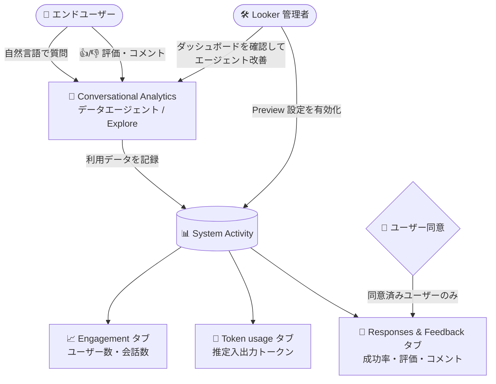

# Looker: Conversational Analytics のオブザーバビリティ強化 (トークン使用量メトリクスとユーザーフィードバックレビュー)

**リリース日**: 2026-08-04

**サービス**: Looker

**機能**: Conversational Analytics System Activity ダッシュボードのオブザーバビリティ強化 (トークン使用量メトリクス / Responses & Feedback タブ)

**ステータス**: Preview

📊 [このアップデートのインフォグラフィックを見る](https://takech9203.github.io/google-cloud-news-summary/20260804-looker-conversational-analytics-observability.html)

## 概要

Looker の自然言語データ分析機能である Conversational Analytics について、管理者向けのオブザーバビリティを強化する 2 つのプレビュー機能が発表されました。いずれも Admin パネルの System Activity セクションにある「Conversational Analytics System Activity ダッシュボード」で利用できます。

1 つ目は **トークン使用量を含む拡張オブザーバビリティメトリクス** です。エンゲージメントデータに加えて、Conversational Analytics の推定トークン使用量 (projected token usage) が「Token usage」タブに表示されるようになりました。有効化するには、Looker 管理者が Admin パネルの Preview セクションにある General ページで「Conversational Analytics Agent Token usage」設定をオンにします。

2 つ目は **エンドユーザークエリのレビュー機能** です。「Responses & Feedback」タブで、エンドユーザーのクエリ成功率、評価 (rating) の分布、ユーザーが記入したフィードバックコメントを確認できます。このデータは、システムパフォーマンスの改善、トラブルシューティングの支援、データエージェントの改良に役立ちます。有効化するには、管理者が「End User Conversational Analytics (CA) Query Review」設定をオンにします (デフォルトは無効)。なお、個別ユーザーのクエリデータは、アカウント設定でクエリデータの共有に同意したユーザーの分のみ表示されます。

**アップデート前の課題**

- Conversational Analytics の利用状況ダッシュボードではエンゲージメント (ユーザー数、会話数、利用の多いエージェント/Explore など) は把握できたものの、LLM のトークン使用量を可視化する手段が限られていた (2026 年 6 月の Looker 26.10 で「Conversational Analytics Observability」プレビューとして一度発表されたが、一時的に利用不可となり、トークン使用量メトリクスは参照できない状態だった)
- エンドユーザーが Conversational Analytics に投げたクエリの成功/失敗や、Thumbs up / Thumbs down などの評価・コメントを管理者が横断的にレビューする仕組みがなく、データエージェントの精度改善やトラブルシューティングの手がかりを得にくかった

**アップデート後の改善**

- 「Token usage」タブで、推定入力トークン数・推定出力トークン数の合計と、日次の推定トークン使用量の推移を可視化できるようになった
- 「Responses & Feedback」タブで、クエリの成功率 (Success / Error / Timeout)、評価分布 (Thumbs up / Thumbs down / Unrated / Removed rating)、ユーザーの記述式フィードバックを確認し、個々のクエリまでドリルダウンできるようになった
- ユーザー同意 (オプトイン) を前提とした設計により、プライバシーに配慮しながら利用実態を把握できるようになった

## アーキテクチャ図



エンドユーザーの Conversational Analytics 利用データが System Activity に記録され、管理者は 3 つのタブでエンゲージメント・トークン使用量・フィードバックを確認できます。個別のクエリデータは同意済みユーザーの分のみ表示されます。

## サービスアップデートの詳細

### 主要機能

1. **Conversational Analytics Agent Token usage (トークン使用量オブザーバビリティ)**
   - Conversational Analytics の使用量は「データトークン」(LLM が処理するテキスト・データの基本単位) で計測される。質問文、モデルへ渡されるコンテキスト、返される回答のすべてが対象
   - 「Token usage」タブに以下が表示される
     - **Total Estimated Input Tokens**: 推定入力トークンの合計 (チャットに入力した質問、セッションの会話履歴、メタデータやエージェント指示などのデータコンテキストを含む)
     - **Total Estimated Output Tokens**: 推定出力トークンの合計 (自然言語の回答、データ取得のために生成された API 呼び出しや SQL クエリ、生成されたビジュアリゼーションなどを含む)
     - **Daily Estimated Token Usage**: 入力・出力トークンの日次推定使用量の時系列ビジュアリゼーション
   - 使用量のトラッキングは、この Preview 機能を有効化した時点から開始される

2. **End User Conversational Analytics (CA) Query Review (Responses & Feedback タブ)**
   - 「Responses & Feedback」タブに以下が表示される
     - **Overall Answer Success**: ユーザークエリが成功 (Success) / エラー (Error) / タイムアウト (Timeout) となった割合のチャート。結果タイプごとにドリルダウンして該当クエリの表示・ダウンロード・Explore が可能
     - **Rating Distribution**: 各評価 (Thumbs up / Thumbs down / Unrated / Removed rating) の件数チャート。評価タイプごとにドリルダウン可能
     - **User Feedback**: ユーザーの評価と任意の記述式コメントの一覧テーブル
   - ドリルダウンしたデータには、クエリの作成日時、ID、タイトル (ユーザーが記入した質問文)、User Message Guid (チャットターンごとの一意のトランザクション ID)、Health (回答の成否)、Rating (ユーザー評価)、Latency (クエリ送信から最終応答までの秒数) が含まれる
   - 使用量のトラッキングは、この Preview 機能を有効化した時点から開始される

3. **エンゲージメントメトリクス (Engagement タブ)**
   - いずれかの Preview 機能を有効化すると、Engagement タブに Total Users、Active % of Total Users (過去 7 日)、Total Agents、Total Conversations、Users by Type、Weekly Users / Conversations、Top Explores / Agents / Users、Dashboard Agents Deep Dive などの情報が表示される

## 技術仕様

### 2 つの Preview 機能の比較

| 項目 | CA Agent Token usage | End User CA Query Review |
|------|----------------------|--------------------------|
| 表示タブ | Token usage | Responses & Feedback |
| 主な内容 | 推定入出力トークン数、日次使用量推移 | クエリ成功率、評価分布、ユーザーフィードバック |
| 管理者設定のデフォルト | 無効 | 無効 |
| ユーザー同意 | 不要 (インスタンス全体の推定値) | 必要 (同意したユーザーのクエリデータのみ表示) |
| 設定場所 | Admin パネル > Preview セクション > General ページ | Admin パネル > Preview セクション > General ページ |
| トラッキング開始 | 機能の有効化時点から | 機能の有効化時点から |

### プライバシーと利用目的に関する留意点

- End User CA Query Review 機能は、**従業員のアウトプットや雇用状態をスコアリング・監視・評価する目的での使用は想定されていない**。システムパフォーマンス改善 (トラブルシューティングやエージェント構築の支援) のための利用データとして位置づけられている
- 期間限定のオンデマンドサポートが開始された場合、Conversational Analytics クエリは Google サポートにも表示される
- 管理者が特定ユーザーのクエリデータを見るには、そのユーザーがアカウント設定 (Account ページの Conversational Analytics セクション) でクエリデータの共有に同意している必要がある。ユーザー向けの説明では、管理者レビューを意図しない機密情報や個人データを入力しないよう注意喚起されている

## 設定方法

### 前提条件

1. Looker 管理者権限 (Admin パネルの Preview Features ページへのアクセス権) があること
2. Conversational Analytics (Gemini in Looker) が利用可能なインスタンスであること
3. ダッシュボードの閲覧には Looker System Activity コンテンツへのアクセス権が必要

### 手順

#### ステップ 1: トークン使用量メトリクスの有効化

Admin パネルの **Preview** セクションにある **General** ページで、「**Conversational Analytics Agent Token usage**」設定をオンにします。有効化した時点から使用量のトラッキングが開始されます。

#### ステップ 2: エンドユーザークエリレビューの有効化

同じく Admin パネルの **Preview** セクションにある **General** ページで、「**End User Conversational Analytics (CA) Query Review**」設定をオンにします (デフォルトは無効)。

#### ステップ 3: エンドユーザーの同意 (Query Review の場合)

エンドユーザーは自身のアカウント設定の **Conversational Analytics** セクションで「End User Conversational Analytics (CA) Query Review」オプションを操作し、クエリデータの共有可否を選択します。管理者に表示されるのは、共有に同意したユーザーのクエリデータのみです。

#### ステップ 4: ダッシュボードの確認

Admin パネルの **System Activity** セクションから **Conversational Analytics** ダッシュボードを開き、Engagement / Token usage / Responses & Feedback の各タブを確認します。

## メリット

### ビジネス面

- **コストの見通し向上**: トークン使用量ベースの課金に対して、推定入出力トークン数と日次推移を可視化することで、Conversational Analytics のコストを予測・管理しやすくなる
- **AI 機能の ROI 把握**: ユーザーエンゲージメント (アクティブユーザー、会話数、利用の多いエージェント) とクエリ成功率を組み合わせて、Conversational Analytics 導入の効果を定量的に評価できる
- **ユーザー体験の改善サイクル**: 評価分布と記述式フィードバックにより、エンドユーザーの不満点を早期に特定し、データエージェントの改善につなげられる

### 技術面

- **トラブルシューティングの効率化**: Error / Timeout となったクエリにドリルダウンし、Latency や実際の質問文 (同意済みユーザー分) を確認して原因を調査できる
- **データエージェントの精度改善**: Thumbs down が付いたクエリやフィードバックコメントを分析し、エージェントの指示 (コンテキスト) や Explore 設計の改善に活用できる
- **プライバシーに配慮した設計**: ユーザーのオプトイン同意を前提とし、管理者設定・ユーザー設定の両方がデフォルト無効であるため、段階的かつ透明性のあるロールアウトが可能

## デメリット・制約事項

### 制限事項

- 両機能とも Preview 段階であり、Pre-GA Offerings Terms が適用される (サポートは限定的で、仕様が変更される可能性がある)
- トークン使用量・クエリデータのトラッキングは各 Preview 機能を有効化した時点から開始されるため、有効化以前のデータは参照できない
- トークン数は「推定値 (Estimated)」であり、正確な課金額そのものを示すものではない
- 特定ユーザーのクエリデータは、そのユーザーが同意している場合のみ表示される (全ユーザーのクエリを網羅的に確認できるとは限らない)

### 考慮すべき点

- End User CA Query Review は従業員の評価・監視目的での利用を想定していない。社内ポリシーとしても利用目的をシステム改善に限定することが推奨される
- ユーザーに対して、管理者レビューの対象となることと、機密情報・センシティブな個人データを質問に含めないよう周知する必要がある
- オンデマンドサポート利用時には Google サポートもクエリログにアクセスし得るため、コンプライアンス要件のある組織は事前に確認が必要
- 不具合報告用の連絡先が機能ごとに用意されている (トークンオブザーバビリティ: looker-token-observability-feedback@google.com、ユーザークエリフィードバック: ca-user-queries-feedback@google.com)

## ユースケース

### ユースケース 1: Conversational Analytics のコストモニタリング

**シナリオ**: 全社で Conversational Analytics を展開している企業の BI 管理者が、トークン使用量ベースのコストを部門展開の前に把握したい。

**実装例**:
```text
1. Admin パネル > Preview > General で
   「Conversational Analytics Agent Token usage」をオン
2. System Activity > Conversational Analytics > Token usage タブで
   Total Estimated Input/Output Tokens と Daily Estimated Token Usage を確認
3. Engagement タブの Weekly Users / Conversations と突き合わせて
   ユーザーあたりのトークン消費傾向を把握
```

**効果**: 展開規模に応じたトークン消費の増加傾向を早期に把握し、コスト予測と予算計画に反映できる。

### ユースケース 2: データエージェントの品質改善サイクル

**シナリオ**: データエージェントを複数運用しているチームが、回答品質の低いエージェントを特定して改善したい。

**効果**: Responses & Feedback タブで Error / Timeout / Thumbs down のクエリにドリルダウンし、失敗しやすい質問パターンや Latency の傾向を分析。エージェントの指示や接続する Explore の見直しにより、回答成功率と満足度を継続的に改善できる。

## 料金

トークン使用量に基づく料金の詳細は [Looker の料金ページ](https://cloud.google.com/looker/pricing) を参照してください。今回のオブザーバビリティ機能自体は Admin パネルの Preview 設定で有効化するもので、System Activity ダッシュボードの一部として提供されます。

## 関連サービス・機能

- **Gemini in Looker**: Conversational Analytics は Gemini in Looker の機能群の一部。利用には `gemini_in_looker` 権限などが必要
- **Looker System Activity**: Looker インスタンスの利用状況を可視化する管理者向けダッシュボード群。今回の機能は Conversational Analytics ダッシュボードのタブとして追加された
- **Conversational Analytics データエージェント**: 最大 5 つの Explore に接続できる AI エージェント。今回のフィードバックデータはエージェントの改良に活用できる
- **Conversational Analytics API**: Looker の UI 外から Conversational Analytics 機能を利用するための API

## 参考リンク

- 📊 [インフォグラフィック](https://takech9203.github.io/google-cloud-news-summary/20260804-looker-conversational-analytics-observability.html)
- [公式リリースノート (2026 年 8 月 4 日)](https://docs.cloud.google.com/release-notes#August_04_2026)
- [System Activity ダッシュボード - Conversational Analytics](https://docs.cloud.google.com/looker/docs/system-activity-dashboards#conversational-analytics)
- [Admin 設定 - Preview 機能: CA Agent Token usage](https://docs.cloud.google.com/looker/docs/admin-panel-general-preview-features#ca-agent-token-usage)
- [Admin 設定 - Preview 機能: End User CA Query Review](https://docs.cloud.google.com/looker/docs/admin-panel-general-preview-features#ca-user-feedback)
- [ユーザーアカウント設定 - Conversational Analytics](https://docs.cloud.google.com/looker/docs/user-account#conversational-analytics)
- [Conversational Analytics 概要](https://docs.cloud.google.com/looker/docs/conversational-analytics-overview)
- [料金ページ](https://cloud.google.com/looker/pricing)

## まとめ

Conversational Analytics のような LLM ベースの機能を本番運用するうえで不可欠な「トークンコストの可視化」と「回答品質のフィードバックループ」が、System Activity ダッシュボードに統合されました。Conversational Analytics を導入済み・検討中の組織は、まず Preview 設定を有効化してトークン消費とクエリ成功率のベースラインを取得し、ユーザーへの同意取得の周知とあわせて品質改善サイクルの整備を進めることを推奨します。

---

**タグ**: Looker, Conversational Analytics, Gemini in Looker, System Activity, オブザーバビリティ, トークン使用量, ユーザーフィードバック, Preview
