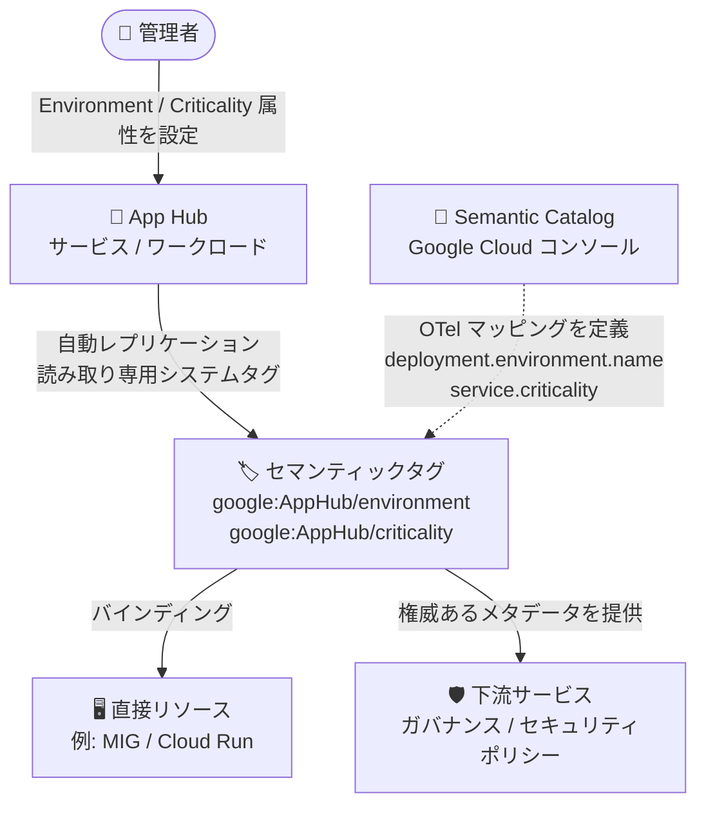

# Resource Manager: セマンティックタグ (Preview)

**リリース日**: 2026-08-04

**サービス**: Resource Manager

**機能**: セマンティックタグ (Semantic tags)

**ステータス**: Preview

📊 [このアップデートのインフォグラフィックを見る](https://takech9203.github.io/google-cloud-news-summary/20260804-resource-manager-semantic-tags.html)

## 概要

Google Cloud Resource Manager に **セマンティックタグ (Semantic tags)** が Preview として登場しました。セマンティックタグは、OpenTelemetry (OTel) のセマンティック規約に裏付けられた、標準化された強いセマンティクスを持つキーバリュー形式のメタデータです。App Hub のサービスやワークロードに設定した Environment (環境) と Criticality (重要度) の属性が、読み取り専用のシステムセマンティックタグ (`google:AppHub/environment` と `google:AppHub/criticality`) として、配下の直接リソースに自動的にレプリケートされます。

また、Google Cloud コンソールに **Semantic Catalog (セマンティックカタログ)** が追加され、利用可能なセマンティクスとその OTel 属性へのマッピングを一覧で確認できるようになりました。App Hub で管理する権威あるアプリケーションコンテキストが、システムタグとして下流のサービスに提供されるため、手動設定に伴うリスクなしにガバナンスやセキュリティポリシーの適用に活用できます。

対象ユーザーは、App Hub でアプリケーションを管理しつつ、タグベースのガバナンス (IAM Conditions、組織ポリシーなど) を運用しているプラットフォームチームや SRE、セキュリティ管理者です。

**アップデート前の課題**

- App Hub で設定した Environment や Criticality の属性は App Hub 内のメタデータにとどまり、配下の個々のリソースに対するタグとして自動的には反映されなかった
- 環境や重要度を表すタグを各リソースに手動で付与・維持する必要があり、App Hub の属性との不整合 (設定漏れ・更新漏れ) が発生するリスクがあった
- 組織ごとに独自のキー名・値でタグを定義していたため、環境や重要度を表すメタデータに業界標準 (OTel) に基づく統一的なセマンティクスがなかった

**アップデート後の改善**

- App Hub のサービス・ワークロードに設定した Environment / Criticality 属性が、読み取り専用のシステムセマンティックタグとして配下の直接リソースへ自動的にレプリケートされるようになった
- タグは読み取り専用のため手動での編集・削除ができず、App Hub を単一の管理ポイント (Single Source of Truth) として権威あるメタデータを下流サービスに提供できるようになった
- Semantic Catalog により、セマンティクスのキー・値と OTel 属性 (`deployment.environment.name`、`service.criticality`) のマッピングをコンソールや API で確認できるようになった

## アーキテクチャ図



App Hub のサービス・ワークロードに設定した Environment / Criticality 属性が、読み取り専用のシステムセマンティックタグとして配下の直接リソースに自動レプリケートされる流れを示しています。タグのキー・値と OTel 属性のマッピングは Semantic Catalog で確認できます。

## サービスアップデートの詳細

### 主要機能

1. **App Hub 属性の自動レプリケーション**
   - App Hub のサービス・ワークロードに設定した Environment と Criticality の属性が、専用の名前空間 `google:AppHub` 配下の読み取り専用システムセマンティックタグとして、配下の直接リソースに自動的にレプリケートされる
   - `google:AppHub/environment`: `PRODUCTION`、`STAGING` など App Hub 由来の値
   - `google:AppHub/criticality`: `MISSION_CRITICAL`、`HIGH` など App Hub 由来の値
   - システムセマンティックタグは読み取り専用であり、Tags API や Google Cloud コンソールから直接編集・削除はできない (タグの管理は App Hub 内で行う)

2. **Semantic Catalog (セマンティックカタログ)**
   - 利用可能なセマンティクスと OTel 属性へのマッピングを一覧表示するカタログ
   - Google Cloud コンソールの「タグ」ページの「Semantic Catalog」タブから参照できるほか、API でも詳細を確認可能

3. **リソースセマンティクスの取得 API**
   - `gcloud alpha resource-manager tags semantics list` コマンドで、リソースに関連付けられた権威あるセマンティックマッピング (例: `ENVIRONMENT: STAGING`、`CRITICALITY: LOW`) を取得できる
   - 既存のリソース固有の `RESOURCE.listEffectiveTags` IAM 権限を使用する

## 技術仕様

### セマンティクスと OTel 属性のマッピング

| セマンティクスキー | OTel 属性キー | セマンティクス値 | OTel 属性値 |
|------|------|------|------|
| ENVIRONMENT | `deployment.environment.name` | PRODUCTION / STAGING / TEST / DEVELOPMENT | production / staging / test / development |
| CRITICALITY | `service.criticality` | MISSION_CRITICAL / HIGH / MEDIUM / LOW | critical / high / medium / low |

### システムセマンティックタグ

| タグキー (名前空間付き) | タグ値 | 説明 |
|------|------|------|
| `google:AppHub/environment` | PRODUCTION, STAGING, TEST, DEVELOPMENT | App Hub の Environment 属性から自動レプリケートされるシステムセマンティックタグ |
| `google:AppHub/criticality` | MISSION_CRITICAL, HIGH, MEDIUM, LOW | App Hub の Criticality 属性から自動レプリケートされるシステムセマンティックタグ |

## 設定方法

### 前提条件

1. App Hub でアプリケーションを作成し、サービス・ワークロードを登録していること
2. タグバインディングの参照には対象リソースの `listEffectiveTags` に相当する IAM 権限が必要

### 手順

#### ステップ 1: App Hub でサービス・ワークロードの属性を設定

```bash
gcloud apphub applications services update SERVICE_NAME \
  --application=APPLICATION_NAME \
  --project=PROJECT_ID \
  --location=LOCATION \
  --criticality-type=MISSION_CRITICAL \
  --environment-type=PRODUCTION
```

App Hub のサービス (またはワークロード) に Environment / Criticality 属性を設定します。設定された属性がシステムセマンティックタグとして配下の直接リソースへ自動レプリケートされます。

#### ステップ 2: レプリケートされたシステムタグを確認

```bash
gcloud resource-manager tags bindings list \
  --parent=//API_DOMAIN/projects/PROJECT_NUMBER/... \
  --location=LOCATION
```

配下のリソース (例: MIG や Cloud Run ジョブ) に `google:AppHub/environment` や `google:AppHub/criticality` のタグバインディングが付与されていることを確認します。

#### ステップ 3: リソースのセマンティクスを取得

```bash
gcloud alpha resource-manager tags semantics list \
  --parent=//API_DOMAIN/projects/PROJECT_NUMBER/... \
  --location=LOCATION
```

リソースに関連付けられた権威あるセマンティックマッピング (`ENVIRONMENT`、`CRITICALITY`) を確認します。

#### ステップ 4: Semantic Catalog を参照

Google Cloud コンソールの「タグ」ページを開き、「Semantic Catalog」タブでセマンティクスキーと OpenTelemetry 標準のマッピング表を確認します。

## メリット

### ビジネス面

- **ガバナンスの信頼性向上**: App Hub で管理される権威あるメタデータが下流サービスに提供されるため、手動設定に伴う設定漏れ・不整合のリスクなしにガバナンス・セキュリティポリシーを適用できる
- **運用負荷の削減**: 環境・重要度タグをリソースごとに手動で付与・更新する作業が不要になり、App Hub での一元管理に集約できる

### 技術面

- **標準準拠のセマンティクス**: OpenTelemetry のセマンティック規約 (`deployment.environment.name`、`service.criticality`) に基づくため、オブザーバビリティエコシステムとの整合性が高い
- **改ざん防止**: システムセマンティックタグは読み取り専用のため、Tags API やコンソールから勝手に変更・削除されることがなく、メタデータの整合性が保たれる

## デメリット・制約事項

### 制限事項

- **カスタムバインディング不可**: `ENVIRONMENT` や `CRITICALITY` のセマンティックタグを Tags API 経由でリソースや Resource Manager ノード (プロジェクト、フォルダ、組織) に直接バインドすることはできない
- **ユーザー定義セマンティクス非対応**: 既存のユーザー定義タグをセマンティックタグへ昇格させることはサポートされていない
- **直接リソースのみ対象**: 同期は App Hub に登録された直接リソースにのみ適用され、サービスやワークロード内のネストされた間接リソース (例: MIG 内の個々の VM) へは伝播しない

### 考慮すべき点

- Preview 段階の機能であり、Pre-GA Offerings Terms が適用される (サポートが限定的な場合がある)
- システムセマンティックタグの管理は App Hub 側で行うため、タグ運用フローを App Hub 中心に見直す必要がある
- `tags semantics list` コマンドは現時点で `gcloud alpha` トラックで提供されている

## ユースケース

### ユースケース 1: 本番環境リソースへのガバナンスポリシー適用

**シナリオ**: 組織内で本番環境のリソースにのみ厳格なアクセス制御を適用したいが、環境を示すタグの手動運用では付与漏れが発生していた。

**実装例**:
```bash
# App Hub でサービスを PRODUCTION として登録・更新
gcloud apphub applications services update payment-service \
  --application=ecommerce-app \
  --project=mgmt-project \
  --location=us-central1 \
  --environment-type=PRODUCTION

# 配下リソースに google:AppHub/environment=PRODUCTION が自動付与される
```

**効果**: 環境情報が App Hub からシステムタグとして自動レプリケートされるため、付与漏れなく本番リソースを一貫して識別でき、タグベースのポリシー適用の信頼性が向上する。

### ユースケース 2: 重要度に基づく運用優先度の可視化

**シナリオ**: インシデント対応時に、影響を受けたリソースがミッションクリティカルなワークロードに属するかを迅速に判断したい。

**効果**: `google:AppHub/criticality` タグにより、個々のリソースレベルで重要度 (MISSION_CRITICAL / HIGH / MEDIUM / LOW) を確認でき、OTel 属性 `service.criticality` とのマッピングによりオブザーバビリティツールとの一貫した重要度管理が可能になる。

## 関連サービス・機能

- **App Hub**: セマンティックタグの発生源。サービス・ワークロードに設定した Environment / Criticality 属性がシステムセマンティックタグとしてレプリケートされる。タグの管理 (設定・変更) は App Hub 内で行う
- **Resource Manager タグ**: セマンティックタグは既存のタグ機構 (タグキー・タグ値・タグバインディング) の上に構築されており、`gcloud resource-manager tags bindings list` で他のタグと同様に参照できる
- **OpenTelemetry (OTel)**: セマンティックタグのキー・値は OTel セマンティック規約 (`deployment.environment.name`、`service.criticality`) にマッピングされ、オブザーバビリティエコシステムとの整合性を担保する
- **Sensitive Data Protection**: 同じくシステムタグ (`google/system:sdp-data-sensitivity`) をリソースに自動付与するサービスで、Google 管理のシステムタグの先行例

## 参考リンク

- 📊 [インフォグラフィック](https://takech9203.github.io/google-cloud-news-summary/20260804-resource-manager-semantic-tags.html)
- [公式リリースノート](https://docs.cloud.google.com/release-notes#August_04_2026)
- [Tags overview - Semantic tags](https://docs.cloud.google.com/resource-manager/docs/tags/tags-overview#semantic_tags)
- [Create and manage tags - View and manage semantic tags](https://docs.cloud.google.com/resource-manager/docs/tags/tags-creating-and-managing#view_and_manage_semantic_tags)
- [App Hub - サービスとワークロードの属性更新](https://docs.cloud.google.com/app-hub/docs/modify-app-hub-resources)

## まとめ

セマンティックタグは、App Hub のアプリケーションコンテキスト (環境・重要度) を OTel 標準に準拠した読み取り専用システムタグとして個々のリソースへ自動反映する仕組みであり、タグの手動運用に伴う不整合リスクを解消します。App Hub とタグベースのガバナンスを併用している組織は、Preview 段階のうちに Semantic Catalog とレプリケーション動作を検証し、既存のタグ運用ポリシーとの統合方針を検討することを推奨します。

---

**タグ**: Resource Manager, App Hub, Semantic Tags, OpenTelemetry, Tags, Governance, Preview
