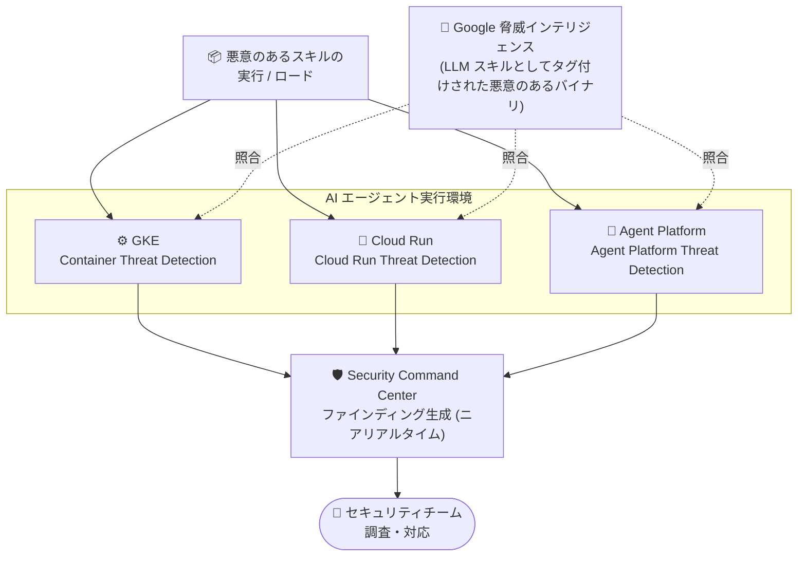

# Security Command Center: Malicious Skill ランタイム脅威検出機能 (GKE / Cloud Run / Agent Platform)

**リリース日**: 2026-08-04

**サービス**: Security Command Center

**機能**: Malicious Skill ランタイム脅威検出機能 (GKE / Cloud Run / Agent Platform)

**ステータス**: Feature

📊 [このアップデートのインフォグラフィックを見る](https://takech9203.github.io/google-cloud-news-summary/20260804-scc-malicious-skill-threat-detectors.html)

## 概要

Security Command Center に、新しい「Malicious Skill (悪意のあるスキル)」ランタイム脅威検出機能がリリースされました。この検出機能は Google Kubernetes Engine (GKE)、Cloud Run、Agent Platform の 3 つの実行環境に対応し、悪意のあるスキル (AI エージェントの能力・ツール) が実行またはロードされた際に、それを検出してファインディングとして報告します。

ここでいう「悪意のあるスキル」とは、Google の脅威インテリジェンスによって LLM スキルとしてタグ付けされた、あらゆる悪意のあるバイナリを指します。AI エージェントの普及に伴い、エージェントに追加のスキル (ツールやプラグインなどの拡張機能) を組み込む開発スタイルが一般化しており、サプライチェーン経由で悪意のあるスキルが混入するリスクが新たな攻撃ベクトルとして注目されています。今回のアップデートは、この AI エージェント特有の脅威をランタイム (実行時) に検出する仕組みを、コンテナ・サーバーレス・エージェント基盤の各レイヤーに横断的に提供するものです。

対象ユーザーは、GKE や Cloud Run 上で AI エージェントワークロードを稼働させている組織、Agent Platform (Agent Runtime) に AI エージェントをデプロイしている組織、および Security Command Center Premium ティアで AI ワークロードの脅威検出を強化したいセキュリティチームです。

**アップデート前の課題**

- 従来のランタイム検出 (Container Threat Detection、Cloud Run Threat Detection、Agent Platform Threat Detection) は、脅威インテリジェンスに基づく悪意のあるバイナリ・ライブラリの検出 (Added/Built-in/Modified Malicious Binary/Library) や、NLP による悪意のある Bash/Python コードの検出を提供していたが、「LLM スキル」という AI エージェント特有の攻撃コンポーネントを区別して検出する仕組みはなかった
- AI エージェントが読み込むスキルが悪意のあるものかどうかを、実行時に自動判定する手段がなく、スキルのサプライチェーンリスクへの対応は事前レビューなど手動の対策に依存していた
- 悪意のあるバイナリの検出結果からは、それが AI エージェントのスキルとして動作していたのかどうかという文脈が分からず、AI ワークロードに対する攻撃の調査・トリアージに追加の分析が必要だった

**アップデート後の改善**

- Google の脅威インテリジェンスが「LLM スキル」としてタグ付けした悪意のあるバイナリが実行またはロードされた時点で、専用の Malicious Skill 検出機能がニアリアルタイムにファインディングを生成するようになった
- GKE、Cloud Run、Agent Platform という AI エージェントの主要な 3 つの実行環境すべてで、同一の脅威分類に基づく一貫した検出が可能になった
- AI エージェントのスキルに起因する脅威が明確にラベル付けされるため、セキュリティチームは Security Command Center 上で AI 特有の脅威として優先度付け・対応ができるようになった

## アーキテクチャ図



3 つの実行環境それぞれのランタイム脅威検出サービスが、Google の脅威インテリジェンスと照合して悪意のあるスキルの実行・ロードを検出し、Security Command Center にファインディングとして集約します。

## サービスアップデートの詳細

### 主要機能

1. **Malicious Skill 検出 (実行・ロードの両方を監視)**
   - AI エージェントのスキル (エージェントの能力を拡張するコンポーネント) として動作する悪意のあるバイナリが「実行」された場合、および「ロード」された場合の両方を検出する
   - 悪意のあるスキルの判定基準は、Google の脅威インテリジェンスによって「LLM スキル」としてタグ付けされた悪意のあるバイナリであること

2. **3 つの実行環境への横断対応**
   - **GKE**: Container Threat Detection が、Container-Optimized OS ノード上のカーネルレベル計装により実行・ロードイベントを収集して検出
   - **Cloud Run**: Cloud Run Threat Detection が、第 2 世代実行環境で稼働するサービス・ジョブ・ワーカープールを監視して検出
   - **Agent Platform**: Agent Platform Threat Detection が、Agent Runtime にデプロイされた AI エージェントのプロセス・スクリプト・ライブラリを監視して検出

3. **Security Command Center へのニアリアルタイムなファインディング生成**
   - 検出された脅威は Security Command Center のファインディングとしてニアリアルタイムに報告される
   - 既存の Malicious Binary/Library 系検出と同様に、脅威インテリジェンスに基づく検出のため、シグネチャの手動管理は不要

## 技術仕様

### 検出基盤 (各実行環境のランタイム検出サービス)

| 項目 | 詳細 |
|------|------|
| 検出対象イベント | 悪意のあるスキル (LLM スキルとしてタグ付けされた悪意のあるバイナリ) の実行・ロード |
| 判定ソース | Google 脅威インテリジェンス (Google Threat Intelligence) |
| GKE での検出基盤 | Container Threat Detection (Container-Optimized OS ノードのカーネルレベル計装 + DaemonSet 経由のイベント収集) |
| Cloud Run での検出基盤 | Cloud Run Threat Detection (第 2 世代実行環境のみサポート) |
| Agent Platform での検出基盤 | Agent Platform Threat Detection (Agent Runtime 上のエージェントをウォッチャープロセスで監視) |
| ファインディング出力先 | Security Command Center (オプションで Cloud Logging) |
| 必要ティア | Security Command Center Premium ティアまたは Enterprise ティア (注: Enterprise ティアは 2027 年 5 月 21 日にシャットダウン予定で、Premium ティアに自動移行) |

### 検出の仕組み (共通アーキテクチャ)

各ランタイム検出サービスは、以下の流れで動作します。

1. ワークロード実行中に、カーネルレベル計装またはウォッチャープロセスがプロセス実行・ライブラリロードなどの低レベルイベントを収集
2. ディテクターサービスがイベントを分析し、脅威インテリジェンスと照合してインシデントかどうかを判定
3. インシデントと判定された場合のみ、Security Command Center にファインディングとして書き込み (インシデントでない場合、情報は保存されない。収集データはメモリ上で処理され永続化されない)

## 設定方法

### 前提条件

1. Security Command Center Premium ティア (または Enterprise ティア) が有効であること
2. 対象環境に応じたランタイム検出サービス (Container Threat Detection / Cloud Run Threat Detection / Agent Platform Threat Detection) が有効であること
3. Cloud Run の場合: 対象リソースが第 2 世代実行環境で稼働していること

### 手順

#### ステップ 1: ランタイム検出サービスの有効化

Google Cloud コンソールの「Security Command Center」>「設定」>「サービス」から、対象のランタイム検出サービス (Container Threat Detection、Cloud Run Threat Detection、Agent Platform Threat Detection) を有効化します。有効化すると、イベント収集は自動的に構成されます。

#### ステップ 2: ファインディングの確認

```
Security Command Center コンソール > 「ファインディング」で
ソース (Container Threat Detection など) や重大度でフィルタリングして確認
```

Malicious Skill 関連のファインディングが生成された場合、Summary タブで検出されたバイナリのパス・引数、影響を受けたリソース、VirusTotal インジケーターへのリンクなどを確認し、調査・対応を行います。

## メリット

### ビジネス面

- **AI エージェント導入のリスク低減**: スキルのサプライチェーン経由の攻撃という AI 特有の新しい脅威に対する検出層が加わり、AI エージェントを本番環境に展開する際のセキュリティ上の懸念を軽減できる
- **セキュリティ運用の一元化**: AI ワークロードの脅威を他のクラウドセキュリティリスクと同じ Security Command Center 上で管理でき、専用ツールの追加導入が不要

### 技術面

- **脅威インテリジェンス駆動の自動検出**: Google Threat Intelligence が LLM スキルとしてタグ付けした悪意のあるバイナリと自動照合するため、利用者側でシグネチャやルールを管理する必要がない
- **実行環境を問わない一貫した検出**: GKE、Cloud Run、Agent Platform のどこに AI エージェントをデプロイしても、同じ分類の Malicious Skill 検出が機能する
- **ニアリアルタイム検出**: 実行・ロードの時点で検出されるため、静的スキャンでは捕捉できないランタイム攻撃にも対応できる

## デメリット・制約事項

### 制限事項

- Security Command Center の Premium ティア (または Enterprise ティア) が必要 (Standard ティアではランタイム脅威検出は利用不可)
- Cloud Run Threat Detection のランタイム検出は第 2 世代実行環境のみをサポートし、有効化すると第 1 世代実行環境の新規サービス・リビジョンは作成できなくなる
- Container Threat Detection は Container-Optimized OS ノードイメージが対象
- 検出は Google の脅威インテリジェンスが「LLM スキルとしてタグ付けした悪意のあるバイナリ」に基づくため、未知・未タグの悪意のあるスキルは対象外の可能性がある

### 考慮すべき点

- 検出 (Detection) の機能であり、悪意のあるスキルの実行を事前にブロックする防御 (Prevention) 機能ではない。ファインディングへの対応プロセス (トリアージ、隔離、修復) を整備しておく必要がある
- 誤検知・過検知の可能性を考慮し、ファインディングの重大度と VirusTotal などの関連情報を組み合わせて判断するワークフローを用意することが望ましい
- Agent Platform Threat Detection のウォッチャープロセスは起動から情報収集開始まで最大 1 分程度かかる

## ユースケース

### ユースケース 1: GKE 上のマルチエージェントシステムにおけるスキル汚染の検出

**シナリオ**: GKE 上で複数の AI エージェントを稼働させており、エージェントはサードパーティ製を含む多数のスキルを動的に利用する。攻撃者がスキル配布経路を侵害し、悪意のあるスキルバイナリを混入させた。

**効果**: 悪意のあるスキルがコンテナ内で実行またはロードされた時点で Container Threat Detection が検出し、Security Command Center にファインディングを生成。セキュリティチームは影響を受けた Pod・コンテナを特定し、該当スキルの隔離とサプライチェーンの調査を迅速に開始できる。

### ユースケース 2: Agent Platform にデプロイした AI エージェントの実行時保護

**シナリオ**: Agent Platform (Agent Runtime) に業務用 AI エージェントをデプロイしている。エージェントのビルドパイプラインが侵害され、悪意のあるスキルがエージェントワークロードに注入されるリスクを懸念している。

**効果**: Agent Platform Threat Detection の Malicious Skill 検出により、悪意のあるスキルの実行・ロードがニアリアルタイムに検出される。既存の Malicious Binary/Library 検出や Reverse Shell 検出などと組み合わせることで、AI エージェントに対する多層的なランタイム保護を実現できる。

## 料金

Malicious Skill 検出機能は、Security Command Center の Premium ティア (または Enterprise ティア) に含まれるランタイム脅威検出サービスの一部として提供されます。個別の追加料金に関する情報は Release Notes には記載されていません。詳細は料金ページを参照してください。

- [Security Command Center の料金](https://cloud.google.com/security-command-center/pricing)

## 関連サービス・機能

- **Container Threat Detection**: GKE ノードをカーネルレベルで監視するランタイム脅威検出サービス。今回の Malicious Skill 検出の GKE 向け基盤
- **Cloud Run Threat Detection**: Cloud Run のサービス・ジョブ・ワーカープールを監視するランタイム脅威検出サービス。今回の Malicious Skill 検出の Cloud Run 向け基盤
- **Agent Platform Threat Detection**: Agent Runtime にデプロイされた AI エージェントを監視するランタイム脅威検出サービス。今回の Malicious Skill 検出の Agent Platform 向け基盤
- **Event Threat Detection**: 監査ログなどを分析するコントロールプレーン検出。ランタイム検出と組み合わせて多層防御を構成
- **AI Protection**: AI ワークロード向けのセキュリティフレームワークとコントロールを提供する Security Command Center の機能群。Agent Platform Threat Detection のファインディングと合わせて AI セキュリティを一元管理
- **Google Threat Intelligence**: 悪意のあるバイナリを「LLM スキル」としてタグ付けする判定ソース。Google 全体の製品・サービスからのシグナルに基づく脅威インテリジェンス

## 参考リンク

- 📊 [インフォグラフィック](https://takech9203.github.io/google-cloud-news-summary/20260804-scc-malicious-skill-threat-detectors.html)
- [公式リリースノート](https://docs.cloud.google.com/release-notes#August_04_2026)
- [Container Threat Detection の概要](https://docs.cloud.google.com/security-command-center/docs/concepts-container-threat-detection-overview)
- [Cloud Run Threat Detection の概要](https://docs.cloud.google.com/security-command-center/docs/cloud-run-threat-detection-overview)
- [Agent Platform Threat Detection の概要](https://docs.cloud.google.com/security-command-center/docs/agent-platform-threat-detection-overview)
- [脅威の概要 (Security Command Center)](https://docs.cloud.google.com/security-command-center/docs/overview-threats)
- [脅威ファインディングインデックス](https://docs.cloud.google.com/security-command-center/docs/threat-findings-index)
- [料金ページ](https://cloud.google.com/security-command-center/pricing)

## まとめ

AI エージェントの「スキル」を悪用するサプライチェーン攻撃は、エージェンティック AI 時代の新しい脅威ベクトルであり、今回のアップデートはこれをランタイムで検出する仕組みを GKE、Cloud Run、Agent Platform の 3 環境に横断的に提供する重要な機能追加です。AI エージェントワークロードを運用している組織は、Security Command Center Premium ティアで対象のランタイム脅威検出サービスを有効化し、Malicious Skill 関連ファインディングへの対応手順をインシデントレスポンスプロセスに組み込むことを推奨します。

---

**タグ**: Security Command Center, Container Threat Detection, Cloud Run Threat Detection, Agent Platform, GKE, Cloud Run, AI セキュリティ, 脅威検出, LLM スキル, ランタイムセキュリティ
