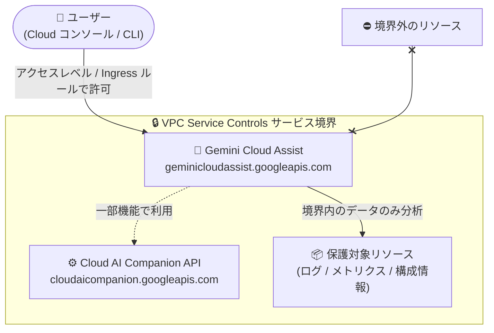

# VPC Service Controls: Gemini Cloud Assist インテグレーションが GA に

**リリース日**: 2026-08-04

**サービス**: VPC Service Controls

**機能**: Gemini Cloud Assist インテグレーションの一般提供 (GA)

**ステータス**: GA (一般提供)

📊 [このアップデートのインフォグラフィックを見る](https://takech9203.github.io/google-cloud-news-summary/20260804-vpc-service-controls-gemini-cloud-assist-ga.html)

## 概要

VPC Service Controls による Gemini Cloud Assist (`geminicloudassist.googleapis.com`) のインテグレーションが一般提供 (GA) になりました。これにより、サービス境界 (Service Perimeter) 内で Gemini Cloud Assist を保護対象サービスとして本番環境で正式に利用できるようになります。

Gemini Cloud Assist は、Google Cloud コンソールや Gemini CLI、IDE から利用できる AI アシスタントで、アプリケーションの設計・デプロイ・モニタリング・トラブルシューティング・コスト最適化をライフサイクル全体にわたって支援します。AI アシスタントはプロジェクト内のリソースやテレメトリデータにアクセスするため、データ漏洩 (exfiltration) リスクを懸念する規制業界の組織では、VPC Service Controls による保護が本番利用の前提条件となるケースが多くありました。

今回の GA により、金融・医療・公共など厳格なセキュリティ要件を持つ組織でも、サービス境界内で Gemini Cloud Assist を安心して活用できるようになります。境界内に配置された Gemini Cloud Assist は、同じ境界内にあるデータと API のみにアクセスできます。

**アップデート前の課題**

- Gemini Cloud Assist の VPC Service Controls インテグレーションは 2026 年 1 月 8 日から Preview 段階であり、本番環境での利用は完全にはサポートされていなかった
- VPC Service Controls による保護なしでは、AI アシスタントが境界外のデータへアクセスするリスクを組織のセキュリティポリシー上許容できず、規制業界では Gemini Cloud Assist の導入が困難だった

**アップデート後の改善**

- サービス境界の保護対象サービスとして `geminicloudassist.googleapis.com` を本番環境で正式に利用可能になった
- 境界内の Gemini Cloud Assist は境界内のデータ・API のみにアクセスするため、データ漏洩リスクを抑えながら AI 支援によるクラウド運用が可能になった

## アーキテクチャ図



サービス境界内に配置された Gemini Cloud Assist は、同じ境界内にあるデータと API のみを参照でき、境界外へのデータ流出を防ぎます。フル機能を利用するには `cloudaicompanion.googleapis.com` も境界に含める必要があります。

## サービスアップデートの詳細

### 主要機能

1. **サービス境界による Gemini Cloud Assist の保護 (GA)**
   - `geminicloudassist.googleapis.com` をサービス境界の保護対象 (Restricted Services) に追加可能
   - 境界内の Gemini Cloud Assist は、境界内に存在するデータと API のみにアクセスできる
   - 本番環境での利用が正式にサポートされる

2. **境界内リソースの AI 分析**
   - Gemini Cloud Assist に分析させたいプロダクトやサービスも同じ境界内に配置することで、最良の結果が得られる
   - コスト最適化、トラブルシューティング、アプリケーション設計などの AI 支援を、セキュリティ境界を維持したまま利用可能

## 技術仕様

| 項目 | 詳細 |
|------|------|
| サービス名 | `geminicloudassist.googleapis.com` |
| 境界による保護 | 可能 (Restricted Services に追加可能) |
| ステータス | GA (2026 年 8 月 4 日) |
| Preview 開始 | 2026 年 1 月 8 日 |
| 依存 API | `cloudaicompanion.googleapis.com` (一部機能で使用。フル機能にはこの API も境界に含める必要あり) |

## 設定方法

### 前提条件

1. Access Context Manager でアクセスポリシーが作成済みであること
2. Gemini Cloud Assist が対象プロジェクトで有効化されていること (境界内プロジェクトで未有効の場合は後述の制限を参照)

### 手順

#### ステップ 1: サービス境界に保護対象サービスを追加

```bash
gcloud access-context-manager perimeters update PERIMETER_NAME \
  --add-restricted-services=geminicloudassist.googleapis.com,cloudaicompanion.googleapis.com \
  --policy=POLICY_ID
```

Gemini Cloud Assist API に加え、一部機能が依存する Cloud AI Companion API も境界に追加します。

#### ステップ 2: 分析対象リソースを同一境界に配置

Gemini Cloud Assist に分析させたいプロジェクトや VPC ネットワークを同じサービス境界に追加します。境界外のリソースは分析対象にできません。

## メリット

### ビジネス面

- **規制業界での AI 活用**: 金融・医療・公共など、データ漏洩対策が必須の組織でも Gemini Cloud Assist を本番環境で導入可能になる
- **コンプライアンス対応**: セキュリティ境界を維持したまま AI 支援による運用効率化を実現できる

### 技術面

- **データ漏洩リスクの低減**: AI アシスタントのアクセス範囲をサービス境界内に限定できる
- **本番サポート**: Preview の制約が外れ、GA として本番環境で完全にサポートされる

## デメリット・制約事項

### 制限事項

- Gemini Cloud Assist は一部機能で `cloudaicompanion.googleapis.com` を使用するため、フル機能を利用するにはこの API も境界に含める必要がある
- 境界内のプロジェクトで Gemini Cloud Assist が未有効の場合、Google Cloud コンソールからの有効化はエラーになる (コンソールが要求する App Optimize API が VPC Service Controls 非対応のため)。このエラーを回避するには gcloud CLI で有効化する
- Gemini Cloud Assist の investigations (Preview) 機能に対する VPC Service Controls サポートは 2026 年 4 月 13 日から非推奨となっており、境界内からの investigations へのアクセスはブロックされる。この機能を利用するには境界外からリクエストする必要がある

### 考慮すべき点

- Gemini Cloud Assist に分析させたいリソースは同じ境界内に配置すること。境界外のリソースは参照できない
- 境界外 (社内ネットワークなど) からアクセスする場合は、アクセスレベルまたは Ingress ルールの設定が必要

## ユースケース

### ユースケース 1: 規制業界でのセキュアな AI 運用支援

**シナリオ**: 金融機関がデータ漏洩対策として全プロジェクトを VPC Service Controls 境界内で運用しており、AI によるトラブルシューティングやコスト最適化を導入したい。

**効果**: `geminicloudassist.googleapis.com` を境界の保護対象に追加することで、AI アシスタントのデータアクセスを境界内に限定したまま、運用効率化とコスト最適化の支援を受けられる。

### ユースケース 2: 境界内リソースの包括的な AI 分析

**シナリオ**: サービス境界内で運用中のアプリケーション群について、ログ・メトリクス・構成情報を横断した AI 分析を行いたい。

**効果**: 分析対象のプロジェクトを Gemini Cloud Assist と同じ境界に配置することで、セキュリティを維持しながら境界内リソースの包括的な分析が可能になる。

## 料金

VPC Service Controls 自体に追加料金はありません。Gemini Cloud Assist の料金は [Gemini for Google Cloud の料金ページ](https://cloud.google.com/products/gemini/pricing)を参照してください。

## 関連サービス・機能

- **Gemini Cloud Assist**: 今回保護対象として GA になった AI アシスタント。アプリ設計、トラブルシューティング、コスト最適化を支援
- **Access Context Manager**: サービス境界やアクセスレベルを定義する基盤サービス。境界外からのアクセス許可に使用
- **Gemini Code Assist** (`cloudaicompanion.googleapis.com`): すでに VPC Service Controls に GA 対応済み。Gemini Cloud Assist の一部機能もこの API に依存
- **Cloud Hub / FinOps Hub**: Gemini Cloud Assist と連携してコスト・使用状況の最適化インサイトを提供

## 参考リンク

- 📊 [インフォグラフィック](https://takech9203.github.io/google-cloud-news-summary/20260804-vpc-service-controls-gemini-cloud-assist-ga.html)
- [公式リリースノート](https://docs.cloud.google.com/release-notes#August_04_2026)
- [VPC Service Controls でサポートされているプロダクト](https://docs.cloud.google.com/vpc-service-controls/docs/supported-products)
- [Gemini Cloud Assist の概要](https://docs.cloud.google.com/cloud-assist/overview)
- [Gemini Cloud Assist のセットアップ](https://docs.cloud.google.com/cloud-assist/set-up-gemini)
- [Gemini for Google Cloud 料金ページ](https://cloud.google.com/products/gemini/pricing)

## まとめ

Gemini Cloud Assist の VPC Service Controls インテグレーションが GA となり、厳格なセキュリティ要件を持つ組織でも AI 支援によるクラウド運用を本番環境で導入できるようになりました。境界内で利用する場合は `cloudaicompanion.googleapis.com` の追加や gcloud CLI での有効化などの制限事項を確認した上で、サービス境界の Restricted Services への追加を検討してください。

---

**タグ**: VPC Service Controls, Gemini Cloud Assist, セキュリティ, GA, サービス境界, データ漏洩対策
