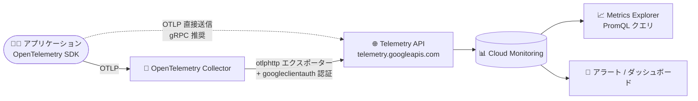

# Cloud Monitoring: Telemetry API によるメトリクス取り込み (OTLP) が GA

**リリース日**: 2026-08-05

**サービス**: Cloud Monitoring

**機能**: Telemetry API による OTLP メトリクス取り込み

**ステータス**: GA (一般提供)

📊 [このアップデートのインフォグラフィックを見る](https://takech9203.github.io/google-cloud-news-summary/20260805-cloud-monitoring-telemetry-api-otlp-ga.html)

## 概要

Cloud Monitoring において、メトリクス取り込み用の Telemetry API が一般提供 (GA) になりました。OpenTelemetry Collector と OTLP エクスポーター (`otlphttp` など)、そして Telemetry API (`telemetry.googleapis.com`) を組み合わせることで、OTLP 形式のメトリクスをそのまま Cloud Monitoring に取り込めます。

Telemetry API は OpenTelemetry Line Protocol (OTLP) を実装した Google Cloud のネイティブエンドポイントで、`http/protobuf`、`http/json`、`grpc` のすべての OTLP プロトコルをサポートします。Collector 経由の送信に加え、OpenTelemetry SDK を組み込んだアプリケーションから直接メトリクスを送信することも可能です。取り込んだメトリクスは Metrics Explorer で表示・グラフ化できます。

OpenTelemetry は Google Cloud がサポートするオープンソースプロジェクトであり、ベンダー中立な計装 (インストルメンテーション) を採用する組織にとって、独自エクスポーターへの依存を減らしつつ Google Cloud Observability にテレメトリーを送る標準的な経路が正式に利用可能になったアップデートです。

**アップデート前の課題**

- Telemetry API によるメトリクス取り込みは Preview (Pre-GA) 段階であり、Pre-GA 提供規約の下で「現状のまま」提供され、サポートが限定される可能性があった
- OTLP メトリクスを Cloud Monitoring に送るには `googlemanagedprometheus` エクスポーターを使う方法が一般的だったが、このエクスポーターはメトリクス名のピリオド (`.`) やスラッシュ (`/`) をアンダースコア (`_`) に変換し、単位や `_total` サフィックスを付与するため、OTLP のセマンティクス通りの名前が保持されなかった

**アップデート後の改善**

- Telemetry API によるメトリクス取り込みが GA となり、本番環境で正式サポートの下で利用できるようになった
- OTLP メトリクス名がそのまま (ピリオドやスラッシュを含めて verbatim で) 取り込まれ、`_total` などのサフィックスも付与されないため、OpenTelemetry のセマンティック規約に沿った命名を維持できる
- `http/protobuf`、`http/json`、`grpc` のすべての OTLP プロトコルに対応し、Collector 経由・SDK からの直接送信のどちらも利用できる

## アーキテクチャ図



アプリケーションの OTLP メトリクスは、OpenTelemetry Collector の `otlphttp` エクスポーター経由 (または SDK から直接) で Telemetry API に送信され、Cloud Monitoring に格納されて Metrics Explorer や PromQL で分析できます。

## サービスアップデートの詳細

### 主要機能

1. **OTLP ネイティブなメトリクス取り込みエンドポイント**
   - `telemetry.googleapis.com` が OpenTelemetry Line Protocol を実装し、OTLP メトリクスをそのまま受け付ける
   - `http/protobuf`、`http/json`、`grpc` のすべての OTLP プロトコルをサポート
   - Collector 設定ではルート URL (`https://telemetry.googleapis.com`) のみを指定すればよく、OpenTelemetry がデータ種別を検出して `/v1/metrics` などのパスを自動付与する

2. **Collector 経由と SDK 直接送信の両対応**
   - OpenTelemetry Collector + `otlphttp` エクスポーターによる送信 (推奨構成)
   - OpenTelemetry SDK を使うアプリケーションからの直接送信にも対応。ただし多くの SDK エクスポーターは動的なトークン更新に対応していないため、SDK からの直接送信では HTTP ではなく gRPC OTLP エクスポーターの使用が推奨される
   - GKE を使用している場合は、Collector を手動でデプロイする代わりに Managed OpenTelemetry for GKE を利用できる

3. **グローバル / リージョナルエンドポイント**
   - グローバルエンドポイント: `telemetry.googleapis.com`
   - リージョナルエンドポイント: `telemetry.REGION.rep.googleapis.com`。メトリクスデータは、データに付与された `location` ラベルがエンドポイントのリージョン (またはリージョン内のゾーン) と一致する場合にのみ保存される
   - Telemetry API (`telemetry.googleapis.com`) は VPC Service Controls 対応サービス

4. **`googlemanagedprometheus` エクスポーターとの命名の違い**
   - Telemetry API はメトリクス名にピリオド (`.`) とスラッシュ (`/`) を許可し、名前を変換せずに取り込む (`googlemanagedprometheus` エクスポーターはこれらを `_` に変換)
   - 単位のサフィックスやカウンタの `_total`、`_ratio` サフィックスを付与しない
   - 指数ヒストグラムから導出される分布値の `sum_of_squared_deviation` を合成する
   - 両方の取り込み経路を併用すると 2 系統のメトリクス記述子が作られるため、クエリ時に両者を手動で結合 (union) する必要がある

## 技術仕様

### 命名規則と制約

| 項目 | 詳細 |
|------|------|
| メトリクス名 | 正規表現 `[a-zA-Z][a-zA-Z0-9_:./-]*` に従う必要あり (使用可能な特殊文字は `_:./-` のみ)。従わない場合は拒否される |
| ラベルキー | 正規表現 `[a-zA-Z_][a-zA-Z0-9_.]*` に従う必要あり (使用可能な特殊文字は `_.` のみ)。ラベル値にはすべての特殊文字を使用可能 |
| 特殊文字のクエリ | `:` と `_` 以外の特殊文字を含む名前は、PromQL の UTF-8 仕様に従い `{"my.metric.name"}` のように波括弧と引用符で囲む |
| Collector バージョン | Prometheus メトリクスの OTLP 取り込みには OpenTelemetry Collector 0.140.0 以降が必要 |
| 推奨バッチサイズ | 1 リクエストあたり 200 データポイント |

### クォータと制限

| 項目 | 詳細 |
|------|------|
| デフォルトクォータ | 60,000 リクエスト/分 (最大バッチサイズ 200 ポイント/リクエストで、実効約 200,000 サンプル/秒)。引き上げ申請可能 |
| ラベル数 | メトリクスあたり最大 200 ラベル (Cloud Monitoring / Managed Service for Prometheus の標準制限が適用) |

### 必要な IAM ロール

Telemetry API でテレメトリーを送信するユーザーまたはサービスアカウントには、以下の設定が必要です。

- クォータプロジェクトの構成と、そのプロジェクトに対する **Service Usage Consumer** (`roles/serviceusage.serviceUsageConsumer`)
- メトリクス送信先プロジェクトに対する **Monitoring Metric Writer** (`roles/monitoring.metricWriter`) (ログは `roles/logging.logWriter`、トレースは `roles/telemetry.tracesWriter`)

### Collector 設定例 (otlphttp エクスポーター)

```yaml
exporters:
  otlphttp:
    encoding: proto
    endpoint: https://telemetry.googleapis.com
    auth:
      authenticator: googleclientauth

extensions:
  googleclientauth:

processors:
  batch:
    send_batch_max_size: 200
    send_batch_size: 200
    timeout: 5s
```

`googleclientauth` 拡張により、Application Default Credentials (ADC) を使って Google の認証情報がリクエストに付与されます。

## メリット

### ビジネス面

- **本番利用の正式サポート**: Pre-GA 提供規約から GA に昇格し、本番ワークロードのメトリクスパイプラインとして安心して採用できる
- **ベンダーロックインの低減**: OTLP という業界標準プロトコルで送信できるため、他のオブザーバビリティバックエンドとの併用や移行が容易になる

### 技術面

- **OTLP セマンティクスの保持**: メトリクス名がそのまま取り込まれ、OpenTelemetry の命名規約 (ピリオド区切りなど) を維持できる
- **プロトコルの柔軟性**: `http/protobuf`、`http/json`、`grpc` から環境に合わせて選択できる
- **VPC Service Controls 対応**: セキュリティ境界内でのテレメトリー取り込みが可能

## デメリット・制約事項

### 制限事項

- メトリクス名・ラベルキーは完全な UTF-8 をサポートしない (前述の正規表現に従わないデータは拒否される。Collector の `replace_pattern` 関数による変換で回避可能)
- Prometheus メトリクスの OTLP 取り込みには OpenTelemetry Collector 0.140.0 以降が必要
- 非常にスパースなデルタメトリクスなど、一部の状況でデルタメトリクスが正しくクエリできない場合がある
- 指数ヒストグラムのクエリで `le` ラベルを保持すると予期しない結果になる可能性がある (`histogram_quantile(.99, sum by (le) (metric))` のような典型的なクエリは動作する)

### 考慮すべき点

- 過去に `target_info` メトリクスを送信していた場合、`INT64` 型と `DOUBLE` 型の値型衝突が発生する可能性がある。その場合は `INT64` 型のメトリクス記述子を削除する必要がある
- `googlemanagedprometheus` エクスポーターと Telemetry API の両方で取り込むと、命名変換の違いにより 2 系統のメトリクスが生成される。クエリ時に手動で結果を結合する必要があるため、移行時は経路の統一を計画すべき
- SDK から直接送信する場合は、動的トークン更新の制約から gRPC OTLP エクスポーターの使用が推奨される

## ユースケース

### ユースケース 1: googlemanagedprometheus エクスポーターからの移行

**シナリオ**: 既存の OpenTelemetry Collector パイプラインで `googlemanagedprometheus` エクスポーターを使用しており、OTLP のメトリクス名をそのまま保持したい。

**実装例**:
```yaml
exporters:
  otlphttp:
    encoding: proto
    endpoint: https://telemetry.googleapis.com
    auth:
      authenticator: googleclientauth
```

**効果**: メトリクス名の変換 (`.`/`/` → `_`、`_total` サフィックス付与) がなくなり、OpenTelemetry のセマンティック規約に沿った命名で Cloud Monitoring に格納される。移行手順は公式ドキュメント「Migrate to the OTLP exporter」を参照。

### ユースケース 2: マルチベンダー構成での標準化された取り込み

**シナリオ**: 複数のオブザーバビリティバックエンドにテレメトリーを送信しており、Google Cloud 向けにも独自エクスポーターではなく標準の OTLP エクスポーターで統一したい。

**効果**: Collector の設定が OTLP エクスポーターに統一され、バックエンド固有のエクスポーター管理が不要になる。GKE では Managed OpenTelemetry for GKE によりさらに運用負荷を削減できる。

## 料金

OTLP メトリクスの課金は、Google Cloud Managed Service for Prometheus と同じ「Prometheus Samples Ingested」SKU で計上されます。取り込みサンプル数に基づく段階制料金です。

### 料金例 (Prometheus 形式のモニタリングデータ)

| 月間取り込みサンプル数 | 料金 |
|--------|-----------------|
| 0〜500 億サンプル | $0.060 / 100 万サンプル |
| 500 億〜2,500 億サンプル | $0.048 / 100 万サンプル |
| 2,500 億〜5,000 億サンプル | $0.036 / 100 万サンプル |
| 5,000 億サンプル超 | $0.024 / 100 万サンプル |

書き込み API 呼び出しは無料です。読み取り API 呼び出しは返却された時系列 100 万件あたり $0.50 (請求先アカウントごとに最初の 100 万時系列は無料)。詳細は [Google Cloud Observability の料金ページ](https://cloud.google.com/products/observability/pricing) を参照してください。

## 関連サービス・機能

- **Google Cloud Managed Service for Prometheus**: 同じストレージと課金 SKU を使用する Prometheus メトリクスのマネージドサービス。Telemetry API とは命名変換の挙動が異なる
- **Managed OpenTelemetry for GKE**: GKE では Collector を手動デプロイせずにマネージドな OpenTelemetry 収集を利用可能
- **Cloud Trace / Cloud Logging**: Telemetry API はメトリクスに加えて OTLP 形式のトレース (`/v1/traces`) とログ (`/v1/logs`) の取り込みにも対応
- **VPC Service Controls**: `telemetry.googleapis.com` はサービス境界による保護に対応
- **Metrics Explorer**: Telemetry API 経由で取り込んだメトリクスの表示・グラフ化に使用

## 参考リンク

- 📊 [インフォグラフィック](https://takech9203.github.io/google-cloud-news-summary/20260805-cloud-monitoring-telemetry-api-otlp-ga.html)
- [公式リリースノート](https://docs.cloud.google.com/release-notes#August_05_2026)
- [OTLP metric ingestion overview](https://docs.cloud.google.com/stackdriver/docs/otlp-metrics/overview)
- [Telemetry (OTLP) API overview](https://docs.cloud.google.com/stackdriver/docs/reference/telemetry/overview)
- [Deploy and use the collector](https://docs.cloud.google.com/stackdriver/docs/otlp-metrics/deploy-collector)
- [Use SDKs to send metrics from applications](https://docs.cloud.google.com/stackdriver/docs/otlp-metrics/use-sdks)
- [Migrate to the OTLP exporter](https://docs.cloud.google.com/stackdriver/docs/otlp-metrics/migrate-to-otlphttp)
- [料金ページ](https://cloud.google.com/products/observability/pricing)

## まとめ

Telemetry API によるメトリクス取り込みの GA により、OTLP 標準プロトコルで Cloud Monitoring にメトリクスを送信する経路が本番利用可能になりました。OpenTelemetry を採用している組織は、`googlemanagedprometheus` エクスポーターからの移行や新規パイプラインでの `otlphttp` エクスポーター採用を検討する価値があります。移行時は命名変換の違いによるメトリクスの二重化に注意し、Collector 0.140.0 以降を使用してください。

---

**タグ**: Cloud Monitoring, OpenTelemetry, OTLP, Telemetry API, Observability, GA
