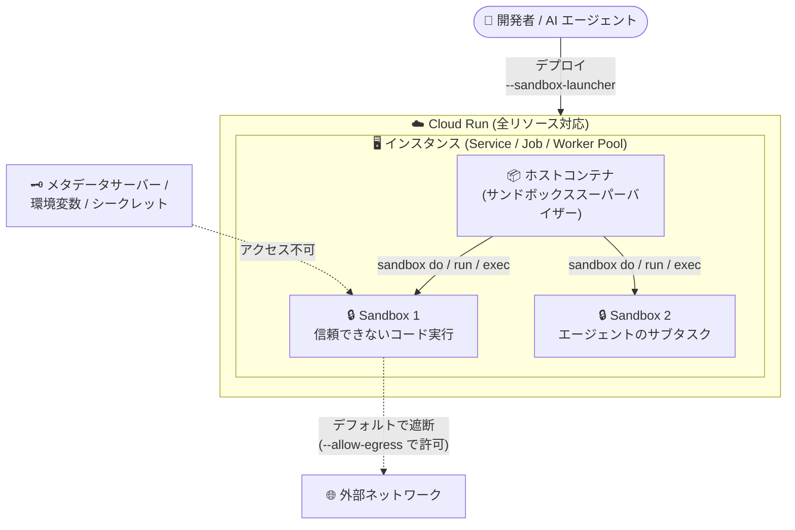

# Cloud Run: Sandboxes がジョブとワーカープールを含む全リソースに対応

**リリース日**: 2026-08-05

**サービス**: Cloud Run

**機能**: Sandboxes のジョブ・ワーカープール対応 (全リソースサポート)

**ステータス**: Preview

📊 [このアップデートのインフォグラフィックを見る](https://takech9203.github.io/google-cloud-news-summary/20260805-cloud-run-sandboxes-jobs-worker-pools.html)

## 概要

Cloud Run の Sandboxes 機能が、サービスに加えてジョブ (Jobs) とワーカープール (Worker Pools) を含むすべての Cloud Run リソースで利用可能になりました (Preview)。Cloud Run Sandboxes は、AI エージェントが生成したコードなどの信頼できないコードを、コンテナ内部の他のプロセスから隔離された高速・セキュアなサンドボックス環境で実行する機能です。

サンドボックスはホストコンテナと同一インスタンス内で動作し、割り当てられた CPU とメモリを共有するため、タスクごとに新しい Cloud Run リソースを作成する場合と比べて作成時間を大幅に短縮できます。サンドボックスはデフォルトで親ワークロード、環境変数、シークレット、Google Cloud メタデータサーバーへのアクセスを持たず、各サンドボックス同士も完全に隔離されます。

今回の拡張により、リクエスト駆動のサービスだけでなく、バッチ処理を行うジョブや、Pub/Sub からのメッセージ処理などプル型ワークロードを担うワーカープール上でも、エージェントワークフローの実行、信頼できないペイロードの処理、イベントの隔離処理が可能になりました。AI エージェントやバッチ型のコード実行基盤を構築する開発者にとって、アーキテクチャの選択肢が大きく広がるアップデートです。

**アップデート前の課題**

- Cloud Run Sandboxes (2026 年 7 月に Preview 公開) はサービスでの利用が前提であり、ジョブやワーカープールでは利用できなかった
- バッチ処理や常駐型ワーカーで信頼できないコードを隔離実行するには、タスクごとに別の Cloud Run リソースを作成するなどの回避策が必要で、作成時間 (レイテンシ) が課題だった
- ワーカープールで動作する AI エージェントワークフローから、安全なコード実行環境を直接利用する手段がなかった

**アップデート後の改善**

- サービス・ジョブ・ワーカープールのすべての Cloud Run リソースで `--sandbox-launcher` フラグ (または YAML の `sandboxLauncher: true`) によりサンドボックスを有効化できるようになった
- ジョブによるバッチ型のコード実行や、ワーカープール上のエージェントワークフローでも、既存インスタンス内でほぼ瞬時にサンドボックスを起動し、信頼できないコードを隔離実行できるようになった
- Google Cloud コンソールおよび gcloud CLI からジョブ・ワーカープールのサンドボックス設定 (Sandbox launcher) を確認できるようになった

## アーキテクチャ図



サンドボックスはホストコンテナと同一インスタンス内で起動し、CPU・メモリを共有しながらプロセス実行を完全に隔離します。今回の対応により、この構成をサービスだけでなくジョブとワーカープールでも利用できるようになりました。

## サービスアップデートの詳細

### 主要機能

1. **全 Cloud Run リソースタイプでのサンドボックス対応**
   - サービス、ジョブ、ワーカープールのいずれでも `--sandbox-launcher` フラグでサンドボックスを有効化可能
   - ジョブは `gcloud beta run jobs create/update`、ワーカープールは `gcloud beta run worker-pools deploy/update` で設定
   - YAML の場合はコンテナ設定に `sandboxLauncher: true` を追加 (`run.googleapis.com/launch-stage: BETA` アノテーションが必要)

2. **高速なサンドボックス作成**
   - サンドボックスは対話的に動作し、ほぼ瞬時にコマンド実行が可能
   - エージェントが動作する既存の Cloud Run リソース内でサンドボックスを作成するため、タスクごとに新しい Cloud Run リソースを作成する方式に比べて作成時間を削減

3. **強力な分離とアクセス制御**
   - デフォルトで親ワークロード、環境変数、シークレット、Google Cloud メタデータサーバーへのアクセスを遮断
   - すべてのサンドボックスは相互に完全隔離
   - サンドボックス内のプロセスは sudo 権限を持つ非 root ユーザーとして実行され、`apt`、`pip`、`npm` などのパッケージマネージャーで実行中にツールをインストール可能

4. **sandbox CLI によるライフサイクル管理**
   - `sandbox do`: エフェメラルなサンドボックスの作成・コマンド実行・削除を一括実行
   - `sandbox run --detach`: バックグラウンドで長時間実行プロセス (ヘッドレスブラウザや常駐エージェントループなど) を実行
   - `sandbox exec`: 実行中のサンドボックスに対して追加コマンドを実行
   - `sandbox tar`: 実行中のサンドボックスのファイルシステム状態を tar アーカイブにスナップショット

5. **データ永続化オプション**
   - `--export-tar` / `--import-tar` / `--sync-tar` による tar アーカイブ経由のワークスペース状態の保存・復元
   - `--mount type=bind,source=...,destination=...` によるホストコンテナとのバインドマウント (readonly 指定も可能)

## 技術仕様

### サンドボックスの動作仕様

| 項目 | 詳細 |
|------|------|
| 対応リソース | Cloud Run サービス、ジョブ、ワーカープール |
| 有効化方法 | `--sandbox-launcher` フラグ / YAML `sandboxLauncher: true` |
| 実行環境 | 第 2 世代実行環境 (ジョブ・ワーカープールは常に第 2 世代で動作) |
| リソース割り当て | ホストコンテナの CPU・メモリを共有 |
| ファイルシステム | ホストのルートファイルシステムに読み取り専用アクセス (`--write` で tmpfs オーバーレイへの書き込み可) |
| ネットワーク | アウトバウンド通信はデフォルトで遮断 (`--allow-egress` で許可) |
| 環境変数 | ホストから継承しない (`--env` で明示的に指定) |
| 実行ユーザー | sudo 権限を持つ非 root ユーザー |
| ライフサイクル | エフェメラル (終了時に削除、tar エクスポートやバインドマウントで永続化可能) |

### ジョブでの YAML 設定例

```yaml
apiVersion: run.googleapis.com/v1
kind: Job
metadata:
  name: JOB
  annotations:
    run.googleapis.com/launch-stage: BETA
spec:
  template:
    spec:
      template:
        spec:
          containers:
          - name: CONTAINER
            image: IMAGE_URL
            sandboxLauncher: true
```

## 設定方法

### 前提条件

1. gcloud CLI のインストールと初期化
2. Cloud Run のジョブまたはワーカープール (もしくは第 2 世代実行環境のサービス) のデプロイ
3. IAM ロール: Cloud Run デベロッパー (`roles/run.developer`) とサービスアカウントユーザー (`roles/iam.serviceAccountUser`)

### 手順

#### ステップ 1: ジョブまたはワーカープールでサンドボックスを有効化

```bash
# ジョブの場合
gcloud beta run jobs create JOB --image IMAGE_URL --sandbox-launcher

# 既存ジョブの更新
gcloud beta run jobs update JOB --sandbox-launcher

# ワーカープールの場合
gcloud beta run worker-pools deploy WORKER_POOL --image IMAGE_URL --sandbox-launcher

# 既存ワーカープールの更新
gcloud beta run worker-pools update WORKER_POOL --sandbox-launcher
```

`--sandbox-launcher` フラグにより、コンテナがサンドボックススーパーバイザーとして設定され、コンテナ内で `sandbox` コマンドラインツールが利用可能になります。

#### ステップ 2: コンテナ内からサンドボックスでコードを実行

```bash
# エフェメラルなサンドボックスでコマンドを実行 (作成 → 実行 → 削除を一括)
sandbox do -- /usr/bin/python3 -c "print(1+2)"

# 外部ネットワークアクセスを許可して実行
sandbox do --allow-egress -- /usr/bin/python3 -c 'import urllib.request; print(urllib.request.urlopen("https://google.com").getcode())'

# バックグラウンドサンドボックスの起動と追加コマンド実行
sandbox run my-web-server --detach -- /usr/bin/long_running_or_idle_program
sandbox exec my-web-server -- /usr/bin/python3 -c "print('test-complete')"
```

アプリケーションコード (Node.js / Python / Go など) からは、サブプロセスとして `sandbox` コマンドを呼び出します。

#### ステップ 3: 設定の確認

```bash
# ジョブ / ワーカープールの設定を確認 (sandboxLauncher: true があること)
gcloud run jobs describe JOB
gcloud run worker-pools describe WORKER_POOL
```

## メリット

### ビジネス面

- **AI エージェント基盤の構築を加速**: 信頼できないコードの隔離実行環境を自前で構築・運用することなく、マネージドなサンドボックスとして利用できるため、エージェント型プロダクトの開発期間を短縮できる
- **ワークロード形態に合わせた柔軟な設計**: リクエスト駆動 (サービス)、バッチ (ジョブ)、プル型常駐処理 (ワーカープール) のいずれの形態でも同じサンドボックス機構を使えるため、ユースケースに最適なリソースタイプを選択できる

### 技術面

- **低レイテンシなコード実行**: 既存インスタンス内でサンドボックスを起動するため、タスクごとに新規リソースを作成する方式と比べて作成時間を削減でき、エージェントの応答性を維持できる
- **セキュアバイデフォルト**: 環境変数・シークレット・メタデータサーバーへのアクセス遮断、アウトバウンド通信のデフォルト遮断、読み取り専用ファイルシステムなど、明示的に許可しない限り隔離が維持される設計
- **柔軟な状態管理**: tar アーカイブによるワークスペースのエクスポート/インポート/同期、バインドマウント、スナップショットにより、エフェメラルな実行と状態の永続化を両立できる

## デメリット・制約事項

### 制限事項

- Preview 段階の機能であり、Pre-GA Offerings Terms が適用される (サポートが限定される可能性がある)
- サンドボックスはホストコンテナに割り当てられた CPU・メモリを共有するため、メインアプリケーションと同時実行するサンドボックスの両方を賄えるリソース上限の設定が必要
- サンドボックスからのアウトバウンド通信はデフォルトで遮断され、外部アクセスには `--allow-egress` の明示的な指定が必要
- サンドボックスはホストの環境変数を継承しないため、必要な変数は `--env` で明示的に渡す必要がある (シークレットを `--env` で渡すことはサンドボックスプロセスから見える可能性があるため非推奨)

### 考慮すべき点

- サンドボックス内で実行するコマンドやツール (`python3` など) はコンテナイメージにインストールされている必要がある。絶対パス以外でコマンドを実行する場合は `--env` で `PATH` の設定が必要
- サンドボックスはエフェメラルであり、tar エクスポートやバインドマウントを設定しない限り、終了時にオーバーレイファイルは完全に削除される
- gcloud での有効化には `beta` コンポーネント (`gcloud beta run ...`) を使用する

## ユースケース

### ユースケース 1: ジョブによる AI 生成コードのバッチ検証

**シナリオ**: LLM が生成した多数のコードスニペットを、夜間バッチで一括実行・検証したい。生成コードは信頼できないため、実行環境の隔離が必須。

**実装例**:
```bash
# サンドボックスを有効化したジョブを作成
gcloud beta run jobs create code-eval-job \
  --image us-docker.pkg.dev/PROJECT/repo/evaluator:latest \
  --sandbox-launcher

# ジョブのコンテナ内で、スニペットごとにサンドボックス実行
sandbox do -- /usr/bin/python3 /tmp/snippets/candidate_001.py
```

**効果**: 生成コードがホストコンテナのシークレットやメタデータサーバーにアクセスすることを防ぎつつ、ジョブのタスク並列性を活かした大規模なコード評価が可能になる。

### ユースケース 2: ワーカープール上の常駐 AI エージェント

**シナリオ**: Pub/Sub からタスクを受信して処理する常駐型 AI エージェントをワーカープールで運用しており、エージェントがサブエージェントの実行や計算タスク、ブラウザ操作を安全に行いたい。

**効果**: エージェント本体と同一インスタンス内でサンドボックスをほぼ瞬時に起動できるため、タスクごとに別リソースを作成する場合と比べて応答性を維持しながら、ホストシステムをリスクにさらさずにサブタスクを実行できる。

## 料金

サンドボックス機能固有の料金情報は公式ドキュメントで確認できませんでした。サンドボックスはホストコンテナに割り当てられた CPU・メモリを共有して動作します。Cloud Run の料金体系の詳細は料金ページを参照してください。

- [Cloud Run 料金ページ](https://cloud.google.com/run/pricing)

## 利用可能リージョン

リージョンごとの提供状況は公式ドキュメントで確認できませんでした。最新情報は Cloud Run のドキュメントを参照してください。

## 関連サービス・機能

- **Cloud Run ワーカープール**: 2026 年 4 月に GA となったプル型ワークロード向けリソース。今回のアップデートでサンドボックスの実行基盤として利用可能になった
- **Cloud Run ジョブ**: バッチ処理向けリソース。常に第 2 世代実行環境で動作し、今回サンドボックスに対応した
- **Cloud Run 実行環境 (第 2 世代)**: microVM ベースで完全な Linux 互換性を提供する実行環境。サービスでサンドボックスを有効化すると第 2 世代環境でデプロイされる
- **Cloud Storage**: 永続ディレクトリやスナップショットの保存先として、ワークスペースデータをバケットにマッピング可能

## 参考リンク

- 📊 [インフォグラフィック](https://takech9203.github.io/google-cloud-news-summary/20260805-cloud-run-sandboxes-jobs-worker-pools.html)
- [公式リリースノート](https://docs.cloud.google.com/release-notes#August_05_2026)
- [Code execution in Cloud Run (ドキュメント)](https://docs.cloud.google.com/run/docs/code-execution)
- [Configure sandboxes for jobs (ドキュメント)](https://docs.cloud.google.com/run/docs/configuring/jobs/sandboxes)
- [Configure sandboxes for worker pools (ドキュメント)](https://docs.cloud.google.com/run/docs/configuring/workerpools/sandboxes)
- [Configure sandboxes for services (ドキュメント)](https://docs.cloud.google.com/run/docs/configuring/services/sandboxes)
- [Sandbox CLI リファレンス](https://docs.cloud.google.com/run/docs/reference/sandbox-cli)
- [料金ページ](https://cloud.google.com/run/pricing)

## まとめ

Cloud Run Sandboxes がサービスに加えてジョブとワーカープールでも利用可能になり、AI エージェントによるコード実行をあらゆるワークロード形態で安全に行える基盤が整いました。バッチ型のコード評価や常駐型エージェントを運用している場合は、`gcloud beta run jobs update JOB --sandbox-launcher` などで既存リソースにサンドボックスを有効化し、Preview 段階での検証を始めることを推奨します。

---

**タグ**: Cloud Run, Sandboxes, Jobs, Worker Pools, AI エージェント, コード実行, セキュリティ, Preview
