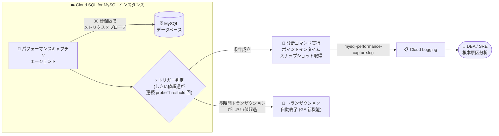

# Cloud SQL for MySQL: パフォーマンスキャプチャが一般提供 (GA) 開始

**リリース日**: 2026-08-05

**サービス**: Cloud SQL for MySQL

**機能**: パフォーマンスキャプチャ (Performance Capture)

**ステータス**: GA (一般提供)

📊 [このアップデートのインフォグラフィックを見る](https://takech9203.github.io/google-cloud-news-summary/20260805-cloud-sql-mysql-performance-capture-ga.html)

## 概要

Cloud SQL for MySQL のパフォーマンスキャプチャが一般提供 (GA) になりました。パフォーマンスキャプチャは、データベースとオペレーティングシステムのメトリクスをポイントインタイムのスナップショットとして自動的に取得し、Cloud Logging にルーティングして根本原因分析 (RCA) に活用できる機能です。標準メトリクスだけでは特定が難しい、一時的 (transient) なデータベースの遅延やストールの原因を、問題発生時点の詳細な状態情報から診断できます。

GA リリースでは、カスタムしきい値を設定して、データベースを遅延させる前に長時間実行トランザクションを自動的に終了させる機能が追加されました。さらに、6 種類のパフォーマンスキャプチャトリガー (High CPU utilization、High memory usage、High temporary files usage、History list length、Semaphore waits、Transaction lock waits) が新たに追加され、InnoDB 内部の競合やリソース枯渇など、より幅広い性能問題を検知できるようになりました。

データベース管理者や SRE にとって、「問題が起きた瞬間の状態」を自動で保全できるため、再現が難しい一過性の性能劣化のトラブルシューティングが大幅に効率化されます。

**アップデート前の課題**

- 一時的な性能劣化が発生しても、発生時点のデータベース内部状態 (実行中スレッド、トランザクション、セマフォ待ちなど) を手動で採取する必要があり、再現が難しい問題は原因特定が困難だった
- 長時間実行トランザクションを検知しても、終了 (kill) は手動で行う必要があり、対応が遅れるとインスタンス全体の性能劣化につながっていた
- GA 以前のトリガーでは、CPU・メモリ使用率や InnoDB 内部の競合 (セマフォ待ち、ロック待ち、History List Length) を条件としたキャプチャができなかった

**アップデート後の改善**

- 問題検知時にデータベースと OS のメトリクスのスナップショットを自動取得し、Cloud Logging に送信して根本原因分析に利用できる
- カスタムしきい値 (`transaction-kill-threshold-seconds`) を設定することで、長時間実行トランザクションをデータベースが遅延する前に自動終了できる (対象トランザクション種別の指定や、特定ユーザー/ホストの除外リストにも対応)
- 6 種類のトリガー (High CPU utilization、High memory usage、High temporary files usage、History list length、Semaphore waits、Transaction lock waits) が追加され、検知できる問題の範囲が拡大した

## アーキテクチャ図



エージェントがインスタンスのメトリクスを定期的にプローブし、トリガー条件が連続して成立するとスナップショットを取得して Cloud Logging の `mysql-performance-capture.log` ログストリームに送信します。GA では、しきい値を超えた長時間実行トランザクションの自動終了も可能になりました。

## サービスアップデートの詳細

### 主要機能

1. **ポイントインタイムのパフォーマンススナップショット**
   - 問題検知時にデータベースへ接続し、一連の診断コマンドを実行して詳細なスナップショットを取得
   - 取得した情報はログエントリとして整形され、プロジェクトの Cloud Logging に `mysql-performance-capture.log` というログストリーム名で直接送信される
   - エージェントは `probingIntervalSeconds` (デフォルト 30 秒) 間隔でメトリクスをプローブし、しきい値超過が `probeThreshold` (デフォルト 3 回) 連続で確認された場合のみキャプチャを実行 (一時的なスパイクによる誤検知を防止)

2. **長時間実行トランザクションの自動終了 (GA 新機能)**
   - `transaction-kill-threshold-seconds` で指定した時間を超えるトランザクションを自動終了
   - 終了対象は `transaction-kill-type` で指定可能: `READ_ONLY_TRANSACTIONS` (デフォルト、読み取り専用/SELECT のみ) または `ALL_TRANSACTIONS` (INSERT/UPDATE/DELETE や DDL を含むすべて)
   - `transaction-kill-excluded-user-hosts` で特定のユーザー/ホスト (例: `report_user@%`) を除外可能 (ワイルドカード `%` と `_` に対応)
   - しきい値は `transaction-duration-threshold` トリガーの値より小さく設定することはできない

3. **6 種類のトリガー追加 (GA 新機能)**
   - High CPU utilization、High memory usage、High temporary files usage、History list length、Semaphore waits、Transaction lock waits の 6 つが追加
   - InnoDB ストレージエンジン内部の競合 (Adaptive Hash Index、バッファプール競合など) やリソース枯渇の予兆検知に対応

4. **クールダウンとアダプティブバックオフ**
   - キャプチャ成功後は 30 分間の標準クールダウンが適用され、過剰なロギングとシステムオーバーヘッドを防止
   - 同一の違反で繰り返しキャプチャがトリガーされる場合は、クールダウンが 24 時間に延長され、1 日 1 回のキャプチャに制限されるスリープモードに移行 (しきい値の設定ミスによるログ量・コストの増大を抑制)

## 技術仕様

### パフォーマンスキャプチャトリガー一覧

| トリガー | API 名 | デフォルト値 | 設定範囲 |
|------|------|------|------|
| Running threads | `runningThreadsThreshold` | `MIN(600, vCPU 数 × 20)` | 10 以上 |
| Seconds behind source (レプリカのみ) | `secondsBehindSourceThreshold` | 900 秒 | 1 以上 |
| Long-running transactions | `transactionDurationThreshold` | 3600 秒 | 60 以上 |
| High CPU utilization (GA 追加) | `cpuUtilizationThresholdPercent` | 0 (無効) | 0、または 10〜99 (%) |
| High memory usage (GA 追加) | `memoryUsageThresholdPercent` | 0 (無効) | 0、または 10〜99 (%) |
| High temp files usage (GA 追加) | 設定不可 (MySQL 8.0 以降で自動有効) | 有効 (100 GB から 1.6 TB まで段階的にエスカレーション) | n/a |
| History list length (GA 追加) | `historyListLengthThresholdCount` | 0 (無効) | 0、または 10000〜10000000 |
| Semaphore waits (GA 追加) | `semaphoreWaitThresholdCount` | 0 (無効) | 0、または 10〜10000 |
| Transaction lock waits (GA 追加) | `transactionLockWaitThresholdCount` | 0 (無効) | 0、または 10〜10000 |
| Replica SQL/IO thread error | 設定不可 (レプリカで自動有効、無効化不可) | 有効 | n/a |

- Semaphore waits は、設定値にかかわらず単一セマフォの最大待ち時間が 200 秒を超えた場合にもキャプチャがトリガーされる
- 複数のトリガー条件を設定した場合、いずれかの条件を満たすとキャプチャが開始される

### 動作の仕組み

| 項目 | 詳細 |
|------|------|
| 監視方式 | エージェントベースのサービスとしてインスタンスを監視 |
| プローブ間隔 | `probingIntervalSeconds` (デフォルト 30 秒) |
| 発火条件 | 連続 `probeThreshold` 回 (デフォルト 3 回) のしきい値超過 |
| ログ出力先 | Cloud Logging のログストリーム `mysql-performance-capture.log` |
| 標準クールダウン | キャプチャ成功後 30 分 |
| アダプティブクールダウン | 同一違反の反復時は 24 時間に延長、1 日 1 キャプチャに制限 |
| 長時間トランザクションのログ | クールダウン期間ごとに最大 10 件、`INFORMATION_SCHEMA.INNODB_TRX` からクエリ全文 (最大 1024 バイト) を含む |

## 設定方法

### 前提条件

1. Query Insights を有効化していること (Query Insights を無効化するとパフォーマンスキャプチャも無効になる)
2. Cloud SQL for MySQL 5.7 以降であること

### 手順

#### ステップ 1: パフォーマンスキャプチャの有効化とトリガー設定

```bash
gcloud sql instances patch INSTANCE_NAME \
  --performance-capture-config="enabled=true,probe-threshold=5,cpu-utilization-threshold-percent=80"
```

`--performance-capture-config` フラグでは、`enabled`、`probing-interval-seconds`、`probe-threshold`、`running-threads-threshold`、`seconds-behind-source-threshold`、`transaction-duration-threshold`、`cpu-utilization-threshold-percent`、`memory-usage-threshold-percent`、`transaction-lock-wait-threshold-count`、`semaphore-wait-threshold-count`、`history-list-length-threshold-count` などのキーを key=value 形式 (カンマ区切り) で指定します。

#### ステップ 2: 長時間実行トランザクションの自動終了を設定 (任意)

```bash
gcloud sql instances patch example-instance \
  --performance-capture-config="transaction-kill-threshold-seconds=600,transaction-kill-type=ALL_TRANSACTIONS,transaction-kill-excluded-user-hosts=report_user@%;backup_user@localhost"
```

この例では、600 秒を超えるすべてのトランザクション (書き込み含む) を自動終了し、`report_user@%` と `backup_user@localhost` を除外します。Cloud SQL Admin API (REST v1 / v1beta4) の `performanceCaptureConfig` フィールドでも同様の設定が可能です。

```json
{
  "performanceCaptureConfig": {
    "transactionKillThresholdSeconds": 600,
    "transactionKillType": "ALL_TRANSACTIONS",
    "transactionKillExcludedUserHosts": ["report_user@%", "backup_user@localhost"]
  }
}
```

## メリット

### ビジネス面

- **ダウンタイムリスクの低減**: 長時間実行トランザクションの自動終了により、インスタンス全体を不安定化させる暴走クエリを未然に防止できる
- **運用コストの削減**: 一過性の性能問題を再現・調査する工数を削減し、問題発生時点の証跡が自動保全されるため MTTR (平均復旧時間) を短縮できる
- **追加費用なし**: パフォーマンスキャプチャ自体はすべての Cloud SQL リージョンで追加費用なしで利用できる

### 技術面

- **根本原因分析の高度化**: 標準メトリクスでは捉えられない InnoDB 内部の競合 (セマフォ待ち、ロック待ち、History List Length) を条件に、問題発生時点のスナップショットを取得できる
- **誤検知の抑制**: 連続プローブによる判定 (デフォルト 3 回) とクールダウン/アダプティブバックオフにより、一時的なスパイクによる過剰なキャプチャとログ量増大を防止
- **Cloud Logging との統合**: キャプチャ結果が `mysql-performance-capture.log` に集約されるため、既存のログ分析基盤やアラートと組み合わせやすい

## デメリット・制約事項

### 制限事項

- Query Insights の有効化が必須 (Query Insights を無効にするとパフォーマンスキャプチャも無効になる)
- Cloud SQL for MySQL 5.7 以降でのみ利用可能 (PostgreSQL / SQL Server は対象外)
- High temp files usage トリガーは MySQL 8.0 以降で自動有効となり、しきい値の手動設定はできない
- `transaction-kill-threshold-seconds` は `transaction-duration-threshold` より小さい値に設定できない

### 考慮すべき点

- キャプチャログは Cloud Logging に保存されるため、ログの保存量に応じて Cloud Logging のストレージ費用が発生する可能性がある
- `transaction-kill-type=ALL_TRANSACTIONS` を設定すると書き込みトランザクション (INSERT/UPDATE/DELETE、DDL) も強制終了されるため、バッチ処理やバックアップ用ユーザーは除外リストに登録するなど慎重な設計が必要
- しきい値はワークロード依存 (特に History list length) のため、低すぎる値は頻繁なキャプチャとアダプティブクールダウン (1 日 1 回制限) を招く。高めの値から調整することが推奨される

## ユースケース

### ユースケース 1: 再現困難な一時的スローダウンの根本原因分析

**シナリオ**: 特定の時間帯にのみデータベースが数分間ストールするが、調査時には正常に戻っており原因が特定できない。

**実装例**:
```bash
gcloud sql instances patch prod-mysql \
  --performance-capture-config="enabled=true,semaphore-wait-threshold-count=50,transaction-lock-wait-threshold-count=100"
```

**効果**: セマフォ待ちやロック待ちが増加した瞬間のスナップショットが Cloud Logging に自動保存され、InnoDB 内部競合 (AHI、バッファプール) やアプリケーションレベルのロック競合を事後に分析できる。

### ユースケース 2: 暴走クエリによる性能劣化の自動防止

**シナリオ**: アドホックな分析クエリが長時間ロックを保持し、InnoDB のパージ処理が滞って本番ワークロード全体が遅延する。

**実装例**:
```bash
gcloud sql instances patch prod-mysql \
  --performance-capture-config="transaction-kill-threshold-seconds=900,transaction-kill-type=READ_ONLY_TRANSACTIONS"
```

**効果**: 900 秒を超える読み取り専用トランザクションが自動終了され、データベース全体が遅延する前に問題を解消できる。書き込みトランザクションは対象外のため、業務処理への影響を抑えられる。

### ユースケース 3: OOM 再起動の予兆検知

**シナリオ**: メモリ使用量が徐々に増加し、Out-of-Memory によるインスタンス再起動が突発的に発生する。

**効果**: `memory-usage-threshold-percent` を設定することで、メモリ使用率が高止まりした時点の状態 (スレッドごとのバッファサイズやメモリリークの兆候) をキャプチャし、クラッシュ前に原因を診断できる。

## 料金

パフォーマンスキャプチャはすべての Cloud SQL リージョンで**追加費用なし**で利用できます。基盤となるデータベースリソースには標準料金が適用されます。また、キャプチャログは Cloud Logging に保存されるため、Cloud Logging のログストレージ費用が別途発生する可能性があります。

- [Cloud Logging の料金](https://cloud.google.com/logging#pricing)

## 利用可能リージョン

すべての Cloud SQL リージョンで利用可能です。

## 関連サービス・機能

- **Cloud Logging**: キャプチャされたスナップショットの送信先。ログストリーム `mysql-performance-capture.log` に集約され、ログエクスプローラでの分析やログベースのアラートに活用できる
- **Query Insights**: パフォーマンスキャプチャの前提条件となる機能。クエリ単位の性能分析を提供し、パフォーマンスキャプチャのシステム全体スナップショットと組み合わせて多層的な診断が可能
- **Cloud Monitoring**: CPU 使用率やメモリ使用量などの標準メトリクス監視を担う。パフォーマンスキャプチャは標準メトリクスでは不足する「問題発生時点の詳細な内部状態」を補完する位置付け

## 参考リンク

- 📊 [インフォグラフィック](https://takech9203.github.io/google-cloud-news-summary/20260805-cloud-sql-mysql-performance-capture-ga.html)
- [公式リリースノート](https://docs.cloud.google.com/release-notes#August_05_2026)
- [パフォーマンスキャプチャの概要](https://docs.cloud.google.com/sql/docs/mysql/performance-capture)
- [パフォーマンスキャプチャの構成](https://docs.cloud.google.com/sql/docs/mysql/configure-performance-capture)
- [パフォーマンスキャプチャログの表示](https://docs.cloud.google.com/sql/docs/mysql/view-performance-capture-logs)
- [Cloud Logging の料金](https://cloud.google.com/logging#pricing)

## まとめ

Cloud SQL for MySQL のパフォーマンスキャプチャが GA となり、長時間実行トランザクションの自動終了と 6 種類の新トリガーにより、一過性の性能問題の診断から未然防止までを追加費用なしでカバーできるようになりました。MySQL 5.7 以降のインスタンスを運用しているチームは、Query Insights とあわせて有効化し、まずは Running threads と Long-running transactions のデフォルト設定から始めて、ワークロードに応じて CPU・メモリ・InnoDB 系トリガーのしきい値を調整することを推奨します。

---

**タグ**: Cloud SQL, MySQL, Performance Capture, GA, Cloud Logging, Query Insights, トラブルシューティング, データベース運用
