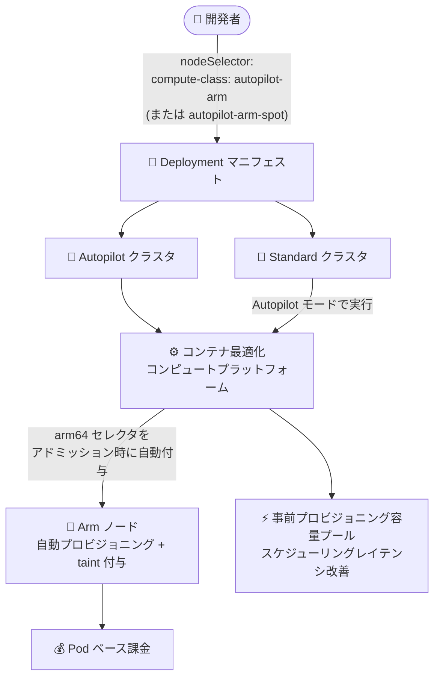

# Google Kubernetes Engine (GKE): Autopilot コンテナ最適化コンピュートプラットフォームで Arm ワークロードを実行する autopilot-arm / autopilot-arm-spot ComputeClass

**リリース日**: 2026-08-05

**サービス**: Google Kubernetes Engine (GKE)

**機能**: Autopilot コンテナ最適化コンピュートプラットフォームでの Arm ワークロード実行 (autopilot-arm / autopilot-arm-spot ComputeClass)

**ステータス**: Feature

📊 [このアップデートのインフォグラフィックを見る](https://takech9203.github.io/google-cloud-news-summary/20260805-gke-autopilot-arm-computeclasses.html)

## 概要

GKE バージョン 1.36.0-gke.3302001 以降で、汎用の組み込み ComputeClass である `autopilot-arm` および `autopilot-arm-spot` を使用して、Autopilot のコンテナ最適化コンピュートプラットフォーム (container-optimized compute platform) 上で Arm ワークロードを実行できるようになりました。これらの ComputeClass は Autopilot クラスタだけでなく Standard クラスタでも選択でき、選択したワークロードは GKE が Autopilot モードで実行します。

コンテナ最適化コンピュートプラットフォームは、実行中のノードを動的にリサイズできる Autopilot ノードを使用し、事前プロビジョニングされたコンピュート容量のプールを維持することで、Pod のスケジューリングレイテンシを改善します。特にオートスケーリング時の新規容量プロビジョニングにかかる時間が大幅に短縮されます。Web サーバーや中程度のバッチジョブなど、特定のハードウェアを必要としない汎用ワークロードに適しています。

Arm アーキテクチャの価格性能比のメリットを、機械タイプの管理を意識せずに Pod ベースの課金と伸縮性とともに享受したい Kubernetes ユーザーが対象です。

**アップデート前の課題**

- コンテナ最適化コンピュートプラットフォームの Arm サポートが登場する以前は、GKE で Arm ワークロードを実行するには C4A、N4A、T2A などの特定のマシンシリーズ (ノードベース課金) を選択する必要があった
- GKE バージョン 1.35.3-gke.1389000 以降 1.36.0-gke.3302001 未満では、汎用 Arm プラットフォームを選択するために `cloud.google.com/compute-class: autopilot-arm` と `kubernetes.io/arch: arm64` の両方のセレクタを明示的に指定する必要があった

**アップデート後の改善**

- `autopilot-arm` (または Spot VM 版の `autopilot-arm-spot`) ComputeClass をセレクタで指定するだけで、コンテナ最適化 Arm プラットフォームにスケジュールされるようになった。必要な `kubernetes.io/arch: arm64` セレクタは Pod のアドミッション時に自動付与される
- Autopilot クラスタと Standard クラスタの両方で同じ ComputeClass を選択でき、いずれの場合も GKE が Autopilot モードでワークロードを実行する
- 事前プロビジョニングされた容量プールにより、オートスケーリング時を中心に Pod のスケジューリングレイテンシが改善された
- Autopilot クラスタでは `kubernetes.io/arch: arm64` の指定のみで汎用 Arm プラットフォームが選択されるスマートデフォルトも利用できる

## アーキテクチャ図



`autopilot-arm` / `autopilot-arm-spot` ComputeClass を指定したワークロードは、Autopilot・Standard どちらのクラスタでもコンテナ最適化コンピュートプラットフォーム上の Arm ノードで Autopilot モードで実行されます。事前プロビジョニングされた容量プールにより、オートスケーリング時の Pod スケジューリングが高速化されます。

## サービスアップデートの詳細

### 主要機能

1. **autopilot-arm / autopilot-arm-spot 組み込み ComputeClass**
   - `cloud.google.com/compute-class: autopilot-arm` セレクタの指定のみで、コンテナ最適化 Arm プラットフォームにワークロードをスケジュールできる
   - `autopilot-arm-spot` は Spot VM 版で、耐障害性のあるワークロードを低コストで実行できる
   - 必要な `kubernetes.io/arch: arm64` セレクタはアドミッション時に自動付与される

2. **Autopilot / Standard 両クラスタでの利用**
   - Autopilot クラスタと Standard クラスタのどちらでも同じ ComputeClass を選択可能
   - Standard クラスタで選択した場合も、対象ワークロードは GKE が Autopilot モードで実行し、ノードは Google 管理となる

3. **Pod スケジューリングレイテンシの改善**
   - コンテナ最適化コンピュートプラットフォームは事前プロビジョニングされたコンピュート容量のプールを維持し、リソース需要の増加に応じて自動割り当てする
   - 特にオートスケーリング時に、新しいノードの起動を待たずに Pod を配置できるケースが増え、スケジューリングレイテンシが改善される

4. **Arm ノードの自動管理**
   - Arm ノードを自動プロビジョニングし、非 Arm Pod がスケジュールされないよう自動で taint を付与する
   - Arm Pod には対応する toleration が自動追加される (組み込み Arm ComputeClass の taint 動作は変更不可)

## 技術仕様

### バージョン別のセレクタ指定方法

| GKE バージョン / クラスタ | セレクタ指定 |
|------|------|
| 1.36.0-gke.3302001 以降 (Autopilot / Standard) | `cloud.google.com/compute-class: autopilot-arm` (または `autopilot-arm-spot`) のみ |
| Autopilot クラスタ (スマートデフォルト) | `kubernetes.io/arch: arm64` のみで汎用 Arm プラットフォームを選択 |
| 1.35.3-gke.1389000 以降 1.36.0-gke.3302001 未満 | `cloud.google.com/compute-class: autopilot-arm` と `kubernetes.io/arch: arm64` の両方 (新バージョンでも後方互換で利用可) |
| 特定ハードウェアが必要な場合 | `cloud.google.com/machine-family: C4A / N4A / T2A` などを指定 |

### 汎用 (General-purpose) ComputeClass のリソース仕様

| 項目 | 詳細 |
|------|------|
| デフォルトリクエスト | CPU: 0.5 vCPU、メモリ: 2 GiB |
| 最小リクエスト (バースト対応クラスタ) | CPU: 50m、メモリ: 52 MiB |
| 最小リクエスト (バースト非対応クラスタ) | CPU: 250m、メモリ: 512 MiB |
| 最大リクエスト | CPU: 30 vCPU、メモリ: 110 GiB |
| CPU:メモリ比 | 1:1 〜 1:6.5 |
| 課金モデル | Pod ベース課金 (汎用 Autopilot Pod) |

### ワークロードマニフェスト例

```yaml
apiVersion: apps/v1
kind: Deployment
metadata:
  name: nginx-arm
spec:
  replicas: 3
  selector:
    matchLabels:
      app: nginx-arm
  template:
    metadata:
      labels:
        app: nginx-arm
    spec:
      nodeSelector:
        cloud.google.com/compute-class: autopilot-arm
      containers:
      - name: nginx-arm
        image: nginx
        resources:
          requests:
            cpu: 2000m
            memory: 2Gi
```

## 設定方法

### 前提条件

1. GKE バージョン 1.36.0-gke.3302001 以降のクラスタ (ComputeClass のみの指定で選択する場合)
2. コンテナイメージが Arm (arm64) 対応であること。x86 と Arm の両方で動作するマルチアーキテクチャイメージの利用が推奨される
3. Standard クラスタで Autopilot ComputeClass を使用する場合の主な要件: taint のないノードプールが 1 つ以上存在すること、VPC ネイティブクラスタであること、Shielded GKE Nodes が有効であること (デフォルトで有効)、Kubernetes NetworkPolicy を使う場合は GKE Dataplane V2 を使用すること

### 手順

#### ステップ 1: マニフェストで ComputeClass を指定する

```yaml
spec:
  nodeSelector:
    cloud.google.com/compute-class: autopilot-arm  # Spot の場合は autopilot-arm-spot
```

`nodeSelector` または node affinity ルールで組み込み ComputeClass を指定します。`kubernetes.io/arch: arm64` はアドミッション時に自動付与されます。

#### ステップ 2: ワークロードをデプロイする

```bash
kubectl apply -f nginx-arm-deployment.yaml
```

デプロイすると、GKE が Arm ノードを自動プロビジョニングし、taint / toleration を自動設定した上で Autopilot モードで Pod を実行します。

## メリット

### ビジネス面

- **コスト効率**: Pod ベース課金のため、リクエストしたリソース分のみの支払いで済み、マシンタイプの選定・管理が不要。`autopilot-arm-spot` により耐障害性のあるワークロードをさらに低コストで実行できる
- **運用負荷の削減**: ノードのプロビジョニング、taint / toleration の設定を GKE が自動化するため、Arm ノード運用の管理コストが下がる

### 技術面

- **スケジューリングレイテンシの改善**: 事前プロビジョニングされた容量プールにより、オートスケーリング時に新ノードの起動を待たずに Pod を配置できるケースが増える
- **クラスタモードをまたぐ一貫性**: Autopilot クラスタと Standard クラスタで同じ ComputeClass セレクタを使用でき、マニフェストの可搬性が高まる
- **セレクタの簡素化**: ComputeClass の指定のみで済み、`kubernetes.io/arch: arm64` の付与漏れによるスケジューリング事故を防げる

## デメリット・制約事項

### 制限事項

- ComputeClass のみの指定で選択できるのは GKE 1.36.0-gke.3302001 以降 (それ以前の 1.35.3-gke.1389000 以降では ComputeClass と arm64 セレクタの併記が必要)
- コンテナ最適化コンピュートプラットフォームのノード動的リサイズは Arm ワークロードではサポートされない
- 組み込み Arm ComputeClass が作成するノードの Arm アーキテクチャ taint 動作は変更できない
- Standard クラスタの組み込み Autopilot ComputeClass は、クラスタ全体での Confidential GKE Nodes の有効化に対応していない (有効化すると該当 Pod は Pending のままになる)
- 事前プロビジョニングされた追加容量により IP アドレス使用量が増加する場合がある (`--autopilot-general-profile=no-performance` フラグで無効化可能だが、容量プロビジョニング性能は低下する)

### 考慮すべき点

- コンテナイメージが arm64 に対応している必要がある。CI/CD パイプラインでマルチアーキテクチャイメージをビルドしておくことが推奨される
- ワークロードマニフェストでアーキテクチャや ComputeClass を明示的に指定しない場合、選択されたコンピュートクラスのデフォルトアーキテクチャ (x86) が使用される可能性がある
- 特定のハードウェア特性が必要なワークロードには、C4A (高性能)、N4A (価格性能バランス)、T2A (水平スケールアウト向け) などのマシンシリーズ指定 (ノードベース課金) の方が適する場合がある

## ユースケース

### ユースケース 1: Web サーバーの Arm 移行によるコスト最適化

**シナリオ**: x86 で稼働している Web サーバー群を、マルチアーキテクチャイメージ化した上で価格性能比の高い Arm に移行したい。マシンタイプの管理はしたくない。

**実装例**:
```yaml
spec:
  nodeSelector:
    cloud.google.com/compute-class: autopilot-arm
```

**効果**: マシンタイプを意識せずに Pod ベース課金で Arm 上にワークロードを実行でき、トラフィック増加時も事前プロビジョニング容量により迅速にスケールする。

### ユースケース 2: バッチジョブを Spot Arm で低コスト実行

**シナリオ**: 中断に耐えられるバッチ処理や CI/CD パイプラインを、可能な限り低コストで実行したい。

**実装例**:
```yaml
spec:
  nodeSelector:
    cloud.google.com/compute-class: autopilot-arm-spot
```

**効果**: Spot VM ベースの Arm 容量を Pod ベース課金で利用でき、コンピュートコストを大幅に削減できる。

### ユースケース 3: Standard クラスタの一部ワークロードだけ Autopilot 化

**シナリオ**: 既存の Standard クラスタを維持しつつ、汎用 Arm ワークロードだけノード管理を GKE に任せたい。

**効果**: クラスタの作り直しをせずに、対象ワークロードのみ Autopilot モード (Google 管理ノード + Pod ベース課金) に移行できる。

## 料金

コンテナ最適化コンピュートプラットフォームで実行される Pod (Autopilot クラスタ / Standard クラスタとも) は、汎用 Autopilot Pod として **Pod ベース課金モデル** が適用されます。Pod がリクエストした CPU・メモリ・エフェメラルストレージに基づいて課金され、ノード単位の課金は発生しません。詳細な単価は料金ページの「General-purpose Autopilot workloads」セクションを参照してください。

- 料金ページ: https://cloud.google.com/kubernetes-engine/pricing

## 利用可能リージョン

公式ドキュメントによると、Autopilot ワークロードを Arm アーキテクチャにデプロイできるリージョンは以下のとおりです。

- us-central1、us-east1、us-west1
- europe-west1、europe-west2、europe-west4
- asia-southeast1

## 関連サービス・機能

- **GKE ComputeClass (カスタム ComputeClass)**: 特定のハードウェア要件がある場合は、`autopilot` フィールドを有効化したカスタム ComputeClass で C4A / N4A / T2A などの Arm マシンシリーズを指定できる
- **Compute Engine Arm マシンシリーズ (C4A / N4A / T2A)**: Google Axion ベースなどの Arm VM。特定のハードウェア特性が必要な場合の選択肢
- **Spot Pods / Spot VM**: `autopilot-arm-spot` は Spot 容量を利用し、耐障害性のあるワークロードのコストを削減する
- **GKE Dataplane V2**: Standard クラスタで Kubernetes NetworkPolicy と Autopilot ComputeClass を併用する場合に必要
- **Artifact Registry + Cloud Build**: Arm 対応のマルチアーキテクチャイメージのビルド・管理に使用

## 参考リンク

- 📊 [インフォグラフィック](https://takech9203.github.io/google-cloud-news-summary/20260805-gke-autopilot-arm-computeclasses.html)
- [公式リリースノート](https://docs.cloud.google.com/release-notes#August_05_2026)
- [Deploy Autopilot workloads on Arm architecture](https://docs.cloud.google.com/kubernetes-engine/docs/how-to/autopilot-arm-workloads)
- [Arm on GKE](https://docs.cloud.google.com/kubernetes-engine/docs/concepts/arm-on-gke)
- [Autopilot overview (container-optimized compute platform)](https://docs.cloud.google.com/kubernetes-engine/docs/concepts/autopilot-overview)
- [Deploy workloads in Autopilot mode in Standard clusters](https://docs.cloud.google.com/kubernetes-engine/docs/how-to/autopilot-classes-standard-clusters)
- [Resource requests in Autopilot](https://docs.cloud.google.com/kubernetes-engine/docs/concepts/autopilot-resource-requests)
- [料金ページ](https://cloud.google.com/kubernetes-engine/pricing)

## まとめ

`autopilot-arm` / `autopilot-arm-spot` ComputeClass の登場により、Arm ワークロードをマシンタイプの管理なしに Pod ベース課金で実行でき、Autopilot / Standard 両クラスタで同じセレクタが使えるようになりました。事前プロビジョニング容量によるスケジューリングレイテンシ改善も含め、汎用ワークロードの Arm 移行のハードルが大きく下がるアップデートです。まずはマルチアーキテクチャイメージを整備し、GKE 1.36.0-gke.3302001 以降のクラスタでコスト効率の検証を始めることを推奨します。

---

**タグ**: GKE, Autopilot, Arm, ComputeClass, コンテナ最適化コンピュートプラットフォーム, Spot VM, Kubernetes, コスト最適化
