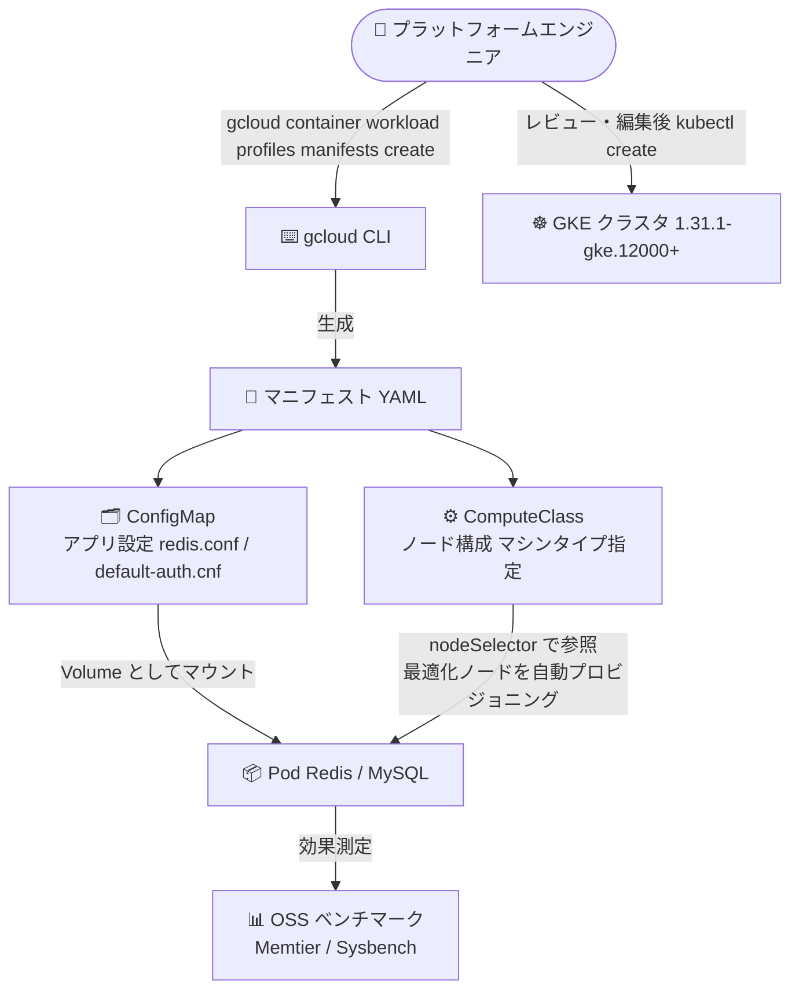

# Google Kubernetes Engine (GKE): ワークロード最適化構成の生成 (Workload Optimization)

**リリース日**: 2026-08-05

**サービス**: Google Kubernetes Engine (GKE)

**機能**: gcloud CLI によるワークロード最適化構成 (ConfigMap / ComputeClass) の生成

**ステータス**: Preview

📊 [このアップデートのインフォグラフィックを見る](https://takech9203.github.io/google-cloud-news-summary/20260805-gke-workload-optimized-configurations.html)

## 概要

GKE で、Redis や MySQL といった特定のワークロード向けにパフォーマンスを最適化した構成を gcloud CLI で生成できる機能が Preview として発表されました。`gcloud container workload profiles manifests create` コマンドが、パフォーマンス推奨事項を反映した Kubernetes マニフェストを生成します。生成されるマニフェストは、アプリケーションレベルの構成を含む **ConfigMap** と、ノードレベルの構成を定義する **ComputeClass** の 2 種類です。

この最適化は GKE バージョン 1.31.1-gke.12000 以降で利用可能で、パフォーマンス改善の効果は Sysbench や Memtier などのオープンソースベンチマークで測定できます。GKE 上で Redis や MySQL などのステートフルワークロードを運用するプラットフォームエンジニアやアプリケーション運用者にとって、チューニングの専門知識がなくても Google の推奨構成を出発点として利用できる点が価値です。

**アップデート前の課題**

- Redis や MySQL のパフォーマンスチューニング (例: `redis.conf` の `io-threads` 設定や MySQL の `max_connections` など) は、利用者が各ソフトウェアのドキュメントを調査して手動で設計する必要があった
- ワークロードに適したマシンタイプやノード構成の選定を、利用者自身がベンチマークを繰り返して判断する必要があった
- アプリケーション設定 (ConfigMap) とノード設定 (ComputeClass) を個別に整合させる作業が煩雑だった

**アップデート後の改善**

- gcloud CLI のコマンド 1 つで、ワークロードプロファイル (例: `redis-7-caching`、`mysql-8-oltp`) に基づく推奨構成のマニフェストを生成できるようになった
- アプリケーションレベル (ConfigMap) とノードレベル (ComputeClass) の最適化が一括で YAML として出力され、レビュー・編集してからクラスタに適用できる
- オープンソースベンチマーク (Redis: Memtier 2.2.1、MySQL: Sysbench 1.1.0) により、改善効果を客観的に測定できる

## アーキテクチャ図



gcloud CLI がワークロードプロファイルに基づき ConfigMap (アプリケーション設定) と ComputeClass (ノード構成) を生成し、Pod は Volume マウントと nodeSelector でそれらを参照して最適化された構成で稼働します。

## サービスアップデートの詳細

### 主要機能

1. **ワークロードプロファイルに基づくマニフェスト生成**
   - `gcloud container workload profiles manifests create` コマンドで、対象ワークロード (`--workload=redis-7-caching` や `--workload=mysql-8-oltp`)、クラスタバージョン、マシンタイプを指定して推奨マニフェストを生成
   - `--output-path` を指定すると YAML ファイルとして保存、省略時はターミナルに出力

2. **アプリケーションレベルの最適化 (ConfigMap)**
   - アプリケーションが理解できる設定ファイルを ConfigMap として生成 (Redis の場合は `redis.conf`、MySQL の場合は `default-auth.cnf`)
   - Pod に Volume としてマウントし、アプリケーション起動時に参照させる

3. **ノードレベルの最適化 (ComputeClass)**
   - ワークロードに適したノードのプロビジョニングを GKE に指示する ComputeClass を生成 (例: `machineType: c4-standard-4`、`nodePoolAutoCreation: enabled: true`)
   - Pod の `nodeSelector` フィールド (`cloud.google.com/compute-class`) で参照

4. **ベンチマークによる効果測定**
   - Redis の最適化は「読み書き比 4:1 のシングルノード look-aside キャッシュ」を Memtier 2.2.1 で測定して決定
   - MySQL の最適化は「SSL 有効のシングルノード Read/Write OLTP (MySQL 8)」を Sysbench 1.1.0 で測定して決定

## 技術仕様

### 対応ワークロードと前提条件

| 項目 | 詳細 |
|------|------|
| 対応ワークロード | Redis 7 (キャッシュ用途)、MySQL 8 (OLTP 用途) |
| ワークロードプロファイル | `redis-7-caching`、`mysql-8-oltp` |
| 必要な GKE バージョン | 1.31.1-gke.12000 以降 (推奨) |
| 生成されるリソース | ConfigMap (アプリ設定) + ComputeClass (ノード構成) |
| ステータス | Preview (Pre-GA Offerings Terms が適用) |
| 効果測定 | Redis: Memtier 2.2.1 / MySQL: Sysbench 1.1.0 |

### 生成されるマニフェストの例 (Redis)

```yaml
apiVersion: v1
kind: ConfigMap
metadata:
  name: redis.conf
data:
  redis.conf: |
    io-threads 2
    io-threads-do-reads yes
    save ""
---
apiVersion: cloud.google.com/v1
kind: ComputeClass
metadata:
  generateName: optimized-gke-redis-7-caching-
spec:
  nodePoolAutoCreation:
    enabled: true
  priorities:
  - machineType: c4-standard-4
  whenUnsatisfiable: DoNotScaleUp
```

## 設定方法

### 前提条件

1. GKE バージョン 1.31.1-gke.12000 以降のクラスタ (推奨)
2. gcloud CLI が利用可能であること
3. ワークロード用に専用ノードプールの利用が推奨される (デフォルトでは手順の完了時に新しいノードプールが作成される)

### 手順

#### ステップ 1: 最適化マニフェストの生成

```bash
gcloud container workload profiles manifests create \
  --workload=redis-7-caching \
  --cluster-version=CLUSTER_VERSION \
  --options=machineType=MACHINE_TYPE \
  --output-path=/tmp/manifests.yaml
```

MySQL の場合は `--workload=mysql-8-oltp` を指定します。生成された推奨構成をレビューし、自身のユースケースに合わせて必要に応じて編集します。

#### ステップ 2: マニフェストの適用

```bash
kubectl create -f /tmp/manifests.yaml
```

ConfigMap と ComputeClass がクラスタに作成されます。

#### ステップ 3: 最適化を参照する Pod のデプロイ

```yaml
apiVersion: v1
kind: Pod
metadata:
  name: redis
spec:
  containers:
  - name: redis
    image: redis:7
    args:
    - /etc/gke/optimization/redis.conf
    volumeMounts:
    - name: gke-optimized-workload-config
      subPath: redis.conf
      mountPath: /etc/gke/optimization/redis.conf
      readOnly: true
  volumes:
  - name: gke-optimized-workload-config
    configMap:
      name: redis.conf
  nodeSelector:
    cloud.google.com/compute-class: optimized-gke-redis-7-caching-abc123
```

`nodeSelector` の ComputeClass 名は生成されたものに合わせて修正します。

#### ステップ 4: 最適化構成の適用確認

```bash
# Redis の場合
kubectl exec redis -- redis-cli INFO server | grep config_file

# MySQL の場合
kubectl exec mysql -- mysql -e "SELECT DISTINCT VARIABLE_PATH FROM performance_schema.variables_info WHERE VARIABLE_PATH != '';"
```

## メリット

### ビジネス面

- **チューニング工数の削減**: Google の推奨構成を出発点にできるため、Redis / MySQL のパフォーマンスチューニングにかかる調査・検証工数を削減できる
- **性能改善の定量評価**: オープンソースベンチマークで改善効果を測定できるため、導入判断を客観的なデータに基づいて行える

### 技術面

- **アプリとインフラの一貫した最適化**: アプリケーション設定 (ConfigMap) とノード構成 (ComputeClass) が整合した形で一括生成される
- **宣言的な運用**: 生成物は標準的な Kubernetes マニフェストであり、レビュー・編集・バージョン管理など既存の GitOps ワークフローに組み込みやすい
- **ノードの自動プロビジョニング**: ComputeClass の `nodePoolAutoCreation` により、最適化されたノードプールを GKE が自動作成する

## デメリット・制約事項

### 制限事項

- Preview 段階の機能であり、Pre-GA Offerings Terms が適用される (サポートが限定される可能性がある)
- 現時点の対応ワークロードは Redis 7 (キャッシュ用途) と MySQL 8 (OLTP 用途) に限られる
- GKE バージョン 1.31.1-gke.12000 以降が推奨される

### 考慮すべき点

- 推奨構成は特定のユースケース (Redis: 読み書き比 4:1 の look-aside キャッシュ、MySQL: シングルノード Read/Write OLTP) を前提に決定されているため、自身のユースケースが異なる場合はマニフェストの調整が必要
- 適用前に推奨内容を Redis / MySQL の公式ドキュメントと照らし合わせてレビューすることが推奨される
- ワークロード用に専用ノードプールの利用が推奨される

## ユースケース

### ユースケース 1: GKE 上の Redis キャッシュのスループット改善

**シナリオ**: GKE 上で look-aside キャッシュとして Redis を運用しているが、`io-threads` などのチューニングやマシンタイプ選定のノウハウが社内にない。

**実装例**:
```bash
gcloud container workload profiles manifests create \
  --workload=redis-7-caching \
  --cluster-version=1.31.1-gke.12000 \
  --options=machineType=c4-standard-4 \
  --output-path=/tmp/redis-manifests.yaml
kubectl create -f /tmp/redis-manifests.yaml
```

**効果**: 推奨構成 (I/O スレッド設定など) と最適なノード構成が自動生成され、Memtier ベンチマークで改善効果を定量的に確認できる。

### ユースケース 2: セルフマネージド MySQL (OLTP) の性能最適化

**シナリオ**: GKE 上でシングルノードの MySQL 8 を OLTP データベースとして運用しており、`max_connections` などのサーバー設定とノードスペックの最適化を行いたい。

**効果**: `mysql-8-oltp` プロファイルにより、MySQL 設定 (`default-auth.cnf`) と専用ノードプール構成が生成され、Sysbench で性能改善を検証しながら安全に適用できる。

## 関連サービス・機能

- **GKE カスタム ComputeClass**: 本機能が生成するノードレベル最適化の基盤。ノード属性と自動スケーリングの優先順位を宣言的に定義でき、フォールバック優先度や自動ノードプール作成をサポート (GKE 1.30.3-gke.1451000 以降)
- **GKE クラスタオートスケーラー / ノード自動プロビジョニング**: ComputeClass の定義に基づき、ワークロードに最適化されたノードを自動作成する
- **Memorystore (Redis / Valkey)**: セルフマネージド Redis の代替となるフルマネージドサービス。マネージド運用を選ぶか、本機能で最適化したセルフマネージド構成を選ぶかの比較対象となる
- **Cloud SQL for MySQL**: セルフマネージド MySQL の代替となるフルマネージドサービス

## 参考リンク

- 📊 [インフォグラフィック](https://takech9203.github.io/google-cloud-news-summary/20260805-gke-workload-optimized-configurations.html)
- [公式リリースノート](https://docs.cloud.google.com/release-notes#August_05_2026)
- [ドキュメント: About workload optimization](https://docs.cloud.google.com/kubernetes-engine/docs/concepts/workload-optimization)
- [ドキュメント: Optimize MySQL workload performance on GKE](https://docs.cloud.google.com/kubernetes-engine/docs/how-to/optimize-mysql)
- [ドキュメント: Optimize Redis workload performance on GKE](https://docs.cloud.google.com/kubernetes-engine/docs/how-to/optimize-redis)
- [ドキュメント: About custom ComputeClasses](https://docs.cloud.google.com/kubernetes-engine/docs/concepts/about-custom-compute-classes)
- [gcloud リファレンス: gcloud container workload profiles manifests create](https://docs.cloud.google.com/sdk/gcloud/reference/container/workload/profiles/manifests/create)

## まとめ

GKE 上の Redis / MySQL ワークロードに対して、Google の知見に基づくパフォーマンス最適化構成を gcloud CLI で簡単に生成できるようになりました。生成されるのは標準的な ConfigMap と ComputeClass のマニフェストであり、レビュー・編集を経て既存の運用フローに自然に組み込めます。GKE 1.31.1-gke.12000 以降でセルフマネージドの Redis / MySQL を運用しているチームは、Preview 段階のうちにベンチマークで効果を検証してみることをおすすめします。

---

**タグ**: #GKE #Kubernetes #Redis #MySQL #ComputeClass #パフォーマンス最適化 #Preview
