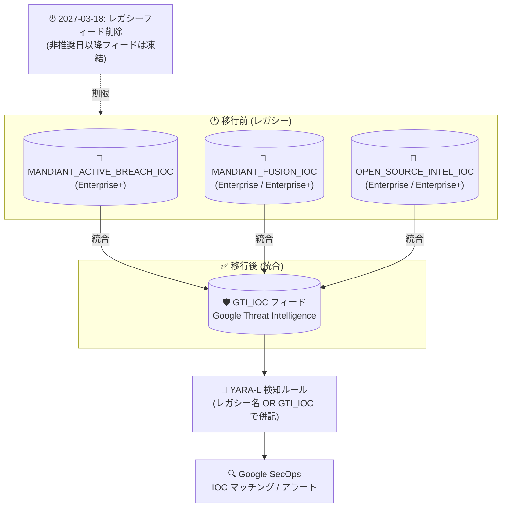

# Google SecOps: Mandiant レガシー IOC フィードの非推奨化 (GTI_IOC フィードへ統合)

**リリース日**: 2026-08-05

**サービス**: Google SecOps

**機能**: MANDIANT_ACTIVE_BREACH_IOC / MANDIANT_FUSION_IOC / OPEN_SOURCE_INTEL_IOC フィードの非推奨化

**ステータス**: Deprecated (非推奨)

📊 [このアップデートのインフォグラフィックを見る](https://takech9203.github.io/google-cloud-news-summary/20260805-google-secops-mandiant-feeds-deprecated.html)

## 概要

Google SecOps において、脅威インテリジェンスフィードの `MANDIANT_ACTIVE_BREACH_IOC`、`MANDIANT_FUSION_IOC`、`OPEN_SOURCE_INTEL_IOC` の 3 つが非推奨 (Deprecated) となり、統合された `GTI_IOC` フィードへの移行が推奨されることが発表されました。2027 年 3 月 18 日以降、これら 3 つのレガシーフィードは製品から削除されます。

この統合は、Google SecOps が脅威インテリジェンスのデータソースを Google Threat Intelligence (GTI) に一本化する取り組みの一環です。GTI フィードはより広範な IoC (Indicators of Compromise) セットを提供し、インテグレーションを簡素化します。影響を受けるのは、これらのレガシーフィード名を YARA-L 検知ルール内で参照しているディテクションエンジニアやアナリストです。

**アップデート前の課題**

- Mandiant 由来の IoC が `MANDIANT_ACTIVE_BREACH_IOC`、`MANDIANT_FUSION_IOC`、`OPEN_SOURCE_INTEL_IOC` という複数のフィードに分散しており、YARA-L ルールでフィードごとに個別の参照が必要だった
- 脅威インテリジェンスのデータソースが統合されておらず、インテグレーションが複雑だった

**アップデート後の改善**

- 統合された `GTI_IOC` フィードにより、より広範な IoC セットを単一のフィードで利用可能になった
- Rules Management ページで影響を受けるルールが自動的に検出され、Gemini 支援による YARA-L ルールの更新 (Suggested Fix の提示と Apply to Editor) が可能になった
- レガシーフィード名と `GTI_IOC` を OR 条件で併記することで、過去データの検知カバレッジを維持したまま移行できる

## アーキテクチャ図



3 つのレガシー Mandiant フィードが統合 GTI_IOC フィードに集約され、YARA-L ルールはレガシーフィード名と GTI_IOC の OR 条件で更新することで移行期間中の検知カバレッジを維持できます。レガシーフィードは 2027 年 3 月 18 日に削除されます。

## サービスアップデートの詳細

### 主要ポイント

1. **3 つのレガシーフィードの非推奨化**
   - `MANDIANT_ACTIVE_BREACH_IOC`、`MANDIANT_FUSION_IOC`、`OPEN_SOURCE_INTEL_IOC` が非推奨となり、`GTI_IOC` フィードへ IOC コンテンツが移行される
   - 既存のレガシーフィードは非推奨日以降凍結され、シャットダウン日 (2027 年 3 月 18 日) に製品から削除される

2. **統合 GTI_IOC フィードへの移行**
   - Google Threat Intelligence (GTI) の統合フィードにより、より広範な IoC セットとシンプルなインテグレーションを提供
   - 利用可能な IoC の範囲は Google SecOps のライセンスティア (Enterprise / Enterprise+) に依存する

3. **Gemini 支援による移行ワークフロー**
   - Rules Management / Lister ページに、影響を受けるルールが存在する場合はグローバルバナーが表示される
   - レガシーフィードを参照するルールには警告アイコンまたは「Update Required」ツールチップが表示される
   - Gemini サイドパネルが移行対象のマッピングを説明し、Suggested Fix を提示。「Apply to Editor」でルールを更新できる

## 技術仕様

### フィードのマッピングとライセンスティア

| レガシー Mandiant フィード名 | 新しい GTI プロダクト名 | ライセンスティア |
|------|------|------|
| MANDIANT_FUSION_IOC | GTI_IOC | Enterprise または Enterprise+ |
| OPEN_SOURCE_INTEL_IOC | GTI_IOC | Enterprise または Enterprise+ |
| MANDIANT_ACTIVE_BREACH_IOC | GTI_IOC | Enterprise+ |

### YARA-L ルールの更新例

過去の履歴データと新しい GTI データの両方にマッチさせる推奨構文:

```text
// 旧構文
$mandiant.graph.metadata.product_name = "MANDIANT_FUSION_IOC"

// 推奨構文 (履歴データと GTI データの両方をカバー)
(
  $mandiant.graph.metadata.product_name = "MANDIANT_FUSION_IOC" OR
  $mandiant.graph.metadata.product_name = "GTI_IOC"
)
```

### 移行スケジュール

| 日付 | イベント |
|------|------|
| 2027 年 3 月 18 日 | レガシーフィードのシャットダウン (製品から削除)。それまでに移行を完了する必要がある |

※ 公式の非推奨情報ページによると、レガシーフィードは非推奨日以降凍結 (新規 IOC の追加停止) されます。

## 設定方法

### 移行手順 (Rules Management での Gemini 支援ワークフロー)

#### ステップ 1: 影響を受けるルールの特定

Rules Management / Lister ページを開き、グローバルバナーの有無を確認します。レガシーフィードを参照しているルールには警告アイコンまたは「Update Required」ツールチップが表示されます。

#### ステップ 2: ルールの詳細を分析

対象ルールを開くと、ルールエディタがレガシー構文 (例: `$mandiant.graph.metadata.product_name = "MANDIANT_FUSION_IOC"`) をハイライト表示します。エディタヘッダーの移行ボタンから Gemini サイドパネルを起動します。

#### ステップ 3: Gemini の提案を確認して適用

Gemini がエンタイトルメントに基づく旧フィードと GTI フィードのマッピングを説明し、Suggested Fix コードブロックを提示します。内容を確認し、「Apply to Editor」をクリックして新しい構文に置き換えます。

#### ステップ 4: 新しい構文の検証

`GTI_IOC` 構文で保存すると、「Update Required」警告アイコンがエディタと Rules Lister ページから消え、移行ステータスがリアルタイムに更新されます。

## メリット

### ビジネス面

- **脅威カバレッジの拡大**: 統合 GTI フィードにより、より広範な IoC セットを利用でき、検知の網羅性が向上する
- **運用の簡素化**: 複数フィードの管理から単一の統合フィードへ集約され、インテグレーションがシンプルになる

### 技術面

- **移行期間中のカバレッジ維持**: レガシーフィード名と `GTI_IOC` の OR 条件により、履歴データの検知を維持したまま移行できる
- **Gemini 支援による効率的な移行**: 影響ルールの自動検出と Suggested Fix により、手動での構文書き換え作業を削減できる

## デメリット・制約事項

### 制限事項

- 2027 年 3 月 18 日以降、レガシーフィード (`MANDIANT_ACTIVE_BREACH_IOC`、`MANDIANT_FUSION_IOC`、`OPEN_SOURCE_INTEL_IOC`) は製品から削除される
- レガシーフィードは非推奨日以降凍結されるため、新規の IOC はレガシーフィードには追加されない
- `MANDIANT_ACTIVE_BREACH_IOC` 相当のコンテンツを GTI で利用するには Enterprise+ ライセンスティアが必要

### 考慮すべき点

- レガシーフィード名を参照する YARA-L ルールは、削除期限前にすべて更新する必要がある
- 移行期間中は、旧フィード名と `GTI_IOC` の両方を OR 条件で参照する構文が推奨される
- 自組織のライセンスティアに応じて利用可能な IoC の範囲が異なるため、エンタイトルメントを事前に確認する

## 関連サービス・機能

- **Google Threat Intelligence (GTI)**: 移行先となる統合脅威インテリジェンス。Mandiant、VirusTotal、Safe Browsing などのインテリジェンスを提供
- **Applied Threat Intelligence (ATI)**: GTI がキュレーションした高精度 IoC に対してセキュリティテレメトリを継続分析し、Active Breach / High などの優先度付きアラートを生成する機能
- **Gemini in Google SecOps**: Rules Management 上で影響ルールの検出と YARA-L ルール更新の Suggested Fix を提供
- **IOC Matches ページ**: マッチした IoC の一元的な調査ハブ。GCTI Priority、IC-Score、脅威アクター/マルウェアの関連情報を確認可能

## 参考リンク

- 📊 [インフォグラフィック](https://takech9203.github.io/google-cloud-news-summary/20260805-google-secops-mandiant-feeds-deprecated.html)
- [公式リリースノート](https://docs.cloud.google.com/release-notes#August_05_2026)
- [Migrate Mandiant legacy feeds to GTI (移行ガイド)](https://docs.cloud.google.com/chronicle/docs/detection/ati-fusion-feed#migrateToGTI)
- [Google SecOps の非推奨情報](https://docs.cloud.google.com/chronicle/docs/deprecations)
- [Applied Threat Intelligence Fusion Feed](https://docs.cloud.google.com/chronicle/docs/detection/ati-fusion-feed)

## まとめ

Google SecOps の Mandiant レガシー IOC フィード 3 種が非推奨となり、2027 年 3 月 18 日に削除されるため、統合 GTI_IOC フィードへの移行が必要です。レガシーフィード名を参照する YARA-L ルールを使用している場合は、Rules Management ページで影響ルールを特定し、Gemini 支援ワークフローまたは手動で `GTI_IOC` を OR 条件に追加する更新を早期に実施することを推奨します。

---

**タグ**: Google SecOps, Chronicle, Mandiant, Google Threat Intelligence, GTI, IOC, YARA-L, 脅威インテリジェンス, Deprecated
