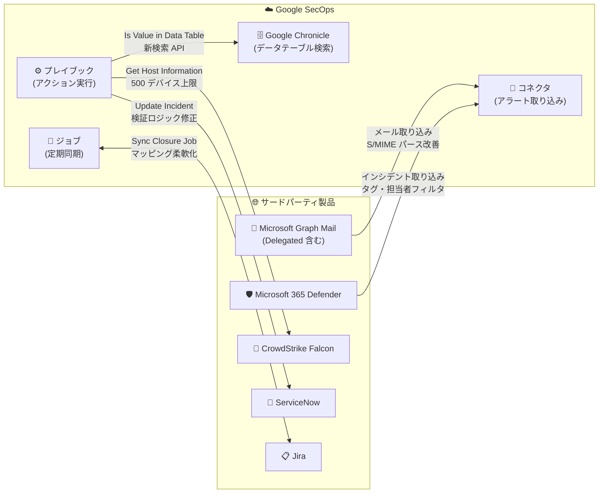

# Google SecOps Marketplace: 7 つのインテグレーションアップデート (Microsoft Graph Mail、ServiceNow、Microsoft 365 Defender、Jira、Google Chronicle、CrowdStrike Falcon)

**リリース日**: 2026-08-05

**サービス**: Google SecOps Marketplace

**機能**: SOAR インテグレーションの更新 (7 件)

**ステータス**: Change

📊 [このアップデートのインフォグラフィックを見る](https://takech9203.github.io/google-cloud-news-summary/20260805-google-secops-marketplace-integration-updates.html)

## 概要

Google SecOps Marketplace において、SOAR (Security Orchestration, Automation and Response) 向けの 7 つのインテグレーションが更新されました。対象は Microsoft Graph Mail Delegated、ServiceNow、Microsoft Graph Mail、Microsoft 365 Defender、Jira、Google Chronicle、CrowdStrike Falcon で、コネクタのパース処理改善、アクションのバグ修正、ジョブ機能の強化、パフォーマンス最適化など、多岐にわたる改善が含まれます。

Google SecOps Marketplace のインテグレーションは、Google SecOps とサードパーティ製品 (EDR、ITSM、メール、チケット管理など) を接続し、アラートの取り込み (コネクタ)、プレイブックからの操作 (アクション)、定期同期 (ジョブ) を実現するコンポーネントです。今回のアップデートは、SOC (Security Operations Center) の自動化ワークフローを運用するセキュリティチームに影響します。

特に注目すべきは、Jira v61.0 の Sync Closure Job に追加されたステータスとクローズ処理のカスタマイズ可能なマッピング機能、Microsoft 365 Defender v29.0 のインシデントタグ・担当者フィルタリング対応、CrowdStrike Falcon v80.0 の大規模環境向け安全性・パフォーマンス改善です。

**アップデート前の課題**

- Microsoft Graph Mail 系コネクタでは、メールヘッダーおよび S/MIME デジタル署名付きメールのパースロジックが改善前の実装であり、更新が必要だった
- ServiceNow の Update Incident アクションで、参照フィールド更新時の検証ロジックに不具合があった
- Jira の Sync Closure Job では、ステータスからクローズ処理へのマッピングをカスタマイズできず、同期失敗時の自動リトライ機構もなかった
- CrowdStrike Falcon の Get Host Information アクションには、エンティティ検索あたりのデバイス数の安全上限やバッチリクエストの分割処理がなく、大規模環境での実行に課題があった
- Google Chronicle の「Is Value in Data Table」アクションは旧検索 API を使用していた

**アップデート後の改善**

- Microsoft Graph Mail / Microsoft Graph Mail Delegated コネクタで、メールヘッダーと S/MIME 署名付きメールのパースロジックが更新された
- ServiceNow の Update Incident アクションで参照フィールド更新時の検証ロジックが修正された
- Jira の Sync Closure Job に、カスタマイズ可能なステータス→クローズ処理マッピング、Case レベルのジョブスコープ、Closed Reason Mapping でのカスタムフィールド変数、JIRA_ISSUE_KEY へのコンテキスト値整合、自動フォールバックリトライ機構が追加された
- Microsoft 365 Defender の Incidents Connector で、イベント構造の更新、インシデントタグ・担当者によるフィルタリング、オントロジーマッピングの更新、アラートあたりのエビデンス上限による処理最適化が行われた
- CrowdStrike Falcon の Get Host Information アクションに、エンティティ検索あたり 500 デバイスの安全上限、last_seen.desc によるデバイスソート、デバイス詳細・ログイン履歴・オンライン状態のバッチリクエスト分割が実装された
- Google Chronicle の「Is Value in Data Table」アクションが新しい検索 API を使用するようになった

## アーキテクチャ図

Google SecOps とサードパーティ製品間の連携ポイント (コネクタ / アクション / ジョブ) ごとに、今回更新された 7 つのインテグレーションの位置づけを示しています。

## サービスアップデートの詳細

### インテグレーション別の更新内容

| インテグレーション | バージョン | 対象コンポーネント | 更新内容 |
|---|---|---|---|
| Microsoft Graph Mail Delegated | v21.0 | Microsoft Graph Mail Delegated Connector | メールヘッダーおよび S/MIME デジタル署名付きメールのパースロジックを更新 |
| ServiceNow | v70.0 | Update Incident (アクション) | 参照フィールド更新時の検証ロジックを修正 |
| Microsoft Graph Mail | v44.0 | Microsoft Graph Mail Connector | メールヘッダーおよび S/MIME デジタル署名付きメールのパースロジックを更新 |
| Microsoft 365 Defender | v29.0 | Incidents Connector | Google SecOps イベント構造の更新、インシデントタグ・担当者フィルタリング対応、オントロジーマッピング更新、アラートあたりの最大エビデンス数制限による処理最適化 |
| Jira | v61.0 | Sync Closure Job | カスタマイズ可能なステータス→クローズ処理マッピング、Case レベルのジョブスコープ、Closed Reason Mapping のカスタムフィールド変数、JIRA_ISSUE_KEY へのコンテキスト値整合、自動フォールバックリトライ機構 |
| Google Chronicle | v92.0 | Is Value in Data Table (アクション) | 新しい検索 API を使用するように更新 |
| CrowdStrike Falcon | v80.0 | Get Host Information (アクション) | エンティティ検索あたり 500 デバイスの安全上限、last_seen.desc によるデバイスソート、デバイス詳細・ログイン履歴・オンライン状態のバッチリクエスト分割 |

### 主要な変更ポイント

1. **メール処理の信頼性向上 (Microsoft Graph Mail / Delegated)**
   - フィッシング調査などのユースケースで重要となるメールヘッダーのパースロジックを更新
   - S/MIME デジタル署名付きメールの取り扱いを改善し、署名付きメールを扱う企業環境での取り込み精度を向上

2. **Jira Sync Closure Job の柔軟性強化**
   - Sync Closure Job は、Google SecOps 側でクローズされたアラートに対応する Jira チケットを自動クローズするジョブ
   - 従来は固定的だったステータス→クローズ処理の対応関係をカスタマイズ可能に
   - Closed Reason Mapping でカスタムフィールド変数が利用可能になり、組織固有の Jira ワークフローに適合しやすくなった
   - コンテキスト値が JIRA_ISSUE_KEY に整合され、同期失敗時の自動フォールバックリトライで同期の確実性が向上

3. **Microsoft 365 Defender Incidents Connector の取り込み制御強化**
   - インシデントタグおよび担当者 (assignee) によるフィルタリングに対応し、取り込むインシデントを絞り込み可能に
   - アラートあたりの最大エビデンス数の制限により、大量のエビデンスを含むインシデントでの処理を最適化

4. **CrowdStrike Falcon 大規模環境向け最適化**
   - Get Host Information アクション (Hostname / IP アドレスエンティティに対して実行し、ホスト情報でエンティティをエンリッチ) に、エンティティ検索あたり 500 デバイスの安全上限を導入
   - デバイスを last_seen.desc (最終確認日時の降順) でソートするため、上限適用時も直近アクティブなデバイスが優先される
   - デバイス詳細・ログイン履歴・オンライン状態の取得をバッチリクエストに分割 (チャンク化) し、API 負荷と失敗リスクを低減

## デメリット・制約事項

### 考慮すべき点

- インテグレーションの更新は Google SecOps Marketplace から各インテグレーションを新バージョンへ更新することで適用される。自動更新設定でない場合は手動更新が必要
- CrowdStrike Falcon の Get Host Information では、エンティティ検索が 500 デバイスに制限されるため、超大規模環境で同一条件に該当するデバイスが 500 を超える場合は last_seen 降順の上位 500 台のみが対象となる
- Microsoft 365 Defender の Incidents Connector はイベント構造とオントロジーマッピングが更新されているため、既存のプレイブックやマッピングに依存した処理がある場合は更新後の動作確認を推奨
- Jira Sync Closure Job のコンテキスト値が JIRA_ISSUE_KEY に整合されたため、既存のカスタム実装でコンテキスト値を参照している場合は影響確認が必要

## ユースケース

### ユースケース 1: Jira 連携によるインシデントチケットの自動クローズ運用

**シナリオ**: SOC が Google SecOps のアラートから Jira チケットを自動起票し、対応完了後に双方のステータスを同期する運用を行っている。組織の Jira ワークフローには独自のクローズステータスがある。

**効果**: v61.0 のカスタマイズ可能なステータス→クローズ処理マッピングとカスタムフィールド変数により、組織固有の Jira ワークフローに合わせたクローズ同期が可能になる。自動フォールバックリトライにより、一時的な失敗による同期漏れも減少する。

### ユースケース 2: 大規模エンドポイント環境でのホスト情報エンリッチ

**シナリオ**: 数万台規模のエンドポイントを CrowdStrike Falcon で管理しており、プレイブックで Hostname / IP エンティティのホスト情報を自動エンリッチしている。

**効果**: v80.0 の 500 デバイス上限と last_seen.desc ソート、バッチリクエスト分割により、大規模環境でもアクションが安定して動作し、直近アクティブなデバイスの情報を優先的に取得できる。

### ユースケース 3: Microsoft Defender XDR インシデントの選択的取り込み

**シナリオ**: Microsoft Defender XDR で大量のインシデントが発生するが、SOC が Google SecOps で扱いたいのは特定のタグが付与された、または特定の担当者にアサインされたインシデントのみ。

**効果**: v29.0 のインシデントタグ・担当者フィルタリングにより、必要なインシデントのみを取り込み、ノイズと取り込みコストを削減できる。

## 関連サービス・機能

- **Google SecOps (SIEM/SOAR)**: 本 Marketplace インテグレーションの実行基盤。コネクタでのアラート取り込み、プレイブックでのアクション実行、ジョブによる定期同期を提供
- **Google Chronicle インテグレーション**: Google SecOps のデータテーブルや検索 API と連携するアクション群を提供 (今回 v92.0 で「Is Value in Data Table」が新検索 API に移行)
- **Google Threat Intelligence (GTI)**: 同日の Google SecOps リリースノートで、Mandiant 系レガシー IOC フィードの GTI_IOC フィードへの移行 (2027 年 3 月 18 日以降に旧フィード削除) が告知されている

## 参考リンク

- 📊 [インフォグラフィック](https://takech9203.github.io/google-cloud-news-summary/20260805-google-secops-marketplace-integration-updates.html)
- [公式リリースノート (August 05, 2026)](https://docs.cloud.google.com/release-notes#August_05_2026)
- [Jira インテグレーション ドキュメント](https://docs.cloud.google.com/chronicle/docs/soar/marketplace-integrations/jira)
- [Microsoft 365 Defender インテグレーション ドキュメント](https://docs.cloud.google.com/chronicle/docs/soar/marketplace-integrations/microsoft-365-defender)
- [CrowdStrike Falcon インテグレーション ドキュメント](https://docs.cloud.google.com/chronicle/docs/soar/marketplace-integrations/crowdstrike-falcon)
- [Google Chronicle インテグレーション ドキュメント](https://docs.cloud.google.com/chronicle/docs/soar/marketplace-integrations/google-chronicle)
- [コネクタによるデータ取り込み](https://docs.cloud.google.com/chronicle/docs/soar/ingest/connectors/ingest-your-data-connectors)

## まとめ

Google SecOps Marketplace の 7 つのインテグレーション更新は、メール処理の信頼性、ITSM 連携 (Jira / ServiceNow) の柔軟性、大規模環境での安定性 (CrowdStrike Falcon / Microsoft 365 Defender) を底上げするものです。該当インテグレーションを利用中のチームは、Marketplace から最新バージョンへ更新し、特に Jira Sync Closure Job や Microsoft 365 Defender Incidents Connector に依存するワークフローについては、マッピングやフィルタ設定の見直しと動作確認を行うことを推奨します。

---

**タグ**: Google SecOps, SOAR, Marketplace, Jira, ServiceNow, Microsoft 365 Defender, Microsoft Graph Mail, CrowdStrike Falcon, Google Chronicle, セキュリティ運用
