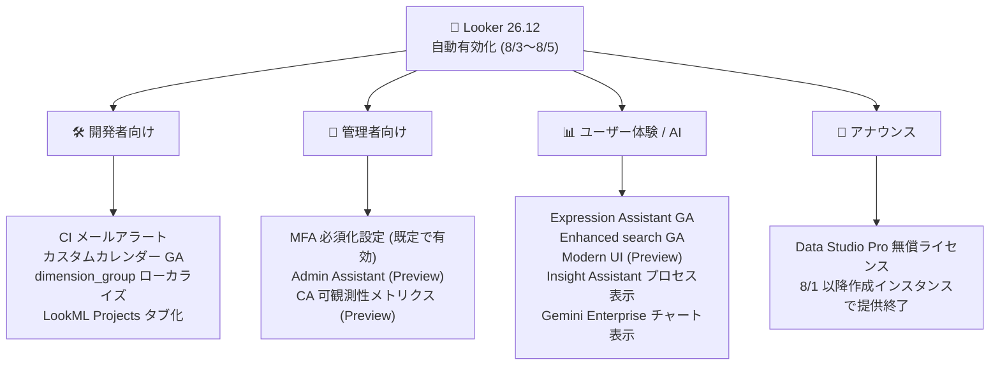

# Looker: Looker 26.12 自動有効化機能群 (CI メールアラート、カスタムカレンダー GA、Expression Assistant GA ほか)

**リリース日**: 2026-08-05

**サービス**: Looker (Google Cloud core)

**機能**: Looker 26.12 で自動有効化される機能群 (CI メールアラート、カスタムカレンダー GA、Expression Assistant GA、MFA 必須化設定など)

**ステータス**: GA (一部 Preview)

📊 [このアップデートのインフォグラフィックを見る](https://takech9203.github.io/google-cloud-news-summary/20260805-looker-26-12-auto-enabled-features.html)

## 概要

2026 年 8 月 3 日から 8 月 5 日にかけて、Looker 26.12 を実行している Looker (Google Cloud core) インスタンスに対して、複数の新機能が自動的に有効化されることが発表されました。今回のアップデートは、LookML 開発者向けの CI (継続的インテグレーション) メールアラートやカスタムカレンダーの GA、管理者向けの MFA (多要素認証) 必須化設定や Admin Assistant (Preview)、そしてエンドユーザー向けの Expression Assistant GA や Modern User Interface (Preview) など、幅広い領域をカバーしています。

開発者、管理者、ビジネスユーザーのそれぞれに価値のある機能が一括で提供されるため、Looker (Google Cloud core) を運用しているチームは各機能の影響範囲を確認しておくことが推奨されます。特に「メール + パスワードでのログイン時に MFA を必須化する機能」は**デフォルトで有効**になるため、認証まわりの挙動変更に注意が必要です。

また、アナウンスメントとして、2026 年 8 月 1 日以降に作成された Looker (Google Cloud core) インスタンスでは、無償の Data Studio Pro ライセンスが利用できなくなることも告知されています。

**アップデート前の課題**

- CI スイートの実行結果は Looker IDE の Runs ページを開いて確認する必要があり、失敗やエラーに気づくのが遅れる可能性があった
- 会計年度や小売業向けカレンダーなどの独自カレンダー (カスタムカレンダー) 機能、Expression Assistant、Enhanced search は GA 前の段階であり、本番利用の判断がしづらかった
- dimension_group が生成するタイムフレームやインターバルはロケール文字列ファイルによる翻訳に対応しておらず、多言語環境でのローカライズが不完全だった
- ロールやパーミッションセットの管理は Admin パネルでの手動操作が必要で、構成の調査や作成に手間がかかった

**アップデート後の改善**

- CI スイートの作成・編集時にメールアラートを設定でき、Failed / Error / Passed / Cancelled のステータスをトリガーに通知を受け取れるようになった
- カスタムカレンダー、Expression Assistant、Enhanced search が GA となり、本番環境で安心して利用できるようになった
- dimension_group のタイムフレーム・インターバル・カスタムタイムフレームをロケール文字列ファイルで翻訳できるようになった
- 管理者はメール + パスワードでのログインに MFA を必須化でき (デフォルトで有効)、セキュリティが強化された
- Admin Assistant (Preview) により、自然言語で Looker のロール・パーミッションセット・モデルセットの検索や作成ができるようになった

## アーキテクチャ図



Looker 26.12 で自動有効化される機能群を、開発者向け・管理者向け・ユーザー体験 (AI 機能含む)・アナウンスの 4 カテゴリに整理した図です。GA 昇格した機能と Preview 段階の機能が混在している点に注意してください。

## サービスアップデートの詳細

### 主要機能

1. **Looker Continuous Integration (CI) のメールアラート対応**
   - CI スイートの作成・編集時に「Enable email alerts」トグルを有効化し、カンマ区切りで通知先メールアドレスを指定できる
   - 通知トリガーとなる実行ステータスをチェックボックスで選択可能: **Failed** (検証テスト失敗)、**Error** (システム / 構成エラー)、**Passed** (正常完了)、**Cancelled** (キャンセル)
   - Runs ページを開かなくても CI 実行の結果を把握できる

2. **カスタムカレンダー機能が GA**
   - データベースに定義した会計カレンダーや小売カレンダーなどの独自カレンダーを、LookML の日付ベースの dimension_group に適用できる
   - `custom_week` や `custom_period` などのカスタムタイムフレームを、標準タイムフレームと同様に Explore クエリで利用可能
   - データベースにカレンダーテーブルを作成し、`calendar_definition` ブロックを含む LookML ビューでモデリングし、`type: custom_calendar` の dimension_group を作成して利用する

3. **Expression Assistant が GA**
   - Gemini in Looker の機能として、自然言語の説明からテーブル計算やカスタムフィールドの Looker 式を生成できる
   - 「Help me write an expression with Gemini」から説明を入力し、生成された式を Refine (改善) または Apply (適用) できる
   - 利用には `create_table_calculations` または `create_custom_fields` 権限と Looker の Gemini ロールが必要

4. **dimension_group パラメータのローカライズ対応**
   - dimension_group が生成するタイムフレーム、インターバル、カスタムタイムフレームを、ロケール文字列ファイルで翻訳できるようになった
   - 多言語環境のモデルローカライズがより完全になった

5. **LookML Projects ページのタブレイアウト化**
   - パフォーマンスが向上したタブレイアウトに更新され、**Models and Projects**、**Pending Projects**、**Marketplace Projects** の 3 タブで構成される

6. **メール + パスワードログインへの MFA 必須化 (デフォルトで有効)**
   - 管理者は、ユーザーがメールとパスワードでログインする際に多要素認証 (MFA) を必須とするようにインスタンスを構成できる
   - この機能は**デフォルトで有効**となる

7. **Enhanced search 機能が GA**
   - 保存済みコンテンツを検索するための拡張検索機能が一般提供となった

8. **Conversational Analytics の可観測性メトリクス強化 (Preview)**
   - エンゲージメントや予測トークン使用量などの拡張可観測性メトリクスが、Conversational Analytics System Activity ダッシュボードで確認可能に
   - 有効化には、Admin パネルの Preview セクションにある General ページで「Conversational Analytics Agent Token usage」設定を管理者がオンにする必要がある

9. **Admin Assistant (Preview)**
   - 自然言語で Looker のロール管理を支援。ロール / パーミッションセット / モデルセットの検索、新規作成、構成分析とベストプラクティスのガイダンスが可能
   - Admin パネルの Roles ページのほか、ロール・パーミッションセット・モデルセットの新規作成 / 編集ページから利用できる

10. **Modern User Interface (Preview)**
    - モダナイズされたレイアウトとデザイン、ビジュアライゼーションとダッシュボードの新しい構成設定を提供
    - 更新されたタイポグラフィとアクセシブルなカラーパレットを備えた「Modern visualization theme」を適用可能
    - 高密度で洗練されたデザインの「Modern dashboard style」により、Google の最新デザイン標準に沿ったデータ閲覧体験を実現

11. **Insight Assistant / Gemini Enterprise 連携の改善 (Change)**
    - Insight Assistant が、回答生成に使用したデータの重要な詳細と Explore のフィールドを含む、回答生成プロセスを表示するようになった
    - Looker で作成したデータエージェントと Gemini Enterprise でチャットする際、エージェントの回答にチャートやビジュアライゼーションが含まれるようになった

12. **Data Studio Pro 無償ライセンスの提供終了 (Announcement)**
    - 2026 年 8 月 1 日以降に作成された Looker (Google Cloud core) インスタンスでは、無償の Data Studio Pro ライセンスは利用できない

## 技術仕様

### CI メールアラートの設定項目

| 項目 | 詳細 |
|------|------|
| 設定場所 | Looker IDE > Continuous Integration > Suites (スイートの作成 / 編集時) |
| 有効化 | 「Enable email alerts」トグル |
| 通知先 | カンマ区切りのメールアドレスリスト |
| トリガーステータス | Failed / Error / Passed / Cancelled (チェックボックスで選択) |

### カスタムカレンダーの前提条件と制限

| 項目 | 詳細 |
|------|------|
| 対応ダイアレクト | カスタムカレンダーをサポートするダイアレクトへの Looker 接続が必要 |
| カレンダーテーブル | reference_date 列を持つカレンダーテーブルをデータベースに作成し、LookML ビューとしてモデリング |
| LookML ランタイム | 新しい LookML ランタイムが必要 (レガシーランタイム有効時は `new_lookml_runtime: yes` をマニフェストに追加) |
| 主な制限 | フィルタ付きメジャー、高度なフィルタ式、OR フィルタ、dimension fill は非対応。複雑な JOIN では symmetric aggregates が完全にはサポートされない場合がある |

### カスタムカレンダーの LookML 例

```lookml
include: "/views/fiscal_calendar.view"

view: orders {
  sql_table_name: public.orders ;;

  dimension_group: created {
    type: custom_calendar
    custom_timeframes: [custom_date, custom_week, custom_year]
    sql: ${TABLE}.created_at ;;
    based_on_calendar: fiscal_calendar
  }
}
```

### Expression Assistant の利用要件

| 項目 | 詳細 |
|------|------|
| インスタンス要件 | Looker (Google Cloud core) では Google Cloud コンソールで Gemini in Looker を有効化 |
| 管理設定 | Gemini in Looker パネルで Looker Assistants を有効化 |
| 必要権限 | テーブル計算: `create_table_calculations` / カスタムフィールド: `create_custom_fields` |
| 必要ロール | Looker の Gemini ロール |

### Admin Assistant (Preview) の利用要件と制限

| 項目 | 詳細 |
|------|------|
| 対象インスタンス | Looker (Google Cloud core) のみ (Looker (original) は非対応)。プライベート接続専用構成では利用不可 |
| 前提設定 | Gemini in Looker の有効化、Trusted Tester features オプションの有効化、Admin パネルでの Admin Assistant 有効化 |
| 必要ロール | Looker Admin ロール |
| 制限 | クエリ結果は最大 100 件 (初期表示は 25 件)。パネルに表示される会話は直近 6 件。ユーザークエリは 1,000 語まで |

## メリット

### ビジネス面

- **ガバナンスとセキュリティの強化**: メール + パスワードログインへの MFA 必須化 (デフォルト有効) により、組織のセキュリティ基準への準拠が容易になる
- **会計年度ベースの分析が本番利用可能に**: カスタムカレンダーの GA により、会計カレンダーや小売カレンダーに基づいたレポーティングを正式サポートの下で運用できる
- **AI 活用コストの可視化**: Conversational Analytics の予測トークン使用量メトリクス (Preview) により、AI 機能の利用状況を管理者が把握できる

### 技術面

- **CI パイプラインの運用性向上**: メールアラートにより、LookML の検証失敗やエラーを即座に検知でき、開発サイクルのフィードバックが高速化する
- **ローカライズの完全性向上**: dimension_group のタイムフレームまで翻訳可能になり、多言語対応モデルの品質が向上する
- **管理作業の効率化**: Admin Assistant (Preview) による自然言語でのロール管理で、権限構成の調査・作成が簡素化される

## デメリット・制約事項

### 制限事項

- 対象は **Looker 26.12 を実行している Looker (Google Cloud core) インスタンス**であり、機能は 8 月 3 日〜 8 月 5 日の期間に自動有効化される
- Admin Assistant、Modern User Interface、Conversational Analytics の可観測性メトリクスは Preview であり、Pre-GA Offerings Terms が適用され、サポートが限定される場合がある
- Admin Assistant は Looker (original) では利用できず、プライベート接続専用のインスタンスでも利用できない
- カスタムカレンダーには、フィルタ付きメジャー非対応、OR フィルタ非対応、dimension fill 非対応などの制限がある

### 考慮すべき点

- MFA 必須化機能は**デフォルトで有効**になるため、メール + パスワード認証を利用している環境ではログインフローの変更をユーザーに周知する必要がある
- 2026 年 8 月 1 日以降に作成する Looker (Google Cloud core) インスタンスでは無償の Data Studio Pro ライセンスが付与されないため、Looker Studio Pro の利用計画とライセンスコストを見直す必要がある
- Gemini 系機能 (Expression Assistant、Admin Assistant など) の出力は事実と異なる場合があるため、適用前に必ず内容を検証することが推奨される
- Preview 機能 (可観測性メトリクスなど) は管理者による明示的な有効化が必要なものがある

## ユースケース

### ユースケース 1: LookML CI パイプラインの失敗を即時検知

**シナリオ**: 複数の開発者が LookML プロジェクトを共同開発しており、プルリクエストごとに CI スイート (SQL Validator、LookML Validator など) を実行している。従来は Runs ページを定期的に確認する必要があった。

**実装例**:
```text
1. Looker IDE > Continuous Integration > Suites でスイートを編集
2. 「Enable email alerts」トグルを有効化
3. 通知先: dev-team@example.com, lead@example.com
4. トリガー: Failed, Error にチェック
```

**効果**: 検証失敗やエラー発生時に開発チームへ即座にメール通知され、マージ前の問題修正が迅速化する。

### ユースケース 2: 会計年度ベースの売上レポート

**シナリオ**: 小売企業が 4-5-4 カレンダーや独自の会計期間に基づいて売上を分析したい。

**実装例**:
```text
1. データベースに reference_date、fiscal_year、fiscal_week などを持つカレンダーテーブルを作成
2. calendar_definition ブロックを含む LookML ビューでモデリング
3. 売上ビューに type: custom_calendar の dimension_group を定義
4. Explore で「Fiscal Year」「Fiscal Week」などのカスタムタイムフレームを利用
```

**効果**: ビジネスユーザーが標準タイムフレームと同じ操作感で会計カレンダーベースの分析・フィルタリングを行える。

### ユースケース 3: 自然言語によるロール管理の効率化

**シナリオ**: 管理者が「develop 権限を含むパーミッションセットはどれか」を調査し、新しい開発者向けロールを作成したい。

**効果**: Admin Assistant (Preview) に自然言語で質問するだけで既存構成を検索でき、パーミッションセットとモデルセットを組み合わせた新規ロール作成もガイド付きで行える。

## 料金

今回のアップデートに伴う追加料金の情報はリリースノートに記載されていません。Looker (Google Cloud core) の料金体系はプラットフォーム利用料とユーザーライセンスに基づきます。詳細は [Looker の料金ページ](https://cloud.google.com/looker/pricing) を参照してください。

なお、2026 年 8 月 1 日以降に作成されたインスタンスでは無償の Data Studio Pro ライセンスが利用できないため、Looker Studio Pro が必要な場合は別途ライセンス費用を考慮する必要があります。

## 関連サービス・機能

- **Gemini in Looker**: Expression Assistant、Admin Assistant、Insight Assistant、Conversational Analytics はいずれも Gemini in Looker の機能群であり、インスタンスでの有効化が前提となる
- **Gemini Enterprise**: Looker で作成したデータエージェントと Gemini Enterprise でチャットでき、今回のアップデートで回答にチャート・ビジュアライゼーションが含まれるようになった
- **Looker Studio Pro (旧 Data Studio Pro)**: 無償ライセンスの提供条件が変更された (2026 年 8 月 1 日以降作成のインスタンスは対象外)
- **System Activity ダッシュボード**: Conversational Analytics の可観測性メトリクス (Preview) の確認場所

## 参考リンク

- 📊 [インフォグラフィック](https://takech9203.github.io/google-cloud-news-summary/20260805-looker-26-12-auto-enabled-features.html)
- [公式リリースノート](https://docs.cloud.google.com/release-notes#August_05_2026)
- [CI スイートのアラート設定](https://docs.cloud.google.com/looker/docs/ci-create-suite#alerting)
- [カスタムカレンダー](https://docs.cloud.google.com/looker/docs/custom-calendars)
- [Expression Assistant](https://docs.cloud.google.com/looker/docs/gemini-expression-asst)
- [dimension_group パラメータ](https://docs.cloud.google.com/looker/docs/reference/param-field-dimension-group)
- [LookML プロジェクトの管理](https://docs.cloud.google.com/looker/docs/manage-projects)
- [二要素認証の管理設定](https://docs.cloud.google.com/looker/docs/admin-panel-authentication-two-factor)
- [Admin Assistant](https://docs.cloud.google.com/looker/docs/gemini-admin-asst)
- [Modern User Interface](https://docs.cloud.google.com/looker/docs/modern-ui)
- [料金ページ](https://cloud.google.com/looker/pricing)

## まとめ

Looker 26.12 では、CI メールアラートやカスタムカレンダー GA などの開発者向け機能から、MFA 必須化や Admin Assistant (Preview) といった管理者向け機能、Modern UI (Preview) などのユーザー体験改善まで、多数の機能が 8 月 3 日〜 5 日に自動有効化されます。特に MFA 必須化設定はデフォルトで有効になるため、メール + パスワード認証を利用している環境では影響を事前に確認し、ユーザーへの周知を行うことを推奨します。また、8 月 1 日以降に新規作成するインスタンスでは無償 Data Studio Pro ライセンスが提供されない点にも留意してください。

---

**タグ**: Looker, Looker (Google Cloud core), Continuous Integration, カスタムカレンダー, Gemini in Looker, Expression Assistant, Admin Assistant, MFA, Conversational Analytics, LookML, GA, Preview
