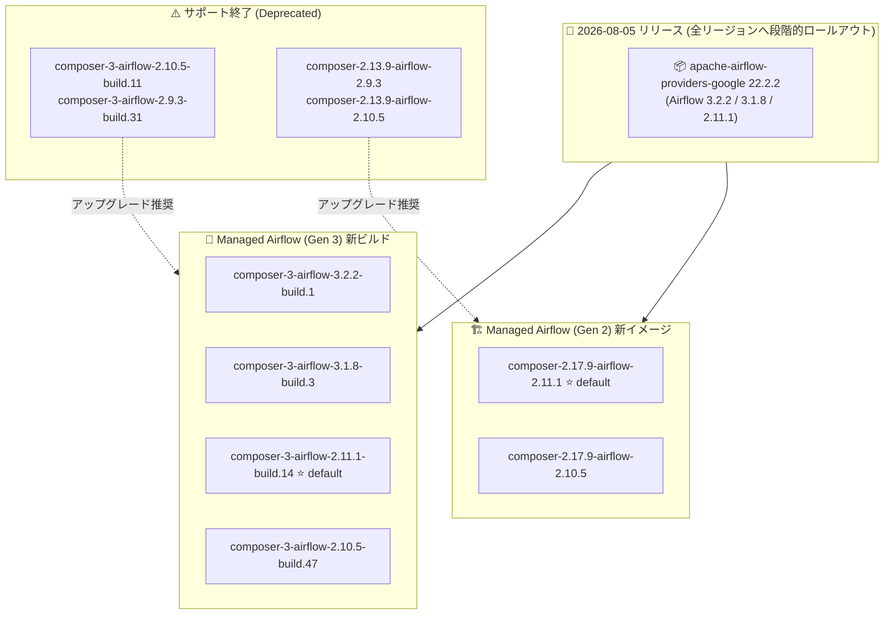

# Managed Service for Apache Airflow: 2026 年 8 月 5 日リリース (新ビルド提供と旧バージョンのサポート終了)

**リリース日**: 2026-08-05

**サービス**: Managed Service for Apache Airflow (旧称: Cloud Composer)

**機能**: 新リリースのロールアウト開始、apache-airflow-providers-google 22.2.2 へのアップグレード、Gen 3 新ビルド / Gen 2 新イメージの提供、旧バージョンのサポート終了

**ステータス**: Announcement / Change / Deprecated

📊 [このアップデートのインフォグラフィックを見る](https://takech9203.github.io/google-cloud-news-summary/20260805-managed-airflow-release-august-2026.html)

## 概要

2026 年 8 月 5 日、Managed Service for Apache Airflow (旧称: Cloud Composer) の新しいリリースのロールアウトが開始されました。全リージョンへ段階的に展開されるため、記載された変更や機能が一部のリージョンではまだ利用できない可能性があります。

今回のリリースでは、Airflow 3.2.2、3.1.8、2.11.1 の各バージョンで `apache-airflow-providers-google` パッケージがバージョン 22.2.2 にアップグレードされました。あわせて、Managed Airflow (Gen 3) では 4 つの新しい Airflow ビルド (Airflow 3.2.2 / 3.1.8 / 2.11.1 / 2.10.5)、Managed Airflow (Gen 2) では 2 つの新しいイメージ (composer-2.17.9 系) が提供されています。Gen 3 のデフォルトは composer-3-airflow-2.11.1-build.14、Gen 2 のデフォルトは composer-2.17.9-airflow-2.11.1 です。

一方で、composer-3-airflow-2.10.5-build.11、composer-3-airflow-2.9.3-build.31、composer-2.13.9-airflow-2.9.3、composer-2.13.9-airflow-2.10.5 の 4 つのバージョン/ビルドがサポート期間終了 (end of support) となりました。Airflow 環境を運用するデータエンジニアリングチームは、利用中のバージョンを確認し、必要に応じてアップグレードを計画してください。

**アップデート前の課題**

- Airflow 3.2.2 系は 2026 年 7 月 29 日提供の build.0 が最初のビルドであり、その後の修正を含む新しいビルドがなかった
- `apache-airflow-providers-google` パッケージは Airflow 3.1.8 で 22.2.0、Airflow 2.11.1 で 22.2.1 と、バージョン間で差異があった
- 旧ビルド (composer-3-airflow-2.10.5-build.11、composer-3-airflow-2.9.3-build.31 など) を利用している環境は、サポート終了時期が近づいていた

**アップデート後の改善**

- Airflow 3.2.2 / 3.1.8 / 2.11.1 / 2.10.5 の最新ビルド・イメージが利用可能になり、最新の修正を含む環境へアップグレードできるようになった
- Airflow 3.2.2、3.1.8、2.11.1 で `apache-airflow-providers-google` が 22.2.2 に統一され、Google Cloud 連携オペレーターの最新の変更が反映された
- サポート終了となるバージョンが明示され、アップグレード計画の判断材料が提供された

## アーキテクチャ図



2026 年 8 月 5 日のリリースで提供される Gen 3 の新ビルドと Gen 2 の新イメージ、およびサポート終了となる旧バージョンからの移行先を示しています。サポート終了バージョンを利用中の環境は、それぞれの世代の新ビルド/イメージへのアップグレードが推奨されます。

## サービスアップデートの詳細

### 主要機能

1. **新リリースのロールアウト開始 (Announcement)**
   - 2026 年 8 月 5 日から新リリースのロールアウトが開始
   - 全リージョンへ段階的に展開されるため、一部リージョンでは記載の変更・機能がまだ利用できない場合がある

2. **apache-airflow-providers-google 22.2.2 へのアップグレード (Change)**
   - Airflow 3.2.2、3.1.8、2.11.1 の各バージョンでパッケージを 22.2.2 にアップグレード
   - BigQuery、Dataflow、Cloud Storage など Google Cloud サービス連携オペレーターの最新の変更が反映される
   - 変更内容の詳細は [apache-airflow-providers-google changelog](https://airflow.apache.org/docs/apache-airflow-providers-google/stable/changelog.html) を参照

3. **Managed Airflow (Gen 3) の新しい Airflow ビルド (Change)**
   - composer-3-airflow-3.2.2-build.1 (Airflow 3.2.2 の 2 番目のビルド)
   - composer-3-airflow-3.1.8-build.3
   - composer-3-airflow-2.11.1-build.14 (デフォルト)
   - composer-3-airflow-2.10.5-build.47

4. **Managed Airflow (Gen 2) の新しいイメージ (Change)**
   - composer-2.17.9-airflow-2.11.1 (デフォルト)
   - composer-2.17.9-airflow-2.10.5

5. **旧バージョンのサポート終了 (Deprecated)**
   - composer-3-airflow-2.10.5-build.11
   - composer-3-airflow-2.9.3-build.31
   - composer-2.13.9-airflow-2.9.3
   - composer-2.13.9-airflow-2.10.5
   - これらはサポート期間 (end of support period) に到達。環境は引き続き動作するが、サポート対象外となる

## 技術仕様

### 今回提供されるバージョン一覧

| 世代 | バージョン/ビルド | Airflow バージョン | 備考 |
|------|------------------|--------------------|------|
| Gen 3 | composer-3-airflow-3.2.2-build.1 | 3.2.2 | Airflow 3 系最新 |
| Gen 3 | composer-3-airflow-3.1.8-build.3 | 3.1.8 | Airflow 3 系 |
| Gen 3 | composer-3-airflow-2.11.1-build.14 | 2.11.1 | **デフォルト** |
| Gen 3 | composer-3-airflow-2.10.5-build.47 | 2.10.5 | 2026 年 9 月以降は新規ビルド提供終了予定 |
| Gen 2 | composer-2.17.9-airflow-2.11.1 | 2.11.1 | **デフォルト** |
| Gen 2 | composer-2.17.9-airflow-2.10.5 | 2.10.5 | 2026 年 9 月以降は新規イメージ提供終了予定 |

### サポート終了となったバージョン

| 世代 | バージョン/ビルド | Airflow バージョン |
|------|------------------|--------------------|
| Gen 3 | composer-3-airflow-2.10.5-build.11 | 2.10.5 |
| Gen 3 | composer-3-airflow-2.9.3-build.31 | 2.9.3 |
| Gen 2 | composer-2.13.9-airflow-2.9.3 | 2.9.3 |
| Gen 2 | composer-2.13.9-airflow-2.10.5 | 2.10.5 |

### バージョンサポートポリシー

- 各イメージ/ビルドにはリリース日とサポート期限が設定されており、2025 年 7 月 1 日以降にリリースされたビルドは初回リリースから 12 か月間の標準サポート期間が適用される
- サポート終了 (end of support) 後も環境は動作を継続するが、end of life 日以降は環境が動作しなくなる (両者は異なる日付)
- ドキュメントと Google Cloud コンソールでサポート終了日に差異がある場合は、遅い方の日付が公式のサポート終了日となる

## 設定方法

### 前提条件

1. Managed Service for Apache Airflow (Cloud Composer) 環境が作成済みであること
2. 環境のアップグレード権限 (Composer 管理者ロールなど) を持っていること

### 手順

#### ステップ 1: 現在の環境バージョンを確認する

```bash
gcloud composer environments describe ENVIRONMENT_NAME \
    --location LOCATION \
    --format="value(config.softwareConfig.imageVersion)"
```

利用中のイメージ/ビルドがサポート終了リストに含まれていないか確認します。

#### ステップ 2: 環境をアップグレードする

```bash
# Gen 3 の例: Airflow 2.11.1 の最新ビルドへアップグレード
gcloud composer environments update ENVIRONMENT_NAME \
    --location LOCATION \
    --airflow-version 2.11.1
```

アップグレード前にステージング環境での動作確認を推奨します。リージョンによっては新ビルドがまだロールアウトされていない場合があります。

## メリット

### ビジネス面

- **サポート継続性の確保**: サポート終了バージョンから最新ビルドへ移行することで、修正やサポートを継続的に受けられる
- **計画的なアップグレード**: デフォルトバージョンとサポート終了バージョンが明示され、移行計画を立てやすい

### 技術面

- **Google Cloud 連携の最新化**: `apache-airflow-providers-google` 22.2.2 により、Google Cloud サービス連携オペレーターの最新の修正・変更が利用できる
- **Airflow 3.2 系の継続提供**: 2026 年 7 月 29 日に登場した Airflow 3.2.2 の 2 番目のビルド (build.1) が提供され、Airflow 3 系の最新機能を利用しやすくなった
- **バージョン統一**: Airflow 3.2.2 / 3.1.8 / 2.11.1 でプロバイダーパッケージのバージョンが 22.2.2 に揃い、バージョン間の挙動差異が減少

## デメリット・制約事項

### 制限事項

- ロールアウトは段階的であり、一部リージョンでは新ビルド/イメージがまだ利用できない可能性がある
- Airflow 3.2.2 では Multi-Team 機能は利用できない (`[core]multi_team` は False 固定でオーバーライド不可、2026 年 7 月 29 日リリースノートに記載)

### 考慮すべき点

- 2026 年 7 月 24 日の発表により、2026 年 9 月以降は Airflow 2.10.5 の新しいイメージ/ビルドが提供されなくなるため、Airflow 2.10.5 利用環境は 2.11 以降への移行を検討すべき
- Gen 3 の Airflow 2.11.1 ビルド (build.7 以降) では Airflow ウェブサーバーに最低 3 GB のメモリが必要 (2026 年 7 月 13 日リリースノートに記載の既知の問題)
- サポート終了バージョン (composer-2.13.9 系、composer-3-airflow-2.9.3-build.31 など) を利用中の環境は、動作は継続するもののサポート対象外となるため早期のアップグレードが望ましい

## 料金

今回のアップデートによる料金体系の変更はありません。Managed Airflow (Gen 2) と Gen 3 では料金モデルが異なります。詳細は [Cloud Composer の料金ページ](https://cloud.google.com/composer/pricing) を参照してください。

## 利用可能リージョン

全リージョンへ段階的にロールアウト中です。一部のリージョンでは記載の変更・機能がまだ利用できない場合があります。

## 関連サービス・機能

- **Google Kubernetes Engine (GKE)**: Gen 2 環境は Autopilot モードの GKE クラスタ上で動作 (Gen 3 ではクラスタはユーザープロジェクト外で管理)
- **BigQuery / Dataflow / Cloud Storage**: `apache-airflow-providers-google` パッケージ経由でオーケストレーション対象となる主要サービス
- **Cloud Monitoring / Cloud Logging**: Airflow 環境のメトリクス・ログの監視に利用

## 参考リンク

- 📊 [インフォグラフィック](https://takech9203.github.io/google-cloud-news-summary/20260805-managed-airflow-release-august-2026.html)
- [公式リリースノート](https://docs.cloud.google.com/release-notes#August_05_2026)
- [Managed Airflow リリースノート](https://docs.cloud.google.com/composer/docs/release-notes)
- [Cloud Composer バージョン一覧](https://docs.cloud.google.com/composer/docs/composer-versions)
- [バージョンの非推奨化とサポート](https://docs.cloud.google.com/composer/docs/composer-versioning-overview#version-deprecation-and-support)
- [apache-airflow-providers-google changelog](https://airflow.apache.org/docs/apache-airflow-providers-google/stable/changelog.html)
- [料金ページ](https://cloud.google.com/composer/pricing)

## まとめ

2026 年 8 月 5 日の Managed Service for Apache Airflow 新リリースでは、Airflow 3.2.2 / 3.1.8 / 2.11.1 / 2.10.5 の新ビルド・イメージ提供と `apache-airflow-providers-google` 22.2.2 へのアップグレードが行われ、同時に 4 つの旧バージョンがサポート終了となりました。サポート終了バージョンや Airflow 2.9.3 / 2.10.5 系を利用中の環境は、2026 年 9 月以降の Airflow 2.10.5 新規提供終了も踏まえ、Airflow 2.11.1 以降または Airflow 3 系への計画的なアップグレードを推奨します。

---

**タグ**: #ManagedAirflow #CloudComposer #ApacheAirflow #リリース #バージョンアップ #サポート終了 #データエンジニアリング
