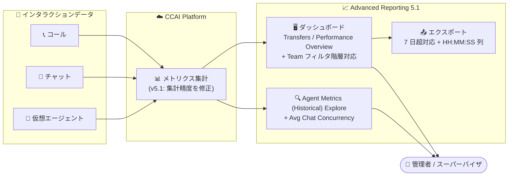

# Google Cloud Contact Center as a Service (CCaaS): Advanced reporting dashboards 5.1 リリース

**リリース日**: 2026-08-06

**サービス**: Google Cloud Contact Center as a Service (CCaaS / CCAI Platform)

**機能**: Advanced reporting dashboards 5.1 (新機能 3 件 + 多数の不具合修正)

**ステータス**: Announcement / Feature / Fixed

📊 [このアップデートのインフォグラフィックを見る](https://takech9203.github.io/google-cloud-news-summary/20260806-ccaas-advanced-reporting-dashboards-5-1.html)

## 概要

Google Cloud Contact Center as a Service (CCaaS / CCAI Platform) の高度なレポーティングダッシュボード (Advanced Reporting Dashboards) のバージョン 5.1 が正式にリリースされました。2026 年 8 月 3 日に公開されたプレリリースノートで予告されていた内容が、今回のリリースで実際に提供開始となります。

バージョン 5.1 には 3 つの新機能が含まれます。(1) Team フィルタでトップレベルチームを選択した際にサブチームのデータも自動的に集計へ含める階層対応、(2) Agent Metrics (Historical) Explore への Avg Chat Concurrency (平均チャット同時対応数) メトリクスの追加、(3) Transfers - Calls / Transfers - Chats ダッシュボードへのウォーム転送・エージェント相談メトリクス (Agent Connection Time (H:M:S) / Agent Consult Time (H:M:S)) の追加です。

さらに、This Week / This Month の時間あたり集計の不正確さ、チャットのキュー放棄数が常に 0 と表示される問題、仮想エージェントのコールメトリクスの誤り、7 日を超える期間のエクスポート失敗など、レポート指標の信頼性に直結する 16 件の不具合修正・改善が含まれています。コンタクトセンターの運用管理者、スーパーバイザ、ワークフォースマネジメント (WFM) 担当者にとって、KPI レポートの正確性と分析の柔軟性が大きく向上するリリースです。

**アップデート前の課題**

- Team フィルタでトップレベルチームを選択してもサブチームのデータが集計に含まれず、組織階層に沿った分析には個別のフィルタ操作が必要だった
- エージェント・チーム・キュー単位のチャット同時対応数 (コンカレンシー) の傾向を Explore で直接分析できなかった
- ウォーム転送やエージェント間相談に費やされた時間を測定する専用メトリクスがなく、転送品質の定量評価が難しかった
- Performance Overview / Agent Performance ダッシュボードの This Week / This Month の時間あたり数値が不正確だった
- Queue Group Performance ダッシュボードでチャットの Queue Abandons / Abandon % が常に 0 と表示されていた
- 仮想エージェントのコールメトリクス、未接続コールへの Assigned Agent 表示、転送済みコールの Queued 誤表示など、複数の指標が実態と乖離していた
- 7 日を超える日付範囲を指定するとダッシュボードからのデータエクスポートが失敗していた
- Available Agents が実際のキャパシティより過大に表示され、要員計画の判断を誤らせるおそれがあった

**アップデート後の改善**

- Team フィルタでトップレベルチームを選択すると、サブチームのデータが自動的に含まれ、組織階層に沿った集計が 1 回の操作で可能になった
- Agent Metrics (Historical) Explore に Avg Chat Concurrency メトリクスが追加され、エージェント・チーム・キュー単位のコンカレンシー傾向を分析できるようになった
- Transfers - Calls / Transfers - Chats ダッシュボードの Call Transfers / Chat Transfers テーブルに Agent Connection Time (H:M:S) (相談 + ウォーム転送の所要時間) と Agent Consult Time (H:M:S) (相談後に通話へ復帰した場合の相談時間) が追加された
- キュー放棄、仮想エージェント、転送、エージェント稼働状況などに関する多数の集計不具合が修正され、レポートの信頼性が向上した
- 7 日を超える期間のエクスポートが可能になり、時間関連のエクスポートには秒に加えて HH:MM:SS 形式の列が追加された

## アーキテクチャ図

CCAI Platform のレポーティングデータフローを示しています。コール・チャット・仮想エージェントのインタラクションデータが集計され、v5.1 で強化されたダッシュボード・Explore・エクスポート機能を通じて管理者に提供されます。

## サービスアップデートの詳細

### 主要機能

1. **Team フィルタのサブチーム自動包含**
   - ダッシュボードの Team フィルタでトップレベルチームを選択すると、そのチーム配下のサブチームのデータも集計に含まれるようになった
   - 組織階層に沿ったチーム単位の分析が、サブチームを個別に選択することなく可能になる

2. **Agent Metrics (Historical) Explore に Avg Chat Concurrency メトリクスを追加**
   - エージェント・チーム・キュー単位でチャット同時対応数の傾向を把握できる
   - あわせて、コールとチャットの両方を含むメトリクスのラベルがチャネル非依存 (channel-agnostic) な表現に更新された

3. **ウォーム転送とエージェント相談のメトリクス**
   - Transfers - Calls / Transfers - Chats ダッシュボードの Call Transfers / Chat Transfers テーブルに以下の 2 メトリクスが追加された
   - **Agent Connection Time (H:M:S)**: 別のエージェントに相談し、そのエージェントへウォーム転送するまでに費やした時間
   - **Agent Consult Time (H:M:S)**: 別のエージェントに相談した後、元の通話に戻るまでに費やした時間

### 不具合修正 (Fixed)

| 対象ダッシュボード / 機能 | 修正内容 |
|--------------------------|----------|
| Performance Overview / Agent Performance | This Week / This Month の時間あたり (per-hour) 数値が不正確だった問題を修正 |
| Queue Group Performance - All / Chats | チャットの Queue Abandons / Abandon % が常に 0 と表示される問題を修正 |
| Virtual Agent - Calls / All Interactions - Calls / Performance Overview | 仮想エージェントのコールメトリクスが誤っていた問題を修正 |
| Assigned Agent 表示 | 接続していないコールにエージェントが Assigned Agent として表示される問題を修正 |
| データエクスポート | 7 日を超える日付範囲でのエクスポートが失敗する問題を修正 |
| Real-time Queue Monitoring / Queued Calls | エージェント対応中の転送済みコールが Queued と誤表示される問題を修正 |
| キューグループ表示 | 無効化されたキューグループがダッシュボードに表示され続ける問題を修正 |
| All Interactions | Queue Time フィルタでデータが表示されない問題を修正 |
| Queue Group Performance - All | SLA Target フィールドが空欄になる問題を修正 |
| Child Queues フィルタ | No チェックボックスをクリアすると消える問題に対応し、No がデフォルトであるため No チェックボックスを削除して Yes のみに変更 |
| Available Agents | 実際のキャパシティより過大に表示される問題を修正 |
| Queue Groups - Calls / Chats | Ave Current Queue Time メトリクスが誤ったデータを表示する問題を修正 |
| 時間関連エクスポート | 秒に加えて HH:MM:SS 形式の列を追加 (Explore ではこの形式に条件付き書式は適用不可) |
| Explore | Max Queue Wait Time / Max Speed To Answer / Max Queue Abandon Time が誤ったデータを表示する問題を修正 |
| Agent Activity | エージェントアダプタでの可用性設定の変更がダッシュボードに反映されない問題を修正 |
| Agent Metrics (Historical) Explore | コールとチャット両方を含むメトリクスのラベルをチャネル非依存に更新 |

## 技術仕様

### Advanced Reporting Dashboards の前提

| 項目 | 詳細 |
|------|------|
| 有効化 | CCAI Platform インスタンスで Advanced reporting 拡張機能を有効化する必要がある |
| 有効化の影響 | 有効化するとレガシーの CCAI Platform ダッシュボードは利用不可になる |
| 利用可能リージョン | us-east1、us-central1、us-west1、europe-west2、asia-northeast1、northamerica-northeast1、australia-southeast1 |
| ダッシュボードの日付範囲 | 最大 45 日 (超過するとエラー) |
| 閲覧・編集権限 | Admin: 閲覧・編集可 / Manager Admin: 全ダッシュボード閲覧のみ / Manager 系ロール: 割り当てキューのダッシュボード閲覧のみ / Agent: 閲覧不可 |

### 新メトリクスの定義

| メトリクス | 定義 |
|-----------|------|
| Agent Connection Time (H:M:S) | 別のエージェントに相談し、そのエージェントへウォーム転送するまでに費やした時間 |
| Agent Consult Time (H:M:S) | 別のエージェントに相談した後、元の通話に戻るまでに費やした時間 |
| Avg Chat Concurrency | エージェント・チーム・キュー単位のチャット同時対応数の傾向を捉えるメトリクス (Agent Metrics (Historical) Explore) |

## 設定方法

### 前提条件

1. CCAI Platform インスタンスが Advanced reporting 対応リージョンに存在すること
2. Advanced reporting 拡張機能を有効化していること (Google Cloud コンソール > CCAI Platform > インスタンス > Edit > Configure extensions > Advanced reporting)
3. ダッシュボードの閲覧に必要なロール (Admin / Manager Admin / Manager 系) が付与されていること

### 手順

#### ステップ 1: ダッシュボードを開く

CCAI Platform ポータルで **Dashboard > Advanced Reporting** をクリックし、Advanced Reporting Landing Page から対象のダッシュボード (例: Transfers / Calls) を開きます。

#### ステップ 2: 新メトリクスとフィルタを確認する

- Transfers - Calls / Transfers - Chats ダッシュボードの Call Transfers / Chat Transfers テーブルで Agent Connection Time (H:M:S) と Agent Consult Time (H:M:S) を確認します
- Team フィルタでトップレベルチームを選択し、サブチームのデータが含まれることを確認します
- Agent Metrics (Historical) Explore で Avg Chat Concurrency メトリクスを利用します

## メリット

### ビジネス面

- **KPI レポートの信頼性向上**: 放棄率、仮想エージェント指標、キュー滞留時間など多数の指標の不正確さが修正され、データに基づく運用判断の精度が高まる
- **転送品質の可視化**: ウォーム転送・相談時間が定量化され、エスカレーションプロセスの改善やトレーニング対象の特定に活用できる
- **要員計画の精度向上**: Avg Chat Concurrency と修正された Available Agents により、チャット要員のキャパシティプランニングがより正確になる

### 技術面

- **組織階層に沿った集計**: Team フィルタの階層対応により、サブチームごとのフィルタ操作やカスタム集計が不要になる
- **エクスポートの改善**: 7 日を超える期間のエクスポートに対応し、HH:MM:SS 形式の列追加で外部ツールでの後処理が容易になる
- **ラベルのチャネル非依存化**: コール・チャット両対応メトリクスのラベルが統一され、Explore でのメトリクス選択の誤解が減る

## デメリット・制約事項

### 制限事項

- Advanced reporting dashboards は対応リージョン (us-east1、us-central1、us-west1、europe-west2、asia-northeast1、northamerica-northeast1、australia-southeast1) のインスタンスでのみ利用可能
- ダッシュボードで指定できる日付範囲は最大 45 日
- エクスポートに追加された HH:MM:SS 形式の列には、Explore で条件付き書式を適用できない
- Child Queues フィルタの No チェックボックスは削除され、Yes チェックボックスのみになった (No がデフォルト動作)

### 考慮すべき点

- Advanced reporting 拡張機能を有効化すると、レガシーダッシュボードは利用できなくなる。また、有効化・無効化の切り替えはカスタムロールの権限設定に影響する可能性があるため、切り替え後にカスタムロールを確認する必要がある
- 過去のレポートで不正確な値 (チャット放棄数 0、per-hour 数値など) を参照していた場合、修正後の値と過去の記録に乖離が生じるため、トレンド比較の際は注意が必要

## ユースケース

### ユースケース 1: ウォーム転送プロセスの品質評価

**シナリオ**: サポート部門で一次対応から専門チームへのエスカレーションが多く、転送に伴う顧客の待ち時間を削減したい。

**実装例**: Transfers - Calls ダッシュボードで Agent Connection Time (H:M:S) と Agent Consult Time (H:M:S) をキュー別・エージェント別に確認し、相談時間が長いパターンを特定する。

**効果**: 相談・ウォーム転送に時間がかかっているキューやエージェントを特定し、ナレッジ整備やルーティング見直しにより転送品質を改善できる。

### ユースケース 2: チャット要員のキャパシティプランニング

**シナリオ**: WFM 担当者がチャットチャネルの要員数を計画する際、エージェントの実際の同時対応数を把握したい。

**効果**: Agent Metrics (Historical) Explore の Avg Chat Concurrency でエージェント・チーム・キュー単位のコンカレンシー実績を分析し、設定済みのコンカレンシー上限と実績の差から適正な要員数・上限値を導出できる。

### ユースケース 3: 組織階層に沿った月次パフォーマンスレポート

**シナリオ**: 複数のサブチームを束ねる部門マネージャーが、部門全体の月次実績をレポートしたい。

**効果**: Team フィルタでトップレベルチームを選択するだけでサブチームを含む部門全体のデータが集計され、7 日超のエクスポート対応と HH:MM:SS 列により月次レポートの作成が容易になる。

## 利用可能リージョン

Advanced reporting dashboards は以下のリージョンのインスタンスで利用可能です。

- us-east1、us-central1、us-west1
- europe-west2
- asia-northeast1
- northamerica-northeast1
- australia-southeast1

## 関連サービス・機能

- **Looker**: Advanced reporting dashboards は Looker ベースのダッシュボード・Explore 機能を提供しており、カスタムダッシュボードの作成や Look の連携が可能
- **Conversational Agents (Dialogflow)**: 仮想エージェントのコールメトリクス (今回修正対象) は、CCAI Platform に統合された仮想エージェントのパフォーマンス評価に利用される
- **CCAI Platform Agent Adapter**: エージェントの可用性設定 (今回修正対象) はエージェントアダプタで変更され、Agent Activity ダッシュボードに反映される

## 参考リンク

- 📊 [インフォグラフィック](https://takech9203.github.io/google-cloud-news-summary/20260806-ccaas-advanced-reporting-dashboards-5-1.html)
- [公式リリースノート](https://docs.cloud.google.com/release-notes#August_06_2026)
- [Advanced reporting dashboards の概要](https://docs.cloud.google.com/contact-center/ccai-platform/docs/dashboards-overview)
- [Transfers ダッシュボード](https://docs.cloud.google.com/contact-center/ccai-platform/docs/dashboards-transfers)
- [Agent Monitoring ダッシュボード](https://docs.cloud.google.com/contact-center/ccai-platform/docs/dashboards-real-time-agent-monitoring)

## まとめ

Advanced reporting dashboards 5.1 は、Team フィルタの階層対応、チャットコンカレンシー分析、ウォーム転送・相談時間の新メトリクスに加え、16 件の集計不具合修正によりレポート指標の信頼性を大幅に高めるリリースです。CCaaS を運用する管理者・WFM 担当者は、これまで不正確だった指標 (チャット放棄数、per-hour 集計、Available Agents など) の修正内容を確認し、過去レポートとのトレンド比較時の乖離に留意しつつ、新メトリクスを転送品質評価や要員計画に活用することを推奨します。

---

**タグ**: #CCaaS #CCAIPlatform #ContactCenter #AdvancedReporting #Dashboards #Looker #WFM
