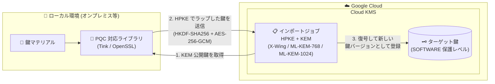

# Cloud Key Management Service (Cloud KMS): 耐量子 (Quantum-safe) 鍵インポートのサポート (Preview)

**リリース日**: 2026-08-06

**サービス**: Cloud Key Management Service (Cloud KMS)

**機能**: 耐量子 (Quantum-safe) 鍵インポート

**ステータス**: Preview

📊 [このアップデートのインフォグラフィックを見る](https://takech9203.github.io/google-cloud-news-summary/20260806-cloud-kms-quantum-safe-key-import.html)

## 概要

Cloud KMS が、耐量子 (Quantum-safe) の鍵インポートを Preview でサポートしました。オンプレミスや他環境で生成した鍵マテリアルを Cloud KMS にインポートする際、従来の RSA ベースのラッピングに代わり、ポスト量子暗号 (PQC) の標準技術である鍵カプセル化メカニズム (KEM) とハイブリッド公開鍵暗号 (HPKE) を用いて鍵を転送中に保護できます。

利用可能なインポートメソッドは以下の 3 種類です。

- `HPKE_KEM_XWING_HKDF_SHA256_AES_256_GCM`
- `HPKE_KEM_ML_KEM_768_HKDF_SHA256_AES_256_GCM`
- `HPKE_KEM_ML_KEM_1024_HKDF_SHA256_AES_256_GCM`

この機能は、将来の量子コンピュータによる「Harvest Now, Decrypt Later (HNDL: 今収集して後で復号する)」攻撃から、転送中の鍵マテリアルを保護することを目的としています。鍵の持ち込み (BYOK) を行う規制業界の組織や、耐量子暗号への移行を進めているセキュリティ組織が主な対象ユーザーです。

**アップデート前の課題**

- 従来の鍵インポートでは、ラッピング (鍵の暗号化) に RSA ベースのインポートメソッド (RSAES-OAEP、3072/4096 ビット) しか選択できなかった
- RSA などの古典暗号アルゴリズムは将来の量子コンピュータにより解読される可能性があり、転送中にラップされた鍵マテリアルを傍受・保存されると、将来復号されるリスク (HNDL 攻撃) があった

**アップデート後の改善**

- NIST FIPS-203 で標準化された ML-KEM-768 / ML-KEM-1024、および ML-KEM-768 と X25519 のハイブリッドである X-Wing を利用した耐量子の鍵インポートが可能になった
- HPKE (RFC 9180)、HKDF-SHA256、AES-256-GCM を組み合わせた標準的な PQC ツールチェーンで鍵マテリアルを転送中に保護できるようになった
- 量子時代を見据えたコンプライアンス・セキュリティ要件に対応した BYOK ワークフローを構築できるようになった

## アーキテクチャ図



ローカル環境で PQC 対応ライブラリを使い、インポートジョブの KEM 公開鍵で鍵マテリアルを HPKE ラップして Cloud KMS に送信するフローです。転送中の鍵は耐量子アルゴリズムで保護され、Cloud KMS 側でターゲット鍵の新しい鍵バージョンとして登録されます。

## サービスアップデートの詳細

### 主要機能

1. **耐量子インポートメソッド (3 種類)**
   - `HPKE_KEM_XWING_HKDF_SHA256_AES_256_GCM`: X-Wing (ML-KEM-768 と X25519 のハイブリッド KEM) を使用
   - `HPKE_KEM_ML_KEM_768_HKDF_SHA256_AES_256_GCM`: NIST FIPS-203 で標準化された ML-KEM-768 を使用
   - `HPKE_KEM_ML_KEM_1024_HKDF_SHA256_AES_256_GCM`: より大きなセキュリティマージンを持つ ML-KEM-1024 を使用

2. **HPKE ベースの鍵ラッピング**
   - HPKE (Hybrid Public Key Encryption) により、KEM で確立した共有シークレットから HKDF-SHA256 で鍵を導出し、AES-256-GCM (AEAD) で鍵マテリアルを暗号化
   - Tink や OpenSSL など、HPKE / PQC 対応の暗号ライブラリでラッピングを実施可能

3. **既存のインポートワークフローとの統合**
   - 既存の鍵インポートと同様に「ターゲット鍵の作成 → インポートジョブの作成 → 鍵のラップ → インポート」の流れで利用可能
   - gcloud CLI、Google Cloud コンソール、REST API、クライアントライブラリ (Go / Java / Node.js / Python) に対応
   - 破棄 (DESTROYED) または失敗 (IMPORT_FAILED) 状態の鍵バージョンの再インポートにも対応

## 技術仕様

### 対応 KEM アルゴリズムのサイズ (バイト)

| アルゴリズム | 公開鍵 | 暗号文 | 共有シークレット |
|------|------|------|------|
| ML_KEM_768 | 1184 | 1088 | 32 |
| ML_KEM_1024 | 1568 | 1568 | 32 |
| KEM_XWING | 1216 | 1120 | 32 |

### 主な仕様と制約

| 項目 | 詳細 |
|------|------|
| ステータス | Preview (Pre-GA Offerings Terms が適用) |
| 対応保護レベル | SOFTWARE のみ |
| KDF | HKDF-SHA256 |
| AEAD | AES-256-GCM |
| インポートジョブの有効期限 | 作成から 3 日間 (期限切れ後は再作成が必要) |
| 必要な IAM ロール | 既存鍵へのインポート: `roles/cloudkms.importer`、新規鍵へのインポート: `roles/cloudkms.admin` |

## 設定方法

### 前提条件

1. ローカルシステムに HPKE、KEM (ML-KEM-768 / ML-KEM-1024 / X-Wing)、HKDF-SHA256、AES-256-GCM をサポートする暗号ライブラリ (Tink、OpenSSL など) を用意する
2. インポートする鍵のアルゴリズムと長さが Cloud KMS でサポートされていることを確認する
3. キーリングに対して適切な IAM ロール (`roles/cloudkms.importer` または `roles/cloudkms.admin`) が付与されていることを確認する

### 手順

#### ステップ 1: ターゲット鍵とキーリングの作成

```bash
gcloud kms keyrings create KEY_RING \
    --location LOCATION

gcloud kms keys create KEY_NAME \
    --location LOCATION \
    --keyring KEY_RING \
    --purpose PURPOSE \
    --protection-level SOFTWARE \
    --skip-initial-version-creation \
    --import-only
```

`--skip-initial-version-creation` により、インポートした鍵マテリアルがバージョン 1 になります。`--import-only` を指定すると、Cloud KMS 側での鍵マテリアル生成を防止できます。

#### ステップ 2: 耐量子インポートメソッドでインポートジョブを作成

```bash
gcloud kms import-jobs create IMPORT_JOB \
    --location LOCATION \
    --keyring KEY_RING \
    --import-method hpke-kem-xwing-hkdf-sha256-aes-256-gcm \
    --protection-level software
```

インポートジョブの初期状態は `PENDING_GENERATION` で、`ACTIVE` になるとインポートに利用できます。状態は以下で確認します。

```bash
gcloud kms import-jobs describe IMPORT_JOB \
    --location LOCATION \
    --keyring KEY_RING \
    --format="value(state)"
```

#### ステップ 3: ラップした鍵をインポート

PQC 対応ライブラリでラップした鍵ファイルを指定してインポートします。

```bash
gcloud kms keys versions import \
    --location LOCATION \
    --keyring KEY_RING \
    --key KEY_NAME \
    --import-job IMPORT_JOB \
    --algorithm ALGORITHM \
    --wrapped-key-file wrapped_key.bin
```

インポートされた鍵バージョンの初期状態は `PENDING_IMPORT` で、`ENABLED` になれば成功です。対称鍵の場合は、使用前にインポートした鍵バージョンをプライマリバージョンに設定する必要があります。

## メリット

### ビジネス面

- **HNDL 攻撃への備え**: 現在傍受されたデータが将来の量子コンピュータで復号されるリスクに対し、鍵転送の段階から先回りして対策できる
- **コンプライアンス対応**: NIST FIPS-203 で標準化されたアルゴリズムを採用しており、耐量子暗号への移行を求める規制・ガイドラインへの対応を進めやすい

### 技術面

- **標準技術ベース**: HPKE (RFC 9180)、ML-KEM (FIPS-203)、X-Wing といった標準・標準化中のプロトコルを採用しており、Tink や OpenSSL などの一般的なライブラリで実装可能
- **ハイブリッド構成の選択肢**: X-Wing は ML-KEM-768 と X25519 のハイブリッドであり、PQC アルゴリズムと実績ある古典アルゴリズムの両方の保証を得られる
- **既存ワークフローとの互換性**: インポートジョブを使った既存の鍵インポート手順 (ターゲット鍵作成 → ジョブ作成 → ラップ → インポート) をそのまま踏襲できる

## デメリット・制約事項

### 制限事項

- Preview 段階のため、Pre-GA Offerings Terms が適用され、サポートが限定される場合がある
- 対応する保護レベルは SOFTWARE のみ (HSM 保護レベルでは利用不可)
- 元の鍵バージョンが RSA ベースのインポートメソッドでインポートされていた場合、耐量子メソッドでの再インポートはできない
- インポートジョブは作成から 3 日で期限切れとなり、期限切れ後は再作成が必要

### 考慮すべき点

- ローカル環境に HPKE と対象 KEM アルゴリズムをサポートする暗号ライブラリ (Tink、OpenSSL など) が必要
- 鍵マテリアルは Cloud KMS が期待するフォーマットに変換した上でラップする必要がある

## ユースケース

### ユースケース 1: 規制業界における耐量子 BYOK

**シナリオ**: 金融機関がオンプレミス HSM 環境で生成した鍵を Cloud KMS に持ち込み (BYOK)、Google Cloud 上のワークロードで利用したい。社内のセキュリティポリシーで、鍵の転送には耐量子暗号の使用が求められている。

**実装例**:
```bash
gcloud kms import-jobs create pqc-import-job \
    --location asia-northeast1 \
    --keyring finance-keyring \
    --import-method hpke-kem-ml-kem-1024-hkdf-sha256-aes-256-gcm \
    --protection-level software
```

**効果**: 鍵マテリアルの転送が ML-KEM-1024 ベースの HPKE で保護され、HNDL 攻撃のリスクを抑えつつ BYOK 要件と耐量子要件を両立できる。

### ユースケース 2: PQC 移行期におけるハイブリッド方式の採用

**シナリオ**: PQC アルゴリズム単体の実績に不安がある組織が、古典暗号と PQC の両方の安全性保証を得ながら鍵インポートを耐量子化したい。

**効果**: X-Wing (ML-KEM-768 + X25519 のハイブリッド) を採用することで、どちらか一方のアルゴリズムに問題が見つかった場合でももう一方による保護が残る、保守的な移行戦略を実現できる。

## 料金

耐量子鍵インポート固有の料金情報は、本レポート作成時点で公式ドキュメントから確認できませんでした。Cloud KMS の鍵バージョンおよびオペレーションの料金体系については、公式の料金ページを参照してください。

- [Cloud KMS 料金ページ](https://cloud.google.com/kms/pricing)

## 関連サービス・機能

- **Cloud KMS 鍵カプセル化メカニズム (KEM)**: Cloud KMS は鍵インポートに加え、`KEY_ENCAPSULATION` を目的とした KEM 鍵の作成・公開鍵取得・デカプセル化もサポートしており、耐量子暗号への対応を進めている
- **Cloud HSM / 従来の鍵インポート**: RSA ベースのインポートメソッドは SOFTWARE / HSM 保護レベルに対応。耐量子メソッドは現時点で SOFTWARE のみ
- **IAM**: 鍵インポートには `roles/cloudkms.importer` (既存鍵) または `roles/cloudkms.admin` (新規鍵) が必要
- **Tink**: Google 製のオープンソース暗号ライブラリで、鍵のラッピングに必要な HPKE / PQC アルゴリズムをサポート

## 参考リンク

- 📊 [インフォグラフィック](https://takech9203.github.io/google-cloud-news-summary/20260806-cloud-kms-quantum-safe-key-import.html)
- [公式リリースノート](https://docs.cloud.google.com/release-notes#August_06_2026)
- [ドキュメント: Quantum-safe key import](https://docs.cloud.google.com/kms/docs/quantum-safe-key-import)
- [ドキュメント: Key wrapping](https://docs.cloud.google.com/kms/docs/key-wrapping)
- [ドキュメント: Key encapsulation mechanisms](https://docs.cloud.google.com/kms/docs/key-encapsulation-mechanisms)
- [ドキュメント: Importing a key](https://docs.cloud.google.com/kms/docs/importing-a-key)
- [料金ページ](https://cloud.google.com/kms/pricing)

## まとめ

Cloud KMS の耐量子鍵インポートは、量子コンピュータ時代を見据えた「Harvest Now, Decrypt Later」攻撃対策を、鍵の持ち込み (BYOK) ワークフローに組み込める重要なアップデートです。NIST 標準の ML-KEM やハイブリッドの X-Wing を選択でき、既存のインポート手順をほぼそのまま利用できます。BYOK を運用している組織は、Preview 段階のうちに SOFTWARE 保護レベルの鍵で検証を開始し、PQC 移行計画への組み込みを検討することを推奨します。

---

**タグ**: #CloudKMS #セキュリティ #耐量子暗号 #PQC #ML-KEM #HPKE #BYOK #Preview
