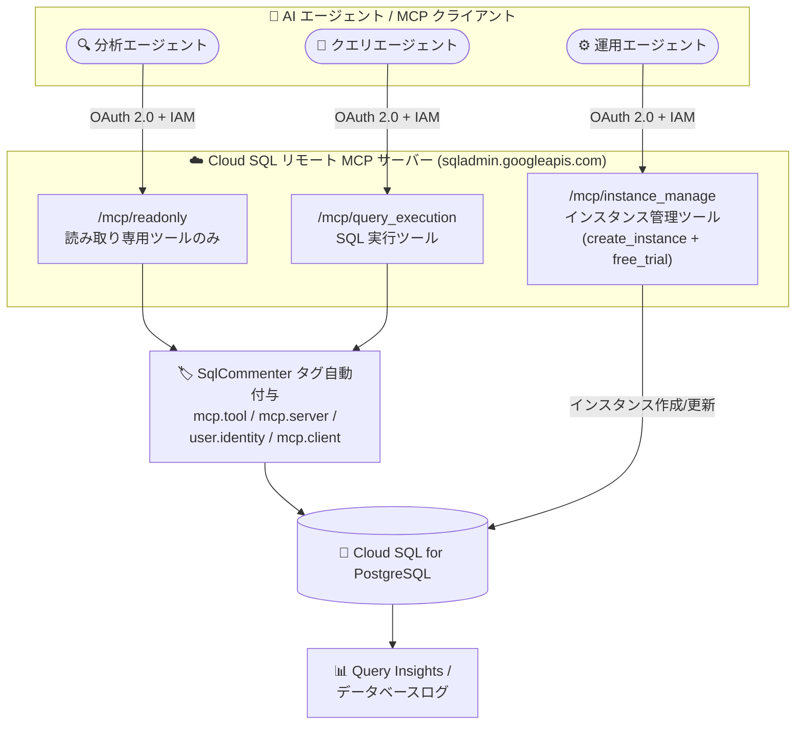

# Cloud SQL for PostgreSQL: リモート MCP サーバーの機能強化 (専用ツールセット、SqlCommenter タグ、無料トライアルインスタンス作成)

**リリース日**: 2026-08-06

**サービス**: Cloud SQL for PostgreSQL

**機能**: リモート MCP サーバーの機能強化 (専用ツールセット URL、SqlCommenter タグ自動付与、free_trial パラメータ)

**ステータス**: Feature

📊 [このアップデートのインフォグラフィックを見る](https://takech9203.github.io/google-cloud-news-summary/20260806-cloud-sql-postgresql-mcp-server-enhancements.html)

## 概要

Cloud SQL for PostgreSQL のリモート MCP (Model Context Protocol) サーバーに、3 つの機能強化が発表されました。リモート MCP サーバーは、AI エージェントや MCP クライアントから自然言語で Cloud SQL インスタンスの管理や SQL 実行を行うためのマネージドエンドポイント (`https://sqladmin.googleapis.com/mcp`) です。

1 つ目は **専用ツールセット URL (toolsets)** のサポートです。`/readonly`、`/instance_manage`、`/query_execution` という専用エンドポイント URL が追加され、セキュリティ要件やワークフローに応じて、エージェントに公開する MCP ツールのセットを制限できるようになりました。

2 つ目は **SqlCommenter タグの自動付与** です。`execute_sql` または `execute_sql_readonly` ツールで SQL クエリを実行すると、MCP サーバーが SQL ステートメントに SqlCommenter タグ (`mcp.tool`、`mcp.server`、`user.identity`、`mcp.client`) を自動的に付加し、データベースのオブザーバビリティが向上します。3 つ目は **free_trial パラメータ** の追加で、`create_instance` ツールで `free_trial` パラメータを `true` に設定することで、テスト・開発用の無料トライアルインスタンスをプロビジョニングできるようになりました。

**アップデート前の課題**

- MCP サーバーのエンドポイントは全ツールを公開する `https://sqladmin.googleapis.com/mcp` のみであり、読み取り専用の分析エージェントにもインスタンス作成・変更などの強力なツールが公開されてしまうため、エンドポイントレベルでツールの公開範囲を絞ることができなかった
- MCP ツール経由で実行された SQL ステートメントに、どのツール・どのクライアント・どのユーザーが発行したかを示すコンテキスト情報が自動付与されず、データベース側のログやクエリ分析で AI エージェント由来のクエリを識別・追跡しにくかった
- MCP の `create_instance` ツールで作成できるのは通常の課金対象インスタンスであり、無料トライアルインスタンスの作成は Google Cloud コンソールからの操作が必要だった

**アップデート後の改善**

- MCP クライアントの接続先を `/readonly`、`/instance_manage`、`/query_execution` の各ツールセット URL に切り替えるだけで、エージェントに公開するツールを用途別のサブセットに制限できるようになった (最小権限の原則をエンドポイントレベルで実現)
- `execute_sql` / `execute_sql_readonly` の実行時に SqlCommenter タグ (`mcp.tool`、`mcp.server`、`user.identity`、`mcp.client`) が SQL ステートメントへ自動付与され、どの MCP ツール・サーバー・ユーザー ID・クライアントからのクエリかをデータベース側で追跡できるようになった
- `create_instance` ツールに `free_trial: true` を指定するだけで、AI エージェント経由でも無料トライアルインスタンスを作成でき、コストをかけずにテスト・開発を開始できるようになった

## アーキテクチャ図



エージェントの役割ごとに専用ツールセット URL へ接続することで、公開される MCP ツールを制限できます。SQL 実行時には SqlCommenter タグが自動付与され、Query Insights やログでエージェント由来のクエリを追跡できます。

## サービスアップデートの詳細

### 主要機能

1. **専用ツールセット URL (toolsets)**
   - MCP クライアントの接続先エンドポイントを切り替えるだけで、公開ツールのサブセットを制御可能
   - 4 種類のエンドポイントを提供 (下表参照)。全ツール公開の従来エンドポイントも引き続き利用可能
   - セキュリティ要件 (読み取り専用に限定したい) やワークフロー要件 (インスタンス管理のみ任せたい) に応じた最小権限構成を実現

2. **SqlCommenter タグの自動付与**
   - `execute_sql` / `execute_sql_readonly` ツールの実行時に、SQL ステートメントへ SqlCommenter 形式のタグを自動付加
   - 付与されるタグ: `mcp.tool` (実行したツール名)、`mcp.server` (MCP サーバー)、`user.identity` (ユーザー ID)、`mcp.client` (MCP クライアント)
   - SqlCommenter は OpenTelemetry ベースのオープンソースライブラリで、SQL コメントとしてタグを埋め込み、アプリケーションコンテキストをデータベースへ伝搬させる仕組み。Query Insights はタグ単位で統計を集計できる

3. **create_instance ツールの free_trial パラメータ**
   - `free_trial` パラメータを `true` に設定すると、無料トライアルインスタンスをプロビジョニング
   - 無料トライアルインスタンスは最大 30 日間、費用負担なしで Cloud SQL の主要機能 (高可用性構成、Vertex AI 統合、System Insights など) をテスト可能
   - AI エージェントによる開発環境の迅速なセットアップ (インスタンス作成 → スキーマ作成 → データ投入) をコストゼロで実行できる

## 技術仕様

### ツールセット URL と公開ツール (PostgreSQL)

| ツールセット | エンドポイント URL | 公開されるツール |
|------|------|------|
| 全ツール | `https://sqladmin.googleapis.com/mcp` | すべての利用可能なツール |
| 読み取り専用 | `https://sqladmin.googleapis.com/mcp/readonly` | `get_instance`, `get_operation`, `list_instances`, `list_users`, `execute_sql_readonly`, `postgres_upgrade_precheck` |
| インスタンス管理 | `https://sqladmin.googleapis.com/mcp/instance_manage` | `clone_instance`, `create_instance`, `get_instance`, `get_operation`, `list_instances`, `postgres_upgrade_precheck`, `update_instance` |
| クエリ実行 | `https://sqladmin.googleapis.com/mcp/query_execution` | `execute_sql`, `get_operation` |

### 認証・認可

| 項目 | 詳細 |
|------|------|
| 認証プロトコル | OAuth 2.0 + IAM (API キーは非対応) |
| 対応 ID | すべての Google Cloud ID (エージェント専用の ID を分離することを推奨) |
| 主な OAuth スコープ | `cloud-platform` (全操作) / `cloudsql` (Cloud SQL 操作) / `cloudsql.readonly` (読み取り専用) |
| トランスポート | HTTP (Streamable HTTP) |

### 無料トライアルインスタンスの構成

| 項目 | 詳細 |
|------|------|
| エディション | Cloud SQL Enterprise Plus |
| マシン構成 | N2 マシンシリーズ、8 vCPU / 64 GB メモリ |
| ストレージ | 100 GB + データキャッシュ 375 GB |
| 期間 | 30 日間 (未アップグレードの場合、さらに 90 日間の猶予期間中はデータを無料保持) |
| 制約 | プロジェクトのライフサイクルにつき 1 インスタンスまで。SLA 適用外。バックアップ/リストア非対応 (削除時の最終バックアップのみ) |
| 課金対象 | インスタンス自体は無料。リージョン外へのデータ転送、公共インターネット経由の接続、最終バックアップの取得・保存には課金あり |

## 設定方法

### 前提条件

1. MCP クライアント (AI エージェント、ホストプログラム) と Google Cloud の認証情報 (OAuth 2.0 / IAM)
2. `execute_sql` / `execute_sql_readonly` を使用する場合: 対象インスタンスの `data_api_access` 設定が `ALLOW_DATA_API` であること、および IAM データベース認証が有効であること

### 手順

#### ステップ 1: ツールセット URL を選択して MCP クライアントを設定

```text
Server name : Cloud SQL MCP server
Server URL  : https://sqladmin.googleapis.com/mcp/readonly   # 用途に応じて選択
Transport   : HTTP
Auth        : Google Cloud 認証情報 / OAuth Client ID / エージェント ID
```

読み取り専用のエージェントには `/readonly`、インスタンス管理を担うエージェントには `/instance_manage`、SQL 実行専用エージェントには `/query_execution` を設定します。

#### ステップ 2: ツールの一覧を確認 (認証不要)

```bash
curl --location 'https://sqladmin.googleapis.com/mcp/readonly' \
  --header 'content-type: application/json' \
  --data '{"jsonrpc": "2.0", "method": "tools/list"}'
```

`tools/list` メソッドは認証不要で、そのエンドポイントが公開するツールの一覧を確認できます。

#### ステップ 3: 無料トライアルインスタンスの作成 (free_trial パラメータ)

```text
プロンプト例: 「free_trial を有効にして PostgreSQL のテスト用インスタンスを作成して」

エージェントの動作:
1. create_instance ツールを free_trial: true で呼び出し
2. get_operation ツールで長時間実行オペレーションのステータスをポーリング
3. 完了後、get_instance で接続メタデータを取得
```

## メリット

### ビジネス面

- **セキュリティガバナンスの強化**: エージェントの役割ごとにツール公開範囲をエンドポイントレベルで制限でき、AI エージェント導入時のリスク管理と監査対応が容易になる
- **検証コストの削減**: `free_trial` パラメータにより、エージェント主導の PoC や開発環境構築を 30 日間無料で実施できる

### 技術面

- **最小権限の多層防御**: IAM/OAuth スコープによる認可に加えて、ツールセット URL でツール自体の公開を制限する多層的なアクセス制御が可能
- **エージェント由来クエリのトレーサビリティ**: SqlCommenter タグにより、データベース側のログ・クエリ分析で「どの MCP ツール・クライアント・ユーザーが発行したクエリか」を識別でき、トラブルシューティングや監査が容易になる
- **クライアント側の実装不要**: タグ付与は MCP サーバー側で自動的に行われるため、アプリケーションやエージェント側の追加実装は不要

## デメリット・制約事項

### 制限事項

- `execute_sql` ツールのレスポンスが 10 MB を超える場合は切り捨てられる
- `execute_sql` ツールで 30 秒を超えるクエリはタイムアウトする可能性がある
- `execute_sql` は IAM データベース認証ユーザーアカウントでのみ実行可能で、SQL はその IAM ユーザーの権限で実行される
- 無料トライアルインスタンスはプロジェクトのライフサイクルにつき 1 つまで、SLA 適用外、バックアップ/リストア非対応

### 考慮すべき点

- ツールセット URL はツールの公開範囲を制限する仕組みであり、IAM 権限・OAuth スコープの適切な設定は引き続き必要
- エージェント用の ID は人間のユーザーと分離して作成し、アクセスの制御・監視を行うことが推奨されている
- 無料トライアルインスタンスは 30 日経過後にリクエストの処理を停止するため、継続利用には有料インスタンスへのアップグレードが必要

## ユースケース

### ユースケース 1: 読み取り専用の分析エージェント

**シナリオ**: 社内のデータ分析用 AI エージェントに Cloud SQL for PostgreSQL への自然言語クエリを許可したいが、インスタンスの変更や DML/DDL の実行は絶対に防ぎたい。

**実装例**:
```text
MCP クライアント設定:
  Server URL: https://sqladmin.googleapis.com/mcp/readonly
  OAuth スコープ: https://www.googleapis.com/auth/cloudsql.readonly
```

**効果**: エージェントには `execute_sql_readonly` などの読み取り専用ツールのみが公開され、書き込み系ツールはエンドポイントレベルで遮断される。OAuth スコープと組み合わせた多層防御を構成できる。

### ユースケース 2: エージェント経由クエリの監査とパフォーマンス分析

**シナリオ**: 複数の AI エージェントが同じデータベースにクエリを実行しており、負荷の高いクエリの発生源 (どのエージェント・どのユーザー) を特定したい。

**効果**: SqlCommenter タグ (`mcp.tool`、`mcp.client`、`user.identity`) が自動付与されるため、Query Insights やデータベースログでエージェント別・ユーザー別にクエリを識別し、問題の切り分けと監査が可能になる。

### ユースケース 3: コストゼロでのエージェント主導開発環境構築

**シナリオ**: 新規プロジェクトで Cloud SQL の採用を検討しており、AI エージェントに開発用データベースの構築 (インスタンス作成、テーブル作成、データ投入) を任せたいが、検証段階のコストは抑えたい。

**効果**: `create_instance` に `free_trial: true` を指定するだけで、Enterprise Plus 相当 (8 vCPU / 64 GB) のインスタンスを 30 日間無料で利用でき、エージェント主導のプロトタイピングを費用負担なく開始できる。

## 料金

Cloud SQL リモート MCP サーバー自体の追加料金に関する公式情報は確認できませんでした。無料トライアルインスタンスは、インスタンス自体とそのリソースには課金されませんが、リージョン外へのデータ転送、公共インターネット経由の接続、最終バックアップの取得・保存には課金が発生します。

Cloud SQL の料金の詳細は公式料金ページを参照してください。

- [Cloud SQL 料金ページ](https://cloud.google.com/sql/pricing)

## 利用可能リージョン

無料トライアルインスタンスは、Cloud SQL Enterprise Plus エディションがサポートされるすべてのリージョンで利用可能です。詳細は [リージョンの提供状況](https://docs.cloud.google.com/sql/docs/postgres/region-availability-overview) を参照してください。

## 関連サービス・機能

- **Cloud SQL Query Insights**: SqlCommenter タグをタグ単位で集計・可視化し、クエリパフォーマンスの分析とアプリケーションコードとの紐付けを支援する
- **IAM / IAM データベース認証**: MCP サーバーの認証・認可の基盤。`execute_sql` は IAM データベース認証ユーザーの権限で SQL を実行する
- **Secret Manager**: 組み込み認証のデータベースユーザーを MCP 経由で作成する際、パスワードをシークレットとして管理する
- **Cloud SQL for MySQL / SQL Server の MCP サーバー**: 同じ `sqladmin.googleapis.com/mcp` エンドポイント配下で提供され、ツールセット URL も同様に利用可能 (公開ツールはエンジンにより一部異なる)

## 参考リンク

- 📊 [インフォグラフィック](https://takech9203.github.io/google-cloud-news-summary/20260806-cloud-sql-postgresql-mcp-server-enhancements.html)
- [公式リリースノート](https://docs.cloud.google.com/release-notes#August_06_2026)
- [Cloud SQL MCP サーバーの使用 (PostgreSQL)](https://docs.cloud.google.com/sql/docs/postgres/use-cloudsql-mcp)
- [無料トライアルインスタンスの概要](https://docs.cloud.google.com/sql/docs/postgres/free-trial-instance)
- [無料トライアルインスタンスの作成](https://docs.cloud.google.com/sql/docs/postgres/create-free-trial-instance)
- [Query Insights の使用](https://docs.cloud.google.com/sql/docs/postgres/using-query-insights)
- [SqlCommenter 仕様](https://google.github.io/sqlcommenter/spec/)
- [料金ページ](https://cloud.google.com/sql/pricing)

## まとめ

今回のアップデートにより、Cloud SQL リモート MCP サーバーは「ツールセット URL による最小権限の公開制御」「SqlCommenter タグによるエージェント由来クエリの追跡」「free_trial パラメータによる無料検証環境の構築」という、AI エージェントを本番運用に近づけるための実用的な機能が揃いました。AI エージェントに Cloud SQL の操作を任せる場合は、まず役割に応じたツールセット URL への接続とエージェント専用 ID の分離から始めることを推奨します。

---

**タグ**: Cloud SQL, PostgreSQL, MCP, Model Context Protocol, AI エージェント, SqlCommenter, オブザーバビリティ, 無料トライアル, セキュリティ
