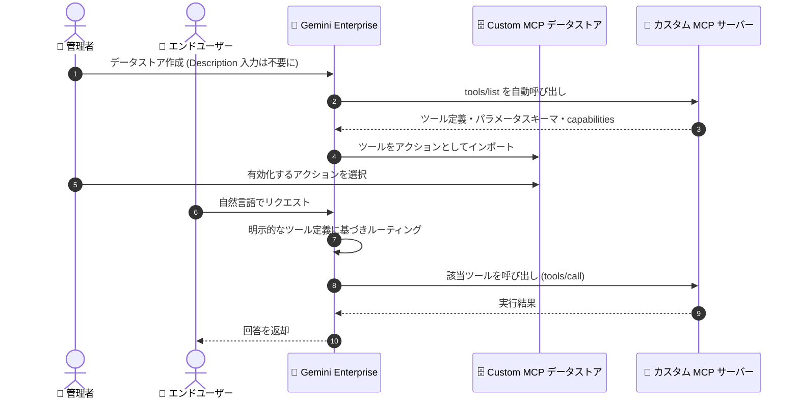

# Gemini Enterprise: Custom MCP server データストアから Description フィールドが削除

**リリース日**: 2026-08-06

**サービス**: Gemini Enterprise

**機能**: Custom MCP server データストアの Description フィールド削除

**ステータス**: Change

📊 [このアップデートのインフォグラフィックを見る](https://takech9203.github.io/google-cloud-news-summary/20260806-gemini-enterprise-custom-mcp-datastore-description-removed.html)

## 概要

Gemini Enterprise の Custom MCP server データストアのセットアップから、Description (説明) フィールドが削除されました。Gemini Enterprise は MCP サーバーの `tools/list` エンドポイントを自動的に呼び出し、ツール、パラメータスキーマ、機能 (capabilities) を直接ディスカバリして理解するため、管理者が手動で説明文を記述する必要がなくなりました。

Gemini Enterprise は、MCP サーバーから取得した明示的なツール定義とパラメータスキーマに基づいてリクエストをルーティングします。この変更により、データストアのセットアップが簡素化されるとともに、ルーティング精度が向上します。管理者が記述した説明文ではなく、MCP サーバー自身が公開する正確なツール定義がルーティングの根拠になるためです。

対象ユーザーは、Gemini Enterprise に自社製またはサードパーティの MCP サーバーを Custom MCP server データストアとして接続している (または接続を検討している) 管理者です。**既存の Custom MCP データストアに対する更新作業は一切不要**で、そのまま利用を継続できます。

**アップデート前の課題**

- Custom MCP server データストアの作成時に、管理者が Description フィールドに説明文を手動で記述する必要があった
- 手動で記述した説明文が、MCP サーバーが実際に公開するツールの内容と乖離する可能性があり、リクエストのルーティング精度に影響し得た
- セットアップ手順に入力項目が多く、データストア作成の手間が大きかった

**アップデート後の改善**

- Gemini Enterprise が MCP サーバーの `tools/list` エンドポイントを自動的に呼び出し、ツール・パラメータスキーマ・機能を直接ディスカバリするため、説明文の記述が不要になった
- 明示的なツール定義とパラメータスキーマに基づいてリクエストがルーティングされるため、ルーティング精度が向上した
- Description フィールドの入力が不要になり、データストアのセットアップが簡素化された
- 既存の Custom MCP データストアは変更不要で、そのまま新しい挙動の恩恵を受けられる

## アーキテクチャ図



Gemini Enterprise が `tools/list` エンドポイントを自動的に呼び出してツールをディスカバリし、取得した明示的なツール定義とパラメータスキーマに基づいてユーザーリクエストを適切なツールへルーティングするフローです。管理者による Description の手動記述は不要になりました。

## サービスアップデートの詳細

### 主要機能

1. **`tools/list` による自動ツールディスカバリ**
   - Gemini Enterprise が MCP サーバーの `tools/list` エンドポイントを呼び出し、利用可能なツール、パラメータスキーマ、capabilities を直接取得する
   - MCP 仕様で「tools」と呼ばれるものは、Gemini Enterprise のデータストアでは「アクション」として表示される (両者は同義)
   - データストアの「Actions」画面で「Reload custom actions」を実行すると、`tools/list` 呼び出しによりツール一覧が再取得される

2. **明示的なツール定義に基づくルーティング**
   - Gemini Enterprise は、管理者が記述した説明文ではなく、MCP サーバーが公開するツール定義とパラメータスキーマを使用してリクエストをルーティングする
   - ツールの実装 (MCP サーバー側の定義) が単一の情報源となるため、ルーティング精度が向上する

3. **セットアップの簡素化**
   - データストア作成フローから Description フィールドが削除され、入力項目が減少
   - 既存の Custom MCP データストアへの更新作業は不要

## 技術仕様

### Custom MCP server データストアの主な仕様

| 項目 | 詳細 |
|------|------|
| ステータス | Custom MCP Server コネクタは Preview |
| トランスポート | StreamableHTTP のみサポート (HTTPS 必須、URL は `/mcp` で終わることが多い) |
| 認証方式 | No authentication または OAuth 2.0 (PKCE サポートあり) |
| ツールディスカバリ | `tools/list` エンドポイントの自動呼び出し |
| アクションの有効化 | デフォルトで全アクション無効。一度に最大 100 アクションまで有効化可能 |
| Agent Gateway | この方法で追加した MCP サーバーへのトラフィックは Agent Gateway を経由せず、Agent Gateway ポリシーは適用されない |

### ツールアノテーションによるユーザー確認の制御

MCP サーバー側のツール定義にアノテーションを設定することで、アクション実行時のユーザー確認の要否を制御できます。デフォルトでは、すべてのアクション呼び出しにユーザー確認が必要です (破壊的操作の可能性を想定するため)。

```python
# Python (MCP SDK) の例: 読み取り専用ツールで確認をスキップ
@mcp.tool(annotations={
    "destructiveHint": False,
    "readOnlyHint": True
})
```

- `readOnlyHint`: 非破壊的でデータ読み取りのみの操作に付与すると、ユーザー確認をバイパスする
- `destructiveHint`: データを変更するツールに明示的に付与し、デフォルトの確認動作を維持する

## 設定方法

### 前提条件

1. Custom MCP データストア作成をブロックする組織ポリシー制約のオーバーライド
2. MCP サーバー URL・認可 URL・トークン URL の FQDN を許可済み Egress FQDN に追加 (ドメイン名のみでよい)
3. プロジェクト強制または VPC Service Controls 保護が有効な場合、`custom_mcp` を許可データソースに追加
4. データストア作成者への Discovery Engine 編集者ロール (`roles/discoveryengine.editor`) の付与
5. OAuth 認証を使う場合: ID プロバイダー (Okta、Azure AD、Google など) に Gemini Enterprise を OAuth クライアントとして登録 (リダイレクト URL: `https://vertexaisearch.cloud.google.com/oauth-redirect`) し、`client_id` と `client_secret` を取得

### 手順

#### ステップ 1: データストアの作成

1. Google Cloud コンソールで Gemini Enterprise ページに移動し、ナビゲーションメニューの「Data stores」をクリック
2. 「Create data store」をクリックし、データソース検索で「Custom MCP Server」を選択して「Add MCP server」をクリック
3. 認証設定 (No authentication または OAuth 2.0) を選択し、MCP Server URL などを入力して「Verify Auth」→「Continue」
4. データコネクタのロケーション (マルチリージョン) とデータストア名を入力して「Create」

Description フィールドの入力は不要です。データストアの状態が「Creating」から「Active」に変わると利用可能になります。

#### ステップ 2: アクションの有効化

1. 作成した Custom MCP server データストアを開き、「Actions」>「Reload custom actions」をクリック (この操作で `tools/list` が呼び出され、利用可能なツールが表示される)
2. 有効化するアクションを選択し、「Enable actions」をクリック

デフォルトではすべてのアクションが無効のため、この有効化操作が必須です。

## メリット

### ビジネス面

- **セットアップ工数の削減**: Description の記述・メンテナンスが不要になり、MCP サーバー接続のオンボーディングが迅速化する
- **移行作業ゼロ**: 既存の Custom MCP データストアは更新不要で、そのまま新しい挙動に移行する

### 技術面

- **ルーティング精度の向上**: 手動記述の説明文ではなく、MCP サーバーが公開する明示的なツール定義とパラメータスキーマに基づいてルーティングされるため、記述の乖離による誤ルーティングを防げる
- **単一の情報源 (Single Source of Truth)**: ツールの説明・スキーマは MCP サーバー側の定義に一元化され、サーバー側の更新が「Reload custom actions」で反映される

## デメリット・制約事項

### 制限事項

- Custom MCP Server コネクタは Preview 段階の機能
- サポートされるトランスポートは StreamableHTTP のみ (HTTPS 必須)
- 有効化できるアクションは一度に最大 100 個まで
- この方法で追加した MCP サーバーへのトラフィックは Agent Gateway を経由せず、Agent Gateway ポリシーが適用されない

### 考慮すべき点

- ルーティングが MCP サーバー側のツール定義に依存するため、MCP サーバー側でツール名・description・パラメータスキーマを明確かつ正確に定義することがこれまで以上に重要になる
- ツール定義を変更した場合は「Reload custom actions」で再取得しないと反映されない
- 読み取り専用ツールで確認ダイアログをスキップしたい場合は、MCP サーバー側で `readOnlyHint` アノテーションの設定が必要

## ユースケース

### ユースケース 1: 社内 API を MCP サーバー経由で Gemini Enterprise に接続

**シナリオ**: 社内の在庫管理 API を StreamableHTTP 対応の MCP サーバーとしてラップし、Gemini Enterprise から自然言語で在庫照会できるようにしたい。

**実装例**:
```python
# MCP サーバー側でツールを定義 (description とスキーマがそのままルーティングに使われる)
@mcp.tool(annotations={"readOnlyHint": True, "destructiveHint": False})
def get_inventory(product_id: str) -> dict:
    """指定した product_id の在庫数と倉庫所在地を返す"""
    ...
```

**効果**: データストア作成時に説明文を書く必要がなく、`tools/list` で取得されたツール定義に基づいて正確にルーティングされる。読み取り専用アノテーションによりユーザー確認もスキップされ、スムーズな体験を提供できる。

### ユースケース 2: 既存の Custom MCP データストアの継続利用

**シナリオ**: すでに複数の Custom MCP server データストアを運用しており、今回の変更への対応要否を確認したい。

**効果**: 既存のデータストアには一切の更新が不要。`tools/list` による自動ディスカバリと明示的ツール定義ベースのルーティングが適用され、ルーティング精度向上の恩恵をそのまま受けられる。

## 料金

このアップデート自体による追加料金はありません。Gemini Enterprise の料金の詳細は公式料金ページを参照してください。

- [Gemini Enterprise の料金](https://cloud.google.com/gemini-enterprise/pricing)

## 関連サービス・機能

- **Model Context Protocol (MCP)**: ツール定義・`tools/list`・アノテーション (`readOnlyHint` / `destructiveHint`) などの仕様を定めるオープンプロトコル。今回の変更は MCP のネイティブなディスカバリ機構への準拠を強めるもの
- **Agent Gateway**: Gemini Enterprise エージェントプラットフォームのゲートウェイ。ただし Custom MCP server データストア経由のトラフィックは Agent Gateway を経由しない点に注意
- **VPC Service Controls**: プロジェクトが VPC SC で保護されている場合、`custom_mcp` を許可データソースに追加する必要がある
- **IAM (Discovery Engine 編集者ロール)**: データストア作成に `roles/discoveryengine.editor` が必要

## 参考リンク

- 📊 [インフォグラフィック](https://takech9203.github.io/google-cloud-news-summary/20260806-gemini-enterprise-custom-mcp-datastore-description-removed.html)
- [公式リリースノート](https://docs.cloud.google.com/release-notes#August_06_2026)
- [Set up a custom MCP server (公式ドキュメント)](https://docs.cloud.google.com/gemini/enterprise/docs/connectors/custom-mcp-server/set-up-custom-mcp-server)
- [Gemini Enterprise の料金](https://cloud.google.com/gemini-enterprise/pricing)

## まとめ

Custom MCP server データストアから Description フィールドが削除され、Gemini Enterprise が `tools/list` による自動ディスカバリと明示的なツール定義に基づくルーティングへ完全に移行しました。既存データストアへの対応は不要ですが、ルーティング品質が MCP サーバー側のツール定義に直接依存するようになるため、MCP サーバーを開発・運用しているチームはツール名・説明・パラメータスキーマの品質を改めて見直すことを推奨します。

---

**タグ**: #GeminiEnterprise #MCP #ModelContextProtocol #DataStore #Connector #AI #Agent
