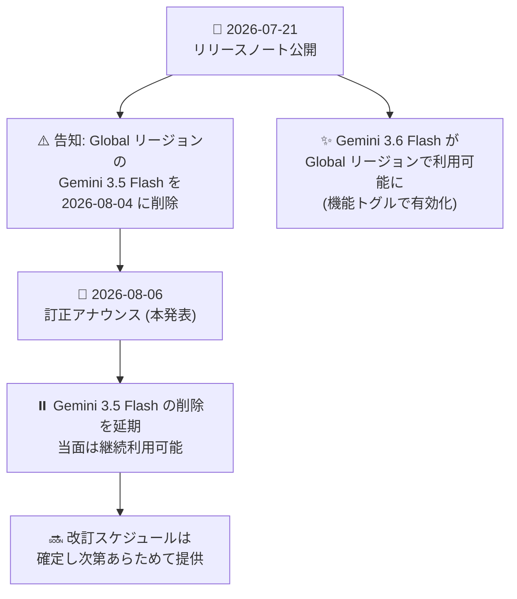

# Gemini Enterprise: Global リージョンにおける Gemini 3.5 Flash 削除の延期

**リリース日**: 2026-08-06

**サービス**: Gemini Enterprise

**機能**: Global リージョンにおける Gemini 3.5 Flash モデル削除スケジュールの延期 (2026 年 7 月 21 日付リリースノートの訂正)

**ステータス**: Announcement

📊 [このアップデートのインフォグラフィックを見る](https://takech9203.github.io/google-cloud-news-summary/20260806-gemini-enterprise-gemini-3-5-flash-removal-postponed.html)

## 概要

Google Cloud は 2026 年 8 月 6 日、Gemini Enterprise アプリの Global リージョンから Gemini 3.5 Flash モデルを削除する計画を延期したと発表しました。これは 2026 年 7 月 21 日付リリースノートの訂正 (correction) にあたるアナウンスです。改訂後の削除スケジュールは、確定し次第あらためて提供される予定です。

もともと 2026 年 7 月 21 日付のリリースノートでは、「Gemini Enterprise アプリの Global リージョンから Gemini 3.5 Flash を 2026 年 8 月 4 日に削除する」と告知されていました。同日には後継となる Gemini 3.6 Flash が Global リージョンで利用可能になっており (管理者が機能トグルを有効化することで利用可能)、Gemini 3.5 Flash から Gemini 3.6 Flash への移行が想定されたスケジュールでした。

今回の延期により、Gemini Enterprise アプリの Global リージョンで Gemini 3.5 Flash を利用中の組織は、当面引き続き同モデルを利用できます。ただし削除自体が撤回されたわけではなく、改訂スケジュールが後日公表されるため、管理者は移行準備を継続しつつ、リリースノートの続報を注視する必要があります。

**アップデート前の状況 (2026 年 7 月 21 日付リリースノート)**

- Gemini Enterprise アプリの Global リージョンから Gemini 3.5 Flash が 2026 年 8 月 4 日に削除されると告知されていた
- 利用組織は 2026 年 8 月 4 日を期限として、Gemini 3.6 Flash などへの移行計画を立てる必要があった

**アップデート後の変更 (本アナウンス)**

- Global リージョンからの Gemini 3.5 Flash の削除が延期された
- 改訂後の削除スケジュールは、確定し次第提供される
- 利用組織は当面 Gemini 3.5 Flash を継続利用できるが、削除計画自体は継続しているため移行準備は引き続き必要

## アーキテクチャ図

2026 年 7 月 21 日の削除告知から今回の延期発表までのタイムラインを示しています。削除は延期されましたが撤回ではなく、改訂スケジュールが後日公表されます。

## サービスアップデートの詳細

### 主要な変更点

1. **Gemini 3.5 Flash 削除の延期**
   - Gemini Enterprise アプリの Global リージョンからの Gemini 3.5 Flash 削除 (当初 2026 年 8 月 4 日予定) が延期された
   - 本アナウンスは 2026 年 7 月 21 日付リリースノートの訂正として公開された

2. **改訂スケジュールは後日提供**
   - 新しい削除日は現時点で未定
   - 改訂後の削除スケジュールは、確定し次第リリースノートなどで提供される

3. **後継モデル Gemini 3.6 Flash は利用可能**
   - 2026 年 7 月 21 日より Gemini 3.6 Flash が Global リージョンで利用可能
   - Gemini Enterprise アプリでユーザーに提供するには、管理者が Gemini 3.6 Flash の機能トグルを有効化する必要がある
   - Agent Designer のワークフローエージェントでも利用可能 (反映まで最大 1 日)

## 考慮すべき点

- 削除は「延期」であり「撤回」ではない。Gemini 3.5 Flash から Gemini 3.6 Flash などへの移行準備は引き続き進めておくことが推奨される
- 改訂スケジュールの公表時期は未定のため、Gemini Enterprise のリリースノートを定期的に確認する必要がある
- 本アナウンスは Gemini Enterprise アプリの Global リージョンにおけるモデル提供に関するものであり、Vertex AI (Gemini Enterprise Agent Platform) 上の Gemini 3.5 Flash モデル自体のライフサイクル (GA、リタイア日: 2027 年 5 月 19 日以降) とは別の話である点に注意

## 関連サービス・機能

- **Gemini 3.6 Flash**: Global リージョンで利用可能な後継モデル。管理者が機能トグルで有効化して移行を進められる
- **Gemini Enterprise 機能管理 (Manage features on the web app)**: Gemini Enterprise アプリで利用可能なモデル・機能のトグル管理を行う機能。今回のモデル提供変更に直接関係する

## 参考リンク

- 📊 [インフォグラフィック](https://takech9203.github.io/google-cloud-news-summary/20260806-gemini-enterprise-gemini-3-5-flash-removal-postponed.html)
- [公式リリースノート](https://docs.cloud.google.com/release-notes#August_06_2026)
- [Gemini Enterprise リリースノート (2026 年 7 月 21 日: 当初の削除告知)](https://docs.cloud.google.com/gemini/enterprise/docs/release-notes#July_21_2026)
- [Manage features on the web app](https://docs.cloud.google.com/gemini/enterprise/docs/manage-web-app-features)
- [Data residency for Gemini Enterprise Standard and Plus Editions](https://docs.cloud.google.com/gemini/enterprise/docs/locations)

## まとめ

Gemini Enterprise アプリの Global リージョンにおける Gemini 3.5 Flash の削除 (当初 2026 年 8 月 4 日予定) が延期され、改訂スケジュールは後日公表されることになりました。利用組織は当面同モデルを継続利用できますが、削除計画自体は継続しているため、Gemini 3.6 Flash への移行検証を進めつつ、リリースノートの続報を確認することを推奨します。

---

**タグ**: Gemini Enterprise, Gemini 3.5 Flash, Gemini 3.6 Flash, モデルライフサイクル, 削除延期, Global リージョン, Announcement
