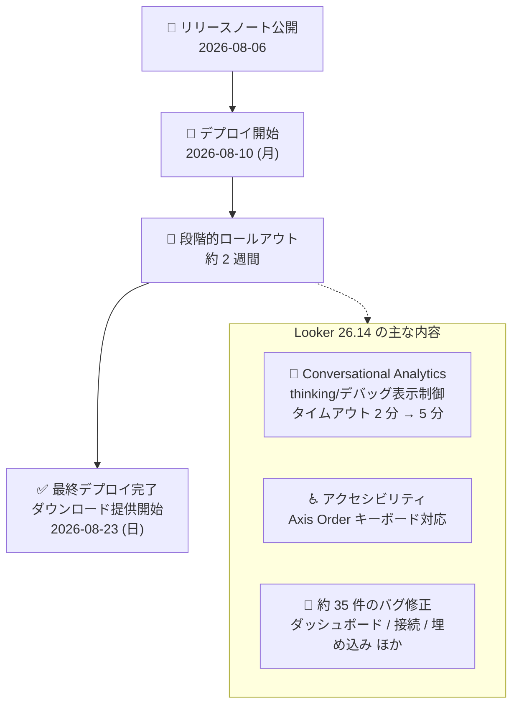

# Looker: Looker 26.14 リリースのロールアウト開始

**リリース日**: 2026-08-06

**サービス**: Looker

**機能**: Looker 26.14 リリース (新機能・変更・バグ修正)

**ステータス**: Announcement (ロールアウトスケジュール発表)

📊 [このアップデートのインフォグラフィックを見る](https://takech9203.github.io/google-cloud-news-summary/20260806-looker-26-14-release.html)

## 概要

Looker 26.14 が Looker (original) インスタンスに対して以下のスケジュールでロールアウトされることが発表されました。

- **デプロイ開始予定**: 2026 年 8 月 10 日 (月)
- **最終デプロイ完了・ダウンロード提供開始予定**: 2026 年 8 月 23 日 (日)

Looker のバージョン番号は「X.Y.Z」形式 (X = 西暦下 2 桁、Y = 月ごとのバージョン、Z = パッチ番号) で採番されており、26.14 は 2026 年の 8 番目のマイナーリリースにあたります。新しいマイナーバージョンは約 2 週間かけて段階的にデプロイされます。

26.14 の目玉は Conversational Analytics (会話型分析) 関連の強化です。データエージェントの編集者が「思考プロセス (thinking)」や「デバッグ情報」の表示可否を制御できるようになったほか、クエリタイムアウトが 2 分から 5 分に延長されました。また、可視化エディタのアクセシビリティ改善 (Axis Order のキーボード操作対応) と、約 35 件のバグ修正が含まれます。

**アップデート前の課題**

- Conversational Analytics データエージェントの応答に含まれる思考プロセスやデバッグ情報の表示可否を、エージェント編集者が細かく制御できなかった
- Conversational Analytics のクエリタイムアウトが 2 分であり、複雑な分析クエリが完了前にタイムアウトすることがあった
- 可視化エディタの Y タブにある Axis Order (軸の順序) オプションがキーボード入力に対応しておらず、スクリーンリーダーからもアクセスできなかった
- Snowflake 接続での大規模クエリが SSL エラー (`SSLHandshakeException`) で失敗する、cookieless embedding 利用時にマージ結果ページが 403 エラーを返す、Workforce Identity (BYOID) ユーザーのスケジュールジョブが IAM ログインエラーで失敗するなど、多数の既知の不具合が存在した

**アップデート後の改善**

- データエージェントの編集者が、応答生成時に思考プロセス (推論ステップ、生成された Looker クエリ、基になるデータテーブル) やデバッグ情報を表示するかどうかを指定できるようになった
- データエージェントがクエリ結果を最終応答ではなく思考プロセス内に表示するようになり、最終応答がより簡潔になった
- Conversational Analytics のクエリタイムアウトが 5 分に延長され、複雑なクエリの完了率が向上した
- Axis Order オプションのキーボード入力対応とスクリーンリーダー対応により、アクセシビリティが向上した
- ダッシュボード、接続、埋め込み、LookML 開発などの領域で約 35 件のバグが修正された

## アーキテクチャ図

Looker 26.14 のロールアウトタイムラインと主な変更内容です。8 月 10 日から約 2 週間かけて Looker (original) インスタンスへ段階的にデプロイされます。

## サービスアップデートの詳細

### 主要機能

1. **Conversational Analytics: thinking / デバッグ情報の表示制御 (Feature)**
   - データエージェントの編集者が、エージェントが応答を生成する際に思考プロセスやデバッグ情報を表示するかどうかを指定できるようになった
   - エージェント設定の Advanced options で「Show thinking」(推論ステップ、生成された Looker クエリ、基になるデータテーブルを表示) と「Show debug info」(応答ごとに実行されたステップを表示し、トラブルシューティングに活用) をトグルで制御できる

2. **Conversational Analytics: 応答表示とタイムアウトの変更 (Change)**
   - データエージェントがクエリ結果を最終応答ではなく思考プロセス (thinking) 内に表示するようになった
   - Conversational Analytics クエリのタイムアウトが 2 分から 5 分に延長された

3. **可視化エディタ: Axis Order のキーボード対応 (Feature)**
   - 可視化エディタの Y タブにある Axis Order オプションがキーボード入力に対応した
   - 併せて、Axis Order セクションの項目がスクリーンリーダーからアクセスできない問題も修正された

### 主なバグ修正 (カテゴリ別)

約 35 件の修正が含まれます。主なものをカテゴリ別に整理します。

| カテゴリ | 主な修正内容 |
|------|------|
| ダッシュボード・可視化 | `string_filter` 型フィルタが候補未設定時に無限にスピンする問題、ダッシュボードからの可視化編集時にタイルヘッダーが Explore に重なる問題、LookML ドリルリンク / Liquid 変数がテーブルセル内で正しく描画されない問題、Timeline / Waterfall チャートの描画不具合、カスタムテーマのカラーコレクションがデフォルトに戻る問題 |
| 接続・認証 | Snowflake 接続の大規模クエリが `SSLHandshakeException` で失敗する問題、データベース接続パラメータ更新後も非管理者ユーザーの OAuth トークンが有効なまま残る問題、混在ロールのユーザーが閲覧専用プロジェクトの OAuth 接続を再認可できない問題、Workforce Identity (BYOID) ユーザー所有のスケジュールジョブが IAM ログインエラーで失敗する問題 |
| 埋め込み | cookieless embedding 利用時にマージ結果ページが一定時間の無操作後に 403 エラーを返す問題、埋め込みユーザー名が長い場合に Conversational Analytics エージェントカードの Explore 一覧が見切れる問題 |
| LookML 開発・デプロイ | 空の `value_format` パラメータの検証で 500 エラーが発生する問題、プロジェクト名が 64 文字を超えると LookML ダッシュボードのデプロイに失敗する問題、フィールドピッカーのラベル検索で空文字の `group_label` が検索できない問題 |
| Self-service Explore | スプレッドシートからの Explore 作成時に不正な SQL が生成される問題、データ更新が汎用エラーで失敗する問題、空のキャンバスから作成したモデルの変更で `Resource already exists` エラーが発生する問題 |
| エクスポート・キャッシュ | ピボットを使用したタイルの XLSX 出力で列番号の問題、テーブル計算の変更時にキャッシュを使わず新規クエリを実行してしまう問題 |
| Conversational Analytics | ダッシュボード利用中に全画面ボタンでチャットビューが消える問題、削除済みエージェント / Explore を使ったチャットを削除・復元できない問題、ネットワーク障害時により分かりやすいエラーを表示するよう改善 |
| その他 | Looker (Google Cloud core) で Admin via IAM 権限のユーザーが Marketplace を有効化できない問題、一部の文字が HTML エンティティとして表示される問題 (例: `"` が `&quot;` と表示)、Extension SDK のタイムアウト設定がデフォルト値 (120 秒) にリセットされる問題 |

## 技術仕様

### ロールアウトスケジュール

| 項目 | 詳細 |
|------|------|
| 対象 | Looker (original) インスタンス |
| デプロイ開始予定 | 2026 年 8 月 10 日 (月) |
| 最終デプロイ完了・ダウンロード提供開始予定 | 2026 年 8 月 23 日 (日) |
| バージョン番号 | 26.14 (2026 年、月ベースの偶数採番による 8 月リリース) |

### Conversational Analytics データエージェントの Advanced options

| 設定 | 動作 |
|------|------|
| Show thinking | 応答にエージェントの推論ステップ、生成された Looker クエリ、基になるデータテーブルを表示 |
| Show debug info | 応答ごとにエージェントが実行したステップを表示 (トラブルシューティング用) |
| クエリタイムアウト | 2 分 → 5 分に延長 |

## メリット

### ビジネス面

- **AI 応答の透明性向上**: エージェントの思考プロセスを表示することで、ビジネスユーザーが AI の回答根拠を確認でき、分析結果への信頼性が高まる
- **エンドユーザー体験の制御**: 逆に思考プロセスを非表示にすることで、埋め込み環境などでシンプルな応答だけを見せる設計も可能になる

### 技術面

- **複雑なクエリへの対応力向上**: タイムアウト延長 (2 分 → 5 分) により、複雑な分析クエリの完了率が向上
- **運用課題の解消**: Snowflake SSL エラー、cookieless embedding の 403 エラー、Workforce Identity のスケジュールジョブ失敗など、運用に影響する多数の不具合が修正
- **アクセシビリティ改善**: Axis Order のキーボード操作・スクリーンリーダー対応

## デメリット・制約事項

### 考慮すべき点

- 日付は「予定 (expected)」であり、変更される可能性がある
- Conversational Analytics のクエリ結果が最終応答ではなく thinking 内に表示されるよう変更されるため、thinking を非表示にしている場合のユーザー体験を事前に確認しておくことが望ましい
- 段階的ロールアウトのため、インスタンスにより 26.14 が適用されるタイミングが異なる (8 月 10 日〜 23 日の間)
- customer-hosted インスタンスの場合、最終デプロイ完了日以降にダウンロード可能となる

## ユースケース

### ユースケース 1: 埋め込みアプリでの AI 応答のシンプル化

**シナリオ**: 顧客向けポータルに Looker の Conversational Analytics を埋め込んでいる SaaS 事業者が、エンドユーザーには簡潔な回答のみを表示したい。

**効果**: エージェント編集者が「Show thinking」「Show debug info」をオフにすることで、内部的な推論ステップや生成クエリを隠し、最終回答のみのクリーンな UI を提供できる。

### ユースケース 2: データアナリストによるエージェントのチューニング

**シナリオ**: データチームが部門向けデータエージェントの回答精度を検証・改善したい。

**効果**: 「Show thinking」「Show debug info」を有効にすることで、エージェントがどの Explore・フィールドを選択し、どのようなクエリを生成したかを確認でき、インストラクションの改善サイクルを高速化できる。タイムアウト延長により、複雑な検証クエリも完了しやすくなる。

## 関連サービス・機能

- **Conversational Analytics (Gemini in Looker)**: 今回のリリースで最も強化された領域。自然言語で Looker のデータに質問できる機能で、データエージェント、ダッシュボードエージェントなどの形態がある
- **Looker (Google Cloud core)**: Google Cloud 統合版の Looker。今回のリリースノートには Admin via IAM 権限に関する修正など、Looker (Google Cloud core) 向けの修正も含まれる
- **Workforce Identity Federation (BYOID)**: 外部 ID プロバイダーによる認証。今回のリリースでスケジュールジョブの失敗問題が修正された
- **Looker Extension SDK**: Looker 上でカスタムアプリケーションを構築するための SDK。タイムアウト設定がリセットされる問題が修正された

## 参考リンク

- 📊 [インフォグラフィック](https://takech9203.github.io/google-cloud-news-summary/20260806-looker-26-14-release.html)
- [公式リリースノート](https://docs.cloud.google.com/release-notes#August_06_2026)
- [Looker リリースプロセスの概要](https://docs.cloud.google.com/looker/docs/release-overview)
- [Conversational Analytics データエージェントの作成と編集](https://docs.cloud.google.com/looker/docs/conversational-analytics-looker-data-agents)
- [Conversational Analytics ダッシュボードエージェント](https://docs.cloud.google.com/looker/docs/conversational-analytics-looker-data-agents-dashboards)

## まとめ

Looker 26.14 は、Conversational Analytics の透明性制御 (thinking / デバッグ表示のトグル) とタイムアウト延長を中心に、アクセシビリティ改善と約 35 件のバグ修正を含むリリースです。8 月 10 日からのロールアウトに備え、Conversational Analytics を利用している場合はクエリ結果の表示位置変更 (最終応答 → thinking 内) の影響を確認し、Snowflake 接続や cookieless embedding で既知の問題に遭遇していた場合はアップグレード後に解消を確認することを推奨します。

---

**タグ**: Looker, Conversational Analytics, Gemini, BI, リリースノート, バグ修正, アクセシビリティ
