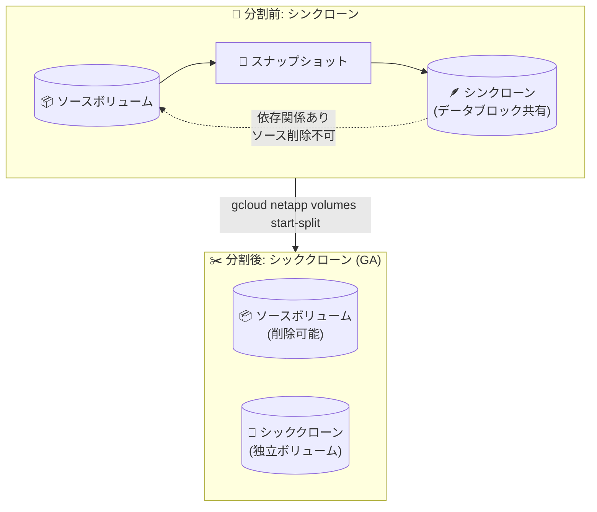

# Google Cloud NetApp Volumes: Flex Unified Default-mode でシッククローン (シンクローン分割) が GA

**リリース日**: 2026-08-06

**サービス**: Google Cloud NetApp Volumes

**機能**: Flex Unified Default-mode サービスレベルにおけるシッククローン (シンクローン分割) 機能

**ステータス**: GA (一般提供)

📊 [このアップデートのインフォグラフィックを見る](https://takech9203.github.io/google-cloud-news-summary/20260806-netapp-volumes-thick-clone-flex-ga.html)

## 概要

Google Cloud NetApp Volumes の Flex Unified Default-mode サービスレベルで、シッククローン (シンクローン分割: thin clone split) 機能が一般提供 (GA) になりました。本機能は 2026 年 7 月 2 日に Preview として発表されており、約 1 か月で GA に昇格した形です。

Flex Unified サービスレベルでは、スナップショットからボリュームを作成するとデフォルトでシンクローンが作成されます。シンクローンはソースボリュームとデータブロックを共有するため、ボリュームサイズにかかわらず数秒で作成でき、初期の追加容量消費もわずかです。一方で、ソースボリュームとの依存関係が残るため、クローンが存在する間はソースボリュームを削除できないという制約があります。今回 GA となった分割機能により、共有ブロックをすべてクローン側へコピーしてソースボリュームから完全に独立したシッククローンへ変換できるようになりました。

対象ユーザーは、Flex Unified Default-mode でテスト・開発環境のボリューム複製を運用しているストレージ管理者や、クローンを長期利用する際にソースボリュームとのライフサイクルを分離したいユーザーです。

**アップデート前の課題**

- Flex Unified Default-mode ではシンクローンをソースボリュームから独立させる手段が GA として提供されておらず、クローンが存在する限りソースボリュームを削除できなかった
- シンクローンの元になったスナップショットは、そのクローンを削除するまで削除できなかった
- ONTAP-mode ではシンクローン分割が 2026 年 5 月に GA 済みだったが、Default-mode では 2026 年 7 月時点で Preview 提供にとどまっていた

**アップデート後の改善**

- シンクローンを分割 (split) してシッククローンへ変換し、ソースボリュームから完全に独立したボリュームとして扱えるようになった
- 分割後はソースボリュームの削除やライフサイクル管理をクローンと切り離して行えるようになった
- Google Cloud コンソールおよび gcloud CLI から分割操作と進行状況の監視が可能になり、本番環境でも SLA の対象となる GA 機能として利用できるようになった

## アーキテクチャ図



シンクローンはソースボリュームとデータブロックを共有し依存関係を持ちますが、分割操作により共有ブロックがすべてクローンへコピーされ、相互に独立した 2 つのボリュームになります。

## サービスアップデートの詳細

### 主要機能

1. **シンクローンの分割 (thin clone split)**
   - シンクローンとソースボリューム間で共有されているデータブロックを、共有がなくなるまでクローン側へコピーする
   - 分割完了後、2 つのボリュームは完全に独立し、ソースボリュームの削除が可能になる

2. **コンソールと gcloud CLI からの操作**
   - Google Cloud コンソールのボリューム一覧、ソースボリューム詳細ページの「Associated clones」セクション、クローンボリューム詳細ページのいずれからも「Split clone」を実行可能
   - `gcloud netapp volumes start-split` で分割を開始し、`gcloud netapp volumes get-split-status` で進行状況を監視できる

3. **各サービスレベルにおけるクローン動作の統一**
   - Standard / Premium / Extreme / Flex File サービスレベルでは、クローンは作成直後に自動分割される常時シッククローン
   - Flex Unified ではデフォルトでシンクローンが作成され、必要に応じて明示的に分割してシッククローン化するという選択が可能

## 技術仕様

### クローン方式の比較

| 項目 | シンクローン | シッククローン (分割後) |
|------|------------|----------------------|
| 対象サービスレベル | Flex Unified (デフォルト) | Standard / Premium / Extreme / Flex File (常時)、Flex Unified (分割後) |
| 作成速度 | 数秒 (ボリュームサイズ非依存) | シンクローンと同等の速度で作成後、分割処理 |
| 容量消費 | 初期はほぼゼロ、書き込みに応じて増加 | プロビジョニングサイズ分を独立して消費 |
| ソースボリュームへの依存 | あり (ソース削除不可) | なし (完全に独立) |
| レプリケーション | 分割中は不可、分割完了後に利用可能 | 利用可能 |

### 分割の前提条件

- 分割後のクローンボリュームのフルプロビジョニングサイズを収容できる空き容量がストレージプールに必要
- 分割対象クローンの子クローンを事前に削除すること
- 分割対象クローンのバックアップを事前に削除すること
- 分割対象クローンのレプリケーションを停止・削除すること

### 分割中の制限

分割処理の実行中は、以下の操作ができません。

- スケジュールされたスナップショット・バックアップの作成・管理・実行
- 新しいシンクローンやレプリケーションの作成
- 分割中ボリュームのリバート (revert)

## 設定方法

### 前提条件

1. Flex Unified Default-mode サービスレベルのストレージプールに、シンクローン (スナップショットから作成したボリューム) が存在すること
2. ストレージプールに分割後の容量を収容できる空き容量があること (不足している場合はプール容量を増やしてから再実行)

### 手順

#### ステップ 1: クローンの分割を開始する

```bash
gcloud netapp volumes start-split CLONE_VOLUME_NAME \
  --project=PROJECT_ID \
  --location=LOCATION \
  --source-volume=SOURCE_VOLUME_NAME
```

`CLONE_VOLUME_NAME` に分割したいクローンボリューム名、`SOURCE_VOLUME_NAME` にクローンの作成元ボリューム名を指定します。コンソールの場合は、ボリューム一覧またはクローンボリューム詳細ページから「Split clone」を選択します。

#### ステップ 2: 分割の進行状況を監視する

```bash
gcloud netapp volumes get-split-status CLONE_VOLUME_NAME \
  --project=PROJECT_ID \
  --location=LOCATION \
  --source-volume=SOURCE_VOLUME_NAME
```

分割のステータスはコンソールのボリューム一覧ページと通知バーにも表示されます。分割中もボリューム詳細ページにはアクセスできますが、一部操作に制限があります。

## メリット

### ビジネス面

- **ライフサイクル管理の柔軟性**: クローンとソースボリュームを独立して管理できるため、テスト環境の昇格や環境の払い出しなど、運用シナリオの自由度が向上する
- **GA による本番利用**: Preview から GA に昇格したことで、本番ワークロードでの利用に適したサポートレベルで機能を活用できる

### 技術面

- **依存関係の解消**: 分割によりソースボリュームの削除やスナップショットの削除が可能になり、不要リソースの整理が容易になる
- **段階的な容量コミット**: まずシンクローンで素早く安価に複製し、長期利用が決まった時点で分割してシッククローン化する、という段階的な運用が可能

## デメリット・制約事項

### 制限事項

- 分割中はスナップショット・バックアップのスケジュール実行、新規シンクローン作成、レプリケーション作成、ボリュームのリバートができない
- 分割前に子クローン・バックアップ・レプリケーションの削除が必要
- Flex Unified ボリュームのレプリケーションは分割完了後にのみ利用可能

### 考慮すべき点

- シンクローンをシッククローンに分割すると、ストレージプールの容量使用量が大幅に増加し、コストが増加する可能性がある
- ストレージプールの空き容量が不足している場合は、プール容量を増やしてから分割を再実行する必要がある

## ユースケース

### ユースケース 1: テスト環境の本番昇格

**シナリオ**: 本番ボリュームのスナップショットからシンクローンを作成してアップグレード検証を実施し、検証済み環境をそのまま独立した環境として長期運用したい。

**実装例**:
```bash
# 検証完了後、クローンを分割して独立させる
gcloud netapp volumes start-split verified-clone \
  --project=my-project \
  --location=asia-northeast1 \
  --source-volume=prod-volume
```

**効果**: 検証済みボリュームがソースボリュームから独立し、本番ボリュームのライフサイクル (削除・変更) に影響されない環境として運用できる。

### ユースケース 2: ソースボリュームの廃止

**シナリオ**: 旧ボリュームから作成したクローンを新環境として使い続けたいが、旧ソースボリュームは削除してコストを削減したい。

**効果**: クローンを分割することでソースボリュームへの依存が解消され、旧ボリュームとそのスナップショットを安全に削除できる。

## 料金

シッククローン分割機能自体の追加料金は Release Notes に記載されていません。ただし、分割後はクローンが独自にストレージプール容量を消費するため、プール容量の使用量増加に伴いコストが増加する可能性があります。NetApp Volumes の課金はプールのロケーション・サービスレベル・割り当て容量に基づきます。

詳細は [NetApp Volumes 料金ページ](https://cloud.google.com/netapp/volumes/pricing) を参照してください。

## 利用可能リージョン

Flex Unified サービスレベルが提供されているリージョンで利用できます。対応リージョンの一覧は [Supported regions](https://docs.cloud.google.com/netapp/volumes/docs/discover/service-levels#supported_regions) を参照してください。

## 関連サービス・機能

- **NetApp Volumes スナップショット**: クローン作成の起点。手動スナップショットを作成し、そこから新規ボリューム (クローン) を作成する
- **NetApp Volumes ボリュームレプリケーション**: Flex Unified ボリュームでは分割完了後にレプリケーションが利用可能になる
- **NetApp Volumes バックアップ**: 分割前にクローンのバックアップ削除が必要。分割中はバックアップのスケジュール実行が停止する
- **Flex Unified ONTAP-mode**: ONTAP API を直接操作するモード。シンクローン分割は ONTAP-mode では 2026 年 5 月に GA 済みで、今回 Default-mode でも GA となった

## 参考リンク

- 📊 [インフォグラフィック](https://takech9203.github.io/google-cloud-news-summary/20260806-netapp-volumes-thick-clone-flex-ga.html)
- [公式リリースノート](https://docs.cloud.google.com/release-notes#August_06_2026)
- [ドキュメント: Manage volume clones](https://docs.cloud.google.com/netapp/volumes/docs/configure-and-use/volumes/manage-volume-clones)
- [ドキュメント: Create a volume from a snapshot](https://docs.cloud.google.com/netapp/volumes/docs/configure-and-use/volume-snapshots/new-volume-from-snapshot)
- [ドキュメント: Service levels](https://docs.cloud.google.com/netapp/volumes/docs/discover/service-levels)
- [料金ページ](https://cloud.google.com/netapp/volumes/pricing)

## まとめ

Flex Unified Default-mode でシンクローンをソースボリュームから独立したシッククローンへ分割する機能が GA となり、クローンとソースのライフサイクルを分離した柔軟なボリューム運用が可能になりました。Flex Unified でクローンを長期利用しているユーザーは、分割前提条件 (子クローン・バックアップ・レプリケーションの削除) とプール容量への影響を確認したうえで、本機能の活用を検討することを推奨します。

---

**タグ**: `NetApp Volumes`, `Flex Unified`, `シッククローン`, `シンクローン分割`, `ストレージ`, `GA`
