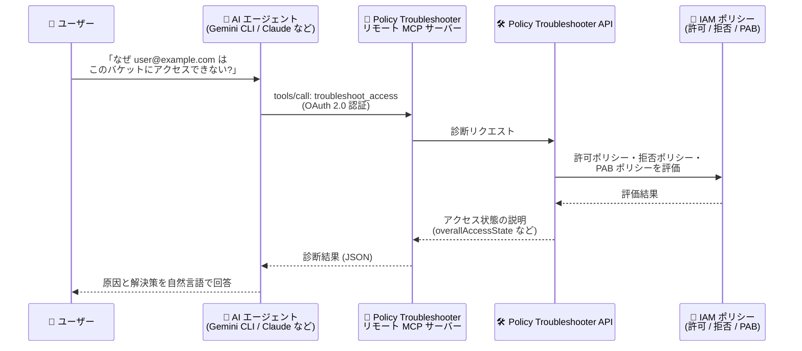

# Policy Intelligence: Policy Troubleshooter MCP サーバーが GA (一般提供)

**リリース日**: 2026-08-06

**サービス**: Policy Intelligence

**機能**: Policy Troubleshooter リモート MCP サーバー

**ステータス**: GA (一般提供)

📊 [このアップデートのインフォグラフィックを見る](https://takech9203.github.io/google-cloud-news-summary/20260806-policy-intelligence-policy-troubleshooter-mcp-server-ga.html)

## 概要

Policy Troubleshooter のリモート MCP (Model Context Protocol) サーバーが一般提供 (GA) になりました。この MCP サーバーは、Gemini CLI、ChatGPT、Claude などの AI アプリケーションや、開発中のカスタムエージェントから Policy Troubleshooter のツールを直接呼び出せるようにするもので、AI エージェントが IAM のアクセス問題やエラーをリアルタイムにトラブルシューティングできるようになります。

MCP は LLM や AI アプリケーションが外部データソースやツールに接続する方法を標準化するプロトコルです。Policy Troubleshooter リモート MCP サーバーは Google Cloud のインフラストラクチャ上で動作するマネージドな HTTP エンドポイント (`https://policytroubleshooter.googleapis.com/mcp`) を提供し、ローカルに MCP サーバーを構築・運用することなく利用できます。Policy Troubleshooter API を有効化すると MCP サーバーも有効になります。

対象ユーザーは、IAM の権限エラー対応を効率化したいセキュリティ管理者・プラットフォーム管理者や、IAM 診断機能を組み込んだ AI エージェント・AI アプリケーションを開発する開発者です。

**アップデート前の課題**

- IAM のアクセス拒否エラーが発生した際、管理者が Google Cloud コンソールや `gcloud` コマンドで Policy Troubleshooter を手動で操作し、プリンシパル・リソース・権限を特定して調査する必要があった
- AI エージェントから Policy Troubleshooter を利用するには、Policy Troubleshooter API を呼び出すカスタムツール定義やローカル MCP サーバーを自前で実装・運用する必要があった
- エラーメッセージからトラブルシューティングに必要な情報 (どの許可ポリシー・拒否ポリシーが影響しているか) を読み解くには IAM のポリシー評価に関する専門知識が必要だった

**アップデート後の改善**

- AI エージェントや AI アプリケーションが、マネージドなリモート MCP サーバー経由で IAM のアクセス問題を自然言語の対話からリアルタイムに診断できるようになった
- `troubleshoot_access` (プリンシパル・リソース・権限を指定した診断) と `troubleshoot_iam_error_id` (権限エラーのエラー ID を指定した診断) の 2 つのツールが GA として正式サポートされ、本番用途で利用できるようになった
- OAuth 2.0 + IAM によるきめ細かな認可、Model Armor によるプロンプト/レスポンス保護 (オプション)、集中監査ログなど、Google Cloud マネージド MCP サーバー共通のセキュリティ・ガバナンス機能を利用できるようになった

## アーキテクチャ図



AI エージェントがユーザーの自然言語の質問を受け、リモート MCP サーバー経由で Policy Troubleshooter API を呼び出し、許可ポリシー・拒否ポリシー・プリンシパルアクセス境界 (PAB) ポリシーの評価結果に基づく診断結果を返すフローです。

## サービスアップデートの詳細

### 主要機能

1. **troubleshoot_access ツール**
   - プリンシパル (メールアドレス)、リソースのフルリソース名、IAM 権限の 3 つを指定して、なぜアクセスが許可/拒否されているかを診断する
   - 許可ポリシー、拒否ポリシー、プリンシパルアクセス境界 (PAB) ポリシーを横断的に評価し、最終的なアクセス状態への影響を説明する
   - ユーザーやサービスアカウントが予期せずアクセス拒否された場合の調査や、特定の権限が付与されていることの検証に使用できる

2. **troubleshoot_iam_error_id ツール**
   - IAM サービスがアクセス拒否時に `ErrorInfo.metadata` の `error_info_id` として返すエラー ID を指定して診断する
   - エラー ID にはプリンシパル・リソース・権限・サポートされる IAM 条件のコンテキストが含まれるため、エラーメッセージのコピーだけでトラブルシューティングを開始できる
   - エラー ID がバックエンドで見つからない場合の指数バックオフによるリトライ戦略がツール仕様に組み込まれている

3. **Google Cloud マネージドリモート MCP サーバーとしての共通機能**
   - マネージドなグローバル HTTP エンドポイントの提供 (ローカル MCP サーバーの構築・運用が不要)
   - OAuth 2.0 + IAM によるきめ細かな認可
   - Model Armor によるプロンプト/レスポンスの保護 (オプション、Floor Settings で `GOOGLE_MCP_SERVER` を統合サービスに追加)
   - 集中監査ログ
   - IAM 拒否ポリシーによる MCP 利用制御 (プリンシパル、ツールの read-only 属性、サービス名/ツール名、OAuth クライアント ID に基づく制御)

## 技術仕様

### MCP サーバーの基本情報

| 項目 | 詳細 |
|------|------|
| エンドポイント | `https://policytroubleshooter.googleapis.com/mcp` (グローバル) |
| トランスポート | HTTP (Streamable HTTP) |
| 有効化 | Policy Troubleshooter API の有効化で MCP サーバーも有効になる |
| 認証 | OAuth 2.0 + IAM (すべての Google Cloud ID をサポート。API キーは不可) |
| OAuth スコープ | `https://www.googleapis.com/auth/cloud-policytroubleshooter.readonly` |
| 提供ツール | `troubleshoot_access`、`troubleshoot_iam_error_id` |
| 対応クライアント | Gemini CLI、ChatGPT、Claude、カスタム AI アプリケーションなど |

### 必要な IAM ロール

| ロール | 用途 |
|--------|------|
| `roles/iam.securityReviewer` (Security Reviewer) | 基本的なトラブルシューティング |
| `roles/iam.denyReviewer` (Deny Reviewer) | 拒否ポリシーのトラブルシューティング |
| `roles/browser` (Browser) | サービスアカウントプリンシパルセットを含むポリシーのトラブルシューティング |
| `roles/serviceusage.serviceUsageConsumer` (Service Usage Consumer) | gcloud CLI からのトラブルシューティング |
| `roles/mcp.toolUser` (MCP Tool User) | MCP ツール呼び出しの実行 |

### troubleshoot_access ツールのパラメータ

```json
{
  "method": "tools/call",
  "params": {
    "name": "troubleshoot_access",
    "arguments": {
      "principal": "example-user@example.com",
      "full_resource_name": "//storage.googleapis.com/projects/_/buckets/my-app-data",
      "permission": "storage.objects.get"
    }
  },
  "jsonrpc": "2.0",
  "id": 1
}
```

- `principal`: 確認対象のプリンシパルのメールアドレス (1 リクエストにつき 1 つ。グループは非サポート)
- `full_resource_name`: フルリソース名形式のリソース名
- `permission`: 確認する IAM 権限 (ロールではなく単一の権限を指定)

## 設定方法

### 前提条件

1. Policy Troubleshooter API が有効化されていること (有効化により MCP サーバーも有効になる)
2. 利用するプリンシパルに前述の IAM ロール (Security Reviewer、MCP Tool User など) が付与されていること
3. エージェント用に専用の ID を作成することが推奨される (リソースアクセスの制御・監視のため)

### 手順

#### ステップ 1: MCP クライアントの設定

AI アプリケーションのリモート MCP サーバー追加設定で、以下の情報を入力します。

```text
Server name : Policy Troubleshooter MCP server
Server URL  : https://policytroubleshooter.googleapis.com/mcp
Transport   : HTTP
OAuth scope : https://www.googleapis.com/auth/cloud-policytroubleshooter.readonly
```

認証情報には、Google Cloud 認証情報、OAuth クライアント ID とシークレット、またはエージェント ID と認証情報のいずれかを使用します。

#### ステップ 2: ツール一覧の確認 (任意)

`tools/list` メソッドは認証不要で、提供されるツールの仕様を確認できます。

```bash
curl --location 'https://policytroubleshooter.googleapis.com/mcp' \
  --header 'content-type: application/json' \
  --header 'accept: application/json, text/event-stream' \
  --data '{ "method": "tools/list", "jsonrpc": "2.0", "id": 1 }'
```

#### ステップ 3: Model Armor による保護の有効化 (任意)

MCP ツール呼び出しとレスポンスを保護するには、Model Armor の Floor Settings で MCP サニタイズを有効にします。

```bash
gcloud model-armor floorsettings update \
  --full-uri='projects/PROJECT_ID/locations/global/floorSetting' \
  --enable-floor-setting-enforcement=TRUE \
  --add-integrated-services=GOOGLE_MCP_SERVER \
  --google-mcp-server-enforcement-type=INSPECT_AND_BLOCK \
  --enable-google-mcp-server-cloud-logging \
  --malicious-uri-filter-settings-enforcement=ENABLED
```

エージェントと MCP サーバーが別プロジェクトの場合は、両プロジェクトに Floor Settings を作成でき、その場合 Model Armor は各プロジェクトで 1 回ずつ呼び出されます。

## メリット

### ビジネス面

- **IAM トラブルシューティングの迅速化**: 「なぜこのユーザーはアクセスできないのか」という問い合わせに対し、AI エージェントが自然言語の対話で原因を即座に診断できるため、権限問題の解決までの時間 (MTTR) を短縮できる
- **専門知識への依存の低減**: 許可/拒否/PAB ポリシーの評価ロジックを理解していない担当者でも、エージェント経由で正確な診断結果を得られる
- **GA によるプロダクション利用**: 一般提供となったことで、本番環境の運用ワークフローや社内向け AI アシスタントへの組み込みを正式サポートの下で行える

### 技術面

- **マネージドエンドポイント**: リモート MCP サーバーとして Google のインフラ上で動作するため、ローカル MCP サーバーの構築・運用・アップデートが不要
- **セキュリティ統制の一元化**: OAuth 2.0 + IAM の認可、IAM 拒否ポリシーによるツール利用制御、Model Armor 保護、集中監査ログにより、エージェントの MCP 利用をガバナンス下に置ける
- **エラー ID 起点の診断**: IAM の権限エラーメッセージに含まれるエラー ID をそのまま渡すだけで、プリンシパル・リソース・権限を手動で特定することなく診断を開始できる

## デメリット・制約事項

### 制限事項

- `troubleshoot_access` で指定できるプリンシパルは 1 リクエストにつき 1 つで、グループプリンシパルはサポートされない
- Cloud Storage の ACL (アクセス制御リスト) のトラブルシューティングには使用できない
- VPC Service Controls 違反の診断には対応しておらず、VPC Service Controls violation analyzer を使用する必要がある
- API キーによる認証は受け付けない (OAuth 2.0 + IAM のみ)

### 考慮すべき点

- `troubleshoot_iam_error_id` はエラー ID がバックエンドに反映されるまで時間がかかる場合があり、ツール仕様上は指数バックオフ (初回 1 分、最大 60 分) でのリトライが想定されている。待機や時間管理ができないエージェント環境ではリトライせずエラーを返す設計になっている
- エージェント用には専用の ID を作成し、リソースへのアクセスを制御・監視することが推奨される
- Model Armor の Floor Settings は Vertex AI など他の統合サービスにも影響するため、MCP 保護のための変更が他サービスのトラフィックスキャン動作に波及する点に注意が必要

## ユースケース

### ユースケース 1: 特定プリンシパルのアクセス拒否の原因調査

**シナリオ**: 開発者から「`example-user@example.com` が `example-project` の `my-app-data` バケットで `storage.objects.get` を実行できない」という問い合わせを受けた。管理者は社内の AI アシスタント (Policy Troubleshooter MCP サーバーを接続済み) に質問する。

**実装例**:
```text
プロンプト例:
「example-user@example.com が example-project の my-app-data バケットに対して
storage.objects.get を実行しようとするとアクセス拒否されるのはなぜですか?」

→ エージェントが troubleshoot_access ツールを呼び出し、
  許可ポリシー・拒否ポリシー・PAB ポリシーの評価結果から原因を説明
```

**効果**: コンソールでの手動調査なしに、どのポリシーがアクセスをブロックしているかを対話的に特定でき、権限問題の解決時間を短縮できる。

### ユースケース 2: 権限エラー ID からの自動診断

**シナリオ**: サービスアカウントの処理が権限エラーで失敗し、エラーメッセージにトラブルシューティング用のエラー ID が含まれていた。エラーメッセージをそのままエージェントに渡して診断する。

**実装例**:
```text
プロンプト例:
「サービスアカウントの権限エラーを調査しています。エラーメッセージに
トラブルシューティング ID: example-error-id が含まれています。
なぜこのアクセスがブロックされたのか説明してください。」

→ エージェントが troubleshoot_iam_error_id ツールを呼び出し、
  エラー ID に紐づくプリンシパル・リソース・権限のコンテキストで診断
```

**効果**: プリンシパル・リソース・権限を手動で特定する手間なく、エラー ID だけでブロック原因の説明と解決策の候補を得られる。

## 料金

Policy Troubleshooter を含む Policy Intelligence のほとんどの機能は、すべての Google Cloud ユーザーに追加料金なしで提供されます (Policy Analyzer の大規模利用や一部の高度な機能のみ Security Command Center の Premium/Enterprise ティアが必要)。

詳細は [Policy Intelligence の課金に関するドキュメント](https://docs.cloud.google.com/policy-intelligence/docs/billing-questions) を参照してください。

## 関連サービス・機能

- **IAM (Identity and Access Management)**: 診断対象となる許可ポリシー・拒否ポリシー・プリンシパルアクセス境界 (PAB) ポリシーを管理するサービス。MCP サーバーの認可にも IAM を使用する
- **Google Cloud MCP サーバー群**: Google Cloud は複数サービスでマネージドリモート MCP サーバーを提供しており、共通のセキュリティ・ガバナンス統制 (IAM 拒否ポリシー、監査ログなど) を適用できる
- **Model Armor**: MCP ツール呼び出しのプロンプト/レスポンスを検査・ブロックするオプションの保護機能
- **Policy Analyzer / Policy Simulator**: Policy Intelligence ファミリーのツール。「誰が何にアクセスできるか」の分析やポリシー変更の事前シミュレーションを提供し、Policy Troubleshooter (「なぜアクセスできる/できないか」) を補完する
- **VPC Service Controls violation analyzer**: VPC Service Controls 違反の診断はこちらを使用する (Policy Troubleshooter MCP サーバーの対象外)

## 参考リンク

- 📊 [インフォグラフィック](https://takech9203.github.io/google-cloud-news-summary/20260806-policy-intelligence-policy-troubleshooter-mcp-server-ga.html)
- [公式リリースノート](https://docs.cloud.google.com/release-notes#August_06_2026)
- [Use the Policy Troubleshooter remote MCP server](https://docs.cloud.google.com/policy-intelligence/docs/use-policy-troubleshooter-mcp)
- [Policy Troubleshooter MCP リファレンス](https://docs.cloud.google.com/policy-intelligence/docs/reference/policytroubleshooter/mcp)
- [Google Cloud MCP servers overview](https://docs.cloud.google.com/mcp/overview)
- [Policy Troubleshooter によるアクセスのトラブルシューティング](https://docs.cloud.google.com/policy-intelligence/docs/troubleshoot-access)
- [Policy Intelligence の課金に関するドキュメント](https://docs.cloud.google.com/policy-intelligence/docs/billing-questions)

## まとめ

Policy Troubleshooter リモート MCP サーバーの GA により、AI エージェントが IAM のアクセス問題をマネージドかつセキュアな経路で診断できるようになり、権限トラブルシューティングの自動化・効率化が本番用途で可能になりました。IAM の権限問い合わせ対応に工数を割いているチームや、運用系 AI エージェントを構築しているチームは、Policy Troubleshooter API を有効化して `troubleshoot_access` / `troubleshoot_iam_error_id` ツールの組み込みを検討することを推奨します。あわせて、エージェント専用 ID の作成と IAM 拒否ポリシー・Model Armor によるガバナンス設計も行うとよいでしょう。

---

**タグ**: `Policy Intelligence` `Policy Troubleshooter` `MCP` `IAM` `AI エージェント` `セキュリティ` `GA`
