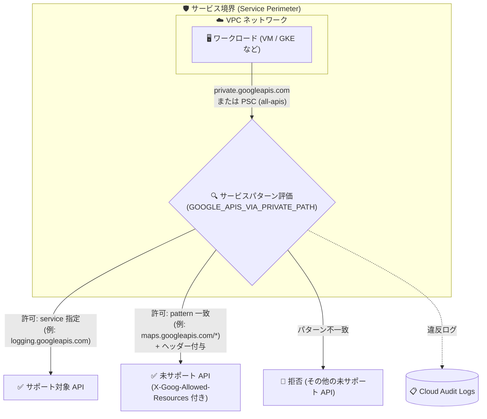

# VPC Service Controls: サービスパターン (Service Patterns) 機能が GA

**リリース日**: 2026-08-06

**サービス**: VPC Service Controls

**機能**: サービスパターン (Service Patterns) による Google API アクセス制御

**ステータス**: GA (一般提供)

📊 [このアップデートのインフォグラフィックを見る](https://takech9203.github.io/google-cloud-news-summary/20260806-vpc-service-controls-service-patterns-ga.html)

## 概要

VPC Service Controls の「サービスパターン (Service Patterns)」機能が一般提供 (GA) になりました。この機能により、プライベート VIP (`private.googleapis.com`) または all-apis バンドルを使用する Private Service Connect エンドポイント経由で Google API にアクセスする場合に、サービス境界 (Service Perimeter) 内の VPC ネットワークからアクセスできる Google API を明示的に構成できます。

最大の特徴は、VPC Service Controls が **サポートしていない Google API (unsupported services) も含めて** アクセス制御の対象にできる点です。許可したい未サポート API の URL パターン (例: `maps.googleapis.com/*`) を指定し、それ以外の未サポート API へのリクエストをプライベート VIP 経路上で拒否できます。さらに、プロキシを導入することなく、未サポート API へのリクエストに `X-Goog-Allowed-Resources` などの HTTP ヘッダーを付与でき、組織単位・ドメイン単位の制限を適用してデータ持ち出し (exfiltration) リスクを軽減できます。

サービス境界を運用するセキュリティチームや、restricted VIP から private VIP への移行を検討しているネットワーク管理者にとって重要なアップデートです。

**アップデート前の課題**

- 従来の VPC accessible services によるアクセス制御は、制限付き VIP (restricted VIP: `restricted.googleapis.com`) の使用が前提であり、プライベート VIP (`private.googleapis.com`) や Private Service Connect の all-apis バンドルを使うネットワークでは同等の制御ができなかった
- VPC Service Controls が正式にサポートしていない Google API へのアクセスを、境界内のネットワークから細かく制御する手段がなかった
- 未サポート API に組織制限ヘッダー (`X-Goog-Allowed-Resources` など) を付与するには、独自のプロキシをデプロイする必要があった

**アップデート後の改善**

- プライベート VIP / Private Service Connect (all-apis) 経路でも、境界内 VPC からアクセス可能な Google API (サポート対象・未サポートの両方) を明示的に構成できるようになった
- 未サポート API について URL パターンで許可リストを定義し、それ以外の未サポート API リクエストを拒否できるようになった
- プロキシを導入せずに、未サポート API へのリクエストに HTTP ヘッダーを付与し、テナント単位・ドメイン単位の制限を適用できるようになった
- restricted VIP から private VIP への移行パスが公式に提供された

## アーキテクチャ図



サービス境界内の VPC からプライベート VIP または Private Service Connect (all-apis) 経由で発行された API リクエストは、サービスパターンで評価され、許可リストに一致した API のみ通過し (未サポート API にはヘッダー付与も可能)、それ以外の未サポート API は拒否されます。

## サービスアップデートの詳細

### 主要機能

1. **プライベート VIP 経路での API アクセス制御**
   - 従来の VPC accessible services が restricted VIP を前提としていたのに対し、サービスパターンはプライベート VIP (`private.googleapis.com`) または all-apis バンドルの Private Service Connect エンドポイントを使うネットワーク向けに設計されている
   - 適用範囲 (enforcement scope) に `GOOGLE_APIS_VIA_PRIVATE_PATH` を指定して有効化する

2. **未サポート API の URL パターン許可リスト**
   - `allowedServicePatterns` で、サポート対象サービスは `service` フィールド (例: `logging.googleapis.com`、全保護対象サービスに展開される `RESTRICTED-SERVICES` も指定可)、未サポート API は `pattern` フィールド (例: `maps.googleapis.com/*`、`www.googleapis.com/drive/*`) で指定する
   - パターンに一致しない未サポート API へのリクエストはプライベート VIP 経路上で拒否される

3. **プロキシ不要の HTTP ヘッダー付与 (modifiers)**
   - `addRequestHeader` モディファイアにより、未サポート API へのリクエストに `X-Goog-Allowed-Resources` (組織制限) や `X-GoogApps-Allowed-Domains` (ドメイン制限) ヘッダーを自動付与できる
   - テナントベース・ドメインベースの制限を強制し、データ持ち出しリスクを軽減する

4. **ドライランモードによる事前検証**
   - 境界のドライラン構成にサービスパターンを設定し、監査ログで違反を確認してから本番構成に反映 (enforce) できる

## 技術仕様

### 構成要素

| 項目 | 詳細 |
|------|------|
| 対象経路 | プライベート VIP (`private.googleapis.com`)、Private Service Connect エンドポイント (all-apis バンドル) |
| 適用スコープ | `servicePatternsEnforcementScopes: GOOGLE_APIS_VIA_PRIVATE_PATH` |
| サポート対象サービスの指定 | `service` フィールド (例: `logging.googleapis.com`、`RESTRICTED-SERVICES`) |
| 未サポート API の指定 | `pattern` フィールド (URL パターン) |
| サポートされる URL パターン形式 | `API_NAME.googleapis.com/*`、`www.googleapis.com/API_NAME/*`、`*.appspot.com/*` |
| 付与可能なヘッダー | `X-Goog-Allowed-Resources`、`X-GoogApps-Allowed-Domains` (未サポート API へのリクエストのみ) |
| 設定手段 | Google Cloud コンソール、gcloud CLI (YAML ファイル) |

### YAML 構成例

```yaml
enableRestriction: true
servicePatternsEnforcementScopes:
- GOOGLE_APIS_VIA_PRIVATE_PATH
allowedServicePatterns:
- service: 'RESTRICTED-SERVICES'
- service: 'logging.googleapis.com'
- pattern: 'maps.googleapis.com/*'
- pattern: 'www.googleapis.com/drive/*'
```

ヘッダーを付与する場合は `modifiers` を追加します。

```yaml
allowedServicePatterns:
- pattern: 'appengine.googleapis.com/*'
  modifiers:
  - addRequestHeader:
      key: 'X-Goog-Allowed-Resources'
      value: 'YOUR_ORGANIZATION_RESTRICTIONS_HEADER'
```

`YOUR_ORGANIZATION_RESTRICTIONS_HEADER` には、許可する Google Cloud 組織 ID を指定した Web セーフ Base64 エンコード済み JSON 文字列を設定します (組織の制限の構成方法に準拠)。

## 設定方法

### 前提条件

1. Access Context Manager のアクセスポリシーとサービス境界が構成済みであること
2. VPC ネットワークがプライベート VIP (`private.googleapis.com`) または all-apis バンドルの Private Service Connect エンドポイントを使用していること (restricted VIP からの移行手順は後述)

### 手順

#### ステップ 1: YAML 構成ファイルの作成

```bash
cat > vpc_accessible_services.yaml <<EOF
enableRestriction: true
servicePatternsEnforcementScopes:
- GOOGLE_APIS_VIA_PRIVATE_PATH
allowedServicePatterns:
- service: 'RESTRICTED-SERVICES'
- pattern: 'maps.googleapis.com/*'
EOF
```

許可するサポート対象サービスと未サポート API の URL パターンを定義します。

#### ステップ 2: 境界の作成または更新

```bash
# 既存境界の更新
gcloud access-context-manager perimeters update PERIMETER_ID \
  --set-vpc-accessible-services=vpc_accessible_services.yaml \
  --policy=POLICY_ID

# 新規境界の作成
gcloud access-context-manager perimeters create PERIMETER_ID \
  --title="TITLE" \
  --resources="projects/PROJECT_ID" \
  --restricted-services=SERVICES \
  --vpc-accessible-services=vpc_accessible_services.yaml \
  --policy=POLICY_ID
```

コンソールの場合は、サービス境界の編集画面で「VPC accessible services」ペインから「Select services and patterns」を選択し、サービスまたはパターン (ヘッダー付きも可) を追加して、適用スコープに「Google APIs via Private Path」を選択します。

#### ステップ 3: ドライランモードで検証してから適用

```bash
# ドライラン構成として作成
gcloud access-context-manager perimeters dry-run create PERIMETER_ID \
  --perimeter-title="TITLE" \
  --perimeter-resources="projects/PROJECT_ID" \
  --perimeter-restricted-services=SERVICES \
  --perimeter-vpc-accessible-services=vpc_accessible_services.yaml \
  --policy=POLICY_ID

# 監査ログで違反を確認した後、本番構成に反映
gcloud access-context-manager perimeters dry-run enforce PERIMETER_ID \
  --policy=POLICY_ID
```

監査ログでブロックされるリクエストを確認し、影響がないことを検証してから適用します。

#### (参考) restricted VIP から private VIP への移行

1. `servicePatternsEnforcementScopes` を `GOOGLE_APIS_VIA_PRIVATE_PATH` に設定した YAML で境界構成を更新する
2. その後、VPC ネットワークの DNS・ルーティング・ファイアウォール構成をプライベート VIP (`private.googleapis.com`) に向けるか、Private Service Connect エンドポイントを all-apis バンドルに更新する

**注意**: 持ち出し経路を塞いだ状態を維持するため、プライベート VIP への切り替えの前に境界構成を先に更新してください。

## メリット

### ビジネス面

- **データ持ち出しリスクの低減**: 未サポート API を含めた許可リスト制御と組織制限ヘッダーの強制により、過度に広いアクセスに起因する exfiltration リスクを軽減できる
- **運用コストの削減**: ヘッダー付与のための独自プロキシの構築・運用が不要になる

### 技術面

- **プライベート VIP での境界制御**: restricted VIP に依存せず、`private.googleapis.com` や PSC (all-apis) を使う既存ネットワーク構成のまま API アクセス制御を実現できる
- **未サポート API のカバレッジ**: VPC Service Controls 統合が未対応の Google API も URL パターンで制御対象にでき、境界の抜け穴を減らせる
- **安全な導入プロセス**: ドライランモードで影響を検証してから適用できる

## デメリット・制約事項

### 制限事項

- 適用対象はプライベート VIP 経路 (`private.googleapis.com` または Private Service Connect の all-apis エンドポイント) のみ
- サポートされる URL パターン形式は `API_NAME.googleapis.com/*`、`www.googleapis.com/API_NAME/*`、`*.appspot.com/*` に限定される
- 付与できるヘッダーは `X-Goog-Allowed-Resources` と `X-GoogApps-Allowed-Domains` のみで、挿入されるのは未サポートサービスへのリクエストに対してのみ
- ドライランモードでは `modifiers` (`addRequestHeader`) によるヘッダー挿入は行われない
- 未サポート API へのリクエストに起因する違反ログはメタデータが限定的
- VPC Service Controls の違反アナライザーは未サポートサービスの違反トラブルシューティングに対応していない (違反 ID を使って監査ログを参照する必要がある)

### 考慮すべき点

- restricted VIP からの移行時は、境界構成の更新を先に行ってから DNS / ルーティングを切り替える順序を守る必要がある
- 許可リスト方式のため、業務に必要な未サポート API のパターン漏れがあるとアプリケーションが停止するリスクがある。ドライランモードでの事前検証が実質必須

## ユースケース

### ユースケース 1: 未サポート API (Maps API など) を限定的に許可

**シナリオ**: サービス境界内のワークロードが Maps API など VPC Service Controls 未サポートの API を利用する必要があるが、その他の未サポート API 経由のデータ持ち出しは防ぎたい。

**実装例**:
```yaml
enableRestriction: true
servicePatternsEnforcementScopes:
- GOOGLE_APIS_VIA_PRIVATE_PATH
allowedServicePatterns:
- service: 'RESTRICTED-SERVICES'
- pattern: 'maps.googleapis.com/*'
```

**効果**: 業務に必要な Maps API のみを許可しつつ、パターンに一致しないその他の未サポート API へのアクセスをプライベート VIP 経路上で遮断できる。

### ユースケース 2: プロキシなしで組織制限ヘッダーを強制

**シナリオ**: 未サポート API へのリクエストに組織制限 (`X-Goog-Allowed-Resources`) を適用したいが、これまで必要だったプロキシの運用を廃止したい。

**効果**: サービスパターンの `modifiers` でヘッダーが自動付与されるため、プロキシのデプロイ・運用が不要になり、自組織のリソース以外へのアクセスを防止できる。

### ユースケース 3: restricted VIP から private VIP への移行

**シナリオ**: restricted VIP (`restricted.googleapis.com`) ベースの VPC accessible services を運用しているが、ネットワーク構成を private VIP (`private.googleapis.com`) に統一したい。

**効果**: サービスパターンを設定してから DNS / ルーティングを切り替えることで、持ち出し経路を塞いだまま private VIP へ移行できる。

## 関連サービス・機能

- **Private Service Connect**: all-apis バンドルのエンドポイントがサービスパターンの適用対象経路の 1 つ。境界内からの Google API アクセスをプライベート IP で実現する
- **限定公開の Google アクセス (Private Google Access) / private.googleapis.com**: 外部 IP を持たない VM から Google API にアクセスするためのプライベート VIP。本機能の主要な適用対象経路
- **Access Context Manager**: サービス境界 (Service Perimeter) の構成基盤。サービスパターンは境界の VPC accessible services 構成の一部として定義する
- **組織の制限 (Organization Restrictions)**: `X-Goog-Allowed-Resources` ヘッダーの値 (許可する組織 ID の指定) は組織の制限の構成方法に準拠する
- **Cloud Audit Logs**: ドライラン・本番適用時の違反リクエストの確認に使用する

## 参考リンク

- 📊 [インフォグラフィック](https://takech9203.github.io/google-cloud-news-summary/20260806-vpc-service-controls-service-patterns-ga.html)
- [公式リリースノート](https://docs.cloud.google.com/release-notes#August_06_2026)
- [VPC Service Controls service patterns (ドキュメント)](https://docs.cloud.google.com/vpc-service-controls/docs/vpc-accessible-services#service-patterns)
- [Limit access to Google APIs by using service patterns (設定手順)](https://docs.cloud.google.com/vpc-service-controls/docs/manage-service-perimeters#service-patterns-cfg)
- [VPC Service Controls 概要](https://docs.cloud.google.com/vpc-service-controls/docs/overview)
- [限定公開の Google アクセスの構成オプション](https://docs.cloud.google.com/vpc/docs/configure-private-google-access#config-options)

## まとめ

サービスパターンの GA により、restricted VIP に依存せず、プライベート VIP や Private Service Connect (all-apis) 経路でも未サポート API を含む Google API アクセスを許可リスト制御できるようになりました。サービス境界を運用している組織は、プロキシで実現していたヘッダー付与の置き換えや restricted VIP からの移行を検討する価値があります。導入時はドライランモードで違反ログを確認してから本番構成に適用してください。

---

**タグ**: #VPCServiceControls #ServicePatterns #PrivateServiceConnect #PrivateGoogleAccess #セキュリティ #GA
