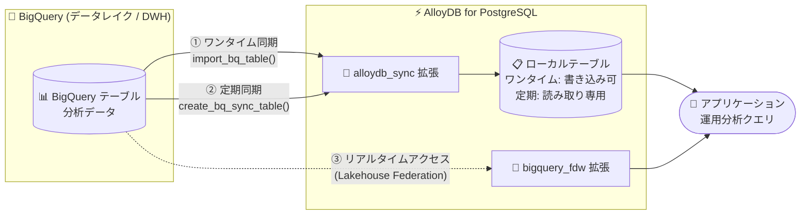

# AlloyDB for PostgreSQL: BigQuery 統合 (テーブル同期・Lakehouse Federation)

**リリース日**: 2026-08-07

**サービス**: AlloyDB for PostgreSQL

**機能**: BigQuery テーブル同期および BigQuery 統合 (Lakehouse Federation / 定期同期 / ワンタイム同期)

**ステータス**: Preview

📊 [このアップデートのインフォグラフィックを見る](https://takech9203.github.io/google-cloud-news-summary/20260807-alloydb-bigquery-sync-integration.html)

## 概要

AlloyDB for PostgreSQL に BigQuery との統合機能が Preview として発表されました。BigQuery のテーブルを AlloyDB インスタンスに同期する機能 (ワンタイムまたは定期スケジュール) と、リアルタイムデータアクセス (Lakehouse Federation) を含む統合オプション群により、運用データ (オペレーショナルデータ) と分析データを接続できるようになります。

同期機能は `alloydb_sync` 拡張機能によって提供され、データを AlloyDB のローカルストレージに移動することで、データレイクに対する低レイテンシかつトランザクショナルなアクセスを実現します。データをその場で参照する Foreign Data Wrapper (FDW) とは異なり、データそのものを AlloyDB に取り込むため最大限のパフォーマンスが得られます。一方、Lakehouse Federation は `bigquery_fdw` 拡張機能を使用し、データを移動・複製せずに BigQuery のライブデータを AlloyDB から直接クエリできます。

このアップデートは、BigQuery 上の分析結果 (顧客セグメンテーションや ML 予測など) をアプリケーションから低レイテンシで参照したい開発者や、HTAP (ハイブリッドトランザクション/分析処理) ワークロードを構築するアーキテクトが主な対象です。

**アップデート前の課題**

- BigQuery の分析データを AlloyDB で利用するには、ETL パイプラインの構築・運用が必要で、レイテンシや障害モードの管理負荷があった
- `bigquery_fdw` と `pg_cron` を組み合わせた定期インポートでは、スケジュールや SQL リフレッシュスクリプトを手動で管理・保守する必要があった
- BigQuery への直接クエリでは、同時接続数の制限やリモートクエリのレイテンシが、多数の同時ユーザーへの分析結果配信のボトルネックになっていた

**アップデート後の改善**

- `alloydb_sync.import_bq_table()` によるワンタイム同期で、書き込み可能な独立した PostgreSQL テーブルとして BigQuery データのコピーを作成できるようになった (INSERT / UPDATE / DELETE が自由に実行可能)
- `alloydb_sync.create_bq_sync_table()` による定期同期 (ミラーリング) で、バックグラウンドワーカーが自動的にデータをリフレッシュする読み取り専用のマネージドテーブルを維持できるようになった (例: 6 時間ごと、日次)
- Lakehouse Federation により、ETL なしで BigQuery のライブデータ (BigLake 経由の Apache Iceberg などオープンフォーマットを含む) を PostgreSQL 構文で直接クエリできるようになった
- BigQuery コンソールの「Export / sync > AlloyDB」から GUI ベースで同期をセットアップできるようになった

## アーキテクチャ図



BigQuery のデータは、(1) ワンタイム同期、(2) 定期同期によるローカルテーブル化、または (3) Lakehouse Federation によるライブクエリの 3 つの経路で AlloyDB から利用できます。同期方式はデータを AlloyDB ストレージに移動して低レイテンシアクセスを実現し、Federation はデータを移動せずに最新データへアクセスします。

## サービスアップデートの詳細

### 主要機能

1. **ワンタイム同期 (Sync tables - one-time)**
   - `alloydb_sync.import_bq_table()` 関数で BigQuery からデータをストリーミングし、AlloyDB ローカルストレージに取り込む
   - 結果は完全に独立した書き込み可能な PostgreSQL テーブルとなり、INSERT / UPDATE / DELETE を自由に実行できる
   - `on_exists` パラメータ (error / skip / replace) で宛先テーブルが既に存在する場合の動作を制御可能
   - オプションの `primary_key` パラメータで主キー列を指定可能

2. **定期同期 / ミラーリング (Sync tables - periodic)**
   - `alloydb_sync.create_bq_sync_table()` 関数でバックグラウンドワーカーを構成し、指定間隔 (例: 12 時間ごと) で BigQuery から更新データを自動取得
   - 作成されるのはマネージドな読み取り専用テーブルで、データ整合性を保ちつつ、リードプールで水平スケール可能
   - `alloydb_sync.job_status` ビューで処理済みレコード数や完了見込みを監視、`alloydb_sync.cancel_import_job()` でジョブのキャンセルが可能
   - 削除には `alloydb_sync.delete_bq_sync_table()` を使用 (手動 DROP は不可)

3. **Lakehouse Federation (リアルタイムデータアクセス)**
   - `bigquery_fdw` 拡張機能により、データを移動・複製せずに BigQuery のライブデータセットを直接クエリ
   - 標準的なフィルタや集計を BigQuery にプッシュダウンし、事前フィルタ済みの結果のみを AlloyDB にストリーミングして性能を最適化
   - BigLake 外部テーブル経由で Apache Iceberg などのオープンフォーマットにもアクセス可能
   - ゼロ ETL・ゼロコピーアーキテクチャで、ストレージコストとデータガバナンスのオーバーヘッドを最小化

4. **BigQuery コンソールからの GUI セットアップ**
   - BigQuery Explorer でテーブルを選択し「Export / sync > AlloyDB (Export once or sync)」から設定可能
   - 既存クラスタへのエクスポートに加え、新規クラスタ (無料トライアルクラスタまたはプロビジョンドクラスタ) の作成にも対応
   - 同期頻度 (Just once / Every hour / Every six hours など) を GUI で選択可能

## 技術仕様

### 同期方式の比較

| 項目 | ワンタイム同期 | 定期同期 (ミラーリング) | Lakehouse Federation |
|------|---------------|------------------------|---------------------|
| 使用する拡張機能 | `alloydb_sync` | `alloydb_sync` | `bigquery_fdw` |
| 主な関数/方法 | `import_bq_table()` | `create_bq_sync_table()` | 外部テーブルへのクエリ |
| データの場所 | AlloyDB ローカルストレージ | AlloyDB ローカルストレージ | BigQuery (移動なし) |
| テーブルの書き込み | 可能 (独立コピー) | 読み取り専用 (マネージド) | 読み取り専用 |
| データ鮮度 | 同期時点のスナップショット | スケジュールに依存 | リアルタイム |

### 主なデータ型マッピング

| BigQuery データ型 | PostgreSQL データ型 |
|------|------|
| BOOLEAN | BOOLEAN |
| INTEGER (INT64) | BIGINT |
| FLOAT (FLOAT64) | DOUBLE PRECISION |
| STRING | VARCHAR |
| NUMERIC | NUMERIC(38, 9) |
| DATE | DATE |
| TIMESTAMP | TIMESTAMPTZ |
| JSON | JSONB |
| DATETIME | TIMESTAMP |

### 必要な IAM ロール (AlloyDB クラスタサービスアカウントに付与)

| ロール | 用途 |
|------|------|
| BigQuery Data Viewer (`roles/bigquery.dataViewer`) | テーブル/ビューのデータとメタデータの読み取り |
| BigQuery Read Session User (`roles/bigquery.readSessionUser`) | 読み取りセッションの作成・使用 |
| BigQuery Job User (`roles/bigquery.jobUser`) | クエリジョブを含むジョブの作成・実行 |

## 設定方法

### 前提条件

1. AlloyDB クラスタとプライマリインスタンス、および同期元の BigQuery テーブルが存在すること
2. 同期機能 (sync data feature) は PostgreSQL バージョン 18 のみサポート
3. AlloyDB API、BigQuery Storage API などの必要な Cloud API を有効化すること
4. AlloyDB クラスタのサービスアカウントに、上記の IAM ロールを付与すること
5. Preview 機能のため、アクセスリクエストページからのアクセス申請が必要な場合がある

### 手順

#### ステップ 1: 拡張機能の作成と接続設定

```sql
CREATE EXTENSION IF NOT EXISTS alloydb_sync;

-- BigQuery への認証のためのユーザーマッピングを作成
CREATE EXTENSION IF NOT EXISTS bigquery_fdw;
CREATE SERVER IF NOT EXISTS BIGQUERY_SERVER_NAME FOREIGN DATA WRAPPER bigquery_fdw;
CREATE USER MAPPING IF NOT EXISTS FOR USER SERVER BIGQUERY_SERVER_NAME;
```

拡張機能は BigQuery データを同期するすべてのデータベースで作成する必要があります。Google Cloud コンソールを使用する場合、これらの手順は自動的に実行されます。

#### ステップ 2: ワンタイム同期の実行

```sql
SELECT alloydb_sync.import_bq_table(
  'my-gcp-project.sales_data.transactions',
  'public.local_sales',
  'replace'
);
```

BigQuery テーブル `transactions` を、書き込み可能な AlloyDB テーブル `public.local_sales` として取り込みます。関数はジョブの UUID を返し、`alloydb_sync.job_status` ビューで進捗を確認できます。

#### ステップ 3: 定期同期の作成

```sql
SELECT alloydb_sync.create_bq_sync_table(
  'my-gcp-project.crm_data.profiles',
  'public.customer_mirror',
  '12 hours',
  'replace'
);
```

12 時間ごとに自動リフレッシュされる読み取り専用ミラーテーブルを作成します。

#### ステップ 4: 同期ジョブの監視・管理

```sql
-- ジョブステータスの確認
SELECT import_id, status, records_processed, total_records, error
FROM alloydb_sync.job_status;

-- 同期の停止とテーブル削除 (DROP TABLE は使用しない)
SELECT alloydb_sync.delete_bq_sync_table('public.customer_mirror');
```

## メリット

### ビジネス面

- **運用分析 (Operational Analytics) の実現**: BigQuery の分析結果 (顧客セグメント、ML 予測など) をアプリケーションから低レイテンシで参照でき、リアルタイムなビジネス判断に活用できる
- **パイプライン運用コストの削減**: ETL パイプラインや pg_cron スクリプトの構築・保守が不要になり、「設定したら任せる」形の自動データミラーリングが可能
- **高同時実行の分析配信**: ローカルデータとリードプールのスケールアウトにより、BigQuery の同時接続制限を回避して数千の同時ユーザーに分析インサイトを配信できる

### 技術面

- **最大パフォーマンス**: データを AlloyDB ストレージに移動するため、AlloyDB のカラムナエンジンとローカルバッファキャッシュを活用した高速クエリが可能
- **柔軟なアクセスモデルの選択**: リアルタイム性が必要なら Federation、性能が必要なら同期、と要件に応じて 3 つの方式を使い分けられる
- **AlloyDB AI との連携**: 同期した分析データに対してベクトル埋め込み生成や高性能ベクトル検索など、AI ドリブンなワークフローを実行できる

## デメリット・制約事項

### 制限事項

- 同期機能は **PostgreSQL バージョン 18 のみ** サポート (Preview)
- ARRAY、BYTES、VECTOR、GEOGRAPHY などの複雑な BigQuery 型は同期非対応
- `alloydb_sync` 拡張を DROP した場合、再作成の前にインスタンスの再起動が必要
- 同期はトランザクション内で実行され、インポートジョブが中断・失敗するとロールバックされる
- 2 ユーザーが同じ宛先テーブルに対して同時に同期ジョブを開始すると、テーブルが相互に上書きされる可能性がある
- 新規登録した同期テーブルの初回バックグラウンドインポートが中断された場合、次回のリフレッシュ間隔までテーブルは不完全なまま残る
- レプリケートされたテーブルを手動で DROP してはならない (`delete_bq_sync_table()` を使用)。手動削除するとバックグラウンドスケジューラのフックが残り、エラーの継続発生とワーカースロットの枯渇を招く
- `alloydb_sync` を使用するデータベースの削除には `DROP DATABASE ... WITH (FORCE)` が必要
- インポート実行中にデータベースがクラッシュすると、メタデータが RUNNING 状態のままになり以降のインポートがブロックされる場合がある (手動での UPDATE 文による解除が必要)

### 考慮すべき点

- Preview 機能のため Pre-GA Offerings Terms が適用され、サポートが限定される可能性がある。本番ワークロードでの利用は慎重に判断する
- データ移動は CPU とメモリを消費するため、大規模テーブルの同期はオフピーク時間帯にスケジュールし、プライマリのトランザクションワークロードへの影響を回避する
- replace 操作中は既存のターゲットテーブルが先に削除・再作成されるため、インポート中のクエリは最初に空のテーブルを参照し、その後バッチトランザクションのコミットに伴い段階的にデータが見える

## ユースケース

### ユースケース 1: ML 予測結果によるデータエンリッチメント

**シナリオ**: BigQuery で計算した顧客セグメンテーションや ML 予測の結果を、AlloyDB 上の運用データベースに取り込み、アプリケーションから低レイテンシで参照したい。

**実装例**:
```sql
SELECT alloydb_sync.import_bq_table(
  'my-gcp-project.ml_outputs.customer_segments',
  'public.customer_segments',
  'replace',
  ARRAY['customer_id']
);
```

**効果**: BigQuery へのリモートクエリのレイテンシなしに、トランザクション処理と同じデータベース内で分析結果を利用でき、書き込み可能なコピーとして独立した加工・インデックス作成 (AlloyDB AI によるベクトル埋め込み生成など) も可能。

### ユースケース 2: 高同時実行のダッシュボード / 分析 API 配信

**シナリオ**: データウェアハウスの集計結果を、数千の同時ユーザーが利用するダッシュボードや API から配信したいが、BigQuery の同時接続制限とクエリレイテンシが課題。

**効果**: `create_bq_sync_table()` による定期同期でローカルの読み取り専用ミラーを維持し、リードプールで水平スケールすることで、BigQuery の同時実行制限を回避しつつ AlloyDB のカラムナエンジンで高速なクエリ性能を実現。

### ユースケース 3: HTAP (ハイブリッドトランザクション/分析処理)

**シナリオ**: AlloyDB 上のライブな「ホット」運用データと、BigQuery 上の大量の「コールド」履歴データを結合した分析を実行したい。

**効果**: Lakehouse Federation により、ETL パイプラインなしで両者を単一の PostgreSQL クエリで結合でき、常に最新の分析データに基づく判断が可能。

## 料金

BigQuery から AlloyDB へデータを同期する際は、**BigQuery ストリーミング読み取り (Storage Read API) の料金** で課金されます。エクスポート後は、AlloyDB 側のデータ保存に対してストレージ料金が発生します。

詳細は以下の料金ページを参照してください。

- [BigQuery の料金 (データ抽出)](https://docs.cloud.google.com/bigquery/pricing#data-extraction-pricing)
- [AlloyDB for PostgreSQL の料金](https://docs.cloud.google.com/alloydb/pricing)

## 関連サービス・機能

- **BigQuery**: 同期元となるデータウェアハウス。BigQuery コンソールからの GUI セットアップにも対応
- **BigLake / Apache Iceberg**: Lakehouse Federation では BigLake 外部テーブル経由でオープンフォーマットのデータにもアクセス可能
- **BigQuery Federated Queries (逆方向)**: BigQuery 側から `EXTERNAL_QUERY` 関数で AlloyDB のデータをリアルタイムにクエリする機能も別途提供されており、双方向のデータ連携が可能
- **AlloyDB AI**: 同期したデータに対するベクトル埋め込み生成・ベクトル検索など、AI ワークフローとの組み合わせが可能
- **AlloyDB カラムナエンジン / リードプール**: 同期したローカルデータの分析クエリ高速化とスケールアウトに活用
- **pg_cron + bigquery_fdw**: 従来の手動による定期インポート手法。`alloydb_sync` はこれをマネージド化した位置づけ

## 参考リンク

- 📊 [インフォグラフィック](https://takech9203.github.io/google-cloud-news-summary/20260807-alloydb-bigquery-sync-integration.html)
- [公式リリースノート](https://docs.cloud.google.com/release-notes#August_07_2026)
- [Sync BigQuery data to AlloyDB](https://docs.cloud.google.com/alloydb/docs/sync-bigquery-data-to-alloydb)
- [Choose how to access BigQuery data from AlloyDB](https://docs.cloud.google.com/alloydb/docs/choose-access-bigquery-data-from-alloydb)
- [AlloyDB access to real-time data in BigQuery overview](https://docs.cloud.google.com/alloydb/docs/access-real-time-data-overview)
- [Configure access to real-time data](https://docs.cloud.google.com/alloydb/docs/configure-access-real-time-data)
- [Import BigQuery data to AlloyDB](https://docs.cloud.google.com/alloydb/docs/import-bigquery-data)
- [AlloyDB for PostgreSQL の料金](https://docs.cloud.google.com/alloydb/pricing)

## まとめ

AlloyDB と BigQuery の統合 (Preview) により、ワンタイム同期・定期同期・Lakehouse Federation という 3 つの方式で運用データと分析データを接続できるようになり、ETL パイプラインなしで低レイテンシな運用分析 (Operational Analytics) を実現できます。同期機能は PostgreSQL 18 のみ対応で複雑なデータ型の制限もあるため、まずは非本番環境でユースケース (データエンリッチメント、高同時実行配信、HTAP) に適した方式を検証することを推奨します。

---

**タグ**: #AlloyDB #BigQuery #Preview #OperationalAnalytics #LakehouseFederation #DataSync #HTAP #PostgreSQL
