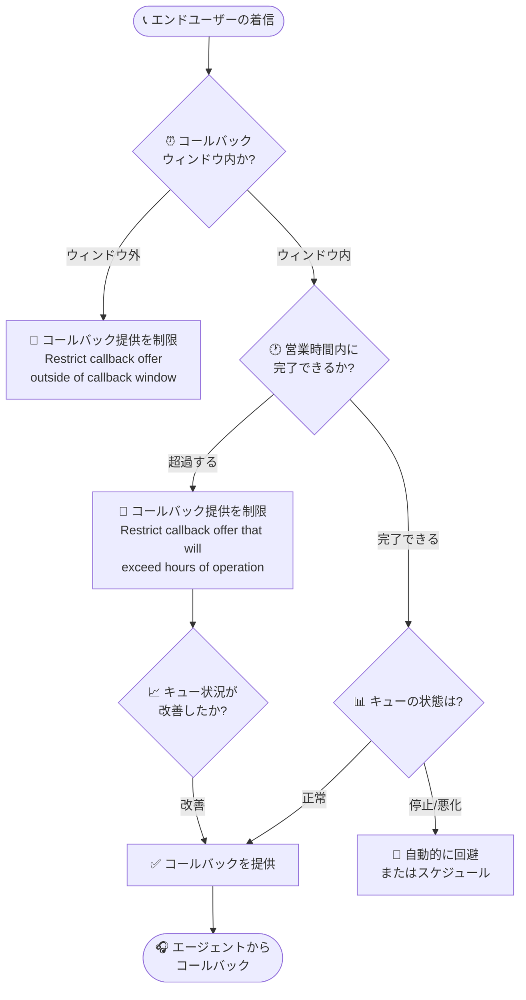

# Google Cloud Contact Center as a Service (CCaaS): 次期バージョンのプレリリースノート — カスタムパネル URL パラメータとコールバック制限

**リリース日**: 2026-08-07

**サービス**: Google Cloud Contact Center as a Service (CCaaS) / CCAI Platform

**機能**: カスタムパネル URL パラメータ、コールバック制限、多数のバグ修正 (プレリリースノート)

**ステータス**: Announcement (プレリリース)

📊 [このアップデートのインフォグラフィックを見る](https://takech9203.github.io/google-cloud-news-summary/20260807-ccaas-prerelease-custom-panels-callback-restrictions.html)

## 概要

Google Cloud CCaaS (CCAI Platform) の次期バージョンのプレリリースノートが公開されました。このリリースには主要な新機能が 2 件含まれます。1 つ目は、Agent desktop のカスタムパネル URL に固定/動的パラメータを含める設定が可能になる機能です。これにより、セッション・エージェント・顧客のコンテキストをカスタムパネル (外部ツールや CRM 画面など) へ渡せるようになります。2 つ目はコールバック制限機能で、営業時間終了間際の問い合わせやキュー停止時に、エンドユーザーへのコールバック提供を自動的に回避またはスケジュールするよう構成できます。

このほか、カスタム SIP ヘッダーのドロップ、チャット画面のブランク化、ダッシュボードの誤レポート、SSO ルーティング、DTMF、Web SDK タイムアウトなど約 40 件のバグ修正が含まれ、プラットフォーム全体の安定性が大きく向上します。

コンタクトセンターの管理者、および Agent desktop のカスタマイズや CRM 連携を運用するチームにとって、事前に変更内容を把握し準備するための重要な情報です。プレリリースノートのため、実際のリリース時に内容が変わる可能性がある点に留意してください。

**アップデート前の課題**

- カスタムパネルの URL には変数 (エージェント ID、セッション ID など) を含められたが、今回追加されるような固定/動的パラメータの柔軟な構成には対応していなかった
- 営業時間の終了間際やキューの停止時にもコールバックが提供され、営業時間外にコールバックが実行できない (または実行されない) 状況が発生し得た
- カスタム SIP ヘッダーのドロップ、チャット画面のブランク化、Web SDK のタイムアウトイベント未送出 (セッションが最大 120 分残留) など、多数の既知の問題が存在した

**アップデート後の改善**

- カスタムパネルの URL に固定/動的パラメータを設定でき、セッション・エージェント・顧客のコンテキストを外部ツールへ確実に引き渡せるようになる
- 「Restrict callback offer outside of callback window」「Restrict callback offer that will exceed hours of operation. If queue condition improve offer callbacks」の 2 つのチェックボックスにより、コールバック提供をグローバルまたはキュー単位で制御できるようになる
- 通話・チャット・ダッシュボード・SSO・API パフォーマンスに関わる約 40 件の問題が修正され、運用の安定性が向上する

## アーキテクチャ図

次期バージョンで追加されるコールバック制限の制御フローです。コールバックウィンドウ・営業時間・キュー状態の条件に基づき、コールバックの提供・回避・スケジュールが自動的に判断されます。

## サービスアップデートの詳細

### 主要機能

1. **Agent desktop: カスタムパネル URL のパラメータサポート (Feature)**
   - カスタムパネルの URL に含める固定 (fixed) および動的 (dynamic) パラメータを構成できるようになる
   - セッション・エージェント・顧客に関するコンテキストをカスタムパネル (iframe で表示される外部リソース) へ渡せる
   - 既存のカスタムパネルではエージェント変数 (`{AGENT_ID}`、`{AGENT_EMAIL}` など)、エンドユーザー変数 (`{ANI}` など)、セッション変数 (`{SESSION_ID}`、`{QUEUE_NAME}` など) を URL や HTTP ヘッダーに利用可能で、今回のアップデートでパラメータ構成の柔軟性がさらに高まる

2. **コールバック制限 (Feature)**
   - 営業時間の終了間際の問い合わせ時や、キューが停止 (shut down) している時に、エンドユーザーへのコールバックを自動的に回避 (deflect) またはスケジュールするようインスタンスを構成できる
   - CCAI Platform ポータルに以下の 2 つのチェックボックスが追加される:
     - **Restrict callback offer outside of callback window** (コールバックウィンドウ外のコールバック提供を制限)
     - **Restrict callback offer that will exceed hours of operation. If queue condition improve offer callbacks** (営業時間を超過するコールバック提供を制限。キュー状況が改善した場合はコールバックを提供)
   - 設定場所:
     - グローバル設定: **Settings > Call > Callback Settings** ペイン
     - キュー単位: **Settings > Queue > IVR (Interactive Voice Response) > Edit / View > QUEUE_NAME > Callback Settings > Configure > Callback Management** ペイン

3. **多数のバグ修正 (Fixed、約 40 件)**
   - **通話関連**: カスタム SIP ヘッダーのドロップ (直接ダイヤルされたエージェントが容量超過でキューへリダイレクトされ、SIP URI へ転送される場合)、アウトバウンド通話が接続されない問題、短いアウトバウンド通話が「顧客による放棄」と誤表示される問題、DTMF が外部 IVR に登録されない問題、カスケードグループへ進まない問題など
   - **チャット関連**: チャット受諾/拒否時の画面ブランク化、複数同時 Web チャット切り替え時の遅延、リッチテキスト使用時に CRM 連携チャットアダプターが送信メッセージを投稿しない問題、PDF/テキストファイル添付の失敗、空のチャットバブル表示など
   - **ダッシュボード・レポート関連**: Deflections - Calls ダッシュボードの誤レポート (パーセント配分使用時)、重複した対応時間イベントによる不正確なレポート、Virtual Agent - Calls ダッシュボードでフランス語 (カナダ) 通話が Unknown 表示される問題、Customer Experience Insights での録音セグメント重複など
   - **認証・SSO 関連**: IdP-initiated SAML SSO のエージェントが Agent desktop ではなくデフォルトのホームページへルーティングされる問題、全アクティブセッションからの予期しないログアウト、Salesforce-Lightning / Zendesk 埋め込みでのプレゼンス接続不安定など
   - **API・SDK 関連**: `agent_activity_logs` / `user_activity_logs` エンドポイントのタイムアウト・遅延、ヘッドレス Web SDK へチャットタイムアウトイベントが送出されずセッションが最大 120 分残留する問題、認証更新後に SDK クライアントメソッドが動作しない問題、Manager API のコールバック応答に `parent_id` フィールドが欠落する問題など

## 技術仕様

### コールバック制限の設定場所

| 設定スコープ | 設定パス |
|------|------|
| グローバル | Settings > Call > Callback Settings |
| キュー単位 | Settings > Queue > IVR > Edit / View > QUEUE_NAME > Callback Settings > Configure > Callback Management |

### カスタムパネルで利用できる既存の変数 (参考)

| カテゴリ | 変数の例 |
|------|------|
| エージェント | `{AGENT_ID}`、`{AGENT_CUSTOM_ID}`、`{AGENT_EMAIL}`、`{AGENT_ALIAS}`、`{AGENT_LANGUAGE}`、`{AGENT_LOCATION_LANGUAGE}` |
| エンドユーザー | `{UJET_ID}`、`{ANI}`、`{DEVICE_TYPE}` |
| セッション | `{SESSION_TYPE}`、`{SESSION_ID}`、`{QUEUE_NAME}`、`{QUEUE_ID}`、`{MENU_PATH}`、`{LANGUAGE}`、`{PHONE_NUMBER}` |

変数に加えて、`=DEFAULT_VALUE()`、`=CONCAT_OR()`、`=JSON()` などの関数も URL や HTTP ヘッダー値に利用できます。

### 関連する既存機能: コールバックフルフィルメント時間 (参考)

CCAI Platform には、構成したウィンドウ外のコールバックを翌営業日に自動リスケジュールする「コールバックフルフィルメント時間」機能が既に存在します (デフォルトでは無効で、有効化には Google への依頼が必要)。グローバル (Settings > Calls > Callback Settings) とキュー単位の両方で設定でき、キュー単位の設定がグローバル設定より優先されます。今回のコールバック制限は、コールバックの「提供 (offer) 自体を制限する」チェックボックスが追加される点が新しい変更です。

## メリット

### ビジネス面

- **顧客体験の向上**: 営業時間外に実行されないコールバックの提供を防ぎ、「コールバックを約束されたのに連絡が来ない」という体験を回避できる
- **CRM・外部ツール連携の強化**: 顧客やセッションのコンテキストをカスタムパネルへ渡すことで、エージェントが必要な情報へ即座にアクセスでき、対応時間の短縮につながる

### 技術面

- **柔軟なコールバック制御**: グローバルとキュー単位の両方で設定でき、キューごとの営業時間や運用形態に合わせた細かな制御が可能になる
- **プラットフォーム安定性の向上**: SIP、チャット、ダッシュボード、SSO、API、Web SDK にまたがる約 40 件の修正により、既知の問題が幅広く解消される

## デメリット・制約事項

### 考慮すべき点

- これはプレリリースノートであり、実際のリリース時には記載内容から変更される可能性がある
- コールバック制限を有効にすると、条件によってはエンドユーザーにコールバックが提供されなくなるため、代替導線 (ボイスメール、スケジュールコールバックなど) の案内設計を確認しておく必要がある
- カスタムパネルの URL は iframe での表示をサポートしている必要がある (サポートしていない場合、パネルには何も表示されない)

## ユースケース

### ユースケース 1: 営業時間終了間際のコールバック回避

**シナリオ**: サポート窓口の営業終了 15 分前に着信が集中し、キュー待機中の顧客にコールバックを提供しても営業時間内に折り返しできないケースが発生している。

**実装例**: グローバル設定 (Settings > Call > Callback Settings) で「Restrict callback offer that will exceed hours of operation. If queue condition improve offer callbacks」を有効化する。

**効果**: 営業時間内に完了できないコールバックの提供が自動的に制限され、キュー状況が改善した場合のみコールバックが提供される。実行されないコールバック約束による顧客不満を防止できる。

### ユースケース 2: CRM 画面へのセッションコンテキスト連携

**シナリオ**: エージェントが通話対応中に、社内 CRM のカスタム画面をカスタムパネルとして表示しているが、顧客やセッションの情報を手動で検索・入力する必要がある。

**効果**: カスタムパネル URL に固定/動的パラメータとしてセッション・顧客コンテキストを含めることで、通話に紐づく顧客情報を CRM 画面へ自動的に引き渡し、エージェントの検索作業を削減できる。

## 料金

CCAI Platform のインスタンスは月次で課金され、課金モデルは「同時接続エージェント数 (Concurrent agents)」「登録エージェント数 (Named agents)」「利用分数 (Minutes used)」のいずれかがインスタンスに割り当てられます。テレフォニー費用は従量課金です。今回のアップデートによる料金体系の変更は Release Notes には記載されていません。

詳細は [CCAI Platform の利用開始ドキュメント](https://docs.cloud.google.com/contact-center/ccai-platform/docs/get-started) を参照してください。

## 利用可能リージョン

CCAI Platform は、規制上の理由でサポートされない一部の地域を除き、全世界で利用可能です。テレフォニー (Google Cloud 管理 / BYOC) の対応国は [ロケーションのドキュメント](https://docs.cloud.google.com/contact-center/ccai-platform/docs/localities) を参照してください (日本は Google Cloud 管理・BYOC の両方に対応)。

## 関連サービス・機能

- **Agent desktop / カスタムパネル**: 今回のパラメータサポートの対象機能。デスクトップレイアウトに外部リソースをウィジェットとして組み込める
- **IVR / 過負荷デフレクション (Overcapacity Deflection)**: コールバックはキュー過負荷時のデフレクションオプションの 1 つとして提供されており、今回のコールバック制限と組み合わせて動作する
- **コールバックフルフィルメント時間 (Callback fulfillment hours)**: ウィンドウ外のコールバックを翌営業日へリスケジュールする既存機能
- **CCAI Platform Web SDK**: 今回の修正対象の 1 つ (チャットタイムアウトイベント、認証更新後のクライアントメソッドなど)
- **Salesforce / Zendesk 連携**: 埋め込みエージェントアダプターのプレゼンス接続安定性が修正対象に含まれる

## 参考リンク

- 📊 [インフォグラフィック](https://takech9203.github.io/google-cloud-news-summary/20260807-ccaas-prerelease-custom-panels-callback-restrictions.html)
- [公式リリースノート](https://docs.cloud.google.com/release-notes#August_07_2026)
- [Agent desktop: カスタムパネルの構成](https://docs.cloud.google.com/contact-center/ccai-platform/docs/agent-desktop-configure-widgets)
- [通話設定 (コールバック設定・過負荷デフレクション)](https://docs.cloud.google.com/contact-center/ccai-platform/docs/call-settings)
- [CCAI Platform の利用開始 (課金モデル)](https://docs.cloud.google.com/contact-center/ccai-platform/docs/get-started)
- [ロケーション](https://docs.cloud.google.com/contact-center/ccai-platform/docs/localities)

## まとめ

CCAI Platform の次期バージョンでは、カスタムパネルへのコンテキスト受け渡しとコールバック提供の自動制御という運用上重要な 2 つの機能追加に加え、約 40 件のバグ修正が予定されています。カスタムパネルで CRM 連携を運用しているチームや、営業時間とコールバック運用のずれに課題を抱えるチームは、プレリリースノートの内容を確認し、正式リリース後の設定変更 (Callback Settings のチェックボックス) を計画しておくことを推奨します。

---

**タグ**: #CCaaS #CCAIPlatform #ContactCenter #AgentDesktop #Callback #IVR #プレリリース
