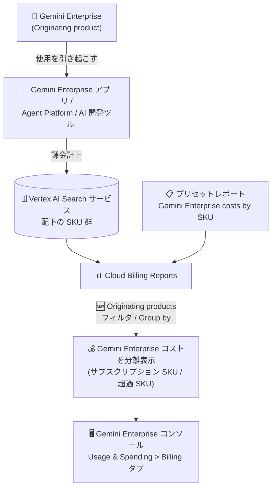

# Cloud Billing: Billing Reports に「Originating products」フィルタとグループ化オプションが追加

**リリース日**: 2026-08-07

**サービス**: Cloud Billing

**機能**: Billing Reports の Originating products フィルタ / グループ化オプション

**ステータス**: Feature (新機能)

📊 [このアップデートのインフォグラフィックを見る](https://takech9203.github.io/google-cloud-news-summary/20260807-cloud-billing-originating-products-filter.html)

## 概要

Cloud Billing の Billing Reports に、新しいフィルタ「**Originating products**」と対応するグループ化 (Group by) オプションが追加されました。Originating products とは「他のプロダクトの使用 (課金) を引き起こす Google Cloud プロダクト」を指すディメンションです。たとえば Gemini Enterprise アプリでの使用を引き起こす場合、Gemini Enterprise が Originating product となります。

このディメンションは特に **AI 支出の追跡・分析**を目的として導入されました。Gemini Enterprise のサブスクリプション費用は Vertex AI Search サービス (サービス ID: 74B1-77CF-C302) の配下に計上されるため、従来のサービス単位のレポートでは他の関連サービスのコストと混在してしまう課題がありました。Originating products ディメンションを使うことで、基盤となる Google Cloud サービスに関係なく、製品スイート・論理的な製品ファミリー単位でコストを分離して可視化できます。

FinOps 担当者、請求管理者、AI 導入を進める組織のコスト管理者が主な対象ユーザーです。

**アップデート前の課題**

- Gemini Enterprise のサブスクリプション費用は Vertex AI Search サービスの配下に計上されるため、サービス単位のレポートでは Gemini Enterprise 固有のコストが他の関連サービスのコストとまとめられ、区別が困難だった
- サブスクリプションのシート費用と、サブスクリプション上限を超えた消費ベースの超過 (オーバレッジ) 費用を切り分けて把握する標準的な手段がなかった
- 製品スイート・論理製品ファミリー単位で AI 支出を横断的に分析するディメンションが Billing Reports になかった

**アップデート後の改善**

- Originating products フィルタ / グループ化により、基盤サービスに関係なく Gemini Enterprise のサブスクリプションおよび消費コストを分離して追跡・分析できるようになった
- 新しいプリセットレポート「**Gemini Enterprise costs by SKU**」で、ワンクリックで最適なレポート構成 (SKU 別グループ化 + Gemini Enterprise Originating products フィルタ) を適用できるようになった
- Gemini Enterprise コンソールの「Usage & Spending」ページの **Billing タブ**に表示されるコストが、この Originating products ディメンションによってサポートされるようになった

## アーキテクチャ図



Gemini Enterprise (Originating product) が引き起こした使用は Vertex AI Search サービス配下の SKU として計上されますが、新しい Originating products ディメンションにより、基盤サービスに関係なく製品単位でコストを分離して可視化できます。

## サービスアップデートの詳細

### 主要機能

1. **Originating products フィルタ**
   - 関連する SKU とサービスを、基盤となる Google Cloud サービスとは独立に、製品スイート・論理製品ファミリー単位でグループ化する
   - 「Gemini Enterprise」「Gemini Enterprise Agent Platform」などの Originating products を選択してフィルタリングすることで、AI サブスクリプション費用と AI 超過費用をクリーンに分離できる

2. **Originating Product グループ化 (Group by) オプション**
   - レポートのチャートとテーブルを Originating Product + Product suite の組み合わせ単位で集計表示する
   - Gemini Enterprise コンソールの Billing タブに近いサマリービューを Billing Reports 上で再現できる (Time range を「Charge period / Last 30 days」に設定)

3. **プリセットレポート「Gemini Enterprise costs by SKU」**
   - Time range: 当月 (Charge period)、Group by: SKU、Filter: すべての Gemini Enterprise Originating products、という構成が自動適用される
   - 保存済みレポートのカルーセルおよび All reports ページからアクセス可能

4. **Gemini Enterprise コンソールとの連携**
   - Gemini Enterprise コンソールの「Usage & Spending」ページの Billing タブは、過去 30 日間の超過・Pay-as-you-go 使用コストを Gemini Enterprise アプリ、Gemini Enterprise Agent Platform、AI 開発ツール (Antigravity など) 別に表示する
   - このコスト表示機能が Originating products ディメンションによってサポートされる

## 技術仕様

### Originating products ディメンションの概要

| 項目 | 詳細 |
|------|------|
| ディメンションの定義 | 他のプロダクトの使用を引き起こす Google Cloud プロダクト |
| 提供箇所 | Cloud Billing Reports (フィルタおよび Group by) |
| 主な対象 | Gemini Enterprise、Gemini Enterprise Agent Platform などの製品スイート / 論理製品 |
| Gemini Enterprise の課金元サービス | Vertex AI Search (サービス ID: 74B1-77CF-C302) |
| プリセットレポート | Gemini Enterprise costs by SKU (Group by: SKU、Filter: Gemini Enterprise Originating products) |
| 必要権限 | 請求先アカウントに対する Full billing account permissions |

### 類似ディメンションとの関係

2026 年 6 月 15 日には「Products」フィルタと「Originating services」フィルタが追加されており、今回の Originating products はその拡張にあたります。

| ディメンション | 定義 | 例 |
|------|------|------|
| Products | 複数サービスの SKU 群をまとめた論理製品ファミリー / サブスクリプションサービス | Gemini Enterprise、Firebase App Hosting |
| Originating services | 他の**サービス**の使用を引き起こすサービス | GKE が Compute Engine の使用を引き起こす |
| Originating products (今回追加) | 他の**プロダクト**の使用を引き起こすプロダクト | Gemini Enterprise が Gemini Enterprise アプリの使用を引き起こす |

## 設定方法

### 前提条件

1. 請求先アカウントに対する Full billing account permissions を保有していること
2. Gemini Enterprise のコストを分析する場合、Gemini Enterprise サブスクリプションにリンクされた Cloud Billing アカウントを選択すること

### 手順

#### 方法 1: プリセットレポートを使用 (推奨)

1. Google Cloud コンソールで、対象の Cloud Billing アカウントの **Reports** ページを開く
2. 保存済みレポートのカルーセルまたは All reports ページから、プリセットレポート「**Gemini Enterprise costs by SKU**」を選択する
3. 自動的に「Time range: 当月 (Charge period)、Group by: SKU、Filter: すべての Gemini Enterprise Originating products」が適用される

#### 方法 2: 手動で SKU 別詳細レポートを構成

1. Reports ページの Report filters で **Originating products** フィルタを開き、「Gemini Enterprise」「Gemini Enterprise Agent Platform」などすべての Gemini Enterprise Originating products を検索・選択して Apply をクリック
2. **Group by** を **SKU** に設定して Apply をクリック (日次 / 月次の粒度が必要な場合は Date > SKU または Month > SKU)
3. レポートには以下が表示される:
   - **サブスクリプション SKU**: 日割り計上されるサブスクリプション費用
   - **超過 (Overage) SKU**: サブスクリプションのシート上限を超えた使用ベースの費用

#### 方法 3: Originating Product 別サマリーレポートを構成

1. Originating products フィルタで Gemini Enterprise 関連の Originating products を選択
2. **Group by** を **Originating Product** に設定
3. Gemini Enterprise コンソールの Billing タブと近い表示にするには、Time range を「Charge period / Last 30 days」に設定

## メリット

### ビジネス面

- **AI 支出の可視化**: 組織の Gemini Enterprise サブスクリプション費用と超過費用を明確に分離でき、正確な予算策定とチャージバック (部門別コスト配賦) のマッピングが可能になる
- **迅速なレポート作成**: プリセットレポートにより、複雑なフィルタ設定なしで即座に AI コスト分析を開始できる

### 技術面

- **サービス横断のコスト帰属**: 課金が計上される基盤サービス (Vertex AI Search など) に依存せず、製品単位でコストを帰属・分析できる
- **SKU レベルの粒度**: サブスクリプション SKU と超過 SKU を SKU 単位で分解でき、コスト増加の正確な要因を特定できる
- **コンソール間の整合性**: Billing Reports と Gemini Enterprise コンソールの Billing タブで同じディメンションに基づく一貫したコストビューが得られる

## デメリット・制約事項

### 制限事項

- Originating products ディメンション使用時は**コスト予測 (cost forecast) 機能が無効**になる
- Originating products フィールドは **BigQuery エクスポートのスキーマに未追加**のため、このディメンション使用時は「Generate query」ボタンが無効になる
- **Gemini Cloud Assist では Originating products フィルタ / Group by を使ったレポートを作成できない** (プリセットレポートを起点に手動調整する必要がある)
- Originating products フィルタは **Cost table レポートおよび Cost breakdown レポートでは利用できない**

### 考慮すべき点

- サブスクリプションは日割りで計上されるため、月額シート料金 (例: $30/月) は 1 日あたり約 $1 として毎日課金される。日々の少額課金は異常ではない
- Billing Reports の閲覧には Full billing account permissions が必要

## ユースケース

### ユースケース 1: Gemini Enterprise の超過費用の特定

**シナリオ**: 組織で Gemini Enterprise をシートベースのサブスクリプションで利用しており、サブスクリプション上限を超える消費ベースの課金が発生していないかを毎月確認したい。

**実装例**:
```
Billing Reports の設定:
- Group by: SKU
- Filter: Originating products = すべての Gemini Enterprise 製品スイート / 論理製品
```

**効果**: 超過費用がレポートテーブル上で個別の SKU 行として表示され、固定のサブスクリプションシート費用と超過費用を明確に区別できる。

### ユースケース 2: Gemini Enterprise コンソールと同等のコストサマリーを FinOps チームで共有

**シナリオ**: FinOps チームが、Gemini Enterprise アプリ / Agent Platform / AI 開発ツール (Antigravity など) 別のコストサマリーを Billing Reports で定期確認し、レポート URL を共有したい。

**効果**: Group by を Originating Product、Time range を「Charge period / Last 30 days」に設定することで、Gemini Enterprise コンソールの Billing タブに近いビューを Billing Reports 上で再現し、レポートの保存・URL 共有・CSV ダウンロードが可能になる。

## 料金

Billing Reports の新しいフィルタ / グループ化オプション自体に追加料金は発生しません (Cloud Billing のレポート機能)。

なお、分析対象となる Gemini Enterprise はサブスクリプションシートベースの課金で、サブスクリプション上限を超えた使用には消費ベースの超過課金が発生します。サブスクリプション費用は日割りで計上されます (例: 月額 $30 のシート料金は 1 日あたり約 $1)。

- [Cloud Billing ドキュメント](https://docs.cloud.google.com/billing/docs)
- [Gemini Enterprise のコスト管理](https://docs.cloud.google.com/gemini/enterprise/docs/manage-costs-overview)

## 関連サービス・機能

- **Gemini Enterprise**: 今回の Originating products ディメンションの主要な分析対象。サブスクリプション費用は Vertex AI Search サービス配下に計上される
- **Vertex AI Search**: Gemini Enterprise サブスクリプション費用が計上される基盤サービス (サービス ID: 74B1-77CF-C302)
- **Cloud Billing の Products / Originating services フィルタ**: 2026 年 6 月に追加された関連ディメンション。Products は論理製品ファミリー、Originating services はサービス間のコスト帰属 (例: GKE → Compute Engine) を表す
- **Cloud Billing BigQuery エクスポート**: 詳細なコスト分析に使用されるが、Originating products フィールドは現時点で未対応
- **Gemini Cloud Assist (Cloud Billing)**: 自然言語でレポートを作成できるが、Originating products ディメンションは現時点で未対応

## 参考リンク

- 📊 [インフォグラフィック](https://takech9203.github.io/google-cloud-news-summary/20260807-cloud-billing-originating-products-filter.html)
- [公式リリースノート](https://docs.cloud.google.com/release-notes#August_07_2026)
- [View Gemini Enterprise costs in Cloud Billing reports](https://docs.cloud.google.com/billing/docs/how-to/reports/gemini-enterprise-costs)
- [Analyzing billing data and cost trends with Reports](https://docs.cloud.google.com/billing/docs/how-to/reports)
- [View Gemini Enterprise costs in the Gemini Enterprise console](https://docs.cloud.google.com/gemini/enterprise/docs/view-costs)

## まとめ

Originating products ディメンションの追加により、Vertex AI Search サービス配下に計上されて見えにくかった Gemini Enterprise のサブスクリプション費用と超過費用を、製品単位で明確に分離・分析できるようになりました。Gemini Enterprise を利用中の組織は、まずプリセットレポート「Gemini Enterprise costs by SKU」で現状の AI 支出を確認し、超過 SKU の有無をチェックすることを推奨します。コスト予測や BigQuery エクスポートが未対応である点には留意してください。

---

**タグ**: Cloud Billing, Billing Reports, Originating Products, Gemini Enterprise, FinOps, コスト管理, AI 支出
