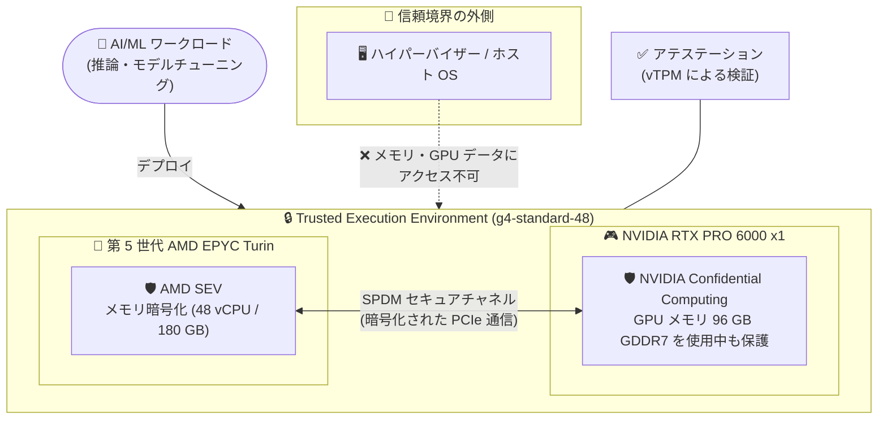

# Confidential VM: アクセラレータ最適化マシンタイプ g4-standard-48 が一般提供 (GA)

**リリース日**: 2026-08-07

**サービス**: Confidential VM

**機能**: アクセラレータ最適化マシンタイプ `g4-standard-48` のサポート (GA)

**ステータス**: GA (一般提供)

📊 [このアップデートのインフォグラフィックを見る](https://takech9203.github.io/google-cloud-news-summary/20260807-confidential-vm-g4-standard-48-ga.html)

## 概要

Confidential VM において、AI/ML ワークロードをセキュアに実行するためのアクセラレータ最適化マシンタイプ `g4-standard-48` が一般提供 (GA) になりました。このマシンタイプは第 5 世代 AMD EPYC Turin プロセッサと AMD SEV (Secure Encrypted Virtualization) によるメモリ暗号化に加え、NVIDIA RTX PRO 6000 Blackwell Server Edition GPU を 1 基搭載し、NVIDIA Confidential Computing により GPU 上で処理中のデータも暗号化して保護します。2026 年 6 月 16 日の Preview 公開から約 2 か月で GA に昇格しました。

CPU とGPU の両方をハードウェアベースの Trusted Execution Environment (TEE) で保護できるため、機密データを扱う AI 推論・モデルチューニングを、ハイパーバイザーや Google を含む第三者からデータを隔離した状態で実行できます。医療、金融、公共など、規制やコンプライアンス要件によりデータの「使用中の暗号化」が求められる組織で、GPU アクセラレーションを本番利用できるようになる点が大きな価値です。

これまで Confidential VM で GPU を利用できる GA 構成は限られており、G4 マシンタイプは A シリーズと比較して低コストにシングルホスト推論やモデルチューニングを実行できる選択肢として位置づけられています。

**アップデート前の課題**

- Confidential VM で NVIDIA RTX PRO 6000 GPU を利用する `g4-standard-48` 構成は Preview (2026 年 6 月 16 日公開) であり、Pre-GA 提供条件のもとでの利用に限られ、本番ワークロードへの適用が難しかった
- Confidential VM と GPU の組み合わせは A3 High (NVIDIA H100 + Intel TDX) が中心で、A3 High は Spot / Flex-start プロビジョニングのみ対応し、オンデマンドや予約 (Reservations) による安定的な容量確保ができなかった

**アップデート後の改善**

- `g4-standard-48` の Confidential VM が GA となり、SLA のもとで本番の機密 AI/ML ワークロードに利用できるようになった
- G4 マシンタイプはオンデマンド (Standard)、Spot、Flex-start の各プロビジョニングモデルに加え、予約 (Reservations) にも対応し、容量確保の選択肢が広がった
- AMD SEV による CPU メモリ暗号化と NVIDIA Confidential Computing による GPU データ保護を組み合わせ、CPU から GPU までエンドツーエンドの機密実行環境を構成できるようになった

## アーキテクチャ図



AMD SEV が CPU メモリを、NVIDIA Confidential Computing が GPU 上のデータをそれぞれ暗号化し、GPU ドライバと GPU 間は SPDM セキュアチャネルで保護されます。ハイパーバイザーを含む信頼境界の外側からは、使用中のデータへアクセスできません。

## サービスアップデートの詳細

### 主要機能

1. **CPU + GPU のエンドツーエンド機密実行環境**
   - 第 5 世代 AMD EPYC Turin プロセッサ上で AMD SEV によるハードウェアベースのメモリ暗号化を提供
   - NVIDIA Confidential Computing により、GPU で処理中の AI/ML データも暗号化され、ハイパーバイザーから隔離される
   - Google の vTPM によるブート時アテステーションで、VM の構成が改ざんされていないことを検証可能

2. **柔軟なプロビジョニングモデル**
   - Standard (オンデマンド)、Spot、Flex-start (MIG 経由) の 3 つのプロビジョニングモデルに対応
   - 予約 (Reservations) に対応。Confidential VM で GPU を使う構成のうち予約に対応するのは G4 マシンタイプのみ (A3 High は非対応)
   - 予約は `--require-specific-reservation` フラグにより自動消費・特定消費の両方を制御可能

3. **NVIDIA RTX PRO 6000 Blackwell Server Edition GPU**
   - GPU メモリ 96 GB (GDDR7)、24,064 CUDA コア、752 基の第 5 世代 Tensor コア、188 基の第 4 世代 RT コアを搭載
   - FP4 精度サポートにより LLM 推論などを高速化。A シリーズと比較して低コストなシングルホスト推論・モデルチューニング向けの選択肢
   - PCIe Gen 5 対応により CPU メモリから GPU への転送速度が向上

## 技術仕様

### g4-standard-48 のスペック

| 項目 | 詳細 |
|------|------|
| vCPU 数 | 48 |
| インスタンスメモリ | 180 GB |
| GPU | NVIDIA RTX PRO 6000 x 1 (GPU メモリ 96 GB GDDR7) |
| CPU プラットフォーム | 第 5 世代 AMD EPYC Turin |
| Confidential Computing 技術 | AMD SEV + NVIDIA Confidential Computing |
| Titanium SSD | 最大 1,500 GiB |
| 物理 NIC 数 | 1 |
| 最大ネットワーク帯域 | 50 Gbps |
| プロビジョニングモデル | Standard (オンデマンド) / Spot / Flex-start、予約 (Reservations) 対応 |
| ライブマイグレーション | 非対応 |

### サポートされる OS イメージ (G4 マシンタイプ)

| イメージファミリー | イメージプロジェクト |
|------|------|
| `ubuntu-2404-lts-amd64` | `ubuntu-os-cloud` |
| `cos-125-lts` | `cos-cloud` |

## 設定方法

### 前提条件

1. 十分な GPU クォータがあること (GPU クォータ要件はドキュメントを参照)
2. サポート対象ゾーンでインスタンスを作成すること
3. GPU ドライバは NVIDIA オープンカーネルモジュールドライバのバージョン 580 以降を推奨

### 手順

#### ステップ 1: Confidential VM インスタンスの作成

```bash
gcloud compute instances create INSTANCE_NAME \
    --provisioning-model=STANDARD \
    --confidential-compute-type=SEV \
    --machine-type=g4-standard-48 \
    --maintenance-policy=TERMINATE \
    --zone=ZONE_NAME \
    --image-project=ubuntu-os-cloud \
    --image-family=ubuntu-2404-lts-amd64 \
    --boot-disk-size=30G
```

`--confidential-compute-type=SEV` を指定して Confidential VM として作成します。G4 マシンタイプでは `--provisioning-model` に `STANDARD` (デフォルト) または `SPOT` を指定できます。Secure Boot を有効にする場合は `--shielded-secure-boot` フラグを追加します。

#### ステップ 2: GPU の Confidential Computing モードの有効化

```bash
# 必要なツールとライブラリのインストール
sudo apt-get update --yes
sudo apt-get install linux-headers-$(uname -r)
sudo apt install -y build-essential libxml2 libncurses5-dev pkg-config libvulkan1 gcc-12

# GPU ドライバ (バージョン 580 以降推奨) をインストール後、
# GPU とドライバ間のセキュア通信のため Linux Kernel Crypto API (LKCA) を有効化
echo "install nvidia /sbin/modprobe ecdsa_generic; /sbin/modprobe ecdh; /sbin/modprobe --ignore-install nvidia" | sudo tee /etc/modprobe.d/nvidia-lkca.conf
sudo update-initramfs -u

# SPDM セキュア接続確立のため persistence モードを有効化
sudo test -f /usr/lib/systemd/system/nvidia-persistenced.service && sudo sed -i "s/no-persistence-mode/uvm-persistence-mode/g" /usr/lib/systemd/system/nvidia-persistenced.service
sudo systemctl daemon-reload
sudo reboot
```

VM 作成後に GPU ドライバをインストールし、LKCA と persistence モードを構成することで、GPU と GPU ドライバ間に SPDM (Security Protocol and Data Model) によるセキュアチャネルが確立されます。

## メリット

### ビジネス面

- **規制業界での GPU 活用**: 医療・金融・公共など、データの「使用中の暗号化」が求められる環境でも、GA 品質で GPU アクセラレーションを本番利用できる
- **コスト効率**: G4 マシンタイプは A シリーズと比較して低コストにシングルホスト推論・モデルチューニングを実行できる。Spot / Flex-start によるさらなるコスト削減も可能

### 技術面

- **エンドツーエンドの TEE**: AMD SEV (CPU) と NVIDIA Confidential Computing (GPU) の統合により、CPU-GPU 間のデータ転送を含めて使用中のデータを保護
- **アテステーション**: vTPM によるブート時アテステーションで、VM とキーコンポーネントの完全性を検証可能
- **容量確保の柔軟性**: オンデマンド・Spot・Flex-start・予約の組み合わせで、ワークロード特性に応じた容量戦略を選択できる

## デメリット・制約事項

### 制限事項

- マルチノードワークロード向けのクラスタ作成は非対応 (NVIDIA Confidential Computing 共通の制限)
- Hyperdisk Extreme は非対応
- ライブマイグレーションは非対応
- 既存のインスタンスを Confidential VM に変換することはできない (新規作成が必要)
- ディスクは NVMe インターフェースが必須 (SCSI 非対応)。TPU のアタッチも不可
- Confidential VM インスタンスの GPU ファームウェアをフラッシュしてはならない (システムが不安定になり、クラッシュする可能性がある)

### 考慮すべき点

- NVIDIA RTX PRO 6000 GPU を Confidential G4 VM で使用すると、NVIDIA Confidential Computing ソフトウェア/サービスのライセンス料が自動的に発生する (割引対象外)
- Confidential VM は非 Confidential VM と比較して、ネットワーク帯域の低下やレイテンシの増加が発生する場合がある
- SSH 接続の確立や、メモリ量に比例したブート時間の増加が発生する場合がある
- Debian 12 は `/dev/sev-guest` パッケージがないため AMD SEV のアテステーションに非対応

## ユースケース

### ユースケース 1: 機密データを扱う LLM 推論

**シナリオ**: 医療機関が患者データを含むプロンプトを処理する LLM 推論サービスを運用する。データは使用中も暗号化し、クラウド事業者を含む第三者からのアクセスを排除する必要がある。

**実装例**:
```bash
gcloud compute instances create secure-llm-inference \
    --confidential-compute-type=SEV \
    --machine-type=g4-standard-48 \
    --maintenance-policy=TERMINATE \
    --zone=us-central1-f \
    --image-project=ubuntu-os-cloud \
    --image-family=ubuntu-2404-lts-amd64 \
    --shielded-secure-boot \
    --boot-disk-size=100G
```

**効果**: GPU メモリ 96 GB を活用した LLM 推論を、CPU・GPU 双方のメモリ暗号化とアテステーションによる検証のもとで実行でき、コンプライアンス要件を満たしながら AI サービスを提供できる。

### ユースケース 2: 予約による本番推論基盤の容量確保

**シナリオ**: 金融機関が不正検知モデルの推論基盤を本番運用しており、ピーク時にも確実に Confidential GPU インスタンスを起動できるよう容量を事前確保したい。

**効果**: G4 マシンタイプは Confidential VM + GPU 構成で唯一予約 (Reservations) に対応しており、`--reservation-affinity` による特定予約の消費と組み合わせて、機密ワークロード向けの容量を確実に確保できる。

## 料金

Confidential VM (G4) は、対応するアクセラレータ最適化 VM の GPU・vCPU・メモリ・バンドル Local SSD の Compute Engine 料金に加えて、Confidential Computing の追加料金が発生します。さらに、NVIDIA RTX PRO 6000 GPU を Confidential G4 VM で使用すると NVIDIA Confidential Computing ソフトウェアのライセンス料が自動的に加算されます。これらの追加料金は継続利用割引やフレキシブル確約利用割引の対象外です。

### 料金例 (us-central1、Compute Engine 本体料金への追加分)

| 項目 | 料金 (時間あたり) |
|--------|-----------------|
| Confidential Computing 追加料金 (g4-standard-48、オンデマンド) | $0.45 / 時間 |
| Confidential Computing 追加料金 (g4-standard-48、Spot) | $0.09 / 時間 |
| Confidential Computing 追加料金 (g4-standard-48、DWS Flex-Start) | $0.22 / 時間 |
| NVIDIA Confidential Computing ライセンス料 (GPU 1 基あたり) | $0.08 / 時間 |

最新の料金は [Confidential VM の料金ページ](https://docs.cloud.google.com/confidential-computing/confidential-vm/pricing) を参照してください。

## 利用可能リージョン

G4 マシンタイプでの NVIDIA Confidential Computing は、以下のゾーンでサポートされています (公式ドキュメント記載時点)。

| リージョン | ゾーン |
|------|------|
| asia-east1 (台湾) | a, b |
| asia-south1 (ムンバイ) | c |
| asia-south2 (デリー) | a, c |
| asia-southeast1 (シンガポール) | a, b, c |
| asia-southeast2 (ジャカルタ) | b, c |
| europe-north1 (フィンランド) | a, b, c |
| europe-west1 (ベルギー) | c |
| europe-west2 (ロンドン) | b, c |
| europe-west4 (オランダ) | a, b (ほか ai1a) |
| europe-west8 (ミラノ) | b |
| europe-west10 (ベルリン) | b |
| us-central1 (アイオワ) | d, f |
| us-east1 (サウスカロライナ) | b, d |
| us-east4 (北バージニア) | b, c |
| us-east5 (コロンバス) | a, b, c |
| us-south1 (ダラス) | a, b |
| us-west1 (オレゴン) | b, c |
| us-west3 (ソルトレイクシティ) | a |
| us-west4 (ラスベガス) | a |

最新のサポートゾーンは [サポートされている構成](https://docs.cloud.google.com/confidential-computing/confidential-vm/docs/supported-configurations#supported-zones) を参照してください。

## 関連サービス・機能

- **Confidential GKE Nodes**: GKE 1.35.3-gke.1389000 以降で、G4 マシンタイプと NVIDIA RTX PRO 6000 GPU を使った Confidential GKE Nodes 上での GPU ワークロード実行が Preview で利用可能 (同日の GKE リリースノートで発表)
- **Managed Service for Apache Spark**: `g4-standard-48` GPU マシンタイプでの Confidential Compute をサポート
- **Cluster Toolkit**: v1.96.0 で Blackwell GPU を搭載した G4 Confidential VM のサポートが追加
- **Compute Engine 予約 (Reservations)**: G4 Confidential VM の容量確保に利用可能
- **Shielded VM / vTPM**: Secure Boot とブート時アテステーションにより VM の完全性を検証

## 参考リンク

- 📊 [インフォグラフィック](https://takech9203.github.io/google-cloud-news-summary/20260807-confidential-vm-g4-standard-48-ga.html)
- [公式リリースノート](https://docs.cloud.google.com/release-notes#August_07_2026)
- [Confidential VM リリースノート](https://docs.cloud.google.com/confidential-computing/confidential-vm/docs/release-notes)
- [Confidential VM の概要](https://docs.cloud.google.com/confidential-computing/confidential-vm/docs/confidential-vm-overview)
- [GPU 付き Confidential VM インスタンスの作成](https://docs.cloud.google.com/confidential-computing/confidential-vm/docs/create-a-confidential-vm-instance-with-gpu)
- [サポートされている構成](https://docs.cloud.google.com/confidential-computing/confidential-vm/docs/supported-configurations)
- [G4 マシンタイプ (アクセラレータ最適化マシン)](https://docs.cloud.google.com/compute/docs/accelerator-optimized-machines#g4-vms)
- [料金ページ](https://docs.cloud.google.com/confidential-computing/confidential-vm/pricing)

## まとめ

`g4-standard-48` Confidential VM の GA により、CPU (AMD SEV) と GPU (NVIDIA Confidential Computing) の両方で使用中のデータを保護しながら、AI/ML ワークロードを本番運用できるようになりました。オンデマンド・予約対応という点で A3 High 構成よりも柔軟に容量を確保でき、コスト面でも A シリーズより低コストなシングルホスト推論の選択肢となります。機密データを扱う AI 推論基盤を検討している場合は、サポートゾーンと追加料金 (Confidential Computing 料金 + NVIDIA ライセンス料) を確認のうえ、PoC から始めることを推奨します。

---

**タグ**: #ConfidentialVM #ConfidentialComputing #G4 #AMDSEV #NVIDIA #RTXPRO6000 #GPU #AI #ML #セキュリティ #GA
