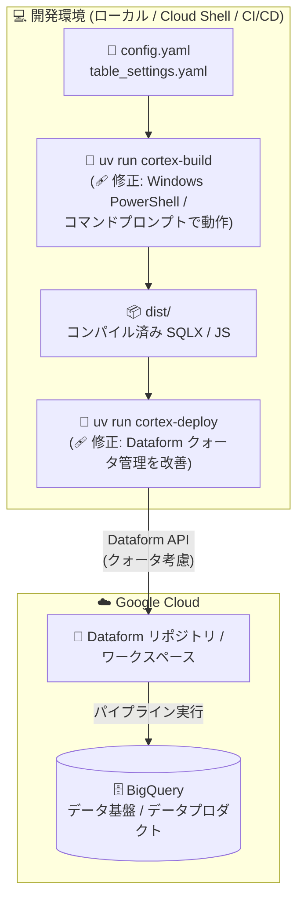

# Cortex Framework: Release 7.0.1 (Windows 環境のビルドエラー修正と Dataform クォータ管理の改善)

**リリース日**: 2026-08-07

**サービス**: Cortex Framework

**機能**: Release 7.0.1 (バグ修正リリース)

**ステータス**: Announcement / Fixed

📊 [このアップデートのインフォグラフィックを見る](https://takech9203.github.io/google-cloud-news-summary/20260807-cortex-framework-release-7-0-1.html)

## 概要

Google Cloud Cortex Framework の Release 7.0.1 が公開されました。2026 年 7 月 30 日に一般提供 (GA) となったバージョン 7.0.0 に対する最初のパッチリリースで、2 件の不具合修正が含まれています。

1 つ目は Windows 環境での修正です。Windows PowerShell または Windows コマンドプロンプトで `uv run cortex-build` コマンドを実行すると、"Could not auto-import local builder" という警告と "Invalid builder type NoneType for category ..." というエラーが発生し、ビルドが失敗する問題が解消されました。2 つ目は `uv run cortex-deploy` スクリプトにおける Dataform クォータ管理の改善です。

Cortex Framework バージョン 7 は、ローカル開発マシン、Cloud Shell、CI/CD パイプラインなど多様な環境で CLI スクリプト (`cortex-build`、`cortex-deploy`、`cortex-build-and-deploy`) を実行してデプロイするアーキテクチャを採用しており、本リリースは Windows 開発者と大規模デプロイを行うユーザーの体験を改善するものです。バージョン 7 を利用中、または導入を検討しているデータエンジニアリングチームが対象です。

**アップデート前の課題**

- Windows PowerShell / Windows コマンドプロンプトで `uv run cortex-build` を実行すると、ローカルビルダーの自動インポートに失敗し ("Could not auto-import local builder" 警告)、"Invalid builder type NoneType for category ..." エラーでビルドが完了できなかった
- `uv run cortex-deploy` 実行時の Dataform API 呼び出しにおけるクォータ管理に改善の余地があり、大規模なデプロイで Dataform のクォータ制限 (例: コンパイルリクエスト 120 回/分/プロジェクト/リージョンなどの API クォータ) に関わる問題が発生する可能性があった

**アップデート後の改善**

- Windows PowerShell / Windows コマンドプロンプトからも `uv run cortex-build` が正常に動作するようになり、Windows のローカル開発マシンでビルド・カスタマイズ・テストが可能になった
- `uv run cortex-deploy` スクリプトの Dataform クォータ管理が改善され、Dataform リポジトリへのデプロイの安定性が向上した

## アーキテクチャ図



Cortex Framework v7 のビルド・デプロイフローです。Release 7.0.1 では、ビルドフェーズ (`cortex-build`) の Windows 環境での不具合と、デプロイフェーズ (`cortex-deploy`) の Dataform クォータ管理が修正・改善されました。

## サービスアップデートの詳細

### 主要機能

1. **Windows 環境での `uv run cortex-build` エラーの修正**
   - Windows PowerShell および Windows コマンドプロンプトで `uv run cortex-build` を実行した際に発生していた "Could not auto-import local builder" 警告と "Invalid builder type NoneType for category ..." エラーが解消された
   - `cortex-build` は設定ファイル (`config.yaml`、`table_settings.yaml`) をコンパイルし、ソースデータのスキーマを解析して Dataform の JavaScript / SQLX コードを動的に生成するコマンドであり、ローカルビルダーの自動インポート失敗はビルド全体の失敗につながっていた
   - Cortex Framework のドキュメントでは、CLI スクリプトの実行環境としてローカル開発マシンが明記されており、Windows 開発者もセットアップ・カスタマイズ・テスト・デバッグに CLI を利用できる

2. **`uv run cortex-deploy` の Dataform クォータ管理の改善**
   - `cortex-deploy` はコンパイル済みアセットをターゲットの Dataform ワークスペースへプッシュするコマンドで、リポジトリ同期時にリモートの Dataform ワークスペースとローカルビルド成果物の照合を行う
   - Dataform には API クォータ (総リクエスト 6,000 回/分、コンパイルリクエスト 120 回/分、ファイルアクセスリクエスト 120 回/分、ファイル移動 60 回/分など、いずれもプロジェクト・リージョンごと) が設定されており、多数のファイルを扱う大規模デプロイでは API 呼び出し頻度の制御が重要になる
   - 本リリースでデプロイスクリプト内のクォータ管理が改善された

## 技術仕様

### Cortex Framework v7 の CLI コマンド

| コマンド | 役割 |
|------|------|
| `uv run cortex-build` | YAML 設定と SQLX / JS テンプレートをコンパイルし、デプロイ可能な Dataform アセットを生成 (今回 Windows 対応を修正) |
| `uv run cortex-deploy` | コンパイル済みアセットをターゲット Dataform ワークスペースへプッシュ (今回クォータ管理を改善) |
| `uv run cortex-build-and-deploy` | ビルドとデプロイを一括実行 |

### 関連する Dataform API クォータ (プロジェクト・リージョンごと)

| クォータ | 上限 |
|------|------|
| 総リクエスト | 6,000 回/分 |
| コンパイルリクエスト | 120 回/分 |
| ファイルアクセスリクエスト | 120 回/分 |
| ファイル移動リクエスト | 60 回/分 |
| ワークフロー呼び出しリクエスト | 60 回/分 |

## 設定方法

### 前提条件

1. Cortex Framework リポジトリのクローン (`git clone https://github.com/GoogleCloudPlatform/cortex-framework`)
2. `uv` (Python パッケージマネージャー) のインストールと `uv sync` による依存関係の同期 (Cloud Shell ではインストール済み)
3. Google Cloud SDK の認証 (`gcloud auth login` / `gcloud auth application-default login`)
4. BigQuery API、Dataform API、Cloud Resource Manager API の有効化
5. `config/config.yaml` にビルド / ソース / ターゲット / リポジトリの各プロジェクト ID を設定

### 手順

#### ステップ 1: 最新リリース (7.0.1) の取得

```bash
git clone https://github.com/GoogleCloudPlatform/cortex-framework
cd cortex-framework
uv sync
```

リポジトリを最新化し、依存関係を同期して Python 仮想環境を有効化します。

#### ステップ 2: ビルドとデプロイの実行

```bash
# ビルドのみ (Windows PowerShell / コマンドプロンプトでも実行可能に)
uv run cortex-build --config config/config.yaml

# デプロイ (Dataform クォータ管理が改善)
uv run cortex-deploy --config config/config.yaml

# または一括実行
uv run cortex-build-and-deploy --config config/config.yaml
```

前提条件の検証、SQLX スクリプトのビルド・コンパイル、Dataform リポジトリ / ワークスペースの作成とコンパイル成果物の同期が実行されます。

## メリット

### ビジネス面

- **Windows 中心の組織での導入障壁の低減**: 開発端末が Windows に統一されている企業でも、追加の回避策なしに Cortex Framework v7 のビルドをローカルで実行できる
- **デプロイの信頼性向上**: Dataform クォータ管理の改善により、大規模なデータ基盤・データプロダクトのデプロイが安定し、運用リスクが低減する

### 技術面

- **開発環境の選択肢の拡大**: ローカル開発マシン (Windows を含む)、Cloud Shell、CI/CD パイプラインという v7 がサポートする実行環境すべてで CLI が期待どおりに動作する
- **クォータ超過に起因するデプロイ失敗の抑制**: `cortex-deploy` が Dataform API のレート制限を考慮して動作することで、リポジトリ同期時のエラーやリトライの手間が減る

## デメリット・制約事項

### 考慮すべき点

- 本リリースはバグ修正のみで、新機能の追加はない
- v6 から v7 へのアップグレードは破壊的変更を伴い、自動移行パスはない (SAP レポーティング向けの v6 互換コンテンツが提供されている)
- v7 Preview から GA 系へのアップグレードでは、設定モデルの変更により設定ファイルの再作成と再デプロイが必要
- `uv run cortex-deploy` / `cortex-build-and-deploy` の実行時には匿名テレメトリが収集される (オプトアウト可能)
- Dataform の API クォータ自体はプロジェクト・リージョンごとの上限として引き続き適用される

## ユースケース

### ユースケース 1: Windows 端末でのローカル開発・カスタマイズ

**シナリオ**: 開発端末が Windows に統一されている企業のデータエンジニアリングチームが、SAP ERP 向けデータプロダクトの設定カスタマイズとビルド検証を PowerShell からローカルで行う。

**実装例**:
```powershell
# Windows PowerShell から実行 (7.0.1 で修正済み)
uv sync
uv run cortex-build --config config/config.yaml
```

**効果**: 7.0.1 以前は "Invalid builder type NoneType" エラーでビルドできず、Cloud Shell などへの切り替えが必要だったが、Windows 上でビルド・テスト・デバッグを完結できる。

### ユースケース 2: 大規模デプロイの安定運用

**シナリオ**: 多数のデータ基盤テーブルとデータプロダクトを含む大規模構成を `uv run cortex-deploy` で Dataform リポジトリへ同期する。

**効果**: 改善されたクォータ管理により、Dataform API のレート制限下でもリポジトリ同期が安定して完了し、デプロイの再実行や手動リカバリの手間を削減できる。

## 関連サービス・機能

- **Dataform**: Cortex Framework v7 のオーケストレーション基盤。ビルドで生成された SQLX / JS コードは Dataform リポジトリにプッシュされ、サーバーレスにパイプラインが実行される。今回の `cortex-deploy` 改善は Dataform API クォータへの対応
- **BigQuery**: データ基盤レイヤーとデータプロダクトレイヤーの実体が構築されるデータウェアハウス
- **uv (Python パッケージマネージャー)**: Cortex Framework の CLI 実行環境。一貫性のある分離されたビルド環境を提供する
- **Cloud Build / GitHub Actions**: CLI スクリプトを CI/CD パイプラインに組み込む際の実行基盤

## 参考リンク

- 📊 [インフォグラフィック](https://takech9203.github.io/google-cloud-news-summary/20260807-cortex-framework-release-7-0-1.html)
- [公式リリースノート](https://docs.cloud.google.com/release-notes#August_07_2026)
- [Cortex Framework リリースノート](https://docs.cloud.google.com/cortex/docs/release-notes)
- [Cortex Framework 概要](https://docs.cloud.google.com/cortex/docs/overview)
- [デプロイガイド](https://docs.cloud.google.com/cortex/docs/deployment)
- [前提条件 (uv のインストールなど)](https://docs.cloud.google.com/cortex/docs/prerequisites)
- [CLI: uv run cortex-deploy](https://docs.cloud.google.com/cortex/docs/uv-run-cortex-deploy)
- [CLI: uv run cortex-build-and-deploy](https://docs.cloud.google.com/cortex/docs/uv-run-cortex-build-and-deploy)
- [Dataform のクォータと上限](https://docs.cloud.google.com/dataform/docs/quotas)

## まとめ

Release 7.0.1 は、GA 直後のバージョン 7 に対する重要なパッチリリースです。Windows PowerShell / コマンドプロンプトでの `cortex-build` 失敗という開発環境の障壁が取り除かれ、`cortex-deploy` の Dataform クォータ管理も改善されました。v7 を利用中のチーム、特に Windows 環境で開発しているチームや大規模デプロイを行うチームは、速やかに 7.0.1 へ更新することを推奨します。

---

**タグ**: Cortex Framework, Dataform, BigQuery, SAP, バグ修正, CLI, Windows, クォータ管理
