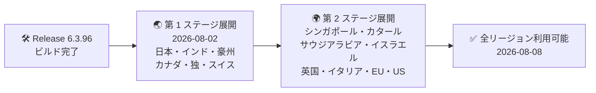

# Google SecOps SOAR: Release 6.3.96 が全リージョンで利用可能に

**リリース日**: 2026-08-08

**サービス**: Google SecOps SOAR

**機能**: Release 6.3.96 (バグ修正リリース)

**ステータス**: Announcement (全リージョン提供開始)

📊 [このアップデートのインフォグラフィックを見る](https://takech9203.github.io/google-cloud-news-summary/20260808-google-secops-soar-release-6-3-96.html)

## 概要

Google SecOps SOAR (旧 Chronicle SOAR / Siemplify) の Release 6.3.96 が、2026 年 8 月 8 日にすべてのリージョンで利用可能になりました。本リリースは 2026 年 8 月 2 日に第 1 フェーズのリージョンへのロールアウトが開始され、約 1 週間で全リージョンへの展開が完了したものです。

公式リリースノートによると、Release 6.3.96 は内部バグ修正およびカスタマー報告に基づくバグ修正 (internal and customer bug fixes) を含むメンテナンスリリースです。新機能の追加は含まれていません。

Google SecOps SOAR は段階的リリース (2 段階ロールアウト) モデルを採用しており、リリースは通常日曜日に第 1 ステージのリージョンへ展開され、その 1 週間後に第 2 ステージのリージョンへ展開されます。SOC (Security Operations Center) の運用チームや SOAR プラットフォーム管理者は、自身のテナントが属するリージョンに応じて適用タイミングが異なる点を把握しておく必要があります。

**アップデート前の状況**

- Release 6.3.96 は 2026 年 8 月 2 日時点では第 1 フェーズのリージョン (日本、インド、オーストラリア、カナダ、ドイツ、スイス) のみで利用可能だった
- 第 2 ステージのリージョン (US、EU マルチリージョンなど) では前バージョンの Release 6.3.95 が稼働していた
- 6.3.96 で修正されたバグは、第 2 ステージのリージョンでは未適用の状態だった

**アップデート後の改善**

- 2026 年 8 月 8 日をもって、すべてのリージョンで Release 6.3.96 が利用可能になった
- 内部バグ修正およびカスタマー報告に基づくバグ修正が全リージョンに適用され、プラットフォームの安定性が向上した
- 全リージョンでプラットフォームのバージョンが統一された

## リリース展開の流れ

Google SecOps SOAR の 2 段階ロールアウトモデルに沿った Release 6.3.96 の展開の流れです。第 1 ステージ展開の約 1 週間後に残りのリージョンへ展開され、全リージョンで利用可能になりました。

## サービスアップデートの詳細

### リリース内容

1. **内部バグ修正およびカスタマーバグ修正**
   - 公式リリースノートには「This release contains internal and customer bug fixes.」と記載されている
   - 修正された個別のバグの詳細は公開されていない
   - 新機能や仕様変更は本リリースには含まれない

2. **全リージョンへの展開完了**
   - 2026 年 8 月 2 日: 第 1 フェーズのリージョンへロールアウト開始
   - 2026 年 8 月 8 日: 全リージョンで利用可能に

## 技術仕様

### 段階的リリース (2 段階ロールアウト) のリージョン構成

Google SecOps SOAR のリリースは、以下の 2 ステージで展開されます (通常は日曜日に実施され、第 2 ステージは第 1 ステージの 1 週間後)。

| ステージ | 対象リージョン |
|---------|---------------|
| 第 1 ステージ | 日本、インド、オーストラリア、カナダ、ドイツ、スイス |
| 第 2 ステージ | シンガポール、カタール、サウジアラビア、イスラエル、英国 (ロンドン)、イタリア、EU (マルチリージョン)、US (マルチリージョン) |

自身のテナントが割り当てられているリージョンが不明な場合は、Google SecOps の担当者に確認してください。

### バージョン確認方法

現在稼働中のプラットフォームバージョンは、SOAR の **Settings > License Management** ページで確認できます。なお、2026 年 7 月のアップデート以降、このページでは Google Cloud への SOAR 移行の完了ステータス (Stage 1 完了で「Google.com」、Stage 2 完了で「CloudIAM Enabled」の表示) も確認できます。

## メリット

### ビジネス面

- **プラットフォームの安定性向上**: カスタマー報告に基づくバグ修正が適用され、SOC 運用における不具合リスクが低減される
- **運用負荷なしの適用**: SaaS 型プラットフォームのため、ユーザー側での適用作業は不要

### 技術面

- **全リージョンでのバージョン統一**: マルチリージョンで運用している組織でも、全テナントが同一バージョン (6.3.96) となり、挙動の差異を考慮する必要がなくなる

## デメリット・制約事項

### 考慮すべき点

- 修正されたバグの個別の内容は公開されていないため、特定の既知の問題が解消されたかを確認したい場合は Google サポートへの問い合わせが必要
- 段階的リリースモデルのため、次のリリース (6.3.97 は 2026 年 8 月 9 日に第 1 フェーズへロールアウト開始予定と発表済み) も同様にリージョンによって適用時期が約 1 週間ずれる

## 関連サービス・機能

- **Google SecOps (SIEM)**: SOAR は Google SecOps プラットフォームの対応・自動化コンポーネントとして SIEM の検知結果と連携する
- **SOAR migration to Google Cloud**: 2026 年 8 月 3 日の別アナウンスで、SOAR の Google Cloud 移行 Stage 2 の期限が 2026 年 9 月 30 日から 11 月 30 日に延長された。License Management ページで移行ステータスを確認できる
- **Remote Agents / Publisher Agent**: SOAR 本体とは別バージョン体系でリリースされるリモートエージェント。直近では Publisher Agent 2.7.0 (高可用性・ファイル転送対応) が全リージョンで利用可能になっている

## 参考リンク

- 📊 [インフォグラフィック](https://takech9203.github.io/google-cloud-news-summary/20260808-google-secops-soar-release-6-3-96.html)
- [公式リリースノート (Google Cloud Release Notes)](https://docs.cloud.google.com/release-notes#August_08_2026)
- [Google SecOps SOAR リリースノート](https://docs.cloud.google.com/chronicle/docs/soar/release-notes#August_02_2026)
- [Google SecOps SOAR 段階的リリースプラン](https://docs.cloud.google.com/chronicle/docs/soar/overview-and-introduction/soar-gradual-release)
- [SOAR migration guide](https://docs.cloud.google.com/chronicle/docs/soar/admin-tasks/advanced/migrate-to-gcp)

## まとめ

Release 6.3.96 は内部およびカスタマーバグ修正を含むメンテナンスリリースであり、2026 年 8 月 8 日をもって全リージョンへの展開が完了しました。SaaS 型のためユーザー側での作業は不要ですが、SOAR 管理者は License Management ページで自環境のバージョンを確認し、あわせて 11 月 30 日に延長された Google Cloud 移行 Stage 2 の対応状況も確認しておくことを推奨します。

---

**タグ**: #GoogleSecOps #SOAR #ReleaseNotes #BugFix #セキュリティ運用
