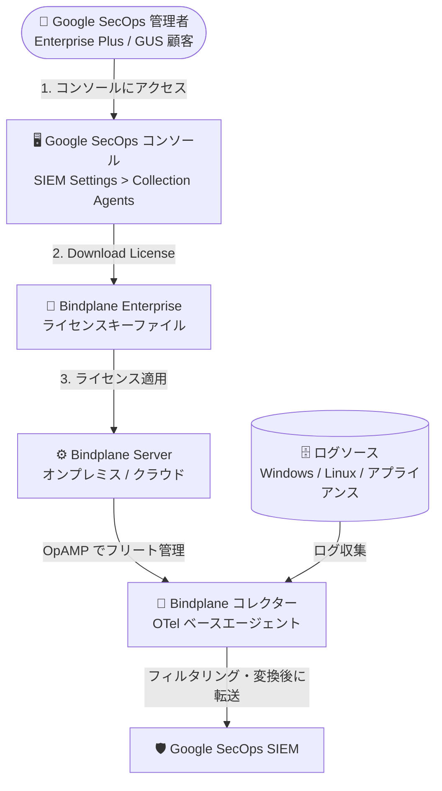

# Google SecOps (SIEM): Bindplane Enterprise ライセンスのセルフサービスダウンロード

**リリース日**: 2026-08-09

**サービス**: Google SecOps (SIEM)

**機能**: Bindplane Enterprise (Google Edition) ライセンスキーのセルフサービスダウンロード

**ステータス**: Preview

📊 [このアップデートのインフォグラフィックを見る](https://takech9203.github.io/google-cloud-news-summary/20260809-google-secops-bindplane-license-self-service.html)

## 概要

Google SecOps Enterprise Plus および Google Unified Security (GUS) の顧客が、Bindplane Enterprise (Google Edition) のライセンスキーを Google SecOps プラットフォームコンソールから直接ダウンロードできるようになりました。本機能は現在 Preview として提供されています。コンソールの **SIEM Settings > Collection Agents** に「Bindplane License」カードが追加され、そこからライセンスキーファイルを取得できます。

Bindplane は OpenTelemetry をベースにした統合テレメトリパイプラインで、あらゆるソースからログを収集・加工し Google SecOps に取り込むためのソリューションです。Google 向けには 2 つのエディションが提供されており、Bindplane (Google Edition) はすべての Google SecOps 顧客に、Bindplane Enterprise (Google Edition) は Google SecOps Enterprise Plus / GUS 顧客に追加費用なしで含まれています。Enterprise エディションは大規模デプロイメント向けに推奨され、高度なフィルタリング、データ削減、PII マスキングなどの機能を備えています。

今回のアップデートにより、Enterprise エディションの利用開始に必要なライセンスキーの入手がセルフサービス化され、大規模なログ収集基盤の構築をより迅速に開始できるようになります。

**アップデート前の課題**

- Bindplane Enterprise (Google Edition) のライセンスキーを顧客自身がコンソールから取得する手段がなく、Google のアカウントチームを通じてライセンスキーをリクエストする必要があった
- ライセンス入手に人手を介したやり取りが必要なため、Bindplane Server のセットアップ開始までにリードタイムが発生していた

**アップデート後の改善**

- Google SecOps コンソールの SIEM Settings > Collection Agents から、ライセンスキーファイルを直接ダウンロードできるようになった
- 対象顧客 (Enterprise Plus / GUS) は Google アカウントチームへの依頼なしに、セルフサービスで Bindplane Server へのライセンス適用まで完結できるようになった

なお、コンソールにセルフサービスダウンロードのオプションが表示されない場合は、従来通り Google アカウントチームに連絡してライセンスキーをリクエストする必要があります。

## アーキテクチャ図

コンソールからライセンスキーをセルフサービスで取得し、Bindplane Server に適用してコレクターのフリートを管理、各種ログソースから Google SecOps へログを取り込むまでの流れを示しています。

## サービスアップデートの詳細

### 主要機能

1. **コンソールからのライセンスキーダウンロード (Preview)**
   - Google SecOps コンソールの SIEM Settings > Collection Agents に「Bindplane License」カードが追加された
   - 「Download License」をクリックしてライセンスキーファイルを保存できる
   - ダウンロードしたライセンスキーは Bindplane Server のインストールに適用する

2. **対象顧客**
   - Google SecOps Enterprise Plus の顧客
   - Google Unified Security (GUS) の顧客
   - Bindplane Enterprise (Google Edition) はこれらの顧客に追加費用なしで含まれる

3. **フォールバック手段**
   - コンソールにセルフサービスダウンロードのオプションが表示されない場合は、Google アカウントチームに連絡してライセンスキーをリクエストする

## 技術仕様

### Bindplane Google エディションの比較

| 項目 | Bindplane (Google Edition) | Bindplane Enterprise (Google Edition) |
|------|---------------------------|--------------------------------------|
| 費用 | すべての Google SecOps 顧客に追加費用なしで提供 | Google SecOps Enterprise Plus 顧客に追加費用なしで提供 |
| ルーティング先 | Google のみ (Google SecOps、Cloud Logging、BigQuery、Cloud Storage) | Google に加え、SIEM 移行用に非 Google 宛先へのルーティングを 12 か月提供 |
| フィルタリング | 正規表現による基本フィルタ | 高度なフィルタリングプロセッサ (条件・フィールド・重大度など)、データ削減、ログサンプリング、重複排除 |
| マスキング | なし | PII マスキング |
| 変換 | フィールド追加・移動、パース (KV/JSON/CSV/XML/タイムスタンプ/正規表現)、フィールドリネーム、イベントブレーカー | Google Edition の全機能に加え、フィールド削除、空値削除、coalesce |
| プラットフォーム機能 | ゲートウェイ、コレクター、Bindplane Server (オンプレミス/クラウド)、高可用性、RBAC、フリート管理など | Google Edition の全機能をサポート |

### Bindplane の主要コンポーネント

| コンポーネント | 説明 |
|---------------|------|
| Bindplane コレクター | OpenTelemetry (OTel) Collector ベースのオープンソースエージェント。各種ソースからログを収集し Google SecOps に送信。オンプレミスまたはクラウドにインストール可能 |
| Bindplane Server | OTel コレクターのデプロイメントを一元管理するプラットフォーム。オンプレミスまたは Bindplane クラウドで稼働。利用は任意だが多くの Google SecOps 顧客が使用 |

## 設定方法

### 前提条件

1. Google SecOps Enterprise Plus または Google Unified Security (GUS) の契約があること
2. Google SecOps コンソールへのアクセス権があること
3. ライセンスを適用する Bindplane Server (オンプレミスまたはクラウド) がインストール済み、またはインストール予定であること

### 手順

#### ステップ 1: ライセンスキーのダウンロード

1. Google SecOps コンソールで **SIEM Settings > Collection Agents** に移動する
2. **Bindplane License** カードで **Download License** をクリックし、ライセンスキーファイルを保存する

#### ステップ 2: Bindplane Server へのライセンス適用

ダウンロードしたライセンスキーを Bindplane Server のインストールに適用します。詳細な手順は Bindplane 公式ドキュメントの [Apply a Bindplane license](https://docs.bindplane.com/installation/license) を参照してください。

## メリット

### ビジネス面

- **リードタイムの短縮**: アカウントチームへの依頼を待たずにライセンスを入手でき、大規模ログ収集基盤の構築をすぐに開始できる
- **追加費用なし**: Bindplane Enterprise (Google Edition) は Enterprise Plus / GUS 契約に含まれており、ライセンス取得に追加コストは発生しない

### 技術面

- **セルフサービス化**: SIEM の管理画面 (Collection Agents) 内でライセンス取得が完結し、収集エージェントの認証ファイル取得と同じ場所で運用できる
- **大規模デプロイメント対応**: Enterprise エディションの高度なフィルタリング、データ削減、PII マスキングなどを迅速に利用開始できる

## デメリット・制約事項

### 制限事項

- 本機能は Preview であり、GA 前の機能として提供されている
- 対象は Google SecOps Enterprise Plus および GUS 顧客のみ (通常の Google SecOps 顧客は Bindplane (Google Edition) を利用)
- コンソールにセルフサービスダウンロードのオプションが表示されない場合があり、その際は Google アカウントチームへの連絡が必要

### 考慮すべき点

- ライセンスキーファイルは認証情報に準じた機密情報として、安全に保管・配布する運用を検討する必要がある
- Bindplane Server の利用は任意だが、Enterprise ライセンスの適用先は Bindplane Server のインストールである

## ユースケース

### ユースケース 1: 大規模オンプレミス環境からのログ収集基盤の迅速な立ち上げ

**シナリオ**: Enterprise Plus 契約の企業が、数千台規模の Windows / Linux ホストから Google SecOps へのログ収集を Bindplane で構築する。

**効果**: コンソールから即座にライセンスを取得して Bindplane Server を構成でき、高度なフィルタリングやデータ削減を使った大規模フリート管理をリードタイムなしで開始できる。

### ユースケース 2: 他社 SIEM からの移行

**シナリオ**: 既存 SIEM から Google SecOps への移行期間中、ログを両方の宛先に送信して並行運用したい。

**効果**: Bindplane Enterprise (Google Edition) は SIEM 移行用に非 Google 宛先へのルーティングを 12 か月間サポートしており、セルフサービスでライセンスを取得してすぐに並行送信構成を開始できる。

## 料金

Bindplane Enterprise (Google Edition) は、Google SecOps Enterprise Plus 顧客に追加費用なしで含まれます。Bindplane (Google Edition) はすべての Google SecOps 顧客に追加費用なしで提供されます。

Google SecOps 自体の料金については [Google Security Operations の料金ページ](https://cloud.google.com/security/products/security-operations) を参照してください。

## 関連サービス・機能

- **Google SecOps (SIEM)**: Bindplane コレクターが収集・加工したログの取り込み先。silent-host モニタリングなどの連携機能も提供
- **Cloud Logging / BigQuery / Cloud Storage**: Bindplane (Google Edition) がサポートする Google 系のルーティング先
- **Google Cloud Observability**: Bindplane は Cloud Monitoring / Cloud Logging / Cloud Trace へのテレメトリ収集にも利用可能
- **OpenTelemetry**: Bindplane コレクターの基盤。Bindplane は OTel プロジェクトの主要コントリビューター

## 参考リンク

- 📊 [インフォグラフィック](https://takech9203.github.io/google-cloud-news-summary/20260809-google-secops-bindplane-license-self-service.html)
- [公式リリースノート](https://docs.cloud.google.com/release-notes#August_09_2026)
- [Deploy the Bindplane agent for collection (公式ドキュメント)](https://docs.cloud.google.com/chronicle/docs/ingestion/use-bindplane-agent)
- [Bindplane for Google Cloud](https://docs.cloud.google.com/stackdriver/bindplane)
- [Apply a Bindplane license (Bindplane ドキュメント)](https://docs.bindplane.com/installation/license)

## まとめ

Google SecOps Enterprise Plus / GUS 顧客は、Bindplane Enterprise (Google Edition) のライセンスキーをコンソールからセルフサービスで取得できるようになり、大規模ログ収集基盤の立ち上げが迅速化されます。該当契約の環境では SIEM Settings > Collection Agents の Bindplane License カードを確認し、Bindplane Server へのライセンス適用フローを整備することを推奨します。表示されない場合は Google アカウントチームへ連絡してください。

---

**タグ**: Google SecOps, SIEM, Bindplane, OpenTelemetry, ログ収集, ライセンス, Preview, セキュリティ
