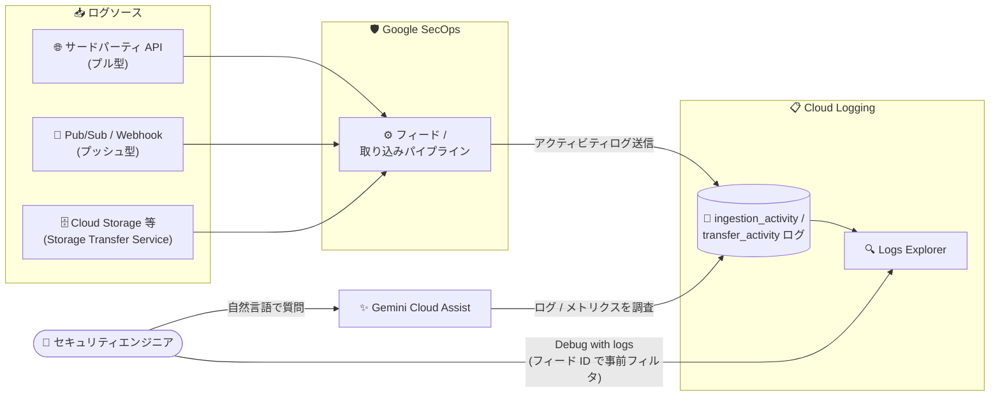

# Google SecOps: Cloud Logging によるフィードアクティビティ分析 (Public Preview)

**リリース日**: 2026-08-09

**サービス**: Google SecOps

**機能**: Cloud Logging によるフィードアクティビティ分析 (Analyze feed activity with Cloud Logging)

**ステータス**: Public Preview (Spotlight Feature)

📊 [このアップデートのインフォグラフィックを見る](https://takech9203.github.io/google-cloud-news-summary/20260809-google-secops-feed-activity-cloud-logging.html)

## 概要

Google SecOps のデータ取り込み (インジェスト) パイプラインとフィードのアクティビティを、Cloud Logging を使ってモニタリング・デバッグ・トラブルシューティングできる機能が Public Preview として公開されました。取り込みおよびフィードアクティビティのログを Cloud Logging に送信し、Logs Explorer で表示・クエリすることで、ログの欠落・遅延・失敗といったログ配信の問題を診断し、取り込み異常の解決にかかる時間を短縮できます。

この機能は、プッシュ型・プル型の両方の取り込みメカニズムに対する可視性を提供します。さらに、Google SecOps コンソールから Gemini Cloud Assist を使ってロギングとメトリクスのテレメトリを直接調査したり、フィード管理ページの「Debug with logs」オプションから、特定のフィード ID で事前フィルタリングされた Logs Explorer を開いたりすることが可能です。

主な対象ユーザーは、Google SecOps SIEM の取り込みパイプラインとフィードの健全性を管理するセキュリティエンジニアおよび管理者です。

**アップデート前の課題**

これまで取り込みの健全性確認は、主に Google SecOps コンソール内のツール (Health Hub、Data Health Deep Dive ダッシュボード、Cloud Monitoring の取り込みメトリクス) に依存していました。

- フィード実行ごとの詳細なアクティビティログ (転送バイト数、レコード数、HTTP ステータスコード、エラー詳細など) を Logs Explorer で直接クエリする手段がなかった
- ログの欠落・遅延・失敗の原因究明には、ダッシュボードのタイムスタンプ比較 (Last Event Time / Last Collected / Last Ingested) など間接的な分析が中心だった
- フィード単位の詳細なデバッグには複数の画面を行き来する必要があり、取り込み異常の解決に時間がかかっていた

**アップデート後の改善**

- 取り込み・フィードアクティビティログが Cloud Logging に送信され、Logs Explorer で Logging クエリ言語を使った柔軟な絞り込み (名前空間、ログ ID、取り込みメカニズム、フィード ID、コレクタ ID など) が可能になった
- 統一された JSON ペイロード (転送 ID、ログタイプ、バイト数、レコード数、HTTP ステータスコード、エラー詳細、リトライ可否など) により、失敗原因の特定が容易になった
- フィード管理ページの「Debug with logs」から、対象フィード ID で事前フィルタリングされた Logs Explorer をワンクリックで開けるようになった
- Google SecOps コンソールの「Ask Gemini Cloud Assist」から、フィードのボリュームやエラーについて自然言語で調査できるようになった

## アーキテクチャ図



Google SecOps の取り込みパイプラインが処理するフィードアクティビティが Cloud Logging にログとして送信され、Logs Explorer でのクエリ分析、コンソールからの「Debug with logs」、Gemini Cloud Assist による自然言語調査が可能になる構成です。

## サービスアップデートの詳細

### 主要機能

1. **Logs Explorer でのフィードアクティビティログの表示とクエリ**
   - Google SecOps インスタンスに関連付けられた Google Cloud プロジェクトで、Logging クエリ言語を使ってログを絞り込み可能
   - 名前空間 (`labels.namespace="chronicle-siem"`)、取り込みアクティビティのログストリーム (`log_id("chronicle.googleapis.com/ingestion_activity")`)、取り込みメカニズム (`labels.ingestion_mechanism`)、フィード ID (`labels.feed_id`)、コレクタ ID (`labels.collector_id`) でのフィルタリングに対応

2. **Debug with logs (コンソール統合)**
   - フィード管理ページ (および View feed ページ) のアクションメニューから「Debug with logs」を選択すると、対象フィード ID で事前フィルタリングされた Logs Explorer が新しいタブで開く
   - フィード単位のデバッグを最短経路で開始できる

3. **Gemini Cloud Assist による調査**
   - Feeds ページの「Ask Gemini Cloud Assist」からチャットペインを開き、フィードのボリュームやエラーについて質問できる
   - プッシュ型・プル型の取り込みメカニズムのロギング・メトリクステレメトリを Google SecOps コンソールから直接調査可能

4. **Storage Transfer Service (STS) ログのサポート**
   - Cloud Storage などを利用する静的フィードのログは、テナント環境からユーザーの Google Cloud プロジェクトにルーティングされ、`resource.type="storage_transfer_job"` と `log_id("storagetransfer.googleapis.com/transfer_activity")` でクエリする
   - `chronicle.googleapis.com/ingestion_activity` では STS ベースの静的フィードのログは表示されない点に注意

## 技術仕様

### 主要な用語とログ識別子

| 項目 | 詳細 |
|------|------|
| `chronicle-siem` | Google SecOps エコシステムに関連するログの名前空間ラベル |
| `chronicle.googleapis.com/ingestion_activity` | Google SecOps データ取り込みパイプライン専用のログストリームのログ ID |
| `storage_transfer_job` | Storage Transfer Service (STS) を使う静的フィードのログのリソースタイプ |
| `storagetransfer.googleapis.com/transfer_activity` | STS アクティビティログのログ ID |

### 取り込みアクティビティログの主なフィールド

| フィールド | データ型 | 説明 |
|------|------|------|
| `request_start_time` | string | アクティビティ開始タイムスタンプ (RFC 3339) |
| `activity_duration` | string | アクティビティの総経過時間 (例: "1.500s") |
| `transfer_id` | string | ファイル / データ転送操作の一意な識別子 |
| `feed_id` / `collector_id` | string | フィード / コレクタの一意な識別子 |
| `log_type` | string | 取り込むログの形式 (例: `DUO`、`OFFICE_365`) |
| `http_status_code` | integer | API フェッチ操作の HTTP ステータスコード |
| `bytes_transferred` / `record_count` | integer | 転送された生バイト数 / 処理されたログエントリ数 |
| `activity` | string | 実行中のタスク名 (例: `File Processing`、`File Transfer`) |
| `error_details` | object | 失敗時のエラー詳細 (`error_message`、`error_code`、`error_type`、`is_retriable`) |

### 失敗時のログペイロード例

```json
{
  "request_start_time": "2026-06-30T19:05:00Z",
  "activity_duration": "1.200s",
  "transfer_id": "transfer-12346",
  "feed_id": "feed-998877",
  "collector_id": "collector-abcd",
  "log_type": "WORKDAY_AUDIT",
  "request_urls": ["https://api.workday.com/ccx/v1/tenant/logs"],
  "http_status_code": 401,
  "bytes_transferred": 0,
  "record_count": 0,
  "activity": "File Transfer",
  "details": "Authorization failure during API request.",
  "error_details": {
    "error_message": "Invalid API token or credential expired.",
    "error_code": "401",
    "error_type": "AUTHORIZATION_ERROR",
    "is_retriable": true
  }
}
```

## 設定方法

### 前提条件

1. ログを表示するために、プロジェクトに対して以下のいずれかの IAM ロールが必要
   - Logs Viewer (`roles/logging.viewer`)
   - Private Logs Viewer (`roles/logging.privateLogViewer`)
2. Cloud Logging は課金対象サービスであるため、コストへの影響を理解しておく (Google Cloud 無料プログラムの一部として無料枠あり)

### 手順

#### ステップ 1: Logs Explorer でフィードアクティビティログをクエリする

Google Cloud コンソールで Logs Explorer を開き、Google SecOps インスタンスに関連付けられたプロジェクトを選択して、クエリペインに条件を入力します。

```text
# Google SecOps エコシステム全体のログを取得
labels.namespace="chronicle-siem"

# 取り込みパイプライン関連のログに絞り込み
log_id("chronicle.googleapis.com/ingestion_activity")

# 特定の取り込みメカニズム (例: サードパーティ API) に絞り込み
labels.ingestion_mechanism="Third Party API"

# 特定のフィード / コレクタに絞り込み
labels.feed_id="FEED_ID"
labels.collector_id="COLLECTOR_ID"
```

#### ステップ 2: STS ベースの静的フィードのログをクエリする

Storage Transfer Service を使う静的フィードは、異なるリソースタイプとログ名を使用します。

```text
resource.type="storage_transfer_job" AND log_id("storagetransfer.googleapis.com/transfer_activity")
```

#### ステップ 3: コンソールツールでデバッグする

- **Debug with logs**: フィード管理ページで対象フィードのアクションメニューから「Debug with logs」を選択すると、そのフィード ID で事前フィルタリングされた Logs Explorer が新しいタブで開きます。
- **Ask Gemini Cloud Assist**: Feeds ページで「Ask Gemini Cloud Assist」を選択してチャットペインを開き、フィードのボリュームやエラーについて質問します。

## メリット

### ビジネス面

- **インシデント解決時間の短縮**: ログの欠落・遅延・失敗の原因を統一されたログペイロードで迅速に特定でき、取り込み異常の解決にかかる時間を削減できる
- **SIEM の信頼性向上**: 取り込みパイプラインの可視性が高まることで、検知に使うログデータの完全性・鮮度を担保しやすくなる

### 技術面

- **標準ツールでの分析**: Cloud Logging / Logs Explorer という Google Cloud 標準のオブザーバビリティツールで、他の Google Cloud ワークロードと同じ手法・クエリ言語により分析できる
- **エラーの構造化**: `error_details` に `error_type` や `is_retriable` が含まれ、リトライすべきか設定修正すべきかの判断が容易
- **ワンクリックデバッグ**: 「Debug with logs」により、フィード単位のトラブルシューティングを事前フィルタ済みの Logs Explorer から即座に開始できる
- **AI 支援の調査**: Gemini Cloud Assist で自然言語によるログ・メトリクス調査が可能

## デメリット・制約事項

### 制限事項

- Public Preview (Pre-GA) 機能であり、Google SecOps Service Specific Terms の Pre-GA Offerings Terms が適用される。サポートが限定される場合があり、変更が他の Pre-GA バージョンと互換性を持たない可能性がある
- STS を使う静的フィードのログは `chronicle.googleapis.com/ingestion_activity` では表示されず、`resource.type="storage_transfer_job"` と STS 専用のログ ID でクエリする必要がある

### 考慮すべき点

- Cloud Logging は課金対象サービスであり、ログの取り込み量に応じたコストが発生する (無料枠あり)。詳細は Google Cloud Observability の料金を確認すること
- ログ閲覧には `roles/logging.viewer` または `roles/logging.privateLogViewer` の付与が必要で、SOC メンバーへの IAM 権限設計を事前に検討する必要がある

## ユースケース

### ユースケース 1: フィードの認証エラーの迅速な特定

**シナリオ**: サードパーティ API (例: Workday) からのログが突然取り込まれなくなった。原因が API 側か SecOps 側か切り分けたい。

**実装例**:
```text
log_id("chronicle.googleapis.com/ingestion_activity")
labels.feed_id="feed-998877"
```

**効果**: `http_status_code: 401` や `error_details.error_type: "AUTHORIZATION_ERROR"` から認証情報の期限切れを即座に特定でき、フィード設定の認証情報更新という対処に直結する。`is_retriable` フィールドによりリトライ可否も判断できる。

### ユースケース 2: ログ遅延・欠落の調査

**シナリオ**: 特定のログタイプのイベントが遅延しており、ソース側の問題か SecOps 取り込みパイプラインの問題かを調べたい。

**効果**: `request_start_time`、`activity_duration`、`bytes_transferred`、`record_count` をフィード実行ごとに時系列で確認でき、Health Hub のダッシュボードによる集計値だけでは分からない実行単位の詳細を把握できる。

### ユースケース 3: Gemini Cloud Assist による対話的な調査

**シナリオ**: SOC アナリストが Logging クエリ言語に習熟していないが、フィードのエラー傾向を素早く把握したい。

**効果**: Feeds ページの「Ask Gemini Cloud Assist」から自然言語でフィードのボリュームやエラーについて質問でき、クエリ作成のスキルギャップを埋められる。

## 料金

この機能自体の追加料金に関する個別の記載はありませんが、Cloud Logging は課金対象サービスであり、ログの取り込み量に応じた料金が発生します。Google Cloud 無料プログラムの一部として無料枠が提供されています。詳細は [Google Cloud Observability の料金ページ](https://cloud.google.com/stackdriver/pricing) を確認してください。

## 関連サービス・機能

- **Cloud Logging / Logs Explorer**: フィードアクティビティログの保存・表示・クエリの基盤。Logging クエリ言語で柔軟なフィルタリングが可能
- **Gemini Cloud Assist**: Google SecOps コンソールからロギング・メトリクステレメトリを自然言語で調査する AI アシスタント
- **Storage Transfer Service**: Cloud Storage などを使う静的フィードのデータ転送を担い、専用のログ (`transfer_activity`) を出力
- **Health Hub / Data Health Deep Dive ダッシュボード**: フィード・データソース・パーサーの健全性をダッシュボードで俯瞰する既存の監視機能。本機能はこれをログレベルの詳細分析で補完する
- **Cloud Monitoring**: 取り込みメトリクスに基づくアラート設定 (例: ログ停止検知の Metric absence 条件) と組み合わせて利用可能

## 参考リンク

- 📊 [インフォグラフィック](https://takech9203.github.io/google-cloud-news-summary/20260809-google-secops-feed-activity-cloud-logging.html)
- [公式リリースノート](https://docs.cloud.google.com/release-notes#August_09_2026)
- [Analyze feed activity with Cloud Logging (公式ドキュメント)](https://docs.cloud.google.com/chronicle/docs/ingestion/analyze-feed-activity-with-cloud-logging)
- [Manage data feeds](https://docs.cloud.google.com/chronicle/docs/administration/feed-management)
- [Data feeds overview](https://docs.cloud.google.com/chronicle/docs/administration/feed-management-overview)
- [Check data ingestion health](https://docs.cloud.google.com/chronicle/docs/ingestion/ingestion-overview)
- [Google Cloud Observability 料金](https://cloud.google.com/stackdriver/pricing)

## まとめ

Google SecOps の取り込みパイプラインとフィードのアクティビティが Cloud Logging で分析できるようになり、ログ配信の問題 (欠落・遅延・失敗) の診断と解決が大幅に効率化されます。SecOps を運用しているチームは、必要な IAM ロール (`roles/logging.viewer` など) を整備した上で、まずは「Debug with logs」と `chronicle.googleapis.com/ingestion_activity` のクエリを試し、Cloud Logging のコスト影響を確認しながら運用フローに組み込むことを推奨します。

---

**タグ**: #GoogleSecOps #CloudLogging #SIEM #Ingestion #LogsExplorer #GeminiCloudAssist #PublicPreview #Security
