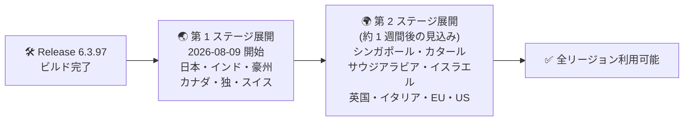

# Google SecOps SOAR: Release 6.3.97 が第 1 フェーズのリージョンへロールアウト開始

**リリース日**: 2026-08-09

**サービス**: Google SecOps SOAR

**機能**: Release 6.3.97 (バグ修正リリース)

**ステータス**: Announcement (第 1 フェーズのリージョンへロールアウト中)

📊 [このアップデートのインフォグラフィックを見る](https://takech9203.github.io/google-cloud-news-summary/20260809-google-secops-soar-release-6-3-97.html)

## 概要

Google SecOps SOAR (旧 Chronicle SOAR / Siemplify) の Release 6.3.97 が、2026 年 8 月 9 日に第 1 フェーズのリージョンへのロールアウトを開始しました。公式リリースノートによると、本リリースは内部バグ修正およびカスタマー報告に基づくバグ修正 (internal and customer bug fixes) を含むメンテナンスリリースです。

Google SecOps SOAR は段階的リリース (2 段階ロールアウト) モデルを採用しており、リリースは通常日曜日に第 1 ステージのリージョン (日本、インド、オーストラリア、カナダ、ドイツ、スイス) へ展開され、その約 1 週間後に第 2 ステージのリージョン (US・EU マルチリージョンなど) へ展開されます。前バージョンの Release 6.3.96 は 2026 年 8 月 2 日に第 1 フェーズへ展開が開始され、8 月 8 日に全リージョンで利用可能になっており、6.3.97 も同様のサイクルで展開が進む見込みです。

**アップデート前の状況**

- 全リージョンで前バージョンの Release 6.3.96 が稼働していた
- 6.3.97 で修正されたバグは、いずれのリージョンにも未適用の状態だった

**アップデート後の改善**

- 第 1 フェーズのリージョンで Release 6.3.97 の適用が開始され、内部およびカスタマー報告に基づくバグ修正が反映される
- 第 2 ステージのリージョンへは段階的リリースモデルに従い、約 1 週間後に展開される見込み

## リリース展開の流れ

Google SecOps SOAR の 2 段階ロールアウトモデルに沿った Release 6.3.97 の展開の流れです。現時点では第 1 ステージのリージョンへの展開が開始された段階です。

## サービスアップデートの詳細

### リリース内容

1. **内部バグ修正およびカスタマーバグ修正**
   - 公式リリースノートには「This release contains internal and customer bug fixes.」と記載されている
   - 修正された個別のバグの詳細は公開されていない
   - 新機能や仕様変更は本リリースのアナウンスには含まれない

2. **第 1 フェーズのリージョンへのロールアウト開始**
   - 2026 年 8 月 9 日: 第 1 フェーズのリージョンへロールアウト開始
   - 残りのリージョンへは段階的リリースプランに従って展開される

### 関連する変更: リッチテキストエディタの刷新 (同日発表)

同日のリリースノートでは、Google SecOps 全体のリッチテキストエディタのアップグレードも Feature として発表されています。対象は Cases Wall、Use Case Upload ダイアログ、Report Template ダイアログ、Dashboard Editor ウィジェットで、主な変更点は以下のとおりです。

- **タイポグラフィの簡素化**: フォントサイズがセマンティックな選択肢 (Small / Normal / Large / Huge) に整理。既存テキストの旧フォントサイズは維持される
- **テーブル操作の簡素化**: テーブル全体の挿入・削除のみサポートし、セル単位の書式設定は非サポートに
- **ツールバーの整理**: Cut / Copy / Paste ボタンを削除 (OS 標準のキーボードショートカットは引き続き利用可能)
- **表示の一貫性向上**: 編集中のコンテンツと送信後のコンテンツの見た目の一貫性が改善

UI 中心の変更ですが、Cases Wall のコメントやレポートテンプレートでセル単位のテーブル書式を利用していた場合は運用への影響を確認してください。

## 技術仕様

### 段階的リリース (2 段階ロールアウト) のリージョン構成

Google SecOps SOAR のリリースは、以下の 2 ステージで展開されます (通常は日曜日に実施され、第 2 ステージは第 1 ステージの 1 週間後)。

| ステージ | 対象リージョン |
|---------|---------------|
| 第 1 ステージ | 日本、インド、オーストラリア、カナダ、ドイツ、スイス |
| 第 2 ステージ | シンガポール、カタール、サウジアラビア、イスラエル、英国 (ロンドン)、イタリア、EU (マルチリージョン)、US (マルチリージョン) |

自身のテナントが割り当てられているリージョンが不明な場合は、Google SecOps の担当者に確認してください。

### バージョン確認方法

現在稼働中のプラットフォームバージョンは、SOAR の **Settings > License Management** ページで確認できます。あわせて、このページでは Google Cloud への SOAR 移行の完了ステータス (Stage 1 完了で「Google.com」、Stage 2 完了で「CloudIAM Enabled」の表示) も確認できます。

## メリット

### ビジネス面

- **プラットフォームの安定性向上**: カスタマー報告に基づくバグ修正が適用され、SOC 運用における不具合リスクが低減される
- **運用負荷なしの適用**: SaaS 型プラットフォームのため、ユーザー側での適用作業は不要

### 技術面

- **段階的リリースによるリスク低減**: 第 1 ステージのリージョンで先行適用されるため、問題が検出された場合に全リージョンへの影響を抑えられる

## デメリット・制約事項

### 考慮すべき点

- 修正されたバグの個別の内容は公開されていないため、特定の既知の問題が解消されたかを確認したい場合は Google サポートへの問い合わせが必要
- 段階的リリースモデルのため、第 2 ステージのリージョン (US、EU マルチリージョンなど) では適用まで約 1 週間の時間差がある。マルチリージョンで運用している組織では、リージョン間で一時的にバージョンが異なる点に留意が必要
- 同日発表のリッチテキストエディタ刷新により、テーブルのセル単位の書式設定が非サポートになるなど、既存の運用手順に影響する UI 変更が含まれる

## 関連サービス・機能

- **Google SecOps (SIEM)**: SOAR は Google SecOps プラットフォームの対応・自動化コンポーネントとして SIEM の検知結果と連携する
- **SOAR migration to Google Cloud**: 2026 年 8 月 3 日の別アナウンスで、SOAR の Google Cloud 移行 Stage 2 の期限が 2026 年 9 月 30 日から 11 月 30 日に延長された。License Management ページで移行ステータスを確認できる
- **Release 6.3.96 (前バージョン)**: 2026 年 8 月 8 日に全リージョンで利用可能になったバグ修正リリース。6.3.97 はその後継リリースにあたる

## 参考リンク

- 📊 [インフォグラフィック](https://takech9203.github.io/google-cloud-news-summary/20260809-google-secops-soar-release-6-3-97.html)
- [公式リリースノート (Google Cloud Release Notes)](https://docs.cloud.google.com/release-notes#August_09_2026)
- [Google SecOps SOAR リリースノート](https://docs.cloud.google.com/chronicle/docs/soar/release-notes#August_09_2026)
- [Google SecOps SOAR 段階的リリースプラン](https://docs.cloud.google.com/chronicle/docs/soar/overview-and-introduction/soar-gradual-release)
- [SOAR migration guide](https://docs.cloud.google.com/chronicle/docs/soar/admin-tasks/advanced/migrate-to-gcp)

## まとめ

Release 6.3.97 は内部およびカスタマーバグ修正を含むメンテナンスリリースであり、2026 年 8 月 9 日に第 1 フェーズのリージョン (日本を含む) への展開が開始されました。SaaS 型のためユーザー側での作業は不要ですが、SOAR 管理者は License Management ページで自環境のバージョンを確認するとともに、同日発表されたリッチテキストエディタの UI 変更 (特にテーブルのセル書式の非サポート化) が既存の運用に影響しないか確認しておくことを推奨します。

---

**タグ**: #GoogleSecOps #SOAR #ReleaseNotes #BugFix #セキュリティ運用
