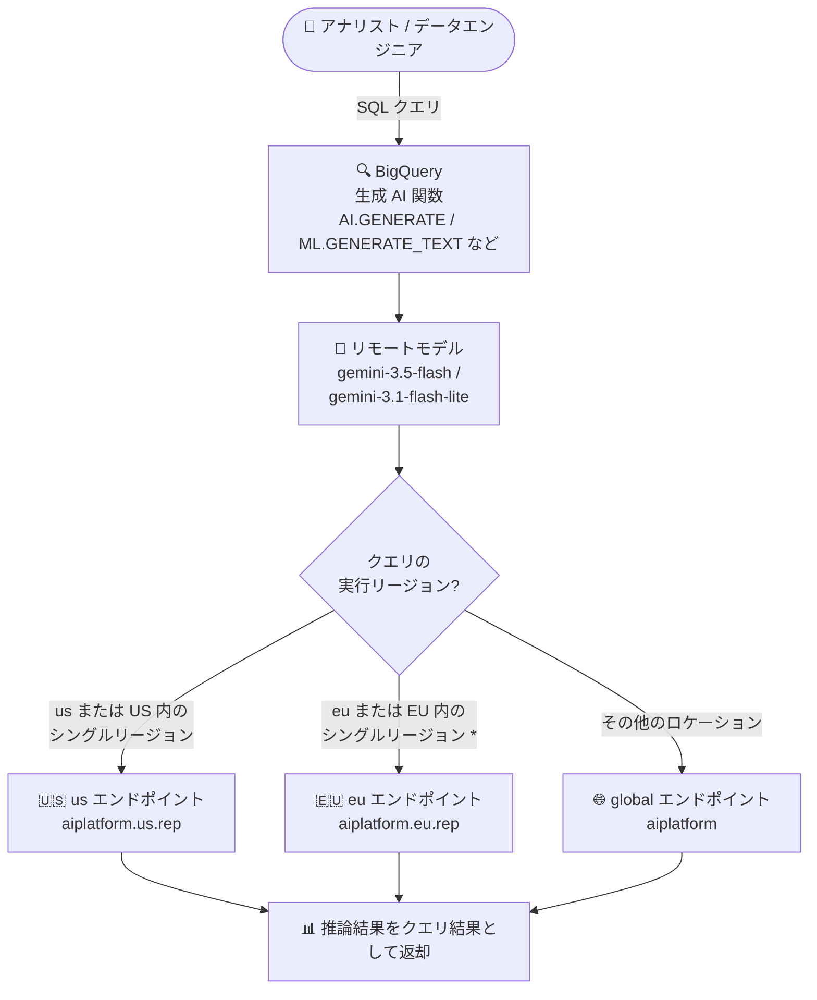

# BigQuery: gemini-3.1-flash-lite / gemini-3.5-flash GA モデルのサポート

**リリース日**: 2026-08-10

**サービス**: BigQuery

**機能**: 生成 AI 関数における gemini-3.1-flash-lite / gemini-3.5-flash GA モデルのサポート

**ステータス**: GA (Generally Available)

📊 [このアップデートのインフォグラフィックを見る](https://takech9203.github.io/google-cloud-news-summary/20260810-bigquery-gemini-flash-models.html)

## 概要

BigQuery が、GA (一般提供) モデルである **gemini-3.1-flash-lite** と **gemini-3.5-flash** をサポートしました。両モデルは **us / eu / global のマルチリージョナルエンドポイント**で利用可能で、BigQuery のすべての生成 AI 関数 (`AI.GENERATE`、`AI.GENERATE_TEXT`、`ML.GENERATE_TEXT` など) から呼び出せます。

gemini-3.5-flash は「最も知能の高い Flash モデル」として、エージェント処理・コーディング・長時間タスクにおいてフロンティア級の性能を Flash モデルの価格帯で提供します。一方の gemini-3.1-flash-lite は「最もコスト効率の高い Gemini モデル」として、大量・低レイテンシのワークロードに最適化されています。SQL だけでデータウェアハウス内のデータに対して最新の GA モデルによる推論を実行できるため、データアナリストやデータエンジニアが ETL パイプラインや分析クエリに生成 AI を組み込む際の選択肢が大きく広がります。

**アップデート前の課題**

- BigQuery の生成 AI 関数から gemini-3.1-flash-lite / gemini-3.5-flash を直接利用できず、これらの最新 GA モデルを使うには BigQuery の外 (Agent Platform / Vertex AI の API) で推論パイプラインを別途構築する必要があった
- 用途に応じた「高知能 (3.5 Flash)」と「低コスト・低レイテンシ (3.1 Flash-Lite)」の使い分けを、SQL ベースのワークフロー内で完結できなかった

**アップデート後の改善**

- すべての生成 AI 関数で gemini-3.1-flash-lite / gemini-3.5-flash を指定できるようになり、SQL のみで最新 GA モデルによるバッチ推論が可能になった
- us / eu / global のマルチリージョナルエンドポイントに対応し、データロケーション要件 (US / EU) に合わせたエンドポイント選択ができるようになった
- 短縮モデル名 (例: `gemini-3.5-flash`) を指定するだけで、クエリの実行リージョンに応じて BigQuery が適切なエンドポイントを自動選択するようになった

## アーキテクチャ図



短縮モデル名を指定した場合、BigQuery はクエリの実行リージョンに基づいて us / eu / global のエンドポイントを自動選択します (* europe-west2 と europe-west6 は例外で global エンドポイントが使用されます)。

## サービスアップデートの詳細

### 主要機能

1. **gemini-3.5-flash のサポート (GA)**
   - 最も知能の高い Flash モデル。エージェント処理、コーディング、マルチステップの長時間タスクに最適化
   - 100 万トークンのコンテキストウィンドウ、最大 65,536 出力トークン、Thinking (思考プロセス) をサポート
   - 教師ありファインチューニングにも対応

2. **gemini-3.1-flash-lite のサポート (GA)**
   - 最もコスト効率の高い Gemini モデル。大量・コスト重視の LLM トラフィックや低レイテンシ用途に最適化
   - Gemini 2.5 Flash 相当の品質を Flash-Lite の価格帯で提供
   - minimal / low / medium / high の Thinking レベルで品質と速度のバランスを制御可能

3. **マルチリージョナルエンドポイント (us / eu / global) の対応**
   - 短縮モデル名指定時はクエリの実行リージョンに応じて自動選択
   - 完全修飾エンドポイント名を指定すれば特定エンドポイントの明示指定も可能
   - これらのモデルはマルチリージョナルエンドポイントのみサポート (リージョナルエンドポイントは非対応)

4. **すべての生成 AI 関数で利用可能**
   - `AI.GENERATE`、`AI.GENERATE_TEXT`、`ML.GENERATE_TEXT` などのテキスト生成関数で使用可能
   - Thinking を使用するクエリでは、ジョブ情報から入力 / 出力 / 思考 / キャッシュの各トークン数を確認可能

## 技術仕様

### モデル比較

| 項目 | gemini-3.5-flash | gemini-3.1-flash-lite |
|------|------------------|----------------------|
| 位置づけ | 最も知能の高い Flash モデル | 最もコスト効率の高い Gemini モデル |
| コンテキストウィンドウ | 1,048,576 トークン | 1,048,576 トークン |
| 最大出力トークン | 65,536 | 65,536 |
| Thinking | サポート (デフォルト: medium) | サポート (minimal / low / medium / high) |
| 入力モダリティ | テキスト、画像、音声、動画 | テキスト、画像、音声、動画 |
| チューニング | 教師ありファインチューニング対応 | 対応 |
| BigQuery で利用可能なエンドポイント | us / eu / global (マルチリージョナル) | us / eu / global (マルチリージョナル) |
| セキュリティ制御 | CMEK、VPC-SC、データレジデンシー、AXT | CMEK、VPC-SC、データレジデンシー、AXT |

### エンドポイント自動選択ルール

短縮モデル名 (例: `gemini-3.5-flash`) を指定した場合の選択ルール:

| クエリの実行ロケーション | 選択されるエンドポイント |
|------|------|
| us マルチリージョン、または US 内のシングルリージョン | us |
| eu マルチリージョン、または EU 内のシングルリージョン (europe-west2 / europe-west6 を除く) | eu |
| 上記以外 (europe-west2 / europe-west6 を含む) | global |

### 完全修飾エンドポイント名の形式

特定のエンドポイントを明示的に指定する場合:

```
https://aiplatform.us.rep.googleapis.com/v1/projects/PROJECT_ID/locations/us/publishers/google/models/MODEL_ID
https://aiplatform.eu.rep.googleapis.com/v1/projects/PROJECT_ID/locations/eu/publishers/google/models/MODEL_ID
https://aiplatform.googleapis.com/v1/projects/PROJECT_ID/locations/global/publishers/google/models/MODEL_ID
```

## 設定方法

### 前提条件

1. BigQuery API と Vertex AI (Agent Platform) API が有効化されたプロジェクト
2. BigQuery から Vertex AI へアクセスするための Cloud リソース接続 (CLOUD_RESOURCE 接続) と、接続サービスアカウントへの権限付与

### 手順

#### ステップ 1: リモートモデルの作成

```sql
CREATE OR REPLACE MODEL `mydataset.gemini_35_flash`
  REMOTE WITH CONNECTION `us.my_connection`
  OPTIONS (ENDPOINT = 'gemini-3.5-flash');
```

短縮エンドポイント名を指定すると、クエリの実行リージョンに応じて us / eu / global エンドポイントが自動選択されます。

#### ステップ 2: 生成 AI 関数からモデルを呼び出す

```sql
SELECT
  review_text,
  ml_generate_text_llm_result AS sentiment
FROM ML.GENERATE_TEXT(
  MODEL `mydataset.gemini_35_flash`,
  (
    SELECT CONCAT('次のレビューの感情を positive / negative / neutral で分類してください: ', review_text) AS prompt
    FROM `mydataset.customer_reviews`
  ),
  STRUCT(0.2 AS temperature, TRUE AS flatten_json_output)
);
```

クエリ実行後、「ジョブ情報」から入力 / 出力 / 思考 / キャッシュの各トークン数を確認できます。

## メリット

### ビジネス面

- **最新 GA モデルの SQL 利用**: 本番運用に耐える GA ステータスのモデルを、既存の BigQuery ワークフローにそのまま組み込める
- **コスト最適化の選択肢**: 高精度が必要な処理は gemini-3.5-flash、大量・低コスト処理は gemini-3.1-flash-lite と、ワークロードに応じた使い分けが可能
- **データレジデンシー対応**: us / eu のマルチリージョナルエンドポイントにより、EU のデータロケーション要件があるワークロードでも利用しやすい

### 技術面

- **パイプライン構築が不要**: データを BigQuery の外に移動せず、SQL のみで LLM バッチ推論を実行できる
- **エンドポイントの自動選択**: 短縮モデル名だけでリージョンに応じた適切なエンドポイントが選択され、構成の手間が少ない
- **トークン使用量の可視化**: ジョブ情報でトークン数 (入力 / 出力 / 思考 / キャッシュ) を確認でき、コスト管理がしやすい

## デメリット・制約事項

### 制限事項

- これらのモデルはマルチリージョナルエンドポイント (us / eu / global) のみのサポートで、リージョナルエンドポイントは利用できない
- europe-west2 と europe-west6 で実行されるクエリは、eu ではなく global エンドポイントが使用される点に注意
- 大量の並列バッチクエリでは、リモートエンドポイントのクォータ超過により一部の行で `RESOURCE EXHAUSTED` エラーが発生する場合がある (リトライスクリプトでの反復処理が推奨)

### 考慮すべき点

- Thinking をサポートするモデルのため、思考トークンも課金対象となる。コスト重視の場合は gemini-3.1-flash-lite で Thinking レベルを minimal に設定するなどの調整を検討する
- リモートモデルは参照する生成 AI 関数と同じリージョン / マルチリージョンで実行する必要がある

## ユースケース

### ユースケース 1: 大規模な顧客レビューの分類・要約

**シナリオ**: EC サイトの数百万件の顧客レビューを毎日バッチで感情分類・要約したい。コストを抑えつつ高スループットで処理する必要がある。

**実装例**:
```sql
CREATE OR REPLACE MODEL `mydataset.gemini_31_flash_lite`
  REMOTE WITH CONNECTION `us.my_connection`
  OPTIONS (ENDPOINT = 'gemini-3.1-flash-lite');

SELECT review_id, ml_generate_text_llm_result AS summary
FROM ML.GENERATE_TEXT(
  MODEL `mydataset.gemini_31_flash_lite`,
  (SELECT review_id, CONCAT('このレビューを 1 文で要約: ', review_text) AS prompt
   FROM `mydataset.daily_reviews`),
  STRUCT(TRUE AS flatten_json_output)
);
```

**効果**: 最もコスト効率の高い GA モデルで、外部パイプラインなしに大量データの LLM 処理を SQL だけで完結できる。

### ユースケース 2: EU データレジデンシー要件下での文書分析

**シナリオ**: EU リージョンに保存された契約文書データに対して、データを EU 外に出さずに高度な内容抽出・分析を行いたい。

**効果**: eu マルチリージョナルエンドポイントを使用することで、EU 内で gemini-3.5-flash による高精度な文書分析を実行できる。CMEK / VPC-SC などのセキュリティ制御にも対応。

## 料金

BigQuery の生成 AI 関数では、クエリ実行に使用する BigQuery のコンピュートリソースに対する課金に加えて、リモートモデルが呼び出す Gemini モデル (Agent Platform / Vertex AI) 側の推論料金が発生します。Thinking を使用する場合は思考トークンも課金対象です。

最新の料金は以下を参照してください。

- [BigQuery ML の料金](https://cloud.google.com/bigquery/pricing#bigquery-ml-pricing)
- [生成 AI (Gemini) の料金](https://cloud.google.com/gemini-enterprise-agent-platform/generative-ai/pricing)

## 利用可能リージョン

- **us** マルチリージョナルエンドポイント
- **eu** マルチリージョナルエンドポイント
- **global** エンドポイント

詳細は [生成 AI の概要のロケーションセクション](https://docs.cloud.google.com/bigquery/docs/generative-ai-overview#locations) を参照してください。

## 関連サービス・機能

- **Vertex AI (Gemini Enterprise Agent Platform)**: BigQuery のリモートモデルが実際に推論を実行する基盤。Provisioned Throughput を購入すれば安定した高スループットでの推論も可能
- **BigQuery ML リモートモデル (`CREATE MODEL ... REMOTE`)**: 生成 AI 関数から Gemini モデルを参照するための仕組み
- **BigQuery 生成 AI 関数 (`AI.GENERATE` / `AI.GENERATE_TEXT` / `ML.GENERATE_TEXT` など)**: 今回のモデルが利用可能になった関数群

## 参考リンク

- 📊 [インフォグラフィック](https://takech9203.github.io/google-cloud-news-summary/20260810-bigquery-gemini-flash-models.html)
- [公式リリースノート](https://docs.cloud.google.com/release-notes#August_10_2026)
- [生成 AI の概要 (ロケーション)](https://docs.cloud.google.com/bigquery/docs/generative-ai-overview#locations)
- [Gemini 3.5 Flash モデルドキュメント](https://docs.cloud.google.com/gemini-enterprise-agent-platform/models/gemini/3-5-flash)
- [Gemini 3.1 Flash-Lite モデルドキュメント](https://docs.cloud.google.com/gemini-enterprise-agent-platform/models/gemini/3-1-flash-lite)
- [ML.GENERATE_TEXT 関数リファレンス](https://docs.cloud.google.com/bigquery/docs/reference/standard-sql/bigqueryml-syntax-generate-text)
- [BigQuery ML の料金](https://cloud.google.com/bigquery/pricing#bigquery-ml-pricing)

## まとめ

BigQuery のすべての生成 AI 関数で、最新の GA モデルである gemini-3.5-flash (高知能) と gemini-3.1-flash-lite (高コスト効率) が利用可能になりました。us / eu / global のマルチリージョナルエンドポイント対応により、データレジデンシー要件のあるワークロードでも採用しやすくなっています。既存のリモートモデルを利用中の場合は、ワークロードの精度・コスト要件に応じてこれらの新モデルへの移行を検討することを推奨します。

---

**タグ**: BigQuery, Gemini, gemini-3.5-flash, gemini-3.1-flash-lite, 生成AI, BigQuery ML, GA, マルチリージョン
