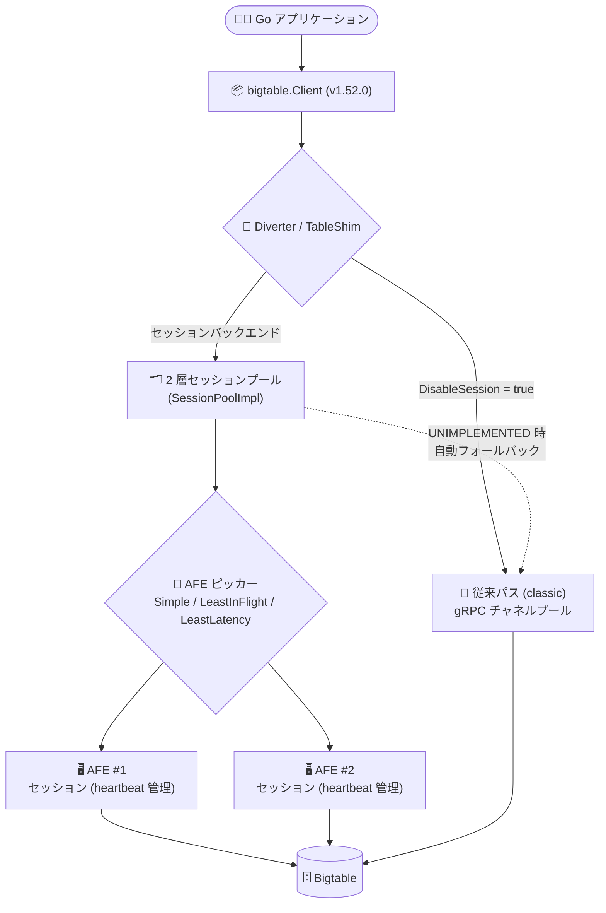

# Bigtable: Go クライアントライブラリ v1.52.0 リリース (AFE ピッカーとセッションバックエンド基盤の追加)

**リリース日**: 2026-08-10 (ライブラリリリース日: 2026-08-03)

**サービス**: Bigtable (クライアントライブラリ)

**機能**: Go クライアントライブラリ v1.52.0 - AFE ピッカー、セッションバックエンド、ClientConfig.DisableSession

**ステータス**: リリース済み (Libraries)

📊 [このアップデートのインフォグラフィックを見る](https://takech9203.github.io/google-cloud-news-summary/20260810-bigtable-go-client-1-52-0.html)

## 概要

Bigtable の Go クライアントライブラリ `cloud.google.com/go/bigtable` の v1.52.0 が 2026 年 8 月 3 日にリリースされ、8 月 10 日付の Google Cloud Release Notes で告知されました。本バージョンの中心となるのは、クライアント内部に新しく導入された「セッションバックエンド」基盤と、リクエストの送信先を賢く選択する **AFE (Application Frontend) ピッカー** の追加です。

AFE ピッカーには **Simple / LeastInFlight / LeastLatency** の 3 種類の選択戦略が実装され、単純なラウンドロビン的選択に加えて、実行中 (in-flight) リクエスト数が最も少ない接続先や、レイテンシが最も低い接続先を動的に選択できるようになりました。また、レイテンシ計測ではプール待機時間 (poolWait) を差し引き、`TransportLatency = wire − backend` を計測ポイントで算出する修正が入っており、より正確なシグナルに基づいた接続先選択が行われます。

あわせて、新しいセッションバックエンドを利用したくない場合に明示的にオプトアウトできる **`ClientConfig.DisableSession`** が追加されました。セッションバックエンドは 2 層構造のセッションプール (two-tier session pool)、セッションのライフサイクル管理 (Start / Close / ForceClose / heartBeat)、TableShim による従来 (classic) パスへの自動フォールバックなど、多数の内部コンポーネントで構成されており、既存アプリケーションへの影響を抑えつつ段階的に導入できる設計になっています。Go で Bigtable を利用する開発者、特に高スループット・低レイテンシ要件のワークロードを運用するチームが対象です。

**アップデート前の課題**

- 従来の Go クライアントの接続プール (channel pool) は接続をラウンドロビンで使用する方式であり、接続ごとの負荷 (実行中リクエスト数) やレイテンシの差を考慮した接続先選択はできなかった
- 接続プールのサイズは `option.WithGRPCConnectionPool` による静的な設定が中心で、トラフィック変動に応じた動的な調整の仕組みが限られていた
- クライアント内部の接続・セッション状態を観測するためのデバッグ用の仕組みが乏しく、レイテンシ問題の切り分けが難しかった

**アップデート後の改善**

- AFE ピッカー (Simple / LeastInFlight / LeastLatency) により、実行中リクエスト数やレイテンシに基づいてリクエストの送信先を動的に選択できるようになった
- 2 層セッションプール (SessionPoolImpl) が導入され、周期的な Tick ループを廃してイベント駆動でプールサイズを調整するようになった (パフォーマンス改善)
- `ClientConfig.DisableSession` により、新しいセッションバックエンドを使わない従来動作へのオプトアウトが可能になった
- セッションのデバッグ用サーフェス (observability フィールド / メソッド) と `session.Config.EnableDebug` が追加され、セッション状態の観測性が向上した
- TableShim がセッションパスで `UNIMPLEMENTED` を受けた場合に従来 (classic) パスへ自動フォールバックするため、環境側が未対応でも安全に動作する

## アーキテクチャ図



v1.52.0 では Client の `Open*` 系呼び出しが Diverter / TableShim を経由し、セッションバックエンド有効時は AFE ピッカーが負荷・レイテンシ情報に基づいて送信先 AFE を選択します。セッションパスが利用できない場合は従来パスへ自動フォールバックします。

## サービスアップデートの詳細

### 主要機能

1. **AFE ピッカー (Simple / LeastInFlight / LeastLatency) の追加** (#20204)
   - リクエスト送信先の AFE (Application Frontend) を選択する 3 種類の戦略を実装
   - `LeastInFlight` は実行中リクエスト数が最少の接続先を、`LeastLatency` は計測レイテンシが最小の接続先を選択
   - レイテンシシグナルはプール待機時間を除外し、`TransportLatency = wire − backend` を計測ソースで算出するよう修正済み (#20281)

2. **`ClientConfig.DisableSession` によるオプトアウト** (#20297)
   - 新しいセッションバックエンドを使用せず、従来のチャネルプール動作を維持したい場合に設定
   - 新基盤への段階的な移行を可能にするエスケープハッチ

3. **セッションバックエンド基盤一式**
   - `Session` 構造体とステートマシン (#20117)、ライフサイクル管理 (Start / Close / ForceClose / readLoop / heartBeatLoop) (#20215)
   - 2 層セッションプール `SessionPoolImpl` (スケーリング + デバッグ機能付き) (#20225)、AFE ごとの sessionList (#20224)
   - `SessionClient` / `SessionTable` / lazyPool (#20228)、リソース単位の `session.TableAPI` の TTL 付きアイドルキャッシュ (#20263)
   - `getClientConfigDirectAccessChecker` によるセッションプール向けダイレクトアクセス判定 (#20209)
   - セッションチャネル用の `NoOpChannelPrimer` (#20208)

4. **TableShim / Diverter による透過的ルーティング**
   - `Client.Open()` が返す `*Table` を Diverter 経由でルーティング (#20273, #20256)
   - セッションパスで `UNIMPLEMENTED` を受けた場合は classic パスへ自動フォールバック (#20269)

5. **観測性 (Observability) の強化**
   - Session のデバッグサーフェス (observability フィールド + メソッド) (#20211)
   - `session.Config.EnableDebug` で sessionz デバッグ状態を制御 (#20247)
   - `session.durations` / `session.uptime` に明示的なヒストグラムバケット境界を設定 (#20276)

### バグ修正・パフォーマンス改善

- gRPC-Go の `NewStream OnFinish` 二重発火に対するガード (#20295)
- `sessionTable.Close` 時のリソース単位プールの確実な破棄とキャッシュのクローズ競合防止 (#20264)
- キャッシュ退避をまたいだ `SessionTableHandle` の自己修復 (#20296)
- セッション vRPC でのコンテキストエラーの gRPC ステータスへの変換 (#20299)
- `PingAndWarm` の NotFound を正常なプライミングとして扱う修正 (#20219)
- 周期的な Tick ループを削除し、プールサイジングをイベント駆動化 (#20285)
- `CheckoutSession` ホットパスから `pick_lost_race` デバッグタグを削除 (#20280)

## 技術仕様

### AFE ピッカーの選択戦略

| 戦略 | 選択基準 |
|------|----------|
| Simple | 単純な選択 (負荷情報を利用しない基本戦略) |
| LeastInFlight | 実行中 (in-flight) リクエスト数が最も少ない AFE を選択 |
| LeastLatency | 計測レイテンシ (TransportLatency = wire − backend、poolWait 除外) が最小の AFE を選択 |

### 従来のチャネルプールとの関係

| 項目 | 従来 (classic) | セッションバックエンド (v1.52.0) |
|------|---------------|----------------------------------|
| 接続の選択 | ラウンドロビン | AFE ピッカー (Simple / LeastInFlight / LeastLatency) |
| プールサイズ調整 | `option.WithGRPCConnectionPool` による静的設定 | 2 層プール + イベント駆動スケーリング |
| フォールバック | - | `UNIMPLEMENTED` 時に classic へ自動フォールバック |
| オプトアウト | - | `ClientConfig.DisableSession` |

## 設定方法

### 前提条件

1. Go アプリケーションで `cloud.google.com/go/bigtable` を使用していること
2. Go モジュール管理 (go.mod) を利用していること

### 手順

#### ステップ 1: ライブラリの更新

```bash
go get cloud.google.com/go/bigtable@v1.52.0
go mod tidy
```

#### ステップ 2: (必要に応じて) セッションバックエンドのオプトアウト

```go
import "cloud.google.com/go/bigtable"

config := bigtable.ClientConfig{
    // 新しいセッションバックエンドを無効化し、従来動作を維持する場合
    DisableSession: true,
}
client, err := bigtable.NewClientWithConfig(ctx, projectID, instanceID, config)
```

従来動作を維持したい場合のみ `DisableSession` を設定します。API の詳細は [pkg.go.dev のリファレンス](https://pkg.go.dev/cloud.google.com/go/bigtable) を確認してください。

## メリット

### ビジネス面

- **テールレイテンシの改善余地**: 負荷・レイテンシに基づく接続先選択により、特定接続へのリクエスト偏りに起因するレイテンシスパイクの抑制が期待できる
- **移行リスクの低減**: `DisableSession` によるオプトアウトと `UNIMPLEMENTED` 時の自動フォールバックにより、既存ワークロードへの影響を抑えて新基盤を導入できる

### 技術面

- **賢い接続先選択**: ラウンドロビンでは考慮されなかった in-flight 数やレイテンシを選択基準に利用可能
- **イベント駆動のプールサイジング**: 周期ポーリング (Tick ループ) の廃止によりオーバーヘッドを削減
- **観測性の向上**: セッションのデバッグサーフェスやヒストグラムメトリクスにより、クライアント側のレイテンシ問題の切り分けが容易になる

## デメリット・制約事項

### 制限事項

- セッションバックエンドは v1.52.0 で追加されたばかりの新しい内部基盤であり、多くの機能はクライアント内部コンポーネント (Diverter、TableShim、SessionPoolImpl など) として実装されている。公開 API としての利用方法は [pkg.go.dev のリファレンス](https://pkg.go.dev/cloud.google.com/go/bigtable) で確認が必要
- AFE ピッカーの選択戦略の効果はワークロードの特性 (QPS、リクエストサイズ、レイテンシ分布) に依存する

### 考慮すべき点

- 新基盤の挙動を確認するまでは、レイテンシに敏感な本番ワークロードでは段階的なロールアウト (カナリア環境での検証) を推奨
- クライアント側メトリクス (Go クライアントは v1.27.0 以降でデフォルト有効) と組み合わせて、アップグレード前後の `operation_latencies` / `attempt_latencies` を比較すると効果を定量評価できる

## ユースケース

### ユースケース 1: 高 QPS ワークロードでのレイテンシ平準化

**シナリオ**: 数万 QPS 規模の読み取りを行う Go サービスで、特定の gRPC 接続にリクエストが偏り、p99 レイテンシが不安定になっている。

**効果**: LeastInFlight / LeastLatency ピッカーにより、混雑した接続先を避けてリクエストを分散し、テールレイテンシの平準化が期待できる。

### ユースケース 2: 保守的なライブラリアップグレード

**シナリオ**: セキュリティ・バグ修正のために v1.52.0 へ更新したいが、新しいセッションバックエンドの挙動変化は本番環境でまだ受け入れたくない。

**実装例**:
```go
config := bigtable.ClientConfig{DisableSession: true}
client, err := bigtable.NewClientWithConfig(ctx, projectID, instanceID, config)
```

**効果**: 従来のチャネルプール動作を維持したままライブラリを最新化でき、検証完了後にセッションバックエンドを有効化する段階的移行が可能。

## 料金

クライアントライブラリ自体は無料 (Apache 2.0 ライセンスの OSS) です。Bigtable の利用料金 (ノード、ストレージ、ネットワーク) は通常どおり発生します。詳細は [Bigtable 料金ページ](https://cloud.google.com/bigtable/pricing) を参照してください。

## 関連サービス・機能

- **Bigtable クライアント側メトリクス**: Go クライアント v1.27.0 以降でデフォルト有効。`operation_latencies` や `attempt_latencies` を Cloud Monitoring で確認でき、本アップデートの効果測定に有用
- **Cloud Monitoring**: クライアント側/サーバー側メトリクスの可視化。Metrics Explorer で `bigtable.googleapis.com/client` を検索
- **Bigtable 接続プール**: 従来の channel pool の仕組みと最適サイズの考え方は[公式ドキュメント](https://docs.cloud.google.com/bigtable/docs/connection-pools)を参照

## 参考リンク

- 📊 [インフォグラフィック](https://takech9203.github.io/google-cloud-news-summary/20260810-bigtable-go-client-1-52-0.html)
- [公式リリースノート](https://docs.cloud.google.com/release-notes#August_10_2026)
- [GitHub リリースノート (bigtable/v1.52.0)](https://github.com/googleapis/google-cloud-go/releases/tag/bigtable/v1.52.0)
- [変更履歴 (v1.51.0...v1.52.0)](https://github.com/googleapis/google-cloud-go/compare/bigtable/v1.51.0...bigtable/v1.52.0)
- [Go クライアントライブラリ リファレンス (pkg.go.dev)](https://pkg.go.dev/cloud.google.com/go/bigtable)
- [Bigtable 接続プールのドキュメント](https://docs.cloud.google.com/bigtable/docs/connection-pools)
- [クライアント側メトリクスの設定](https://docs.cloud.google.com/bigtable/docs/client-side-metrics-setup)
- [料金ページ](https://cloud.google.com/bigtable/pricing)

## まとめ

Bigtable Go クライアント v1.52.0 は、AFE ピッカーによる負荷・レイテンシベースの接続先選択と、2 層セッションプールを中心とする新しいセッションバックエンド基盤を導入する大きな内部刷新です。`ClientConfig.DisableSession` によるオプトアウトと classic パスへの自動フォールバックが用意されているため、まずは検証環境でアップグレードし、クライアント側メトリクスでレイテンシへの影響を確認した上で本番展開することを推奨します。

---

**タグ**: #Bigtable #Go #ClientLibrary #gRPC #ConnectionPool #Latency #Libraries
