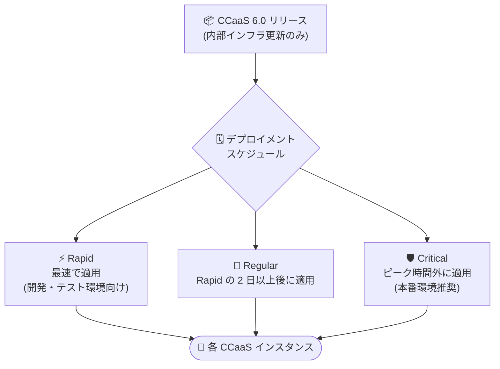

# Google Cloud Contact Center as a Service (CCaaS): バージョン 6.0 リリース

**リリース日**: 2026-08-10

**サービス**: Google Cloud Contact Center as a Service (CCaaS) / Contact Center AI Platform (CCAI Platform)

**機能**: バージョン 6.0 リリース (内部インフラストラクチャ更新)

**ステータス**: Announcement (リリース済み)

📊 [このアップデートのインフォグラフィックを見る](https://takech9203.github.io/google-cloud-news-summary/20260810-ccaas-6-0-release.html)

## 概要

Google Cloud CCaaS のバージョン 6.0 がリリースされました。本バージョンは Google Cloud CCaaS の内部インフラストラクチャを更新するリリースであり、バージョン 5.2 からの顧客向け (customer-facing) の変更は含まれていません。新機能の追加や UI・API の変更はなく、既存の運用や設定への影響はありません。

各インスタンスへの適用タイミングは、インスタンスごとに選択しているデプロイメントスケジュール (Rapid / Regular / Critical) に依存します。運用チームは、自社インスタンスのデプロイメントスケジュールに応じたアップデート適用時期を把握しておくとよいでしょう。

## アーキテクチャ図

バージョン 6.0 は、各インスタンスが選択しているデプロイメントスケジュールに従って順次適用されます。

## サービスアップデートの詳細

### 主要ポイント

1. **内部インフラストラクチャの更新**
   - Google Cloud CCaaS の内部インフラストラクチャを更新するリリース
   - バージョン 5.2 からの顧客向けの変更 (新機能、UI 変更、API 変更) は含まれない

2. **適用タイミングはデプロイメントスケジュールに依存**
   - インスタンスへの適用時期は、選択済みのデプロイメントスケジュールによって決まる
   - 詳細は [Deployment schedules](https://cloud.google.com/contact-center/ccai-platform/docs/deployment-schedules) を参照

## 技術仕様

### デプロイメントスケジュール

| スケジュール | 適用タイミング | 推奨環境 |
|------|------|------|
| Rapid | 可能な限り早く適用 | 開発・テストなどの非本番環境 |
| Regular | Rapid での提供から 2 日以上後に適用 | - |
| Critical | ピーク営業時間外に適用 (Rapid 完了後、通常 1 週間以内) | 本番環境 |

なお、セキュリティパッチは Regular / Critical のインスタンスにも遅延なく即時適用されます。デプロイメントスケジュールは Google Cloud コンソールの CCAI Platform インスタンスページで確認・変更できます。

## 影響と対応

- **顧客側での対応は不要**: 顧客向けの変更が含まれないため、設定変更や検証作業は基本的に不要
- **適用時期の確認**: 自社インスタンスのデプロイメントスケジュール (Schedule 列) を確認しておくと、適用タイミングを把握できる
- **特別イベント時の考慮**: 大規模イベント期間中にアップグレードをブロックしたい場合は、Google Cloud サポートへ依頼可能 (最大 1 リリース分、約 6 週間まで)

## 関連サービス・機能

- **Contact Center AI Platform (CCAI Platform)**: Google Cloud CCaaS の基盤プラットフォーム。デプロイメントスケジュールの設定はコンソールの CCAI Platform ページから行う
- **Cloud Logging**: CCaaS のログイベントを `contactcenteraiplatform.googleapis.com/ContactCenter` リソースタイプで確認可能

## 参考リンク

- 📊 [インフォグラフィック](https://takech9203.github.io/google-cloud-news-summary/20260810-ccaas-6-0-release.html)
- [公式リリースノート](https://docs.cloud.google.com/release-notes#August_10_2026)
- [Deployment schedules](https://cloud.google.com/contact-center/ccai-platform/docs/deployment-schedules)
- [CCAI Platform リリースノート](https://docs.cloud.google.com/contact-center/ccai-platform/docs/release-notes)

## まとめ

Google Cloud CCaaS 6.0 は内部インフラストラクチャの更新のみを含むリリースで、バージョン 5.2 からの顧客向け変更はありません。顧客側での対応は不要ですが、本番環境のインスタンスでは Critical デプロイメントスケジュールの選択と適用時期の把握を推奨します。

---

**タグ**: #GoogleCloud #CCaaS #CCAIPlatform #ContactCenter #リリース #インフラストラクチャ
