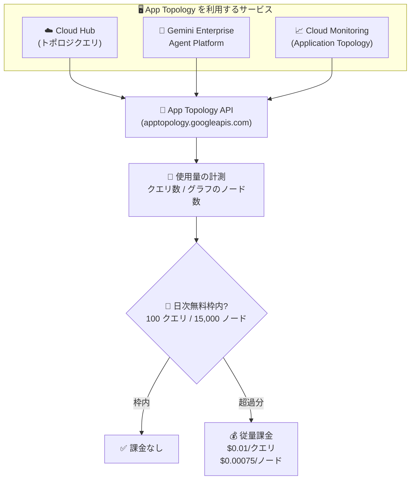

# Cloud Hub: App Topology API の従量課金モデルへの移行

**リリース日**: 2026-08-10

**サービス**: Cloud Hub

**機能**: App Topology API の課金モデル変更 (従量課金 + 日次無料枠)

**ステータス**: Announcement

📊 [このアップデートのインフォグラフィックを見る](https://takech9203.github.io/google-cloud-news-summary/20260810-cloud-hub-app-topology-api-billing.html)

## 概要

2026 年 9 月 15 日より、App Topology API (`apptopology.googleapis.com`) が、日次の無料データ使用枠を含む従量課金 (usage-based billing) モデルに移行することが発表されました。App Topology は、複数のソースからリソースやアプリケーションに関するデータをクエリし、相関付けられた結果をトポロジグラフとして可視化できる Cloud Hub の機能 (Preview) です。

新しい課金モデルは、Cloud Hub 内で生成されるトポロジグラフだけでなく、Gemini Enterprise Agent Platform や Cloud Monitoring で生成されるトポロジグラフを含む、すべての App Topology API の使用に適用されます。課金はクエリ数とトポロジグラフのノード数の 2 つのディメンションで計測され、それぞれにプロジェクト単位の日次無料枠が設定されています。

App Topology を利用している、または利用を検討している SRE、DevOps エンジニア、セキュリティエンジニアは、2026 年 9 月 15 日以降の利用コストを見積もり、必要に応じて予算やクエリの利用パターンを見直す必要があります。

**アップデート前の課題**

- App Topology API の利用に対する明示的な従量課金モデルが定義されていなかった
- 利用量に応じたコストの予測やコスト管理の基準が明確ではなかった

**アップデート後の改善**

- クエリ数とノード数に基づく透明性のある従量課金モデルが定義された
- プロジェクトごとの日次無料枠 (クエリ 100 件 / ノード 15,000 個) が設けられ、小規模な利用は引き続き無料で継続できる
- Cloud Hub、Gemini Enterprise Agent Platform、Cloud Monitoring をまたぐ App Topology API の利用が統一的に計測・課金される

## アーキテクチャ図

2026 年 9 月 15 日以降、Cloud Hub・Gemini Enterprise Agent Platform・Cloud Monitoring からの App Topology API 利用がすべて計測対象となり、プロジェクト単位の日次無料枠を超過した分がクエリ数とノード数に基づいて課金されます。

## サービスアップデートの詳細

### 主要機能

1. **従量課金モデルへの移行 (2026 年 9 月 15 日開始)**
   - App Topology API の利用が、使用量に基づく課金モデルに移行する
   - 課金対象は「クエリ数」と「トポロジグラフのノード数」の 2 ディメンション

2. **プロジェクト単位の日次無料枠**
   - クエリ: 1 日あたり 100 クエリまで無料
   - ノード: 1 日あたり 15,000 ノードまで無料
   - 無料枠はプロジェクトごとに毎日適用される

3. **すべての利用経路が課金対象**
   - Cloud Hub 内で生成されるトポロジグラフ
   - Gemini Enterprise Agent Platform で生成されるトポロジグラフ
   - Cloud Monitoring で生成されるトポロジグラフ

### App Topology とは

App Topology は、複数のソース (App Hub、Cloud Asset、Developer Connect、Cloud Monitoring、Security Command Center、Cloud Trace など) からリソースとアプリケーションのデータをクエリし、相関付けた結果をトポロジグラフとして表示する機能です。たとえば「特定の脆弱性を持つすべてのエージェントを表示する」といったクエリが可能です。

Cloud Hub では以下のドメイン別にクエリを実行できます。

- **Health and troubleshooting**: SRE 向け。デプロイイベントに関するアラートの確認、アプリケーションコンポーネント間のトラフィック分析
- **Deployments**: DevOps エンジニア向け。デプロイ前のビルドアーティファクトの脆弱性チェック、ソースコードから本番までの来歴の追跡
- **Security**: セキュリティエンジニア向け。アクセスパスの監査、脆弱性の影響を受けるサービス・インフラの特定

## 技術仕様

### 課金レート (2026 年 9 月 15 日以降)

| 計測項目 | 日次無料枠 (プロジェクトごと) | 超過分の料金 |
|------|------|------|
| クエリ | 100 クエリ | $0.01 / クエリ |
| トポロジグラフのノード | 15,000 ノード | $0.00075 / ノード |

### 対象 API

| 項目 | 詳細 |
|------|------|
| API 名 | App Topology API |
| エンドポイント | `apptopology.googleapis.com` |
| 機能のステータス | Preview (Pre-GA Offerings Terms が適用) |
| 課金開始日 | 2026 年 9 月 15 日 |
| 課金対象 | Cloud Hub、Gemini Enterprise Agent Platform、Cloud Monitoring を含むすべての App Topology API 使用 |

## メリット

### ビジネス面

- **コストの透明性**: クエリ数とノード数という明確な指標に基づく課金となり、利用コストの見積もりが可能になる
- **スモールスタートが可能**: 日次無料枠 (100 クエリ / 15,000 ノード) の範囲内であれば、無料で App Topology を利用し続けられる

### 技術面

- **統一された計測**: Cloud Hub、Gemini Enterprise Agent Platform、Cloud Monitoring をまたいだ利用が一元的に計測されるため、利用状況の把握がしやすい
- **プロジェクト単位の無料枠**: 無料枠がプロジェクトごとに適用されるため、複数プロジェクトで分散利用している場合も各プロジェクトで無料枠を活用できる

## デメリット・制約事項

### 考慮すべき点

- 2026 年 9 月 15 日以降、日次無料枠を超える利用には課金が発生するため、大規模な環境で頻繁にトポロジクエリを実行している場合はコスト影響を事前に見積もる必要がある
- ノード数の多い大規模なトポロジグラフ (例: 大量のリソースを含む app-enabled フォルダ全体のクエリ) は、ノード課金 ($0.00075/ノード) が積み上がりやすい
- Gemini Cloud Assist の調査 (investigations) や Cloud Monitoring の Application Topology など、間接的に App Topology を利用する機能も課金対象に含まれる点に注意が必要
- App Topology 自体は Preview 段階の機能であり、Pre-GA Offerings Terms が適用される

## 料金

2026 年 9 月 15 日から、App Topology API は日次無料枠付きの従量課金モデルに移行します。

### 料金例

| 使用量 (1 日あたり・1 プロジェクト) | 日額料金 (概算) |
|--------|-----------------|
| 100 クエリ以下 かつ 15,000 ノード以下 | $0 (無料枠内) |
| 200 クエリ、15,000 ノード | $1.00 (超過 100 クエリ x $0.01) |
| 100 クエリ、35,000 ノード | $15.00 (超過 20,000 ノード x $0.00075) |
| 300 クエリ、55,000 ノード | $32.00 (超過 200 クエリ x $0.01 + 超過 40,000 ノード x $0.00075) |

詳細は [App Topology pricing](https://docs.cloud.google.com/hub/docs/app-topology/index#pricing) を参照してください。

## 関連サービス・機能

- **App Hub**: アプリケーション単位でリソースをグループ化するサービス。App Topology は App Hub アプリケーションのサービス・ワークロードをトポロジグラフとして可視化する
- **Cloud Hub**: アプリケーション中心の運用ハブ。App Topology はそのクエリ・可視化機能を担う
- **Cloud Monitoring (Application Topology)**: テレメトリに基づくトラフィック・レイテンシ・依存関係のリアルタイム可視化。今回の課金対象に含まれる
- **Gemini Enterprise Agent Platform (Agent Topology)**: エージェントベースのシステムのインフラと接続関係の可視化。今回の課金対象に含まれる
- **Gemini Cloud Assist**: App Topology がリソースの関係性コンテキストを提供し、調査 (investigations) の根本原因分析の品質を向上させる
- **VPC Service Controls**: App Topology API をセキュリティ境界内で保護可能。App Hub API、Cloud Asset API、Cloud Monitoring API などを同じ境界に含めることが推奨される

## 参考リンク

- 📊 [インフォグラフィック](https://takech9203.github.io/google-cloud-news-summary/20260810-cloud-hub-app-topology-api-billing.html)
- [公式リリースノート](https://docs.cloud.google.com/release-notes#August_10_2026)
- [App Topology ドキュメント](https://docs.cloud.google.com/hub/docs/app-topology)
- [App Topology pricing](https://docs.cloud.google.com/hub/docs/app-topology/index#pricing)
- [App Topology でのクエリ実行](https://docs.cloud.google.com/hub/docs/app-topology/run-queries)
- [Cloud Hub のセットアップ](https://docs.cloud.google.com/hub/docs/setup-cloud-hub)

## まとめ

App Topology API が 2026 年 9 月 15 日から日次無料枠付きの従量課金モデルに移行します。日次無料枠 (プロジェクトごとに 100 クエリ / 15,000 ノード) 内の利用は引き続き無料ですが、Cloud Hub に加えて Gemini Enterprise Agent Platform や Cloud Monitoring 経由の利用もすべて課金対象となるため、App Topology を活用しているチームは課金開始前に利用量を確認し、コスト影響を見積もっておくことを推奨します。

---

**タグ**: Cloud Hub, App Topology, 課金, 料金改定, App Hub, Cloud Monitoring, Gemini Enterprise Agent Platform
