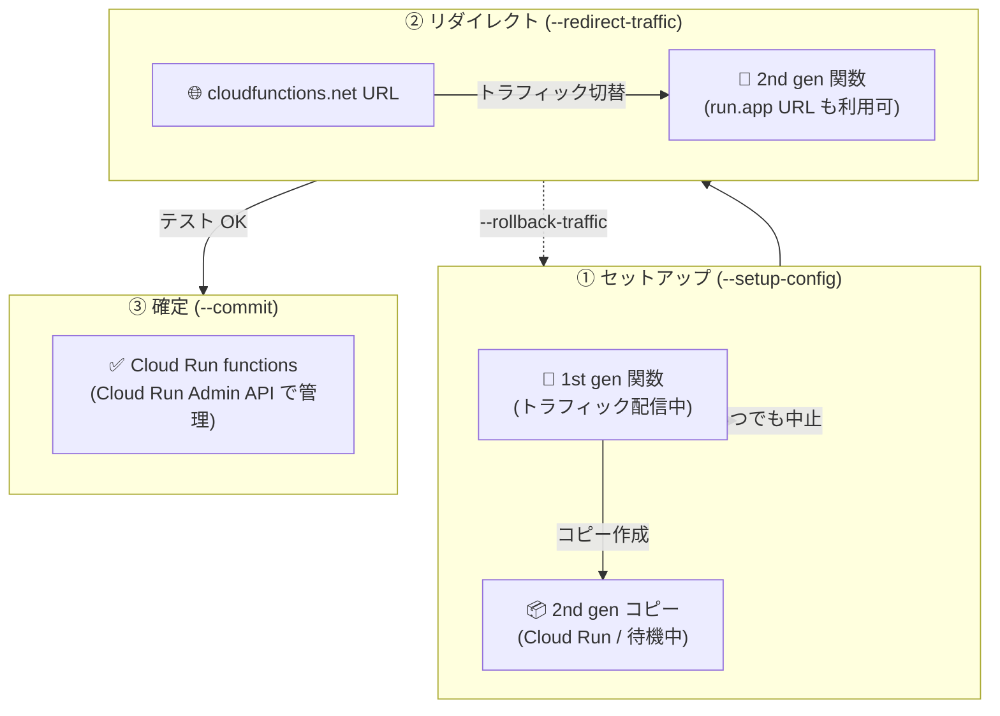

# Cloud Run functions: アップグレードツールが GA (一般提供) に

**リリース日**: 2026-08-10

**サービス**: Cloud Run functions

**機能**: Cloud Run functions アップグレードツール (1st gen 関数の Cloud Run functions への移行)

**ステータス**: GA (一般提供)

📊 [このアップデートのインフォグラフィックを見る](https://takech9203.github.io/google-cloud-news-summary/20260810-cloud-run-functions-upgrade-tool-ga.html)

## 概要

Cloud Run functions のアップグレードツールが GA (一般提供) になりました。このツールを使用すると、Cloud Functions v1 API で作成された 1st gen 関数 (旧 Cloud Functions 1st gen) を、Cloud Run 上で動作する Cloud Run functions にアップグレードできます。

アップグレードツールは、1st gen 関数と同じ名前・コード・構成を持つ 2nd gen コピーを作成し、「トラフィックのリダイレクト → テスト → コミット (確定)」という段階的なプロセスで安全に移行を進められます。移行中はいつでもロールバックや中止 (abort) が可能で、HTTP 関数の場合は移行後も従来の `cloudfunctions.net` URL がそのまま新しい関数にルーティングされるため、呼び出し元の変更が不要です。

1st gen 関数を多数運用している組織にとって、Cloud Run の豊富な機能 (最大 60 分のタイムアウト、インスタンスあたり最大 1,000 の同時実行、トラフィック分割など) へ低リスクで移行できる手段が正式にサポートされることになります。

**アップデート前の課題**

- アップグレードツールは Preview (Pre-GA Offerings Terms 適用) であり、「as is」での提供で限定的なサポートしか受けられなかったため、本番環境の移行に採用しづらかった
- ツールを使わない場合、1st gen 関数の移行は再デプロイ・トリガーの再作成・URL の変更 (呼び出し元の修正) を手動で行う必要があった
- 1st gen 関数は最大 9 分のタイムアウト、最大 8 GB RAM / 2 vCPU、インスタンスあたり同時実行 1 リクエストという制限があり、トラフィック分割にも対応していなかった

**アップデート後の改善**

- アップグレードツールが GA となり、本番環境の 1st gen 関数の移行に正式サポート付きで利用できるようになった
- 段階的な移行フロー (セットアップ → リダイレクト → テスト → コミット) により、いつでもロールバック・中止が可能な安全な移行を実現
- HTTP 関数は移行後も同じ `cloudfunctions.net` URL でトラフィックが新関数にルーティングされ、呼び出し元の変更が不要
- IAM ロールも移行時に自動変換される (例: `roles/cloudfunctions.invoker` → `roles/run.invoker`)

## アーキテクチャ図



アップグレードツールによる 3 段階の移行フロー。コミット前であればいつでもロールバック (`--rollback-traffic`) や中止 (`--abort`) が可能です。

## サービスアップデートの詳細

### 主要機能

1. **段階的なアップグレードプロセス**
   - **セットアップ**: 1st gen 関数と同じ名前・コード・構成を持つ一時的な 2nd gen コピーを作成。この時点ではトラフィックは 1st gen 関数に流れ続ける
   - **リダイレクト**: `cloudfunctions.net` URL へのトラフィックを 2nd gen 関数に切り替え。`run.app` の Cloud Run URL も利用可能になる
   - **コミット**: アップグレードを確定 (不可逆)。以降は Cloud Run Admin API と Cloud Run ツールで管理する

2. **ロールバック・中止のサポート**
   - `--rollback-traffic` でトラフィックを 1st gen 関数に戻せる (2nd gen コピーはテスト用に残る)
   - `--abort` でアップグレードプロセス全体を取り消し、2nd gen コピーを削除して元の状態に戻せる (コミット前まで)

3. **Pub/Sub 関数のリトライ設定に応じた処理**
   - リトライ無効 (1st gen のデフォルト) の関数: Eventarc Pub/Sub トリガーとデッドレターキュー (DLQ) を作成し、未配信メッセージを DLQ トピックに保存
   - リトライ有効の関数: デフォルト設定の Eventarc Pub/Sub トリガーを作成

4. **IAM ポリシーの自動変換**
   - `roles/cloudfunctions.invoker` → `roles/run.invoker`
   - `roles/cloudfunctions.developer` → `roles/run.sourceDeveloper`
   - `roles/cloudfunctions.viewer` → `roles/run.sourceViewer`
   - `roles/cloudfunctions.admin` → `roles/run.admin` + `roles/run.sourceDeveloper`

## 技術仕様

### 1st gen 関数と Cloud Run functions の比較

| 項目 | Cloud Run functions | Cloud Run functions (1st gen) |
|------|--------------------|-------------------------------|
| 旧製品名 | Cloud Functions (2nd gen) | Cloud Functions (1st gen) |
| リソースモデル | ソースコードからデプロイされる Cloud Run サービス | ソースコードからデプロイされる関数 |
| 割り当て URL | `run.app` (v2 API 作成の場合は `cloudfunctions.net` も) | `cloudfunctions.net` |
| リクエストタイムアウト | HTTP: 最大 60 分 / イベント駆動: 最大 9 分 | 最大 9 分 |
| インスタンスサイズ | 最大 16 GiB RAM / 4 vCPU | 最大 8 GB RAM / 2 vCPU |
| 同時実行 | インスタンスあたり最大 1,000 リクエスト | インスタンスあたり 1 リクエスト |
| トラフィック分割 | サポート | 非サポート |
| イベントタイプ | Eventarc がサポートする 90 以上のイベントソース | 7 ソースからの直接イベント |
| 基盤 | Cloud Run | Google 内部インフラ |

### アップグレードプロセス中の状態遷移 (HTTP 関数)

| フェーズ | 1st gen 関数 | 2nd gen コピー |
|---------|-------------|---------------|
| セットアップ後 | `cloudfunctions.net` でトラフィック配信 | 作成済み (トラフィックなし) |
| リダイレクト後 | トラフィックなし (存在は継続) | `cloudfunctions.net` と `run.app` の両方で配信 |
| ロールバック後 | トラフィック配信を再開 | テスト用に残存 |
| コミット後 | 削除 | Cloud Run functions として稼働 |

## 設定方法

### 前提条件

1. Cloud Run API が有効になっていること (`gcloud services enable run.googleapis.com`)
2. 対象が 1st gen の HTTP 関数または Pub/Sub 関数であること
3. 1st gen 関数がサポート対象のランタイムバージョンを使用していること (廃止済みランタイムの場合は先に再デプロイが必要)
4. 1st gen 関数の max-instances 設定が Cloud Run のクォータを超えていないこと
5. 必要な IAM ロールを保有していること:
   - 関数のサービスアカウントに対する `roles/iam.serviceAccountUser`
   - プロジェクトに対する `roles/cloudfunctions.admin` または同等のロール
   - Pub/Sub 関数のコミットには `roles/pubsub.admin`

### 手順

#### ステップ 1: アップグレードの開始 (2nd gen コピーの作成)

```bash
gcloud functions upgrade FUNCTION_NAME --setup-config
```

1st gen 関数のコピーとなる一時的な 2nd gen 関数が作成されます。トラフィックは引き続き 1st gen 関数に流れます。移行開始後は、Cloud Storage の関数ソースコードや Artifact Registry のコンテナを削除しないでください。

#### ステップ 2: トラフィックのリダイレクト

```bash
gcloud functions upgrade FUNCTION_NAME --redirect-traffic
```

`cloudfunctions.net` URL へのトラフィックが 2nd gen 関数に切り替わります。実行前に、両方の関数の URL をテストして動作を確認することが推奨されています。

#### ステップ 3 (必要に応じて): ロールバック

```bash
gcloud functions upgrade FUNCTION_NAME --rollback-traffic
```

トラフィックを 1st gen 関数に戻します。2nd gen コピーは `run.app` URL でのテスト用に残ります。

#### ステップ 4: アップグレードの確定

```bash
gcloud functions upgrade FUNCTION_NAME --commit
```

アップグレードを確定し、1st gen コピーを削除します。**この操作は不可逆**で、以降はアップグレードの中止 (`--abort`) はできません。実行前に十分なテストを行ってください。

## メリット

### ビジネス面

- **移行リスクの低減**: 段階的なプロセスとロールバック・中止機能により、本番環境への影響を最小化しながら移行できる
- **正式サポート**: GA となったことで Pre-GA 条項の制約がなくなり、本番ワークロードの移行に安心して採用できる
- **呼び出し元の変更が不要**: HTTP 関数は移行後も同じ `cloudfunctions.net` URL が新関数にルーティングされるため、クライアント側の修正コストが発生しない

### 技術面

- **Cloud Run の機能をフル活用**: 移行後は最大 60 分のタイムアウト、16 GiB RAM / 4 vCPU、同時実行 1,000、トラフィック分割、Direct VPC、GPU、ボリュームマウントなどが利用可能になる
- **Eventarc による豊富なイベントソース**: 1st gen の 7 ソースから、Cloud Audit Logs 経由を含む 90 以上のイベントソースに拡大
- **IAM の自動変換**: 1st gen の IAM ロールが対応する Cloud Run ロールにベストエフォートで自動変換される

## デメリット・制約事項

### 制限事項

- アップグレードツールがサポートするのは **HTTP トリガーと Pub/Sub トリガーの関数のみ** (現時点)
- 対象は Cloud Functions v1 API で作成された 1st gen 関数のみ。v2 API で作成された 2nd gen 関数や Cloud Functions for Firebase には適用されない
- コミット後は不可逆で、以降は Cloud Run Admin API と Cloud Run ツールでのみ操作可能
- 同名の関数が同一リージョン・プロジェクトに存在する場合、廃止済みランタイムを使用している場合はアップグレードを開始できない

### 考慮すべき点

- **Pub/Sub 関数のトラフィック切替時のリスク**: 新旧サブスクリプションの入れ替えの過程で、同じメッセージが両方の関数に配信される (重複) 可能性や、リダイレクト後に新関数がメッセージ処理に失敗するとメッセージを失うリスクがある (特にリトライ無効の関数)
- 依存関係のバージョンを固定 (ピン留め) していない場合、2nd gen コピーが新しいバージョンの依存関係を使用する可能性がある
- Cloud Run ではリトライ無効設定がサポートされないため、リトライ無効の 1st gen Pub/Sub 関数は DLQ 付きの Eventarc トリガーに変換される。DLQ トピックに CMEK を使いたい場合は移行後に設定する
- 移行後の料金は Cloud Run の料金体系に変わる (従来は Cloud Run functions (1st gen) の料金体系)

## ユースケース

### ユースケース 1: 本番 HTTP API の無停止移行

**シナリオ**: 1st gen HTTP 関数で提供している本番 API を、呼び出し元 (モバイルアプリや外部パートナー) に影響を与えずに Cloud Run functions へ移行したい。

**実装例**:
```bash
# 1. 2nd gen コピーを作成 (トラフィックは 1st gen のまま)
gcloud functions upgrade my-api --setup-config

# 2. run.app URL で 2nd gen コピーを事前テスト
gcloud run services describe my-api --region asia-northeast1 --format="value(status.url)"

# 3. トラフィックを切替
gcloud functions upgrade my-api --redirect-traffic

# 4. 問題なければ確定
gcloud functions upgrade my-api --commit
```

**効果**: `cloudfunctions.net` URL がそのまま新関数にルーティングされるため、クライアント側の変更なしで移行が完了する。問題があれば `--rollback-traffic` で即座に切り戻せる。

### ユースケース 2: 長時間処理が必要なワークロードの制約解消

**シナリオ**: 1st gen 関数の 9 分タイムアウト制限により、大きなデータ処理を分割実行していた。

**効果**: Cloud Run functions への移行後、HTTP トリガー関数は最大 60 分のタイムアウトが利用でき、最大 16 GiB RAM / 4 vCPU のインスタンスと同時実行 1,000 により、処理の分割やコールドスタート対策の複雑さを軽減できる。

## 料金

アップグレードツール自体の追加料金に関する記載はありません。移行後の関数には Cloud Run の料金体系が適用されます (移行前は Cloud Run functions (1st gen) の料金体系)。

- [Cloud Run の料金](https://cloud.google.com/run/pricing)
- [Cloud Run functions (1st gen) の料金](https://cloud.google.com/functions/pricing-1stgen)

## 関連サービス・機能

- **Cloud Run**: 移行後の関数は Cloud Run サービスとしてデプロイ・管理される。Cloud Run Admin API、`gcloud run` コマンド、Cloud Run コンソールで操作する
- **Eventarc**: Pub/Sub 関数の移行時に Eventarc Pub/Sub トリガーが作成される。リトライポリシーは Eventarc 側で管理する
- **Pub/Sub**: リトライ無効の 1st gen Pub/Sub 関数の移行では、デッドレターキュー (DLQ) トピックが作成され、未配信メッセージを保存する
- **Artifact Registry / Cloud Storage**: 移行中は関数のソースコード (Cloud Storage) とコンテナイメージ (Artifact Registry) を削除してはならない
- **IAM**: 1st gen の Cloud Functions ロールが対応する Cloud Run ロールに自動変換される

## 参考リンク

- 📊 [インフォグラフィック](https://takech9203.github.io/google-cloud-news-summary/20260810-cloud-run-functions-upgrade-tool-ga.html)
- [公式リリースノート](https://docs.cloud.google.com/release-notes#August_10_2026)
- [1st gen 関数を Cloud Run functions にアップグレードする (ドキュメント)](https://docs.cloud.google.com/functions/1stgendocs/migrating/upgrade-gen1-functions)
- [Cloud Run functions と 1st gen の比較](https://docs.cloud.google.com/run/docs/functions/comparison)
- [gcloud functions upgrade コマンドリファレンス](https://docs.cloud.google.com/sdk/gcloud/reference/functions/upgrade)
- [Cloud Run の料金ページ](https://cloud.google.com/run/pricing)

## まとめ

1st gen 関数を Cloud Run functions へ移行するための公式アップグレードツールが GA となり、本番環境でも安心して利用できるようになりました。段階的な移行フローとロールバック機能により低リスクで移行でき、移行後は Cloud Run の豊富な機能 (長いタイムアウト、高い同時実行、トラフィック分割など) を活用できます。1st gen 関数 (HTTP / Pub/Sub トリガー) を運用中の組織は、ランタイムのサポート状況と IAM 前提条件を確認のうえ、計画的な移行を開始することを推奨します。

---

**タグ**: Cloud Run functions, Cloud Run, Cloud Functions, Migration, Eventarc, Pub/Sub, GA, Serverless
