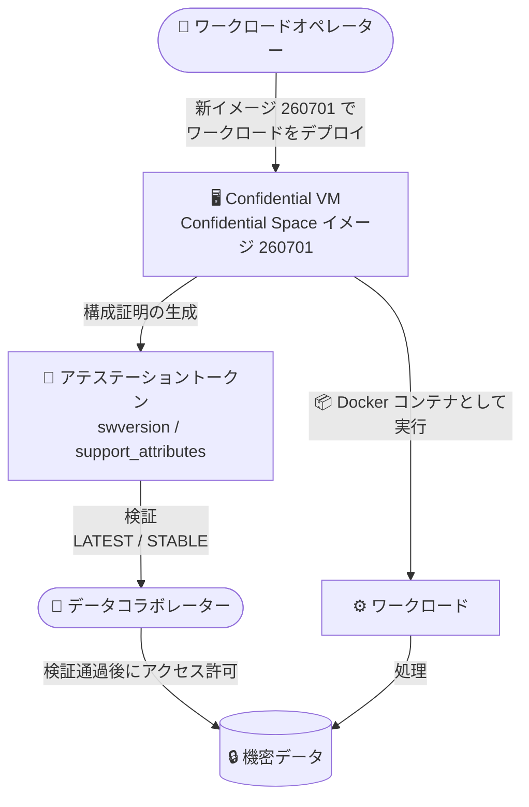

# Confidential Space: 新イメージ 260701 の提供開始

**リリース日**: 2026-08-10

**サービス**: Confidential Space

**機能**: Confidential Space イメージ 260701

**ステータス**: 提供開始 (Announcement)

📊 [このアップデートのインフォグラフィックを見る](https://takech9203.github.io/google-cloud-news-summary/20260810-confidential-space-image-260701.html)

## 概要

Confidential Space の新しいイメージ (バージョン 260701) が利用可能になりました。Confidential Space イメージは、Confidential VM 上で単一のワークロードを 1 回だけ実行するために設計された、最小構成・単一目的の OS イメージです。Container-Optimized OS のセキュリティ強化をベースに、ディスクパーティションの暗号化と完全性保護、認証付き暗号化ネットワーク接続、各種ブート測定、リモートアクセスの無効化などが組み込まれています。

今回のリリースノートでは新イメージの提供開始のみが告知されており、本レポート作成時点では公式ドキュメントのイメージバージョン一覧に 260701 の詳細 (含まれる変更内容や対応する Container-Optimized OS バージョン) はまだ掲載されていません。直近では 2026 年 6 月 24 日にイメージ 260600 (コンテナワークロードの graceful shutdown 対応) がリリースされており、260701 はそれに続く定期的なイメージ更新です。

機密データを複数の組織間で共有・処理する Confidential Space のワークロードでは、イメージのバージョンがアテステーション (構成証明) の検証対象となるため、ワークロードオペレーターとデータコラボレーターの双方にとって新イメージのリリースは把握しておくべき情報です。

**アップデート前の課題**

- 直近の最新イメージは 2026 年 6 月 24 日リリースの 260600 であり、それ以降のセキュリティ更新を含む新イメージは提供されていなかった
- `LATEST` サポート属性は常に最新イメージにのみ付与されるため、アテステーションポリシーで `LATEST` を要求している場合は新イメージのリリース状況を追跡する必要があった

**アップデート後の改善**

- 新イメージ 260701 が利用可能になり、最新のイメージでワークロードを実行できるようになった
- `LATEST` サポート属性を要求するアテステーションポリシーを利用するワークロードは、新イメージへ移行することで引き続き検証を通過できる

## アーキテクチャ図



新イメージ 260701 上で実行されるワークロードは、イメージバージョンやサポート属性を含むアテステーショントークンを生成し、データコラボレーターはこれを検証して機密データへのアクセスを許可します。

## サービスアップデートの詳細

### 主要機能

1. **新イメージ 260701 の提供**
   - リリースノートでは提供開始のみが告知されており、含まれる変更内容の詳細は本レポート作成時点で未公開
   - Confidential Space イメージのバージョンは `YYYYMM##` 形式 (260701 = 2026 年 7 月ビルド)

2. **イメージのバリアント**
   - Production イメージ: 本番データを処理するワークロード向け。ワークロードオペレーターによるデータアクセスを防ぐようロックダウンされている
   - Debug イメージ: 非本番データでのテスト向け。SSH が有効で、オペレーターは VM への root アクセスが可能

### イメージライフサイクルとサポート属性

| サポート属性 | 説明 |
|------|------|
| `LATEST` | 最新バージョンのイメージ。サポート対象で脆弱性が監視される (`STABLE` と `USABLE` も含む) |
| `STABLE` | サポート対象で脆弱性が監視されるバージョン (`USABLE` も含む) |
| `USABLE` | この属性のみのイメージはサポート終了。利用は自己責任 |

なお、Confidential Space のデフォルトトークンは 1 時間ごとに更新されるため、長時間実行するワークロードのアテステーションポリシーで `LATEST` を指定することは推奨されていません。イメージ更新のタイミングによってはワークロード実行中に `LATEST` でなくなり、アテステーションに失敗する可能性があります。

## 設定方法

### 利用可能なイメージの確認

```bash
gcloud compute images list \
    --project=confidential-space-images \
    --no-standard-images
```

- `--filter="family~'confidential-space$'"` で Production イメージのみを表示
- `--filter="family~'confidential-space-debug$'"` で Debug イメージのみを表示
- `--show-deprecated` で古いイメージも表示

### アテステーションポリシーでのバージョン検証例

```text
# 安定版イメージであることを検証
"STABLE" in assertion.submods.confidential_space.support_attributes

# 特定のイメージバージョンを検証
int(assertion.swversion[0]) == 260701
```

## メリット

### ビジネス面

- **セキュリティ体制の維持**: 最新イメージを利用することで、サポート対象かつ脆弱性監視の対象となるイメージでワークロードを運用できる

### 技術面

- **アテステーションの継続性**: `LATEST` 属性を要求するポリシーを使うワークロードは、新イメージへ移行することで検証を通過し続けられる

## デメリット・制約事項

### 考慮すべき点

- 本レポート作成時点で、イメージ 260701 に含まれる変更内容の詳細は公式ドキュメントに掲載されていない。詳細は Confidential Space のリリースノートおよびイメージバージョン一覧の更新を確認すること
- 長時間実行するワークロードで `LATEST` を要求している場合、イメージ更新に伴いアテステーションが失敗する可能性があるため、`STABLE` の利用を検討する

## 料金

Confidential Space 自体のイメージ提供に関する料金変更はこのアップデートでは告知されていません。Confidential VM の料金は以下を参照してください。

- [Confidential VM の料金](https://cloud.google.com/confidential-computing/confidential-vm/pricing)

## 関連サービス・機能

- **Confidential VM**: Confidential Space イメージが実行される基盤。AMD SEV や Intel TDX などのハードウェアベースのメモリ暗号化を提供
- **Container-Optimized OS**: Confidential Space イメージのベース OS
- **Confidential Computing API (アテステーション)**: ワークロードの構成証明トークンの生成・検証に使用
- **Workload Identity プール**: データコラボレーターがアテステーションポリシーを定義し、機密リソースへのアクセスを制御

## 参考リンク

- 📊 [インフォグラフィック](https://takech9203.github.io/google-cloud-news-summary/20260810-confidential-space-image-260701.html)
- [公式リリースノート](https://docs.cloud.google.com/release-notes#August_10_2026)
- [Confidential Space リリースノート](https://docs.cloud.google.com/confidential-computing/confidential-space/docs/release-notes)
- [Confidential Space イメージ (バージョン一覧)](https://docs.cloud.google.com/confidential-computing/confidential-space/docs/confidential-space-images)
- [アテステーションアサーションのリファレンス](https://docs.cloud.google.com/confidential-computing/confidential-space/docs/reference/attestation-assertions)

## まとめ

Confidential Space の新イメージ 260701 が提供開始されました。変更内容の詳細は現時点で未公開ですが、アテステーションポリシーで `LATEST` を要求しているワークロードや、最新のセキュリティ更新を維持したい環境では、新イメージへの移行を計画することを推奨します。詳細が公開され次第、Confidential Space のリリースノートとイメージバージョン一覧を確認してください。

---

**タグ**: Confidential Space, Confidential Computing, セキュリティ, イメージリリース, アテステーション
